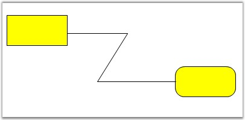
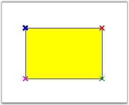
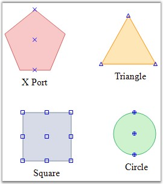

::: {style="DISPLAY: none"}
{#d2h_url_template}{#d2h_package_url style="WIDTH: 0px; DISPLAY: none; HEIGHT: 0px"}
:::

::::::: {.d2h_secondary_topic style="PADDING-BOTTOM: 10pt; MARGIN: 0pt; PADDING-LEFT: 0pt; PADDING-RIGHT: 0pt; PADDING-TOP: 0pt"}
#### Ports {#ports style="tab-stops: 0pt"}

[]{style="FONT-FAMILY: 'Trebuchet MS','sans-serif'; COLOR: #15428b; FONT-SIZE: 9pt"} 

Port is an object used to establish a connection between the node and the link.

[]{style="FONT-FAMILY: 'Trebuchet MS','sans-serif'; COLOR: #15428b; FONT-SIZE: 9pt"} 

Central Port

[]{style="FONT-FAMILY: 'Trebuchet MS','sans-serif'; COLOR: #15428b; FONT-SIZE: 9pt"} 

By default, the central port for a diagram is enabled using the **EnableCentralPort** property available for the node.

[]{style="FONT-FAMILY: 'Trebuchet MS','sans-serif'; COLOR: #15428b; FONT-SIZE: 9pt"} 

::: {align="center"}
  ------------------- --------------------------------------------
  Property            Description
  EnableCentralPort   Used to enable or disable the CentralPort.
  ------------------- --------------------------------------------
:::

[]{style="FONT-FAMILY: 'Trebuchet MS','sans-serif'; COLOR: #15428b; FONT-SIZE: 9pt"} 

The central port for a diagram node can be enabled by using the following code snippet.

[]{style="FONT-FAMILY: 'Trebuchet MS','sans-serif'; COLOR: #15428b; FONT-SIZE: 9pt"} 

+----------------------------------------------------------------------------------------------------------------+
| **[\[C#\]]{style="FONT-FAMILY: 'Courier New'; COLOR: black"}**                                                 |
|                                                                                                                |
| []{style="FONT-FAMILY: 'Courier New'"}                                                                         |
|                                                                                                                |
| [Ellipse ellips = [new]{style="COLOR: blue"} Ellipse(100, 100, 200, 100);]{style="FONT-FAMILY: 'Courier New'"} |
|                                                                                                                |
| [ellips.EnableCentralPort = [true]{style="COLOR: blue"};]{style="FONT-FAMILY: 'Courier New'"}                  |
+----------------------------------------------------------------------------------------------------------------+

[]{style="FONT-FAMILY: 'Courier New'"} 

+--------------------------------------------------------------------------------------------------------------------------------------------------------------------------------------+
| **[\[VB\]]{style="FONT-FAMILY: 'Courier New'; COLOR: black"}**                                                                                                                       |
|                                                                                                                                                                                      |
| []{style="FONT-FAMILY: 'Courier New'; COLOR: blue"}                                                                                                                                  |
|                                                                                                                                                                                      |
| [Dim]{style="FONT-FAMILY: 'Courier New'; COLOR: blue"}[ ellips [As]{style="COLOR: blue"} [New]{style="COLOR: blue"} Ellipse(100, 100, 200, 100)]{style="FONT-FAMILY: 'Courier New'"} |
|                                                                                                                                                                                      |
| [ellips.EnableCentralPort = [True]{style="COLOR: blue"}]{style="FONT-FAMILY: 'Courier New'"}                                                                                         |
+--------------------------------------------------------------------------------------------------------------------------------------------------------------------------------------+

[]{style="FONT-FAMILY: 'Trebuchet MS','sans-serif'; COLOR: #15428b; FONT-SIZE: 9pt"} 

In the above code snippets, the Central Port is enabled for an Ellipse node.

 

Sample diagram is as follows:

[]{style="FONT-FAMILY: 'Trebuchet MS','sans-serif'; COLOR: #15428b; FONT-SIZE: 9pt"} 

{border="0"}

**[]{style="FONT-FAMILY: 'Trebuchet MS','sans-serif'; COLOR: #15428b; FONT-SIZE: 9pt"}** 

Figure 68: Central Port

**[]{style="FONT-FAMILY: 'Trebuchet MS','sans-serif'; COLOR: #15428b; FONT-SIZE: 9pt"}** 

Custom ports

[]{style="FONT-FAMILY: 'Trebuchet MS','sans-serif'; COLOR: #15428b; FONT-SIZE: 9pt"} 

Custom ports can be defined at any position of the diagram node, thus allowing the creation of any number of connection ports at any position on the node. All the connections can be defined from the required point or port. Unlike the default port, the custom port when set, will be visible. The **DrawPorts** property must be enabled for custom ports to be created.

[]{style="FONT-FAMILY: 'Trebuchet MS','sans-serif'; COLOR: #15428b; FONT-SIZE: 9pt"} 

::: {style="BORDER-BOTTOM: windowtext 1pt solid; BORDER-LEFT: medium none; PADDING-BOTTOM: 1pt; MARGIN-TOP: 9pt; PADDING-LEFT: 0pt; PADDING-RIGHT: 0pt; MARGIN-BOTTOM: 9pt; BORDER-TOP: windowtext 1pt solid; BORDER-RIGHT: medium none; PADDING-TOP: 1pt"}
{border="0"}Note: When a link is drawn to a node or another link and when the EnableCentralPort is set to True, the links cannot be connected to the custom port. Hence make sure to disable that property for the links and the nodes to connect the links to the custom ports.
:::

[]{style="FONT-FAMILY: 'Trebuchet MS','sans-serif'; COLOR: #15428b; FONT-SIZE: 9pt"} 

::: {align="center"}
  ----------- -------------------------------------------------------------------------------
  Property    Description
  DrawPorts   Specifies whether creation of custom ports is enabled. Default value is True.
  ----------- -------------------------------------------------------------------------------
:::

[]{style="FONT-FAMILY: 'Trebuchet MS','sans-serif'; COLOR: #15428b; FONT-SIZE: 9pt"} 

The Syncfusion.Windows.Forms.Diagram.ConnectionPoint class is used to create custom ports and define their properties. For details, see ConnectionPoint Properties.

 

The following code snippet illustrate the Custom Ports,

[]{style="FONT-FAMILY: 'Trebuchet MS','sans-serif'; COLOR: #15428b; FONT-SIZE: 9pt"} 

+-----------------------------------------------------------------------------------------------------------------------------------------------------------------------------------+
| **[\[C#\]]{style="FONT-FAMILY: 'Courier New'; COLOR: black"}**                                                                                                                    |
|                                                                                                                                                                                   |
| []{style="FONT-FAMILY: 'Courier New'"}                                                                                                                                            |
|                                                                                                                                                                                   |
| [Syncfusion.Windows.Forms.Diagram.Rectangle rect = [new ]{style="COLOR: blue"}Syncfusion.Windows.Forms.Diagram.Rectangle(100, 100, 100, 50);]{style="FONT-FAMILY: 'Courier New'"} |
|                                                                                                                                                                                   |
| [rect.DrawPorts = [true]{style="COLOR: blue"};]{style="FONT-FAMILY: 'Courier New'"}                                                                                               |
|                                                                                                                                                                                   |
| [Syncfusion.Windows.Forms.Diagram.ConnectionPoint cp = [new ]{style="COLOR: blue"}Syncfusion.Windows.Forms.Diagram.ConnectionPoint();]{style="FONT-FAMILY: 'Courier New'"}        |
|                                                                                                                                                                                   |
| [rect.Ports.Add(cp);]{style="FONT-FAMILY: 'Courier New'"}                                                                                                                         |
+-----------------------------------------------------------------------------------------------------------------------------------------------------------------------------------+

[]{style="FONT-FAMILY: 'Courier New'"} 

+----------------------------------------------------------------------------------------------------------------------------------------------------------------------------------------------------------------------+
| **[\[VB\]]{style="FONT-FAMILY: 'Courier New'; COLOR: black"}**                                                                                                                                                       |
|                                                                                                                                                                                                                      |
| []{style="FONT-FAMILY: 'Courier New'; COLOR: blue"}                                                                                                                                                                  |
|                                                                                                                                                                                                                      |
| [Dim]{style="FONT-FAMILY: 'Courier New'; COLOR: blue"}[ rect [As]{style="COLOR: blue"} [New]{style="COLOR: blue"} Syncfusion.Windows.Forms.Diagram.Rectangle(100, 100, 100, 50)]{style="FONT-FAMILY: 'Courier New'"} |
|                                                                                                                                                                                                                      |
| [rect.DrawPorts = [True]{style="COLOR: blue"}]{style="FONT-FAMILY: 'Courier New'"}                                                                                                                                   |
|                                                                                                                                                                                                                      |
| [Dim]{style="FONT-FAMILY: 'Courier New'; COLOR: blue"}[ cp [As]{style="COLOR: blue"} [New]{style="COLOR: blue"} Syncfusion.Windows.Forms.Diagram.ConnectionPoint()]{style="FONT-FAMILY: 'Courier New'"}              |
|                                                                                                                                                                                                                      |
| [rect.Ports.Add(cp)]{style="FONT-FAMILY: 'Courier New'"}                                                                                                                                                             |
+----------------------------------------------------------------------------------------------------------------------------------------------------------------------------------------------------------------------+

[]{style="FONT-FAMILY: 'Trebuchet MS','sans-serif'; COLOR: #15428b; FONT-SIZE: 9pt"} 

Sample diagram is as follows.

[]{style="FONT-FAMILY: 'Trebuchet MS','sans-serif'; COLOR: #15428b; FONT-SIZE: 9pt"} 

{border="0"}

**[]{style="FONT-FAMILY: 'Trebuchet MS','sans-serif'; COLOR: #15428b; FONT-SIZE: 9pt"}** 

Figure 69: Rectangle Node with Four Custom Ports

[]{style="FONT-FAMILY: 'Trebuchet MS','sans-serif'; COLOR: #15428b; FONT-SIZE: 9pt"} 

Port Shapes

[]{style="FONT-FAMILY: 'Trebuchet MS','sans-serif'; COLOR: #15428b; FONT-SIZE: 9pt"} 

The **VisualType** property available for the port can be used for customizing the shape of the port. There are several types of ports available for customizing the port\'s shape,[ ]{style="FONT-FAMILY: 'Times New Roman','serif'; FONT-SIZE: 12pt"}each of which differs depending on how they are positioned within the symbol and how they are rendered. For example, a CirclePort can be positioned anywhere within the bounds of a symbol and renders itself as a circle containing cross hairs. Another example is a CenterPort, which always positions itself in the center of the symbol and has no visual representation.

[]{style="FONT-FAMILY: 'Trebuchet MS','sans-serif'; COLOR: #15428b; FONT-SIZE: 9pt"} 

::: {align="center"}
+-----------------------------------+---------------------------------------------------------------------------------------+
| Property                          | Description                                                                           |
+-----------------------------------+---------------------------------------------------------------------------------------+
| VisualType                        | The default value is XPort. The options included are as follows:                      |
|                                   |                                                                                       |
|                                   | []{style="FONT-FAMILY: 'Trebuchet MS','sans-serif'; COLOR: #15428b; FONT-SIZE: 9pt"}  |
|                                   |                                                                                       |
|                                   | [·      ]{style="FONT-FAMILY: Symbol"}CirclePort                                      |
|                                   |                                                                                       |
|                                   | [·      ]{style="FONT-FAMILY: Symbol"}XPort                                           |
|                                   |                                                                                       |
|                                   | [·      ]{style="FONT-FAMILY: Symbol"}TrianglePort                                    |
|                                   |                                                                                       |
|                                   | [·      ]{style="FONT-FAMILY: Symbol"}SquarePort                                      |
|                                   |                                                                                       |
|                                   | [·      ]{style="FONT-FAMILY: Symbol"}RhombPort                                       |
|                                   |                                                                                       |
|                                   | [·      ]{style="FONT-FAMILY: Symbol"}Custom                                          |
+-----------------------------------+---------------------------------------------------------------------------------------+
:::

[]{style="FONT-FAMILY: 'Trebuchet MS','sans-serif'; COLOR: #15428b; FONT-SIZE: 9pt"} 

The visual types for a port can be defined using the following code snippet.

[]{style="FONT-FAMILY: 'Trebuchet MS','sans-serif'; COLOR: #15428b; FONT-SIZE: 9pt"} 

+---------------------------------------------------------------------------------------------------+
| **[\[C#\]]{style="FONT-FAMILY: 'Courier New'; COLOR: black; FONT-SIZE: 9pt"}**                    |
|                                                                                                   |
| []{style="FONT-FAMILY: 'Courier New'; FONT-SIZE: 9pt"}                                            |
|                                                                                                   |
| [port.VisualType = PortVisualType.RhombPort;]{style="FONT-FAMILY: 'Courier New'; FONT-SIZE: 9pt"} |
+---------------------------------------------------------------------------------------------------+

[]{style="FONT-FAMILY: 'Courier New'"} 

+--------------------------------------------------------------------------------------------------+
| **[\[VB\]]{style="FONT-FAMILY: 'Courier New'; COLOR: black; FONT-SIZE: 9pt"}**                   |
|                                                                                                  |
| []{style="FONT-FAMILY: 'Courier New'; COLOR: blue; FONT-SIZE: 9pt"}                              |
|                                                                                                  |
| [port.VisualType = PortVisualType.RhombPort]{style="FONT-FAMILY: 'Courier New'; FONT-SIZE: 9pt"} |
+--------------------------------------------------------------------------------------------------+

[]{style="FONT-FAMILY: 'Trebuchet MS','sans-serif'; COLOR: #15428b; FONT-SIZE: 9pt"} 

Sample diagram is as follows,

[]{style="FONT-FAMILY: 'Trebuchet MS','sans-serif'; COLOR: #15428b; FONT-SIZE: 9pt"} 

{border="0"}

**[]{style="FONT-FAMILY: 'Trebuchet MS','sans-serif'; COLOR: #15428b; FONT-SIZE: 9pt"}** 

Figure 70: Different Port Shapes

 

[]{#p45} 

 

[]{#related-topics}
:::::::
