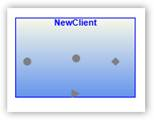

::: {style="DISPLAY: none"}
{#d2h_url_template}{#d2h_package_url style="WIDTH: 0px; DISPLAY: none; HEIGHT: 0px"}
:::

::::: {#nsbanner .d2h_main_nsbanner style="BORDER-BOTTOM: #999999 1px solid; POSITION: relative; PADDING-BOTTOM: 0px; BACKGROUND-COLOR: transparent; PADDING-LEFT: 0px; PADDING-RIGHT: 0px; DISPLAY: none; BORDER-TOP: #999999 1px solid; PADDING-TOP: 0px; LEFT: 0px"}
:::: {#TitleRow .d2h_main_titlerow style="PADDING-BOTTOM: 4px; BACKGROUND-COLOR: transparent; PADDING-LEFT: 22px; WIDTH: 100%; PADDING-RIGHT: 10px; DISPLAY: none; PADDING-TOP: 4px"}
::: {#ienav .d2h_main_ienav style="DISPLAY: none"}
{#D2HPrevious .D2HPreviousEnabled}  {#D2HNext .D2HNextEnabled}
:::
::::
:::::

:::: {#nstext .d2h_main_nstext style="PADDING-BOTTOM: 10px; BACKGROUND-COLOR: transparent; PADDING-LEFT: 22px; PADDING-RIGHT: 10px; HEIGHT: 100%; OVERFLOW: auto; PADDING-TOP: 5px" hasuserbackground="true" valign="bottom"}
::: {#d2h_breadcrumbs .d2h_breadcrumbs}
[Essential Studio User Guide Documentation](ms-xhelp:///?Id=12457748-09e3-4d74-a240-8e049cedf030){.d2h_breadcrumbsNormal}[ \> ]{.d2h_breadcrumbsLinkSeparator}[User Interface Edition](ms-xhelp:///?Id=c29296b7-531c-413b-a0ec-488ca1f7f669){.d2h_breadcrumbsNormal}[ \> ]{.d2h_breadcrumbsLinkSeparator}[Essential Silverlight](ms-xhelp:///?Id=66221bd1-ba2e-43c2-94a7-618f50e01d24){.d2h_breadcrumbsNormal}[ \> ]{.d2h_breadcrumbsLinkSeparator}[Essential Diagram]{.d2h_breadcrumbsContentsOnly}[ \> ]{.d2h_breadcrumbsLinkSeparator}[Concepts and Features](ms-xhelp:///?Id=d592a058-dcc0-44a4-994e-e7901da8db52){.d2h_breadcrumbsNormal}[ \> ]{.d2h_breadcrumbsLinkSeparator}[Connection Port](ms-xhelp:///?Id=a9f1c02d-01d3-40f5-aa89-afbd16955701){.d2h_breadcrumbsNormal}
:::

### PortShape {#portshape style="tab-stops: 0pt"}

[]{style="FONT-FAMILY: 'Trebuchet MS','sans-serif'; COLOR: #15428b; FONT-SIZE: 9pt"} 

Several predefined shapes have been provided for the ports. They are:

[]{style="FONT-FAMILY: 'Trebuchet MS','sans-serif'; COLOR: #15428b; FONT-SIZE: 9pt"} 

[·      ]{style="FONT-FAMILY: Symbol"}Arrow

[·      ]{style="FONT-FAMILY: Symbol"}Circle

[·      ]{style="FONT-FAMILY: Symbol"}Diamond

[]{style="FONT-FAMILY: 'Trebuchet MS','sans-serif'; COLOR: #15428b; FONT-SIZE: 9pt"} 

Property:

[]{style="FONT-FAMILY: 'Trebuchet MS','sans-serif'; COLOR: #15428b; FONT-SIZE: 9pt"} 

+-------------+-------------------------------------------------------------------------------------------------------------------------------------+----------------------------------------+--------------------+---------------------------------------------------+
| Property    | Description                                                                                                                         | Type of the property                   | Value it accepts   | Any other dependencies/ sub properties associated |
+-------------+-------------------------------------------------------------------------------------------------------------------------------------+----------------------------------------+--------------------+---------------------------------------------------+
| PortShape   | The PortShape property specifies the shape to be used for the port. Three types of shapes are provided: Arrow, Circle, and Diamond. | [CLR Property]{style="COLOR: #1f497d"} | PortShapes.None    | No                                                |
|             |                                                                                                                                     |                                        |                    |                                                   |
|             |                                                                                                                                     |                                        | PortShapes.Arrow   |                                                   |
|             |                                                                                                                                     |                                        |                    |                                                   |
|             | Default Value: PortShapes.Diamond                                                                                                   |                                        | PortShapes.Diamond |                                                   |
|             |                                                                                                                                     |                                        |                    |                                                   |
|             |                                                                                                                                     |                                        | PortShapes.Circle  |                                                   |
+-------------+-------------------------------------------------------------------------------------------------------------------------------------+----------------------------------------+--------------------+---------------------------------------------------+

 

The following code shows how a port shape can be selected for the port.

[]{style="FONT-FAMILY: 'Trebuchet MS','sans-serif'; COLOR: #15428b; FONT-SIZE: 9pt"} 

+---------------------------------------------------------------------------------------------------------------------------------------------------------------------------------------------------+
| **[\[C#\]]{style="FONT-FAMILY: 'Courier New'; COLOR: black"}**                                                                                                                                    |
|                                                                                                                                                                                                   |
| **[]{style="FONT-FAMILY: 'Courier New'; COLOR: black"}**                                                                                                                                          |
|                                                                                                                                                                                                   |
| [ConnectionPort]{style="FONT-FAMILY: 'Courier New'; COLOR: #2b91af"}[ port = [new]{style="COLOR: blue"} [ConnectionPort]{style="COLOR: #2b91af"}(NewClient);]{style="FONT-FAMILY: 'Courier New'"} |
|                                                                                                                                                                                                   |
| [            port.Left = 70;]{style="FONT-FAMILY: 'Courier New'"}                                                                                                                                 |
|                                                                                                                                                                                                   |
| [            port.Top = 90;]{style="FONT-FAMILY: 'Courier New'"}                                                                                                                                  |
|                                                                                                                                                                                                   |
| [            port.PortShape = [PortShapes]{style="COLOR: #2b91af"}.Arrow;]{style="FONT-FAMILY: 'Courier New'"}                                                                                    |
|                                                                                                                                                                                                   |
| [            NewClient.Ports.Add(port);]{style="FONT-FAMILY: 'Courier New'"}                                                                                                                      |
|                                                                                                                                                                                                   |
| [            [ConnectionPort]{style="COLOR: #2b91af"} port1 = [new]{style="COLOR: blue"} [ConnectionPort]{style="COLOR: #2b91af"}(NewClient);]{style="FONT-FAMILY: 'Courier New'"}                |
|                                                                                                                                                                                                   |
| [            port1.Left = 10;]{style="FONT-FAMILY: 'Courier New'"}                                                                                                                                |
|                                                                                                                                                                                                   |
| [            port1.Top = 50;]{style="FONT-FAMILY: 'Courier New'"}                                                                                                                                 |
|                                                                                                                                                                                                   |
| [            port1.PortShape = [PortShapes]{style="COLOR: #2b91af"}.Circle;]{style="FONT-FAMILY: 'Courier New'"}                                                                                  |
|                                                                                                                                                                                                   |
| [            NewClient.Ports.Add(port1);]{style="FONT-FAMILY: 'Courier New'"}                                                                                                                     |
|                                                                                                                                                                                                   |
| [            [ConnectionPort]{style="COLOR: #2b91af"} port2 = [new]{style="COLOR: blue"} [ConnectionPort]{style="COLOR: #2b91af"}(NewClient);]{style="FONT-FAMILY: 'Courier New'"}                |
|                                                                                                                                                                                                   |
| [            port2.Left = 120;]{style="FONT-FAMILY: 'Courier New'"}                                                                                                                               |
|                                                                                                                                                                                                   |
| [            port2.Top = 50;]{style="FONT-FAMILY: 'Courier New'"}                                                                                                                                 |
|                                                                                                                                                                                                   |
| [            port2.PortShape = [PortShapes]{style="COLOR: #2b91af"}.Diamond;]{style="FONT-FAMILY: 'Courier New'"}                                                                                 |
|                                                                                                                                                                                                   |
| [            NewClient.Ports.Add(port2);]{style="FONT-FAMILY: 'Courier New'"}                                                                                                                     |
+---------------------------------------------------------------------------------------------------------------------------------------------------------------------------------------------------+

[]{style="FONT-FAMILY: 'Trebuchet MS','sans-serif'; COLOR: #15428b; FONT-SIZE: 9pt"} 

+------------------------------------------------------------------------------------------------------------------------------------------------------------------------------------------------------------+
| **[\[VB\]]{style="FONT-FAMILY: 'Courier New'; COLOR: black"}**                                                                                                                                             |
|                                                                                                                                                                                                            |
| **[]{style="FONT-FAMILY: 'Courier New'; COLOR: black"}**                                                                                                                                                   |
|                                                                                                                                                                                                            |
| [Dim]{style="FONT-FAMILY: 'Courier New'; COLOR: blue"}[ port [As]{style="COLOR: blue"} [New]{style="COLOR: blue"} [ConnectionPort]{style="COLOR: #2b91af"}(NewClient)]{style="FONT-FAMILY: 'Courier New'"} |
|                                                                                                                                                                                                            |
| [            port.Left = 70]{style="FONT-FAMILY: 'Courier New'"}                                                                                                                                           |
|                                                                                                                                                                                                            |
| [            port.Top = 90]{style="FONT-FAMILY: 'Courier New'"}                                                                                                                                            |
|                                                                                                                                                                                                            |
| [            port.PortShape = PortShapes.Arrow]{style="FONT-FAMILY: 'Courier New'"}                                                                                                                        |
|                                                                                                                                                                                                            |
| [            NewClient.Ports.Add(port)]{style="FONT-FAMILY: 'Courier New'"}                                                                                                                                |
|                                                                                                                                                                                                            |
| [    [Dim]{style="COLOR: blue"} port1 [As]{style="COLOR: blue"} [New]{style="COLOR: blue"} [ConnectionPort]{style="COLOR: #2b91af"}(NewClient)]{style="FONT-FAMILY: 'Courier New'"}                        |
|                                                                                                                                                                                                            |
| [            port1.Left = 10]{style="FONT-FAMILY: 'Courier New'"}                                                                                                                                          |
|                                                                                                                                                                                                            |
| [            port1.Top = 50]{style="FONT-FAMILY: 'Courier New'"}                                                                                                                                           |
|                                                                                                                                                                                                            |
| [            port1.PortShape = PortShapes.Circle]{style="FONT-FAMILY: 'Courier New'"}                                                                                                                      |
|                                                                                                                                                                                                            |
| [            NewClient.Ports.Add(port1)]{style="FONT-FAMILY: 'Courier New'"}                                                                                                                               |
|                                                                                                                                                                                                            |
| [    [Dim]{style="COLOR: blue"} port2 [As]{style="COLOR: blue"} [New]{style="COLOR: blue"} [ConnectionPort]{style="COLOR: #2b91af"}(NewClient)]{style="FONT-FAMILY: 'Courier New'"}                        |
|                                                                                                                                                                                                            |
| [            port2.Left = 120]{style="FONT-FAMILY: 'Courier New'"}                                                                                                                                         |
|                                                                                                                                                                                                            |
| [            port2.Top = 50]{style="FONT-FAMILY: 'Courier New'"}                                                                                                                                           |
|                                                                                                                                                                                                            |
| [            port2.PortShape = PortShapes.Diamond]{style="FONT-FAMILY: 'Courier New'"}                                                                                                                     |
|                                                                                                                                                                                                            |
| [            NewClient.Ports.Add(port2)]{style="FONT-FAMILY: 'Courier New'"}[]{style="FONT-FAMILY: 'Courier New'"}                                                                                         |
+------------------------------------------------------------------------------------------------------------------------------------------------------------------------------------------------------------+

[]{style="FONT-FAMILY: 'Trebuchet MS','sans-serif'; COLOR: #15428b; FONT-SIZE: 9pt"} 

NewClient is the Node of Diagram Page.

[]{style="FONT-FAMILY: 'Trebuchet MS','sans-serif'; COLOR: #15428b; FONT-SIZE: 9pt"} 

{border="0"}

Figure 74: Port Shapes[]{#p53}

[]{#related-topics}
::::
