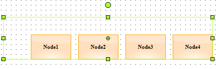
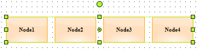

::: {style="DISPLAY: none"}
{#d2h_url_template}{#d2h_package_url style="WIDTH: 0px; DISPLAY: none; HEIGHT: 0px"}
:::

::: {.d2h_secondary_topic style="PADDING-BOTTOM: 10pt; MARGIN: 0pt; PADDING-LEFT: 0pt; PADDING-RIGHT: 0pt; PADDING-TOP: 0pt"}
#### Positioning nodes in Group {#positioning-nodes-in-group style="tab-stops: 0pt"}

Positioning support

Diagram Group node supports absolute and relative positioning.

[]{#_Positioning_Group_node’s}Positioning Group node's Child

Group Node has an enum property called **GroupNodePosition** of type **GroupNodePositions** to position its child nodes. GroupNodePositions has two values Absolute and Relative. The Absolute will place the nodes inside a group based on their actual pinpoint whereas the Relative will place the nodes based on their default pinpoint. Default value is *Relative*.

 

[]{#OLE_LINK4}[]{#OLE_LINK3} 

+-------------------------------------------------------------------------------------------------------------------------------------------------------------------------+
| **[\[C#\]]{style="FONT-FAMILY: 'Courier New'"}**                                                                                                                        |
|                                                                                                                                                                         |
| [//Group]{style="FONT-FAMILY: 'Courier New'; COLOR: green"}                                                                                                             |
|                                                                                                                                                                         |
| [Group]{style="FONT-FAMILY: 'Courier New'; COLOR: #2b91af"}[ group = [new]{style="COLOR: blue"} [Group]{style="COLOR: #2b91af"}();]{style="FONT-FAMILY: 'Courier New'"} |
|                                                                                                                                                                         |
| [//Absolute positioning]{style="FONT-FAMILY: 'Courier New'; COLOR: green"}                                                                                              |
|                                                                                                                                                                         |
| [group.GroupNodePosition = [GroupNodePositions]{style="COLOR: #2b91af"}.Absolute;]{style="FONT-FAMILY: 'Courier New'"}                                                  |
+-------------------------------------------------------------------------------------------------------------------------------------------------------------------------+

 

+----------------------------------------------------------------------------------------------------------------------------------------------------------------------------------------------------+
| **[\[VB\]]{style="FONT-FAMILY: 'Courier New'"}**[]{style="FONT-FAMILY: 'Courier New'; COLOR: blue"}                                                                                                |
|                                                                                                                                                                                                    |
| [\'Group]{style="FONT-FAMILY: 'Courier New'; COLOR: green"}[]{style="FONT-FAMILY: 'Courier New'"}                                                                                                  |
|                                                                                                                                                                                                    |
| [Dim]{style="FONT-FAMILY: 'Courier New'; COLOR: blue"}[ group [As]{style="COLOR: blue"} Group = [New]{style="COLOR: blue"} [Group]{style="COLOR: #2b91af"} ()]{style="FONT-FAMILY: 'Courier New'"} |
|                                                                                                                                                                                                    |
| [\'Absolute positioning]{style="FONT-FAMILY: 'Courier New'; COLOR: green"}[]{style="FONT-FAMILY: 'Courier New'"}                                                                                   |
|                                                                                                                                                                                                    |
| [group.GroupNodePosition = [GroupNodePositions]{style="COLOR: #2b91af"}.Absolute]{style="FONT-FAMILY: 'Courier New'"}[]{style="FONT-FAMILY: 'Courier New'"}                                        |
+----------------------------------------------------------------------------------------------------------------------------------------------------------------------------------------------------+

 

 

{border="0"}

Figure 86: Group Node Absolute positioning

{border="0"}

Figure 87: Group Node Relative positioning

 

 

Properties

+-------------------+--------------------------------------------------------------------------+--------------------+---------------+----------------+-----------------------+
| Name              | Description                                                              | Type               | Default value | Value Accepted | Reference             |
+-------------------+--------------------------------------------------------------------------+--------------------+---------------+----------------+-----------------------+
| GroupNodePosition | Specifies the mode in which the group node's child should be positioned. | GroupNodePositions | Relative      | Absolute,      | [GroupNodePosition]() |
|                   |                                                                          |                    |               |                |                       |
|                   |                                                                          |                    |               | Relative       |                       |
+===================+==========================================================================+====================+===============+================+=======================+

[]{#p50} 

[]{#related-topics}
:::
