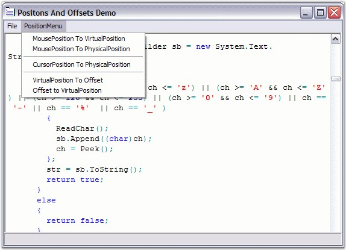

::: {style="DISPLAY: none"}
{#d2h_url_template}{#d2h_package_url style="WIDTH: 0px; DISPLAY: none; HEIGHT: 0px"}
:::

:::::::: {.d2h_secondary_topic style="PADDING-BOTTOM: 10pt; MARGIN: 0pt; PADDING-LEFT: 0pt; PADDING-RIGHT: 0pt; PADDING-TOP: 0pt"}
#### Positions and Offsets {#positions-and-offsets style="tab-stops: 0pt"}

 

Edit Control has a wide array of APIs for handling text operations by using Positions and Offsets. The **PhysicalLineCount** property is an useful API that returns the actual number of lines in the Edit Control. The following APIs can be used to set the position of the cursor using the keyboard.

 

::: {align="center"}
  ----------------------- --------------------------------------------------------------------
  Edit Control Property   Description
  CurrentColumn           Gets / sets the current column.
  CurrentLine             Gets / sets the current line.
  CurrentLineInstance     Gets instance of the current line.
  CurrentLineText         Gets text of the current line.
  CurrentPosition         Gets / sets current position of the cursor in virtual coordinates.
  PhysicalLineCount       Gets the count of the lines in the file.
  ----------------------- --------------------------------------------------------------------
:::

 

You can use the **GoTo** method to navigate to any desired position in a file.

 

::: {align="center"}
  ----------------------------- ---------------------------------------------------------
  Edit Control Method           Description
  GoTo                          Navigates to the specified position in the opened file.
  ----------------------------- ---------------------------------------------------------
:::

[]{style="FONT-FAMILY: 'Trebuchet MS','sans-serif'; COLOR: #15428b; FONT-SIZE: 9pt"} 

+----------------------------------------------------------------------------------------------------------------------------------------------------------------------------------------------+
| **[\[C#\]]{style="FONT-FAMILY: 'Courier New'; COLOR: black"}**                                                                                                                               |
|                                                                                                                                                                                              |
| []{style="FONT-FAMILY: 'Courier New'; COLOR: black"}                                                                                                                                         |
|                                                                                                                                                                                              |
| [// Gets or sets the current column of the cursor.]{style="FONT-FAMILY: 'Courier New'; COLOR: green"}                                                                                        |
|                                                                                                                                                                                              |
| [this]{style="FONT-FAMILY: 'Courier New'; COLOR: blue"}[.editControl1.CurrentColumn = 10;]{style="FONT-FAMILY: 'Courier New'"}                                                               |
|                                                                                                                                                                                              |
| []{style="FONT-FAMILY: 'Courier New'"}                                                                                                                                                       |
|                                                                                                                                                                                              |
| [// Gets or sets the current line of the cursor.]{style="FONT-FAMILY: 'Courier New'; COLOR: green"}                                                                                          |
|                                                                                                                                                                                              |
| [this]{style="FONT-FAMILY: 'Courier New'; COLOR: blue"}[.editControl1.CurrentLine = 7;]{style="FONT-FAMILY: 'Courier New'"}                                                                  |
|                                                                                                                                                                                              |
| []{style="FONT-FAMILY: 'Courier New'"}                                                                                                                                                       |
|                                                                                                                                                                                              |
| [// Gets or sets current cursor position.]{style="FONT-FAMILY: 'Courier New'; COLOR: green"}                                                                                                 |
|                                                                                                                                                                                              |
| [this]{style="FONT-FAMILY: 'Courier New'; COLOR: blue"}[.editControl1.CurrentPosition = [new]{style="COLOR: blue"} [Point]{style="COLOR: teal"}(10, 2);]{style="FONT-FAMILY: 'Courier New'"} |
|                                                                                                                                                                                              |
| []{style="FONT-FAMILY: 'Courier New'"}                                                                                                                                                       |
|                                                                                                                                                                                              |
| [this]{style="FONT-FAMILY: 'Courier New'; COLOR: blue"}[.editControl1.GoTo(7);]{style="FONT-FAMILY: 'Courier New'"}                                                                          |
+----------------------------------------------------------------------------------------------------------------------------------------------------------------------------------------------+

[]{style="FONT-FAMILY: 'Trebuchet MS','sans-serif'; COLOR: #15428b; FONT-SIZE: 9pt"} 

+---------------------------------------------------------------------------------------------------------------------------------------------------------------------+
| **[\[VB.NET\]]{style="FONT-FAMILY: 'Courier New'; COLOR: black"}**                                                                                                  |
|                                                                                                                                                                     |
| []{style="FONT-FAMILY: 'Courier New'; COLOR: black"}                                                                                                                |
|                                                                                                                                                                     |
| [\' Gets or sets the current column of the cursor.]{style="FONT-FAMILY: 'Courier New'; COLOR: green"}                                                               |
|                                                                                                                                                                     |
| [Me]{style="FONT-FAMILY: 'Courier New'; COLOR: blue"}[.editControl1.CurrentColumn = 10]{style="FONT-FAMILY: 'Courier New'"}                                         |
|                                                                                                                                                                     |
| []{style="FONT-FAMILY: 'Courier New'"}                                                                                                                              |
|                                                                                                                                                                     |
| [\' Gets or sets the current line of the cursor.]{style="FONT-FAMILY: 'Courier New'; COLOR: green"}                                                                 |
|                                                                                                                                                                     |
| [Me]{style="FONT-FAMILY: 'Courier New'; COLOR: blue"}[.editControl1.CurrentLine = 7]{style="FONT-FAMILY: 'Courier New'"}                                            |
|                                                                                                                                                                     |
| []{style="FONT-FAMILY: 'Courier New'"}                                                                                                                              |
|                                                                                                                                                                     |
| [\' Gets or sets current cursor position.]{style="FONT-FAMILY: 'Courier New'; COLOR: green"}                                                                        |
|                                                                                                                                                                     |
| [Me]{style="FONT-FAMILY: 'Courier New'; COLOR: blue"}[.editControl1.CurrentPosition = [New]{style="COLOR: blue"} Point (10, 2)]{style="FONT-FAMILY: 'Courier New'"} |
|                                                                                                                                                                     |
| []{style="FONT-FAMILY: 'Courier New'"}                                                                                                                              |
|                                                                                                                                                                     |
| [Me]{style="FONT-FAMILY: 'Courier New'; COLOR: blue"}[.editControl1.GoTo(7)]{style="FONT-FAMILY: 'Courier New'"}                                                    |
+---------------------------------------------------------------------------------------------------------------------------------------------------------------------+

 

The coordinates associated with the above properties are referred to as **Virtual** (or **Visible**), because their values vary depending on factors that affect the state of the collapsible blocks, font size of the text, and so on.

 

::: {style="BORDER-BOTTOM: windowtext 1pt solid; BORDER-LEFT: medium none; PADDING-BOTTOM: 1pt; MARGIN-TOP: 9pt; PADDING-LEFT: 0pt; PADDING-RIGHT: 0pt; MARGIN-BOTTOM: 9pt; BORDER-TOP: windowtext 1pt solid; BORDER-RIGHT: medium none; PADDING-TOP: 1pt"}
{border="0"}Note: The Virtual coordinates of the top-left corner in the Edit Control is (1,1), and it is not a zero-based coordinates system.
:::

 

The following APIs are used for inter-conversion between virtual / actual positions and offsets.

 

::: {align="center"}
  -------------------------------------- ------------------------------------------------------------------------
  Edit Control Method                    Description
  PointToVirtualPosition                 Converts point in client coordinates to the virtual position in text.
  PointToPhysicalPosition                Converts point in client coordinates to the physical position in text.
  ConvertVirtualPositionToPhysical       Converts virtual coordinates to physical coordinates.
  ConvertVirtualPositionToOffset         Converts virtual position in text to the offset in stream.
  ConvertOffsetToVirtualPosition         Converts in-stream offset to virtual coordinates.
  ConvertVirtualPointToCoordinatePoint   Converts point in virtual coordinates to coordinate point.
  -------------------------------------- ------------------------------------------------------------------------
:::

[]{style="FONT-FAMILY: 'Trebuchet MS','sans-serif'; COLOR: #15428b; FONT-SIZE: 9pt"} 

+-----------------------------------------------------------------------------------------------------------------------------------------------------------------------------------------------------------------------------------+
| **[\[C#\]]{style="FONT-FAMILY: 'Courier New'; COLOR: black"}**                                                                                                                                                                    |
|                                                                                                                                                                                                                                   |
| []{style="FONT-FAMILY: 'Courier New'; COLOR: black"}                                                                                                                                                                              |
|                                                                                                                                                                                                                                   |
| [// Convert coordinates associated with mouse position to virtual coordinates.]{style="FONT-FAMILY: 'Courier New'; COLOR: green"}                                                                                                 |
|                                                                                                                                                                                                                                   |
| [Point]{style="FONT-FAMILY: 'Courier New'; COLOR: teal"}[ virtualPosition = [this]{style="COLOR: blue"}.editControl1.PointToVirtualPosition([Control]{style="COLOR: teal"}.MousePosition);]{style="FONT-FAMILY: 'Courier New'"}   |
|                                                                                                                                                                                                                                   |
| []{style="FONT-FAMILY: 'Courier New'; COLOR: green"}                                                                                                                                                                              |
|                                                                                                                                                                                                                                   |
| [// Converts coordinates associated with mouse position to physical coordinates.]{style="FONT-FAMILY: 'Courier New'; COLOR: green"}                                                                                               |
|                                                                                                                                                                                                                                   |
| [Point]{style="FONT-FAMILY: 'Courier New'; COLOR: teal"}[ physicalPosition = [this]{style="COLOR: blue"}.editControl1.PointToPhysicalPosition([Control]{style="COLOR: teal"}.MousePosition);]{style="FONT-FAMILY: 'Courier New'"} |
|                                                                                                                                                                                                                                   |
| []{style="FONT-FAMILY: 'Courier New'; COLOR: green"}                                                                                                                                                                              |
|                                                                                                                                                                                                                                   |
| [// Converts virtual coordinates to physical coordinates.]{style="FONT-FAMILY: 'Courier New'; COLOR: green"}                                                                                                                      |
|                                                                                                                                                                                                                                   |
| [Point]{style="FONT-FAMILY: 'Courier New'; COLOR: teal"}[ physicalPosition = [this]{style="COLOR: blue"}.editControl1.ConvertVirtualPositionToPhysical(virtualPosition);]{style="FONT-FAMILY: 'Courier New'"}                     |
|                                                                                                                                                                                                                                   |
| []{style="FONT-FAMILY: 'Courier New'; COLOR: green"}                                                                                                                                                                              |
|                                                                                                                                                                                                                                   |
| [// Converts virtual coordinates to offset value.]{style="FONT-FAMILY: 'Courier New'; COLOR: green"}                                                                                                                              |
|                                                                                                                                                                                                                                   |
| [long]{style="FONT-FAMILY: 'Courier New'; COLOR: blue"}[ offset = [this]{style="COLOR: blue"}.editControl1.ConvertVirtualPositionToOffset(virtualPosition);]{style="FONT-FAMILY: 'Courier New'"}                                  |
|                                                                                                                                                                                                                                   |
| []{style="FONT-FAMILY: 'Courier New'; COLOR: green"}                                                                                                                                                                              |
|                                                                                                                                                                                                                                   |
| [// Converts the offset value to virtual coordinates.]{style="FONT-FAMILY: 'Courier New'; COLOR: green"}                                                                                                                          |
|                                                                                                                                                                                                                                   |
| [Point]{style="FONT-FAMILY: 'Courier New'; COLOR: teal"}[ virtualPosition = [this]{style="COLOR: blue"}.editControl1.ConvertOffsetToVirtualPosition(offset);]{style="FONT-FAMILY: 'Courier New'"}                                 |
|                                                                                                                                                                                                                                   |
| []{style="FONT-FAMILY: 'Courier New'"}                                                                                                                                                                                            |
|                                                                                                                                                                                                                                   |
| [// Converts point in virtual coordinates to coordinate point. ]{style="FONT-FAMILY: 'Courier New'; COLOR: green"}                                                                                                                |
|                                                                                                                                                                                                                                   |
| [this]{style="FONT-FAMILY: 'Courier New'; COLOR: blue"}[.editControl1.ConvertVirtualPointToCoordinatePoint([int]{style="COLOR: blue"} Column, [int ]{style="COLOR: blue"}line);]{style="FONT-FAMILY: 'Courier New'"}              |
+-----------------------------------------------------------------------------------------------------------------------------------------------------------------------------------------------------------------------------------+

[]{style="FONT-FAMILY: 'Trebuchet MS','sans-serif'; COLOR: #15428b; FONT-SIZE: 9pt"} 

+----------------------------------------------------------------------------------------------------------------------------------------------------------------------------------------------------------------------------------------------------+
| **[\[VB.NET\]]{style="FONT-FAMILY: 'Courier New'; COLOR: black"}**                                                                                                                                                                                 |
|                                                                                                                                                                                                                                                    |
| []{style="FONT-FAMILY: 'Courier New'; COLOR: black"}                                                                                                                                                                                               |
|                                                                                                                                                                                                                                                    |
| [\' Convert coordinates associated with mouse position to virtual coordinates. ]{style="FONT-FAMILY: 'Courier New'; COLOR: green"}                                                                                                                 |
|                                                                                                                                                                                                                                                    |
| [Dim]{style="FONT-FAMILY: 'Courier New'; COLOR: blue"}[ virtualPosition [As]{style="COLOR: blue"} Point[ =  Me]{style="COLOR: blue"}.editControl1.PointToVirtualPosition(Control.MousePosition)]{style="FONT-FAMILY: 'Courier New'"}               |
|                                                                                                                                                                                                                                                    |
| []{style="FONT-FAMILY: 'Courier New'; COLOR: green"}                                                                                                                                                                                               |
|                                                                                                                                                                                                                                                    |
| [\' Converts coordinates associated with mouse position to physical coordinates. ]{style="FONT-FAMILY: 'Courier New'; COLOR: green"}                                                                                                               |
|                                                                                                                                                                                                                                                    |
| [Dim]{style="FONT-FAMILY: 'Courier New'; COLOR: blue"}[ physicalPosition [As]{style="COLOR: blue"} Point[ =  Me]{style="COLOR: blue"}.editControl1.PointToPhysicalPosition(Control.MousePosition)]{style="FONT-FAMILY: 'Courier New'"}             |
|                                                                                                                                                                                                                                                    |
| []{style="FONT-FAMILY: 'Courier New'; COLOR: green"}                                                                                                                                                                                               |
|                                                                                                                                                                                                                                                    |
| [\' Converts virtual coordinates to physical coordinates. ]{style="FONT-FAMILY: 'Courier New'; COLOR: green"}                                                                                                                                      |
|                                                                                                                                                                                                                                                    |
| [Dim]{style="FONT-FAMILY: 'Courier New'; COLOR: blue"}[ physicalPosition [As]{style="COLOR: blue"} Point =  [Me]{style="COLOR: blue"}.editControl1.ConvertVirtualPositionToPhysical(virtualPosition)]{style="FONT-FAMILY: 'Courier New'"}          |
|                                                                                                                                                                                                                                                    |
| []{style="FONT-FAMILY: 'Courier New'; COLOR: green"}                                                                                                                                                                                               |
|                                                                                                                                                                                                                                                    |
| [\' Converts virtual coordinates to offset value. ]{style="FONT-FAMILY: 'Courier New'; COLOR: green"}                                                                                                                                              |
|                                                                                                                                                                                                                                                    |
| [Dim]{style="FONT-FAMILY: 'Courier New'; COLOR: blue"}[ offset [As]{style="COLOR: blue"} [Long]{style="COLOR: blue"} = [Me]{style="COLOR: blue"}.editControl1.ConvertVirtualPositionToOffset(virtualPosition)]{style="FONT-FAMILY: 'Courier New'"} |
|                                                                                                                                                                                                                                                    |
| []{style="FONT-FAMILY: 'Courier New'; COLOR: green"}                                                                                                                                                                                               |
|                                                                                                                                                                                                                                                    |
| [\' Converts the offset value to virtual coordinates.]{style="FONT-FAMILY: 'Courier New'; COLOR: green"}                                                                                                                                           |
|                                                                                                                                                                                                                                                    |
| [Dim]{style="FONT-FAMILY: 'Courier New'; COLOR: blue"}[ virtualPosition [As]{style="COLOR: blue"} Point =  [Me]{style="COLOR: blue"}.editControl1.ConvertOffsetToVirtualPosition(offset)]{style="FONT-FAMILY: 'Courier New'"}                      |
|                                                                                                                                                                                                                                                    |
| []{style="FONT-FAMILY: 'Courier New'"}                                                                                                                                                                                                             |
|                                                                                                                                                                                                                                                    |
| [\' Converts point in virtual coordinates to coordinate point. ]{style="FONT-FAMILY: 'Courier New'; COLOR: green"}                                                                                                                                 |
|                                                                                                                                                                                                                                                    |
| [Me]{style="FONT-FAMILY: 'Courier New'; COLOR: blue"}[.editControl1.ConvertVirtualPointToCoordinatePoint([Integer ]{style="COLOR: blue"}Column, [Integer ]{style="COLOR: blue"}line)]{style="FONT-FAMILY: 'Courier New'"}                          |
+----------------------------------------------------------------------------------------------------------------------------------------------------------------------------------------------------------------------------------------------------+

[]{style="FONT-FAMILY: 'Trebuchet MS','sans-serif'; COLOR: #15428b; FONT-SIZE: 9pt"} 

{border="0"}

Figure 15: Positions and Offsets Conversion Options in Edit Control

[]{style="FONT-FAMILY: 'Trebuchet MS','sans-serif'; COLOR: #15428b; FONT-SIZE: 9pt"} 

::: {style="BORDER-BOTTOM: windowtext 1pt solid; BORDER-LEFT: medium none; PADDING-BOTTOM: 1pt; MARGIN-TOP: 9pt; PADDING-LEFT: 0pt; PADDING-RIGHT: 0pt; MARGIN-BOTTOM: 9pt; BORDER-TOP: windowtext 1pt solid; BORDER-RIGHT: medium none; PADDING-TOP: 1pt"}
{border="0"}Note:[ ]{style="COLOR: black"}The Offset value is always calculated from the top-left corner of the Edit Control from the Virtual coordinates (1,1).
:::

 

A sample which demonstrates the above features is available in the following sample installation path.

 

***..\\My Documents\\Syncfusion\\EssentialStudio\\Version Number\\Windows\\Edit.Windows\\Samples\\2.0\\Text Navigation\\PositionsAndOffsetsDemo***

 

**See Also**

 

[Line Numbers and Current Line Highlighting]{.UGHyperlink}[]{.UGHyperlink}

                              

[]{#p34} 

[]{#related-topics}
::::::::
