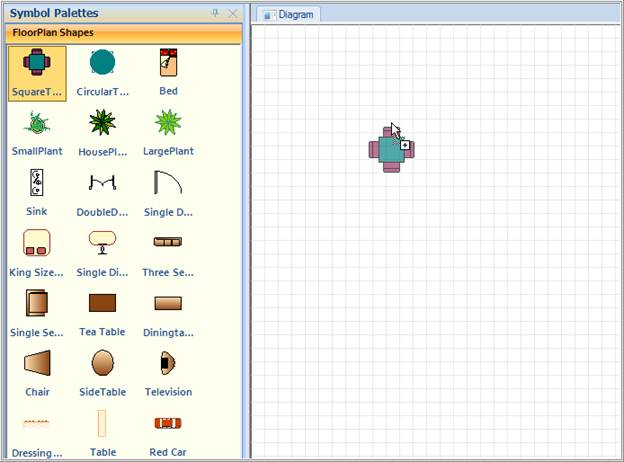

::: {style="DISPLAY: none"}
{#d2h_url_template}{#d2h_package_url style="WIDTH: 0px; DISPLAY: none; HEIGHT: 0px"}
:::

::::: {#nsbanner .d2h_main_nsbanner style="BORDER-BOTTOM: #999999 1px solid; POSITION: relative; PADDING-BOTTOM: 0px; BACKGROUND-COLOR: transparent; PADDING-LEFT: 0px; PADDING-RIGHT: 0px; DISPLAY: none; BORDER-TOP: #999999 1px solid; PADDING-TOP: 0px; LEFT: 0px"}
:::: {#TitleRow .d2h_main_titlerow style="PADDING-BOTTOM: 4px; BACKGROUND-COLOR: transparent; PADDING-LEFT: 22px; WIDTH: 100%; PADDING-RIGHT: 10px; DISPLAY: none; PADDING-TOP: 4px"}
::: {#ienav .d2h_main_ienav style="DISPLAY: none"}
{#D2HPrevious .D2HPreviousEnabled}  {#D2HNext .D2HNextEnabled}
:::
::::
:::::

::::::::: {#nstext .d2h_main_nstext style="PADDING-BOTTOM: 10px; BACKGROUND-COLOR: transparent; PADDING-LEFT: 22px; PADDING-RIGHT: 10px; HEIGHT: 100%; OVERFLOW: auto; PADDING-TOP: 5px" hasuserbackground="true" valign="bottom"}
::: {#d2h_breadcrumbs .d2h_breadcrumbs}
[Essential Studio User Guide Documentation](ms-xhelp:///?Id=12457748-09e3-4d74-a240-8e049cedf030){.d2h_breadcrumbsNormal}[ \> ]{.d2h_breadcrumbsLinkSeparator}[User Interface Edition](ms-xhelp:///?Id=c29296b7-531c-413b-a0ec-488ca1f7f669){.d2h_breadcrumbsNormal}[ \> ]{.d2h_breadcrumbsLinkSeparator}[Essential Windows](ms-xhelp:///?Id=e60759d8-47a4-4570-9d7a-16a68d63f2ea){.d2h_breadcrumbsNormal}[ \> ]{.d2h_breadcrumbsLinkSeparator}[Essential Diagram]{.d2h_breadcrumbsContentsOnly}[ \> ]{.d2h_breadcrumbsLinkSeparator}[Concepts And Features](ms-xhelp:///?Id=008cec4b-5177-4859-8616-c062751d8fb6){.d2h_breadcrumbsNormal}[ \> ]{.d2h_breadcrumbsLinkSeparator}[Advanced Features](ms-xhelp:///?Id=f661be94-4825-49a2-ac75-df5e8495098e){.d2h_breadcrumbsNormal}
:::

### Preview for Symbol Palette Item {#preview-for-symbol-palette-item style="LINE-HEIGHT: 115%; TEXT-INDENT: -21.6pt; MARGIN: 24pt 0pt 0pt 21.6pt; tab-stops: 21.6pt"}

Essential Diagram for Windows Forms provides preview support for [[Symbol Palette. When you drag an item from Symbol Palette to Diagram View, Preview of the dragged item will be displayed. You can enable or disable the preview support. ]{style="COLOR: black"}]{.apple-style-span}

 

Use Case Scenario

[[This feature displays a preview of the item you drag from Symbol Palette, thus enables you to identify the item you are dragging from the symbol palette to Diagram view.]{style="COLOR: black"}]{.apple-style-span}

 

Properties

 

Table 5: Property Table

::: {align="center"}
+--------------------+-------------------------------------------------------------+-------------+-------------+-----------------+
| Property           | Description                                                 | Type        | Data Type   | Reference links |
+--------------------+-------------------------------------------------------------+-------------+-------------+-----------------+
| ShowDragNodeCue    | Gets or sets a value indicating whether preview is visible. | NA          | Boolean     | NA              |
|                    |                                                             |             |             |                 |
|                    | The default value is true.                                  |             |             |                 |
+--------------------+-------------------------------------------------------------+-------------+-------------+-----------------+
| DragNodeCueEnabled | Gets or sets a value indicating whether preview is enabled. | NA          | Boolean     | NA              |
|                    |                                                             |             |             |                 |
|                    | The default value is true.                                  |             |             |                 |
+--------------------+-------------------------------------------------------------+-------------+-------------+-----------------+
:::

 

Enabling Preview Support

To enable preview for the dragged item from Symbol Palette, set the *DragNodeCueEnabled* property of *PalatteGroupBar/PaletteGroupView* to true. To disable preview set this to false. By default this is set to true. 

Following code example illustrates how to enable preview support: 

::: {align="center"}
+-------------------------------------------------------------------------------------------------------------------------------------------+
| **[\[C#\]]{style="FONT-FAMILY: 'Courier New'"}**                                                                                          |
|                                                                                                                                           |
| [      ]{style="FONT-FAMILY: 'Courier New'; COLOR: #2b91af"}[//enable dragged node cue]{style="FONT-FAMILY: 'Courier New'; COLOR: green"} |
|                                                                                                                                           |
| [            paletteGroupBar1.DragNodeCueEnabled = [true]{style="COLOR: blue"};]{style="FONT-FAMILY: 'Courier New'"}                      |
|                                                                                                                                           |
| [            ]{style="FONT-FAMILY: 'Courier New'"}                                                                                        |
|                                                                                                                                           |
| [            paletteGroupView1.DragNodeCueEnabled = [true]{style="COLOR: blue"};]{style="FONT-FAMILY: 'Courier New'"}                     |
|                                                                                                                                           |
| []{style="FONT-FAMILY: 'Courier New'; COLOR: #2b91af"}                                                                                    |
|                                                                                                                                           |
| [      ]{style="FONT-FAMILY: 'Courier New'; COLOR: #2b91af"}[//show dragged node cue]{style="FONT-FAMILY: 'Courier New'; COLOR: green"}   |
|                                                                                                                                           |
| [            paletteGroupBar1.ShowDragNodeCue = [true]{style="COLOR: blue"};]{style="FONT-FAMILY: 'Courier New'"}                         |
|                                                                                                                                           |
| [            ]{style="FONT-FAMILY: 'Courier New'"}                                                                                        |
|                                                                                                                                           |
| [            paletteGroupView1.ShowDragNodeCue = [true]{style="COLOR: blue"};]{style="FONT-FAMILY: 'Courier New'"}                        |
+-------------------------------------------------------------------------------------------------------------------------------------------+
:::

 

::: {align="center"}
+----------------------------------------------------------------------------------------------------------------------------------------------------+
| **[\[VB\]]{style="FONT-FAMILY: 'Courier New'"}**                                                                                                   |
|                                                                                                                                                    |
| [  ]{style="FONT-FAMILY: Consolas; COLOR: #2b91af; FONT-SIZE: 9.5pt"}[//enable dragged node cue]{style="FONT-FAMILY: 'Courier New'; COLOR: green"} |
|                                                                                                                                                    |
| [            paletteGroupBar1.DragNodeCueEnabled = [True]{style="COLOR: blue"};           ]{style="FONT-FAMILY: 'Courier New'"}                    |
|                                                                                                                                                    |
| [            paletteGroupView1.DragNodeCueEnabled = [True]{style="COLOR: blue"}]{style="FONT-FAMILY: 'Courier New'"}                               |
|                                                                                                                                                    |
| []{style="FONT-FAMILY: Consolas; COLOR: #2b91af; FONT-SIZE: 9.5pt"}                                                                                |
|                                                                                                                                                    |
| [  ]{style="FONT-FAMILY: Consolas; COLOR: #2b91af; FONT-SIZE: 9.5pt"}[//show dragged node cue]{style="FONT-FAMILY: 'Courier New'; COLOR: green"}   |
|                                                                                                                                                    |
| [            paletteGroupBar1.ShowDragNodeCue = [True]{style="COLOR: blue"};        ]{style="FONT-FAMILY: 'Courier New'"}                          |
|                                                                                                                                                    |
| [            paletteGroupView1.ShowDragNodeCue = [True]{style="COLOR: blue"};]{style="FONT-FAMILY: 'Courier New'"}                                 |
+----------------------------------------------------------------------------------------------------------------------------------------------------+
:::

 

{border="0"}

Figure 120: Preview of Dragged Item

 

The following code illustrates how to disable preview support:

::: {align="center"}
+-----------------------------------------------------------------------------------------------------------------------------------------+
| **[\[C#\]]{style="FONT-FAMILY: 'Courier New'"}**                                                                                        |
|                                                                                                                                         |
| [      ]{style="FONT-FAMILY: 'Courier New'; COLOR: #2b91af"}[//hide dragged node cue]{style="FONT-FAMILY: 'Courier New'; COLOR: green"} |
|                                                                                                                                         |
| [            paletteGroupBar1.ShowDragNodeCue = [false]{style="COLOR: blue"};]{style="FONT-FAMILY: 'Courier New'"}                      |
|                                                                                                                                         |
| [            paletteGroupView1.ShowDragNodeCue = [false]{style="COLOR: blue"};]{style="FONT-FAMILY: 'Courier New'"}                     |
+-----------------------------------------------------------------------------------------------------------------------------------------+
:::

 

::: {align="center"}
+------------------------------------------------------------------------------------------------------------------------------------------------------------------------+
| **[\[VB\]]{style="FONT-FAMILY: 'Courier New'"}**                                                                                                                       |
|                                                                                                                                                                        |
| [  ]{style="FONT-FAMILY: Consolas; COLOR: #2b91af; FONT-SIZE: 9.5pt"}[            [//hide dragged node cue]{style="COLOR: green"}]{style="FONT-FAMILY: 'Courier New'"} |
|                                                                                                                                                                        |
| [            paletteGroupBar1.ShowDragNodeCue = [False]{style="COLOR: blue"};]{style="FONT-FAMILY: 'Courier New'"}                                                     |
|                                                                                                                                                                        |
| [      paletteGroupView1.ShowDragNodeCue = [False]{style="COLOR: blue"};]{style="FONT-FAMILY: 'Courier New'"}                                                          |
+------------------------------------------------------------------------------------------------------------------------------------------------------------------------+
:::

 

Sample Link

To view a sample:

1.   Open the Syncfusion Dashboard.

2.   Click the **Windows Forms** drop-down list and select **Run Locally Installed Samples.**

3.   Navigate to **Diagram[ ]{style="COLOR: #c00000"}Samples \> Product Showcase \> Diagram Builder.**

 

[]{#related-topics}
:::::::::
