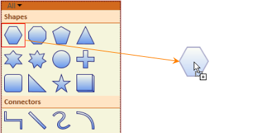
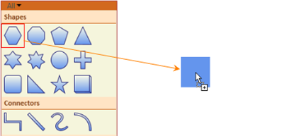

::: {style="DISPLAY: none"}
{#d2h_url_template}{#d2h_package_url style="WIDTH: 0px; DISPLAY: none; HEIGHT: 0px"}
:::

::::: {#nsbanner .d2h_main_nsbanner style="BORDER-BOTTOM: #999999 1px solid; POSITION: relative; PADDING-BOTTOM: 0px; BACKGROUND-COLOR: transparent; PADDING-LEFT: 0px; PADDING-RIGHT: 0px; DISPLAY: none; BORDER-TOP: #999999 1px solid; PADDING-TOP: 0px; LEFT: 0px"}
:::: {#TitleRow .d2h_main_titlerow style="PADDING-BOTTOM: 4px; BACKGROUND-COLOR: transparent; PADDING-LEFT: 22px; WIDTH: 100%; PADDING-RIGHT: 10px; DISPLAY: none; PADDING-TOP: 4px"}
::: {#ienav .d2h_main_ienav style="DISPLAY: none"}
{#D2HPrevious .D2HPreviousEnabled}  {#D2HNext .D2HNextEnabled}
:::
::::
:::::

:::::::: {#nstext .d2h_main_nstext style="PADDING-BOTTOM: 10px; BACKGROUND-COLOR: transparent; PADDING-LEFT: 22px; PADDING-RIGHT: 10px; HEIGHT: 100%; OVERFLOW: auto; PADDING-TOP: 5px" hasuserbackground="true" valign="bottom"}
::: {#d2h_breadcrumbs .d2h_breadcrumbs}
[Essential Studio User Guide Documentation](ms-xhelp:///?Id=12457748-09e3-4d74-a240-8e049cedf030){.d2h_breadcrumbsNormal}[ \> ]{.d2h_breadcrumbsLinkSeparator}[User Interface Edition](ms-xhelp:///?Id=c29296b7-531c-413b-a0ec-488ca1f7f669){.d2h_breadcrumbsNormal}[ \> ]{.d2h_breadcrumbsLinkSeparator}[Essential WPF](ms-xhelp:///?Id=7f4f82c5-151c-4262-94d0-75c4626c77bc){.d2h_breadcrumbsNormal}[ \> ]{.d2h_breadcrumbsLinkSeparator}[Essential Diagram]{.d2h_breadcrumbsContentsOnly}[ \> ]{.d2h_breadcrumbsLinkSeparator}[Concepts and Features](ms-xhelp:///?Id=8625d466-6e21-495a-b811-4ecee754da81){.d2h_breadcrumbsNormal}[ \> ]{.d2h_breadcrumbsLinkSeparator}[SymbolPalette](ms-xhelp:///?Id=20dbf28d-6928-4d19-a722-5f6779ab36c2){.d2h_breadcrumbsNormal}
:::

### Preview for Symbol Palette Item {#preview-for-symbol-palette-item style="tab-stops: 0pt"}

Essential Diagram for WPF provides preview support for Symbol Palette. When you drag an item from Symbol Palette to Diagram View, Preview of the dragged item will be displayed. You can enable or disable the preview support. You can also customize the preview. 

 

Use Case Scenario

This feature displays a preview of the item you drag from Symbol Palette, thus enables you to identify the item you are dragging from the symbol palette to Diagram view.

 

Properties

Table 80: Property Table

+--------------+-------------------------------------------------------------+---------------------+-------------+-----------------+
| Property     | Description                                                 | Type                | Data Type   | Reference links |
+--------------+-------------------------------------------------------------+---------------------+-------------+-----------------+
| ShowPreview  | Gets or sets a value indicating whether preview is enabled. | Dependency property | Boolean     | NA              |
|              |                                                             |                     |             |                 |
|              | The default value is true.                                  |                     |             |                 |
+--------------+-------------------------------------------------------------+---------------------+-------------+-----------------+
|              |                                                             |                     |             |                 |
|              |                                                             |                     |             |                 |
| PreviewBrush | Gets or sets a value for preview content.                   | Dependency property | Brush       | NA              |
+--------------+-------------------------------------------------------------+---------------------+-------------+-----------------+

[]{style="FONT-FAMILY: 'Calibri','sans-serif'; FONT-SIZE: 11pt"} 

Enabling Preview Support

To enable preview for the dragged item from Symbol Palette, set the *ShowPreview* property of *SymbolPalette* to true. To disable preview set this to false. By default this is set to true. 

Following code example illustrates how to enable preview support: 

::: {align="center"}
+-----------------------------------------------------------------------------------------------------------------------------------------------------------------------------------------------------------+
| **[\[C#\]]{style="FONT-FAMILY: 'Courier New'; FONT-SIZE: 11pt"}**                                                                                                                                         |
|                                                                                                                                                                                                           |
| [      DiagramControl]{style="FONT-FAMILY: 'Courier New'; COLOR: #2b91af"}[ diagramControl1 = [new]{style="COLOR: blue"} [DiagramControl]{style="COLOR: #2b91af"}();]{style="FONT-FAMILY: 'Courier New'"} |
|                                                                                                                                                                                                           |
| [diagramControl1.SymbolPalette.ShowPreview = [true]{style="COLOR: blue"};]{style="FONT-FAMILY: 'Courier New'"}                                                                                            |
|                                                                                                                                                                                                           |
| []{style="FONT-FAMILY: 'Courier New'; FONT-SIZE: 11pt"}                                                                                                                                                   |
+-----------------------------------------------------------------------------------------------------------------------------------------------------------------------------------------------------------+
:::

[]{style="FONT-FAMILY: 'Calibri','sans-serif'; FONT-SIZE: 11pt"} 

::: {align="center"}
+--------------------------------------------------------------------------------------------------------------------------------------------------------------------------------------------------------------------------------------------------------------+
| **[\[VB\]]{style="FONT-FAMILY: 'Courier New'; FONT-SIZE: 11pt"}**                                                                                                                                                                                            |
|                                                                                                                                                                                                                                                              |
| [       ]{style="FONT-FAMILY: Consolas; COLOR: #2b91af; FONT-SIZE: 9.5pt"}[Dim]{style="FONT-FAMILY: 'Courier New'; COLOR: blue"}[ diagramControl1 [As]{style="COLOR: blue"} [New]{style="COLOR: blue"} DiagramControl()]{style="FONT-FAMILY: 'Courier New'"} |
|                                                                                                                                                                                                                                                              |
| [      diagramControl1.SymbolPalette.ShowPreview = [true]{style="COLOR: blue"}]{style="FONT-FAMILY: 'Courier New'"}                                                                                                                                          |
+--------------------------------------------------------------------------------------------------------------------------------------------------------------------------------------------------------------------------------------------------------------+
:::

[]{style="FONT-FAMILY: 'Calibri','sans-serif'; FONT-SIZE: 11pt"} 

[ ]{style="BORDER-BOTTOM: windowtext 1pt; BORDER-LEFT: windowtext 1pt; PADDING-BOTTOM: 0pt; PADDING-LEFT: 0pt; LAYOUT-GRID-MODE: line; PADDING-RIGHT: 0pt; FONT-FAMILY: 'Times New Roman','serif'; BACKGROUND: black; COLOR: black; FONT-SIZE: 1pt; BORDER-TOP: windowtext 1pt; BORDER-RIGHT: windowtext 1pt; PADDING-TOP: 0pt"}{border="0"}

Figure 179: Preview of Dragged Item

[]{style="FONT-FAMILY: 'Calibri','sans-serif'; FONT-SIZE: 11pt"} 

Change the preview content using PreviewBrush

You can customize the preview content using the *PreviewBrush* property of *SymbolPaletteItem*. Following code example illustrates how to customize preview content:

 

::: {align="center"}
+-------------------------------------------------------------------------------------------------------------------------------------------------------------------------------------------------------------------------------------------------------------------------------+
| **[\[C#\]]{style="FONT-FAMILY: 'Courier New'; FONT-SIZE: 11pt"}**                                                                                                                                                                                                             |
|                                                                                                                                                                                                                                                                               |
| [       ]{style="FONT-FAMILY: Consolas; COLOR: #2b91af; FONT-SIZE: 9.5pt"}[DiagramControl]{style="FONT-FAMILY: 'Courier New'; COLOR: #2b91af"}[ diagramControl1 = [new]{style="COLOR: blue"} [DiagramControl]{style="COLOR: #2b91af"}();]{style="FONT-FAMILY: 'Courier New'"} |
|                                                                                                                                                                                                                                                                               |
| [      (diagramControl1.SymbolPalette.SymbolGroups\[0\].Items\[0\] [as    ]{style="COLOR: blue"}[SymbolPaletteItem]{style="COLOR: #2b91af"}).PreviewBrush = [Brushes]{style="COLOR: #2b91af"}.CornflowerBlue;]{style="FONT-FAMILY: 'Courier New'"}                            |
|                                                                                                                                                                                                                                                                               |
| []{style="FONT-FAMILY: 'Courier New'; FONT-SIZE: 11pt"}                                                                                                                                                                                                                       |
+-------------------------------------------------------------------------------------------------------------------------------------------------------------------------------------------------------------------------------------------------------------------------------+
:::

[]{style="FONT-FAMILY: 'Calibri','sans-serif'; FONT-SIZE: 11pt"} 

::: {align="center"}
+--------------------------------------------------------------------------------------------------------------------------------------------------------------------------------------------------------------------------------------------------------------+
| **[\[VB\]]{style="FONT-FAMILY: 'Courier New'; FONT-SIZE: 11pt"}**                                                                                                                                                                                            |
|                                                                                                                                                                                                                                                              |
| [       ]{style="FONT-FAMILY: Consolas; COLOR: #2b91af; FONT-SIZE: 9.5pt"}[Dim]{style="FONT-FAMILY: 'Courier New'; COLOR: blue"}[ diagramControl1 [As]{style="COLOR: blue"} [New]{style="COLOR: blue"} DiagramControl()]{style="FONT-FAMILY: 'Courier New'"} |
|                                                                                                                                                                                                                                                              |
| [      TryCast(diagramControl1.SymbolPalette.SymbolGroups(0).Items(0),  SymbolPaletteItem).PreviewBrush = Brushes.CornflowerBlue]{style="FONT-FAMILY: 'Courier New'"}[]{style="FONT-FAMILY: Consolas; FONT-SIZE: 9.5pt"}                                     |
|                                                                                                                                                                                                                                                              |
| []{style="FONT-FAMILY: 'Courier New'; FONT-SIZE: 11pt"}                                                                                                                                                                                                      |
+--------------------------------------------------------------------------------------------------------------------------------------------------------------------------------------------------------------------------------------------------------------+
:::

**[]{style="FONT-FAMILY: 'Calibri','sans-serif'; COLOR: #e36c0a; FONT-SIZE: 11pt"}** 

[ ]{style="BORDER-BOTTOM: windowtext 1pt; BORDER-LEFT: windowtext 1pt; PADDING-BOTTOM: 0pt; PADDING-LEFT: 0pt; LAYOUT-GRID-MODE: line; PADDING-RIGHT: 0pt; FONT-FAMILY: 'Times New Roman','serif'; BACKGROUND: black; COLOR: black; FONT-SIZE: 1pt; BORDER-TOP: windowtext 1pt; BORDER-RIGHT: windowtext 1pt; PADDING-TOP: 0pt"}{border="0"}

Figure 180: Customized Preview Content[]{style="COLOR: #e36c0a"}

[]{style="FONT-FAMILY: 'Calibri','sans-serif'; FONT-SIZE: 11pt"} 

[]{style="FONT-FAMILY: 'Trebuchet MS','sans-serif'; COLOR: #15428b; FONT-SIZE: 9pt"} 

[]{#related-topics}
::::::::
