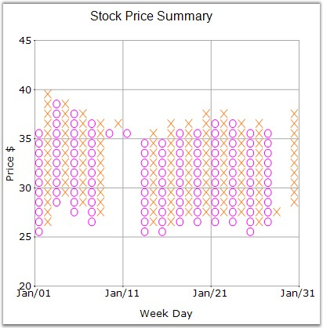

::: {style="DISPLAY: none"}
{#d2h_url_template}{#d2h_package_url style="WIDTH: 0px; DISPLAY: none; HEIGHT: 0px"}
:::

:::: {.d2h_secondary_topic style="PADDING-BOTTOM: 10pt; MARGIN: 0pt; PADDING-LEFT: 0pt; PADDING-RIGHT: 0pt; PADDING-TOP: 0pt"}
#### PriceDownColor {#pricedowncolor style="tab-stops: 0pt"}

 

Specifies a color for the financial item whose price is down.

 

::: {align="center"}
+-------------------------------------+-------------------------------------------------------------------------+
|                                                                                                               |
|                                                                                                               |
| Details                                                                                                       |
+-------------------------------------+-------------------------------------------------------------------------+
| **Possible Values**                 | Any valid color                                                         |
+-------------------------------------+-------------------------------------------------------------------------+
| **Default Value    **               | **Color.Red**                                                           |
+-------------------------------------+-------------------------------------------------------------------------+
| **2D / 3D Limitations**             | No                                                                      |
+-------------------------------------+-------------------------------------------------------------------------+
| **Applies to Chart Element**        | Any series                                                              |
+-------------------------------------+-------------------------------------------------------------------------+
| **Applies to Chart Types**          | Kagi Chart, Point and Figure Chart, Renko Chart, Three Line Break Chart |
+-------------------------------------+-------------------------------------------------------------------------+
:::

 

Here is code snippet using **PriceDownColor** in PointandFigure Chart.

 

+----------------------------------------------------------------------------------------------------------------------------------------------------------------------------------------------------+
| **[\[C#\]]{style="FONT-FAMILY: 'Courier New'; COLOR: black"}**                                                                                                                                     |
|                                                                                                                                                                                                    |
| **[]{style="FONT-FAMILY: 'Courier New'; COLOR: black"}**                                                                                                                                           |
|                                                                                                                                                                                                    |
| [series7.PriceDownColor =]{style="FONT-FAMILY: 'Courier New'; COLOR: black"}[ Color]{style="FONT-FAMILY: 'Courier New'; COLOR: teal"}[.Magenta;]{style="FONT-FAMILY: 'Courier New'; COLOR: black"} |
|                                                                                                                                                                                                    |
| [series7.PriceUpColor= ]{style="FONT-FAMILY: 'Courier New'; COLOR: black"}[Color]{style="FONT-FAMILY: 'Courier New'; COLOR: teal"}[.Orange;]{style="FONT-FAMILY: 'Courier New'; COLOR: black"}     |
+----------------------------------------------------------------------------------------------------------------------------------------------------------------------------------------------------+

 

+---------------------------------------------------------------------------------------------------------------------------------------------------------------------------------------------------+
| **[\[VB.NET\]]{style="FONT-FAMILY: 'Courier New'; COLOR: black"}**                                                                                                                                |
|                                                                                                                                                                                                   |
| **[]{style="FONT-FAMILY: 'Courier New'; COLOR: black"}**                                                                                                                                          |
|                                                                                                                                                                                                   |
| [series7.PriceDownColor = ]{style="FONT-FAMILY: 'Courier New'; COLOR: black"}[Color]{style="FONT-FAMILY: 'Courier New'; COLOR: teal"}[.Magenta]{style="FONT-FAMILY: 'Courier New'; COLOR: black"} |
|                                                                                                                                                                                                   |
| [series7.PriceUpColor = ]{style="FONT-FAMILY: 'Courier New'; COLOR: black"}[Color]{style="FONT-FAMILY: 'Courier New'; COLOR: teal"}[.Orange]{style="FONT-FAMILY: 'Courier New'; COLOR: black"}    |
+---------------------------------------------------------------------------------------------------------------------------------------------------------------------------------------------------+

**[]{style="FONT-FAMILY: 'Courier New'; COLOR: black"}** 

{border="0"}

 

Figure 178: PriceDownColor = \"Magenta\"

 

**See Also**

 

[Kagi Chart]{.UGHyperlink}, [Point and Figure Chart]{.UGHyperlink}, [Three Line Break Chart]{.UGHyperlink}, [Renko Chart]{.UGHyperlink}

[]{style="COLOR: black"} 

 

[]{#p133} 

 

[]{#related-topics}
::::
