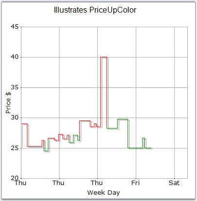

::: {style="DISPLAY: none"}
{#d2h_url_template}{#d2h_package_url style="WIDTH: 0px; DISPLAY: none; HEIGHT: 0px"}
:::

:::: {.d2h_secondary_topic style="PADDING-BOTTOM: 10pt; MARGIN: 0pt; PADDING-LEFT: 0pt; PADDING-RIGHT: 0pt; PADDING-TOP: 0pt"}
#### PriceUpColor {#priceupcolor style="tab-stops: 0pt"}

 

Specifies a color for the financial item whose price is up.

 

::: {align="center"}
+-------------------------------------+-----------------------------------------------------------------------+
|                                                                                                             |
|                                                                                                             |
| Details                                                                                                     |
+-------------------------------------+-----------------------------------------------------------------------+
| **Possible Values**                 | Any valid color                                                       |
+-------------------------------------+-----------------------------------------------------------------------+
| **Default Value    **               | **Color.Green**                                                       |
+-------------------------------------+-----------------------------------------------------------------------+
| **2D / 3D Limitations**             | No                                                                    |
+-------------------------------------+-----------------------------------------------------------------------+
| **Applies to Chart Element**        | Any series                                                            |
+-------------------------------------+-----------------------------------------------------------------------+
| **Applies to Chart Types**          | Kagi Chart, PointandFigure Chart, Renko Chart, Three Line Break Chart |
+-------------------------------------+-----------------------------------------------------------------------+
:::

 

Here is sample code snippet using PriceUpColor in Kagi Chart.

 

+-------------------------------------------------------------------------------------------------------------------------------------------------------------------------------------------------+
| **[\[C#\]]{style="FONT-FAMILY: 'Courier New'; COLOR: black"}**                                                                                                                                  |
|                                                                                                                                                                                                 |
| **[]{style="FONT-FAMILY: 'Courier New'; COLOR: black"}**                                                                                                                                        |
|                                                                                                                                                                                                 |
| [series.PriceUpColor = ]{style="FONT-FAMILY: 'Courier New'; COLOR: black"}[Color]{style="FONT-FAMILY: 'Courier New'; COLOR: teal"}[.Red;]{style="FONT-FAMILY: 'Courier New'; COLOR: black"}     |
|                                                                                                                                                                                                 |
| [series.PriceDownColor = ]{style="FONT-FAMILY: 'Courier New'; COLOR: black"}[Color]{style="FONT-FAMILY: 'Courier New'; COLOR: teal"}[.Green;]{style="FONT-FAMILY: 'Courier New'; COLOR: black"} |
+-------------------------------------------------------------------------------------------------------------------------------------------------------------------------------------------------+

 

+------------------------------------------------------------------------------------------------------------------------------------------------------------------------------------------------+
| **[\[VB.NET\]]{style="FONT-FAMILY: 'Courier New'; COLOR: black"}**                                                                                                                             |
|                                                                                                                                                                                                |
| **[]{style="FONT-FAMILY: 'Courier New'; COLOR: black"}**                                                                                                                                       |
|                                                                                                                                                                                                |
| [series.PriceUpColor = ]{style="FONT-FAMILY: 'Courier New'; COLOR: black"}[Color]{style="FONT-FAMILY: 'Courier New'; COLOR: teal"}[.Red]{style="FONT-FAMILY: 'Courier New'; COLOR: black"}     |
|                                                                                                                                                                                                |
| [series.PriceDownColor = ]{style="FONT-FAMILY: 'Courier New'; COLOR: black"}[Color]{style="FONT-FAMILY: 'Courier New'; COLOR: teal"}[.Green]{style="FONT-FAMILY: 'Courier New'; COLOR: black"} |
+------------------------------------------------------------------------------------------------------------------------------------------------------------------------------------------------+

 

{border="0"}

 

Figure 179: PriceUpColor = \"Red\"

**** 

 

 

**See Also**

 

[]{#p134}[[Kagi Chart]{style="COLOR: blue"}]{.UGHyperlink}, [Point and Figure Chart]{.UGHyperlink}, [Three Line Break Chart]{.UGHyperlink}, [Renko Chart]{.UGHyperlink}

 

[]{#related-topics}
::::
