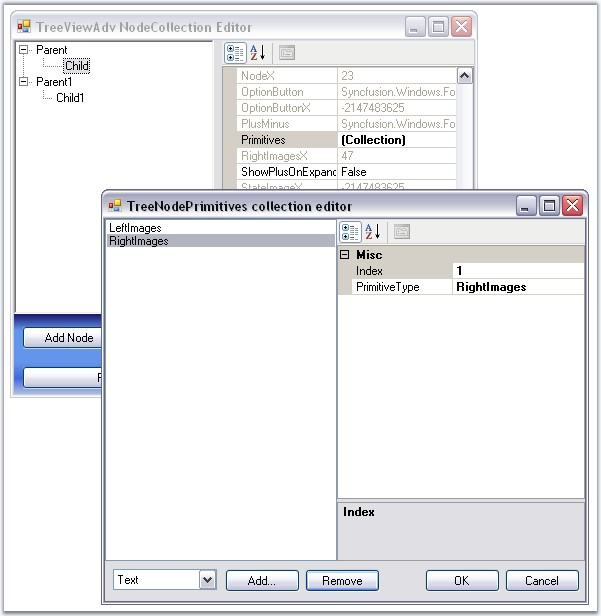

::: {style="DISPLAY: none"}
{#d2h_url_template}{#d2h_package_url style="WIDTH: 0px; DISPLAY: none; HEIGHT: 0px"}
:::

::: {.d2h_secondary_topic style="PADDING-BOTTOM: 10pt; MARGIN: 0pt; PADDING-LEFT: 0pt; PADDING-RIGHT: 0pt; PADDING-TOP: 0pt"}
##### Primitives {#primitives style="MARGIN-LEFT: 18pt; tab-stops: 18.0pt"}

 

The TreeViewAdv control supports a set of primitive collections, that can be set through the Primitives Collection Editor available with each node in the TreeViewAdv controls.

[]{style="COLOR: #15428b"} 

{border="0"}

[]{style="COLOR: #15428b"} 

Figure 1120: TreeNodePrimitives Collection Editor

[]{style="COLOR: #15428b"} 

The types of primitives available are LabelPrimitive, LeftImagePrimitive, RightImagePrimitive, CheckBoxPrimitive, OptionButtonPrimitive and CustomControlPrimitive.

 

The Primitive Collection Editor available for each node provides **index** property. Using this index set, for each primitive, the position for each of these node contents can be set.

[]{style="COLOR: #15428b"} 

[·      ]{style="FONT-FAMILY: Symbol"}**LabelPrimitive -** LabelPrimitive is used to display the text of the label.

 

[·      ]{style="FONT-FAMILY: Symbol"}**LeftImagePrimitive -** LeftImagePrimitive is used to display the image to the left of the nodes.

 

[·      ]{style="FONT-FAMILY: Symbol"}**RightImagePrimitive -** RightImagePrimitive is used to display the image that is added to the right of the nodes.

 

[·      ]{style="FONT-FAMILY: Symbol"}**StateImagePrimitive -** StateImagePrimitive is used to display the state image of the node depending on its state, whether expanded or collapsed.

 

[·      ]{style="FONT-FAMILY: Symbol"}**CheckBoxPrimitive -** CheckBoxPrimitive is used to display the checkbox for the nodes. When user clicks on this, the node will be checked.

 

[·      ]{style="FONT-FAMILY: Symbol"}**OptionButtonPrimitive -** OptionButtonPrimitive is used to display the Option button available for the nodes. When the user clicks this primitive, the corresponding node will be selected.

 

[·      ]{style="FONT-FAMILY: Symbol"}**CustomControlPrimitives -** CustomControlPrimitive displays the custom control for the nodes. User can use the functionality of the custom control primitive which is added to the nodes.     

[]{style="COLOR: #15428b"} 

See also

**[]{style="COLOR: #15428b"}** 

[[Node Images]{.UGHyperlink}](../../../../../../../../Documents%20and%20Settings/sylviap/Desktop/Tools%20-%20Part%202.docx#_Node_Images)[, ]{style="COLOR: #15428b"}[[Checkbox and Option Buttons]{.UGHyperlink}](../../../../../../../../Documents%20and%20Settings/sylviap/Desktop/Tools%20-%20Part%202.docx#_Checkbox_and_Option)[, ]{style="COLOR: #15428b"}[[CustomControls]{.UGHyperlink}](../../../../../../../../Documents%20and%20Settings/sylviap/Desktop/Tools%20-%20Part%202.docx#_Custom_Controls)[]{style="COLOR: black"}

 

 

 

 

 

[]{#related-topics}
:::
