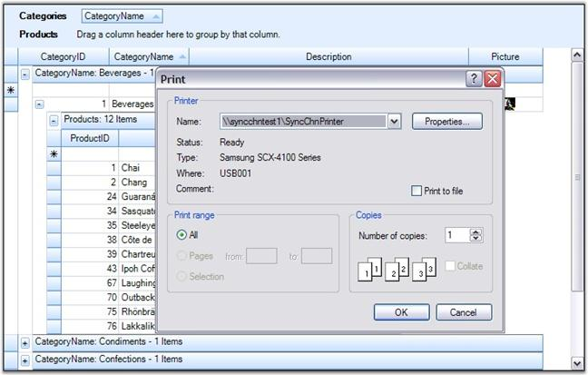
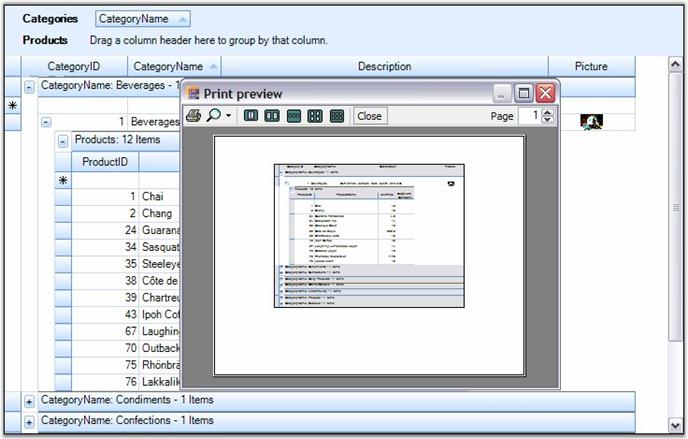
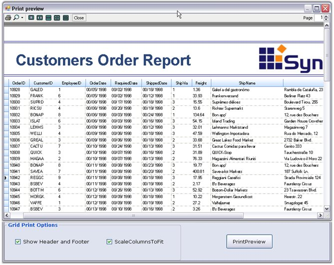

::: {style="DISPLAY: none"}
{#d2h_url_template}{#d2h_package_url style="WIDTH: 0px; DISPLAY: none; HEIGHT: 0px"}
:::

:::: {.d2h_secondary_topic style="PADDING-BOTTOM: 10pt; MARGIN: 0pt; PADDING-LEFT: 0pt; PADDING-RIGHT: 0pt; PADDING-TOP: 0pt"}
#### Print and Print Preview {#print-and-print-preview style="tab-stops: 0pt"}

[]{style="FONT-FAMILY: 'Trebuchet MS','sans-serif'; COLOR: #15428b; FONT-SIZE: 9pt"} 

Grid Grouping control supports printing and printing previews through the .NET Framework classes System.Windows.Forms.PrintPreviewDialog and System.Windows.Forms.PrintDialog. A derived **GridPrintDocument** which represents the print document is passed to these classes. This GridPrintDocument implements the printing logic that is needed to print multipage grids.

[]{style="FONT-FAMILY: 'Trebuchet MS','sans-serif'; COLOR: #15428b; FONT-SIZE: 9pt"} 

Code for Print Preview Dialog Box

[]{style="FONT-FAMILY: 'Trebuchet MS','sans-serif'; COLOR: #15428b; FONT-SIZE: 9pt"} 

+----------------------------------------------------------------------------------------------------------------------------------------------------------------------------------------------------------------------------------------------------------------------------------------+
| **[\[C#\]]{style="FONT-FAMILY: 'Courier New'; COLOR: black"}**                                                                                                                                                                                                                         |
|                                                                                                                                                                                                                                                                                        |
| []{style="FONT-FAMILY: 'Courier New'; COLOR: black"}                                                                                                                                                                                                                                   |
|                                                                                                                                                                                                                                                                                        |
| [GridPrintDocument]{style="FONT-FAMILY: 'Courier New'; COLOR: #2b91af"}[ pd = [new]{style="COLOR: blue"} [GridPrintDocument]{style="COLOR: #2b91af"}([this]{style="COLOR: blue"}.gridGroupingControl1.TableControl, [true]{style="COLOR: blue"});]{style="FONT-FAMILY: 'Courier New'"} |
|                                                                                                                                                                                                                                                                                        |
| [PrintPreviewDialog]{style="FONT-FAMILY: 'Courier New'; COLOR: #2b91af"}[ ppv = [new]{style="COLOR: blue"} [PrintPreviewDialog]{style="COLOR: #2b91af"}();]{style="FONT-FAMILY: 'Courier New'"}                                                                                        |
|                                                                                                                                                                                                                                                                                        |
| [ppv.Document = pd;]{style="FONT-FAMILY: 'Courier New'"}                                                                                                                                                                                                                               |
|                                                                                                                                                                                                                                                                                        |
| [pd.DefaultPageSettings.Landscape = [true]{style="COLOR: blue"};]{style="FONT-FAMILY: 'Courier New'"}                                                                                                                                                                                  |
|                                                                                                                                                                                                                                                                                        |
| [ppv.ShowDialog();]{style="FONT-FAMILY: 'Courier New'"}                                                                                                                                                                                                                                |
+----------------------------------------------------------------------------------------------------------------------------------------------------------------------------------------------------------------------------------------------------------------------------------------+

[]{style="FONT-FAMILY: 'Trebuchet MS','sans-serif'; COLOR: #15428b; FONT-SIZE: 9pt"} 

+------------------------------------------------------------------------------------------------------------------------------------------------------------------------------------------------------------------------------------------------------------------+
| **[\[VB.NET\]]{style="FONT-FAMILY: 'Courier New'; COLOR: black"}**                                                                                                                                                                                               |
|                                                                                                                                                                                                                                                                  |
| []{style="FONT-FAMILY: 'Courier New'; COLOR: black"}                                                                                                                                                                                                             |
|                                                                                                                                                                                                                                                                  |
| [Dim]{style="FONT-FAMILY: 'Courier New'; COLOR: blue"}[ pd [As]{style="COLOR: blue"} [New]{style="COLOR: blue"} GridPrintDocument([Me]{style="COLOR: blue"}.gridGroupingControl1.TableControl, [True]{style="COLOR: blue"})]{style="FONT-FAMILY: 'Courier New'"} |
|                                                                                                                                                                                                                                                                  |
| [Dim]{style="FONT-FAMILY: 'Courier New'; COLOR: blue"}[ ppv [As]{style="COLOR: blue"} [New]{style="COLOR: blue"} PrintPreviewDialog()]{style="FONT-FAMILY: 'Courier New'"}                                                                                       |
|                                                                                                                                                                                                                                                                  |
| [ppv.Document = pd]{style="FONT-FAMILY: 'Courier New'"}                                                                                                                                                                                                          |
|                                                                                                                                                                                                                                                                  |
| [pd.DefaultPageSettings.Landscape = [True]{style="COLOR: blue"}]{style="FONT-FAMILY: 'Courier New'"}                                                                                                                                                             |
|                                                                                                                                                                                                                                                                  |
| [ppv.ShowDialog()]{style="FONT-FAMILY: 'Courier New'"}                                                                                                                                                                                                           |
+------------------------------------------------------------------------------------------------------------------------------------------------------------------------------------------------------------------------------------------------------------------+

[]{style="FONT-FAMILY: 'Trebuchet MS','sans-serif'; COLOR: #15428b; FONT-SIZE: 9pt"} 

Code for Print Dialog Box

[]{style="FONT-FAMILY: 'Trebuchet MS','sans-serif'; COLOR: #15428b; FONT-SIZE: 9pt"} 

+-----------------------------------------------------------------------------------------------------------------------------------------------------------------------------------------------------------------------------------------------------------+
| **[\[C#\]]{style="FONT-FAMILY: 'Courier New'; COLOR: black"}**                                                                                                                                                                                            |
|                                                                                                                                                                                                                                                           |
| []{style="FONT-FAMILY: 'Courier New'; COLOR: black"}                                                                                                                                                                                                      |
|                                                                                                                                                                                                                                                           |
| [GridPrintDocument]{style="FONT-FAMILY: 'Courier New'; COLOR: #2b91af"}[ pd = [new]{style="COLOR: blue"} [GridPrintDocument]{style="COLOR: #2b91af"}([this]{style="COLOR: blue"}.gridGroupingControl1.TableControl);]{style="FONT-FAMILY: 'Courier New'"} |
|                                                                                                                                                                                                                                                           |
| [PrintDialog]{style="FONT-FAMILY: 'Courier New'; COLOR: #2b91af"}[ printDialog = [new]{style="COLOR: blue"} [PrintDialog]{style="COLOR: #2b91af"}();]{style="FONT-FAMILY: 'Courier New'"}                                                                 |
|                                                                                                                                                                                                                                                           |
| [printDialog.Document = pd;]{style="FONT-FAMILY: 'Courier New'"}                                                                                                                                                                                          |
|                                                                                                                                                                                                                                                           |
| [pd.DefaultPageSettings.Landscape = [true]{style="COLOR: blue"};]{style="FONT-FAMILY: 'Courier New'"}                                                                                                                                                     |
|                                                                                                                                                                                                                                                           |
| [if]{style="FONT-FAMILY: 'Courier New'; COLOR: blue"}[ (printDialog.ShowDialog() == [DialogResult]{style="COLOR: #2b91af"}.OK)]{style="FONT-FAMILY: 'Courier New'"}                                                                                       |
|                                                                                                                                                                                                                                                           |
| [pd.Print();]{style="FONT-FAMILY: 'Courier New'"}                                                                                                                                                                                                         |
+-----------------------------------------------------------------------------------------------------------------------------------------------------------------------------------------------------------------------------------------------------------+

[]{style="FONT-FAMILY: 'Trebuchet MS','sans-serif'; COLOR: #15428b; FONT-SIZE: 9pt"} 

+-------------------------------------------------------------------------------------------------------------------------------------------------------------------------------------------------------------------------------------+
| **[\[VB.NET\]]{style="FONT-FAMILY: 'Courier New'; COLOR: black"}**                                                                                                                                                                  |
|                                                                                                                                                                                                                                     |
| []{style="FONT-FAMILY: 'Courier New'; COLOR: black"}                                                                                                                                                                                |
|                                                                                                                                                                                                                                     |
| [Dim]{style="FONT-FAMILY: 'Courier New'; COLOR: blue"}[ pd [As]{style="COLOR: blue"} [New]{style="COLOR: blue"} GridPrintDocument([Me]{style="COLOR: blue"}.gridGroupingControl1.TableControl)]{style="FONT-FAMILY: 'Courier New'"} |
|                                                                                                                                                                                                                                     |
| [Dim]{style="FONT-FAMILY: 'Courier New'; COLOR: blue"}[ printDialog [As]{style="COLOR: blue"} [New]{style="COLOR: blue"} PrintDialog()]{style="FONT-FAMILY: 'Courier New'"}                                                         |
|                                                                                                                                                                                                                                     |
| [printDialog.Document = pd]{style="FONT-FAMILY: 'Courier New'"}                                                                                                                                                                     |
|                                                                                                                                                                                                                                     |
| [pd.DefaultPageSettings.Landscape = [True]{style="COLOR: blue"}]{style="FONT-FAMILY: 'Courier New'"}                                                                                                                                |
|                                                                                                                                                                                                                                     |
| [If]{style="FONT-FAMILY: 'Courier New'; COLOR: blue"}[ printDialog.ShowDialog() = Windows.Forms.DialogResult.OK [Then]{style="COLOR: blue"}]{style="FONT-FAMILY: 'Courier New'"}                                                    |
|                                                                                                                                                                                                                                     |
| [pd.Print()]{style="FONT-FAMILY: 'Courier New'"}                                                                                                                                                                                    |
|                                                                                                                                                                                                                                     |
| [End]{style="FONT-FAMILY: 'Courier New'; COLOR: blue"}[ [If]{style="COLOR: blue"}]{style="FONT-FAMILY: 'Courier New'"}                                                                                                              |
+-------------------------------------------------------------------------------------------------------------------------------------------------------------------------------------------------------------------------------------+

[]{style="FONT-FAMILY: 'Trebuchet MS','sans-serif'; COLOR: #15428b; FONT-SIZE: 9pt"} 

Given below are sample screen shots.

[]{style="FONT-FAMILY: 'Trebuchet MS','sans-serif'; COLOR: #15428b; FONT-SIZE: 9pt"} 

{border="0"}

[]{style="FONT-FAMILY: 'Trebuchet MS','sans-serif'; COLOR: #15428b; FONT-SIZE: 9pt"} 

*[Figure ]{style="FONT-SIZE: 9pt"}[406]{style="FONT-SIZE: 9pt"}[: Grid with Print Dialog Box]{style="FONT-SIZE: 9pt"}*

*[]{style="FONT-SIZE: 9pt"}* 

{border="0"}

**[]{style="FONT-FAMILY: 'Trebuchet MS','sans-serif'; COLOR: #15428b; FONT-SIZE: 9pt"}** 

*[Figure ]{style="FONT-SIZE: 9pt"}[407]{style="FONT-SIZE: 9pt"}[: Grid with Print Preview Dialog Box]{style="FONT-SIZE: 9pt"}*

[]{style="FONT-FAMILY: 'Trebuchet MS','sans-serif'; COLOR: #15428b; FONT-SIZE: 9pt"} 

::: {style="BORDER-BOTTOM: windowtext 1pt solid; BORDER-LEFT: medium none; PADDING-BOTTOM: 1pt; MARGIN-TOP: 9pt; PADDING-LEFT: 0pt; PADDING-RIGHT: 0pt; MARGIN-BOTTOM: 9pt; BORDER-TOP: windowtext 1pt solid; BORDER-RIGHT: medium none; PADDING-TOP: 1pt"}
{border="0"}Note: For more details, refer the following browser sample:

 

\<Install Location\>\\Syncfusion\\EssentialStudio\\\[Version Number\]\\Windows\\Grid.Grouping.Windows\\Samples\\2.0\\Print\\Print Grid Demo
:::

[]{style="FONT-FAMILY: 'Trebuchet MS','sans-serif'; COLOR: #15428b; FONT-SIZE: 9pt"} 

Advanced printing

 

Grid Grouping control supports printing of entire grid\'s column in a single page. Also, it allows the user to specify the header and footer for the page to be printed. This can be achieved by using the GridPrintDocumentAdv class. Column can be specified to fit in a single page by setting ScaleColumnsToFitPage property to true, header and footer can be added using the events DrawGridPrintHeader and DrawGridPrintFooter.

 

The following code example illustrates setting the header and footer for the page to be printed.

[]{style="FONT-FAMILY: 'Trebuchet MS','sans-serif'; COLOR: #15428b; FONT-SIZE: 9pt"} 

+--------------------------------------------------------------------------------------------------------------------------------------------------------------------------------------------------------------------------------------------------------------------------------------------------------------------------------------------------------------------------------------------------------+
| **[\[C#\]]{style="FONT-FAMILY: 'Courier New'; COLOR: black"}**                                                                                                                                                                                                                                                                                                                                         |
|                                                                                                                                                                                                                                                                                                                                                                                                        |
| []{style="FONT-FAMILY: 'Courier New'; COLOR: black"}                                                                                                                                                                                                                                                                                                                                                   |
|                                                                                                                                                                                                                                                                                                                                                                                                        |
| [Syncfusion.GridHelperClasses.[GridPrintDocumentAdv]{style="COLOR: #2b91af"} pd = [new]{style="COLOR: blue"} Syncfusion.GridHelperClasses.[GridPrintDocumentAdv]{style="COLOR: #2b91af"}([this]{style="COLOR: blue"}.gridGroupingControl1.TableControl);]{style="FONT-FAMILY: 'Courier New'"}                                                                                                          |
|                                                                                                                                                                                                                                                                                                                                                                                                        |
| [pd.DefaultPageSettings.Margins = [new]{style="COLOR: blue"} System.Drawing.Printing.[Margins]{style="COLOR: #2b91af"}(25, 25, 25, 25);]{style="FONT-FAMILY: 'Courier New'"}                                                                                                                                                                                                                           |
|                                                                                                                                                                                                                                                                                                                                                                                                        |
| []{style="FONT-FAMILY: 'Courier New'"}                                                                                                                                                                                                                                                                                                                                                                 |
|                                                                                                                                                                                                                                                                                                                                                                                                        |
| [// Set header and footer height.]{style="FONT-FAMILY: 'Courier New'; COLOR: green"}                                                                                                                                                                                                                                                                                                                   |
|                                                                                                                                                                                                                                                                                                                                                                                                        |
| [pd.HeaderHeight = 70;]{style="FONT-FAMILY: 'Courier New'"}                                                                                                                                                                                                                                                                                                                                            |
|                                                                                                                                                                                                                                                                                                                                                                                                        |
| [pd.FooterHeight = 50;]{style="FONT-FAMILY: 'Courier New'"}                                                                                                                                                                                                                                                                                                                                            |
|                                                                                                                                                                                                                                                                                                                                                                                                        |
| []{style="FONT-FAMILY: 'Courier New'"}                                                                                                                                                                                                                                                                                                                                                                 |
|                                                                                                                                                                                                                                                                                                                                                                                                        |
| [// Scale columns to fit page.]{style="FONT-FAMILY: 'Courier New'; COLOR: green"}                                                                                                                                                                                                                                                                                                                      |
|                                                                                                                                                                                                                                                                                                                                                                                                        |
| [pd.ScaleColumnsToFitPage = [true]{style="COLOR: blue"};]{style="FONT-FAMILY: 'Courier New'"}                                                                                                                                                                                                                                                                                                          |
|                                                                                                                                                                                                                                                                                                                                                                                                        |
| []{style="FONT-FAMILY: 'Courier New'"}                                                                                                                                                                                                                                                                                                                                                                 |
|                                                                                                                                                                                                                                                                                                                                                                                                        |
| [// Handle the following events to draw the header/footer.]{style="FONT-FAMILY: 'Courier New'; COLOR: green"}                                                                                                                                                                                                                                                                                          |
|                                                                                                                                                                                                                                                                                                                                                                                                        |
| [pd.DrawGridPrintHeader += [new]{style="COLOR: blue"} Syncfusion.GridHelperClasses.[GridPrintDocumentAdv]{style="COLOR: #2b91af"}.[DrawGridHeaderFooterEventHandler]{style="COLOR: #2b91af"}(pd_DrawGridPrintHeader);]{style="FONT-FAMILY: 'Courier New'"}                                                                                                                                             |
|                                                                                                                                                                                                                                                                                                                                                                                                        |
| [pd.DrawGridPrintFooter += [new]{style="COLOR: blue"} Syncfusion.GridHelperClasses.[GridPrintDocumentAdv]{style="COLOR: #2b91af"}.[DrawGridHeaderFooterEventHandler]{style="COLOR: #2b91af"}(pd_DrawGridPrintFooter); pd = [new]{style="COLOR: blue"} [GridPrintDocument]{style="COLOR: #2b91af"}([this]{style="COLOR: blue"}.gridGroupingControl1.TableControl);]{style="FONT-FAMILY: 'Courier New'"} |
|                                                                                                                                                                                                                                                                                                                                                                                                        |
| [PrintDialog]{style="FONT-FAMILY: 'Courier New'; COLOR: #2b91af"}[ printDialog = [new]{style="COLOR: blue"} [PrintDialog]{style="COLOR: #2b91af"}();]{style="FONT-FAMILY: 'Courier New'"}                                                                                                                                                                                                              |
|                                                                                                                                                                                                                                                                                                                                                                                                        |
| [printDialog.Document = pd;]{style="FONT-FAMILY: 'Courier New'"}                                                                                                                                                                                                                                                                                                                                       |
|                                                                                                                                                                                                                                                                                                                                                                                                        |
| [pd.DefaultPageSettings.Landscape = [true]{style="COLOR: blue"};]{style="FONT-FAMILY: 'Courier New'"}                                                                                                                                                                                                                                                                                                  |
|                                                                                                                                                                                                                                                                                                                                                                                                        |
| [if]{style="FONT-FAMILY: 'Courier New'; COLOR: blue"}[ (printDialog.ShowDialog() == [DialogResult]{style="COLOR: #2b91af"}.OK)]{style="FONT-FAMILY: 'Courier New'"}                                                                                                                                                                                                                                    |
|                                                                                                                                                                                                                                                                                                                                                                                                        |
| [pd.Print();]{style="FONT-FAMILY: 'Courier New'"}                                                                                                                                                                                                                                                                                                                                                      |
+--------------------------------------------------------------------------------------------------------------------------------------------------------------------------------------------------------------------------------------------------------------------------------------------------------------------------------------------------------------------------------------------------------+

[]{style="FONT-FAMILY: 'Trebuchet MS','sans-serif'; COLOR: #15428b; FONT-SIZE: 9pt"} 

+-------------------------------------------------------------------------------------------------------------------------------------------------------------------------------------------------------------------------------------------------------------------------------------------------------------------------+
| **[\[VB.NET\]]{style="FONT-FAMILY: 'Courier New'; COLOR: black"}**                                                                                                                                                                                                                                                      |
|                                                                                                                                                                                                                                                                                                                         |
| []{style="FONT-FAMILY: 'Courier New'; COLOR: black"}                                                                                                                                                                                                                                                                    |
|                                                                                                                                                                                                                                                                                                                         |
| [Dim]{style="FONT-FAMILY: 'Courier New'; COLOR: blue"}[ pd [As]{style="COLOR: blue"} Syncfusion.GridHelperClasses.GridPrintDocumentAdv = [New]{style="COLOR: blue"} Syncfusion.GridHelperClasses.GridPrintDocumentAdv([Me]{style="COLOR: blue"}.gridGroupingControl1.TableControl)]{style="FONT-FAMILY: 'Courier New'"} |
|                                                                                                                                                                                                                                                                                                                         |
| [pd.DefaultPageSettings.Margins = [New]{style="COLOR: blue"} System.Drawing.Printing.Margins(25, 25, 25, 25)]{style="FONT-FAMILY: 'Courier New'"}                                                                                                                                                                       |
|                                                                                                                                                                                                                                                                                                                         |
| []{style="FONT-FAMILY: 'Courier New'"}                                                                                                                                                                                                                                                                                  |
|                                                                                                                                                                                                                                                                                                                         |
| [\' Set header and footer height. ]{style="FONT-FAMILY: 'Courier New'; COLOR: green"}                                                                                                                                                                                                                                   |
|                                                                                                                                                                                                                                                                                                                         |
| [pd.HeaderHeight = 70]{style="FONT-FAMILY: 'Courier New'"}                                                                                                                                                                                                                                                              |
|                                                                                                                                                                                                                                                                                                                         |
| [pd.FooterHeight = 50]{style="FONT-FAMILY: 'Courier New'"}                                                                                                                                                                                                                                                              |
|                                                                                                                                                                                                                                                                                                                         |
| []{style="FONT-FAMILY: 'Courier New'"}                                                                                                                                                                                                                                                                                  |
|                                                                                                                                                                                                                                                                                                                         |
| [\' Scale columns to fit page.]{style="FONT-FAMILY: 'Courier New'; COLOR: green"}                                                                                                                                                                                                                                       |
|                                                                                                                                                                                                                                                                                                                         |
| [pd.ScaleColumnsToFitPage = [True]{style="COLOR: blue"}]{style="FONT-FAMILY: 'Courier New'"}                                                                                                                                                                                                                            |
|                                                                                                                                                                                                                                                                                                                         |
| []{style="FONT-FAMILY: 'Courier New'; COLOR: green"}                                                                                                                                                                                                                                                                    |
|                                                                                                                                                                                                                                                                                                                         |
| [\' Handle the following events to draw the header/footer.]{style="FONT-FAMILY: 'Courier New'; COLOR: green"}                                                                                                                                                                                                           |
|                                                                                                                                                                                                                                                                                                                         |
| [AddHandler]{style="FONT-FAMILY: 'Courier New'; COLOR: blue"}[ pd.DrawGridPrintHeader, [AddressOf]{style="COLOR: blue"} pd_DrawGridPrintHeader]{style="FONT-FAMILY: 'Courier New'"}                                                                                                                                     |
|                                                                                                                                                                                                                                                                                                                         |
| [AddHandler]{style="FONT-FAMILY: 'Courier New'; COLOR: blue"}[ pd.DrawGridPrintFooter, [AddressOf]{style="COLOR: blue"} pd_DrawGridPrintFooter]{style="FONT-FAMILY: 'Courier New'"}                                                                                                                                     |
+-------------------------------------------------------------------------------------------------------------------------------------------------------------------------------------------------------------------------------------------------------------------------------------------------------------------------+

[]{style="FONT-FAMILY: 'Trebuchet MS','sans-serif'; COLOR: #15428b; FONT-SIZE: 9pt"} 

For more details, refer the following sample browser.

 

***\<Install Location\>\\Syncfusion\\EssentialStudio\\\[Version Number\]\\Windows\\Grid.Grouping.Windows\\Samples\\2.0\\Print\\Print Grid Demo***

***[]{style="FONT-FAMILY: 'Trebuchet MS','sans-serif'; COLOR: #15428b; FONT-SIZE: 9pt"}*** 

{border="0"}

***[]{style="FONT-FAMILY: 'Trebuchet MS','sans-serif'; COLOR: #15428b; FONT-SIZE: 9pt"}*** 

*[Figure ]{style="FONT-SIZE: 9pt"}[408]{style="FONT-SIZE: 9pt"}[: Header and Footer set for page to be Printed]{style="FONT-SIZE: 9pt"}****[]{style="FONT-FAMILY: 'Trebuchet MS','sans-serif'; COLOR: #15428b; FONT-SIZE: 9pt"}***

 

[]{#p478} 

 

[]{#related-topics}
::::
