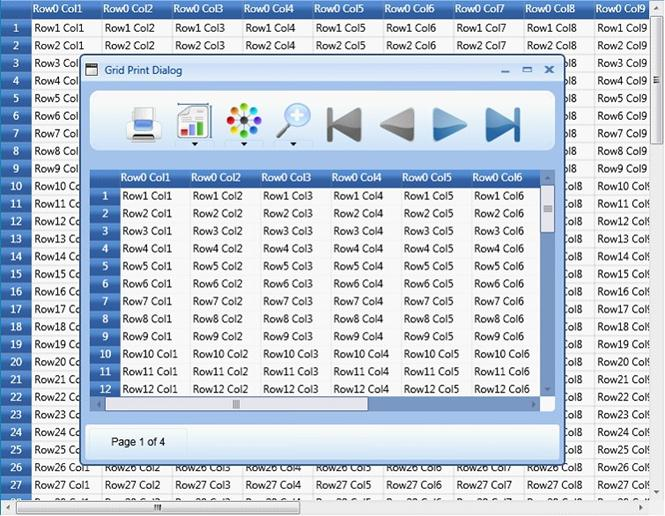

::: {style="DISPLAY: none"}
{#d2h_url_template}{#d2h_package_url style="WIDTH: 0px; DISPLAY: none; HEIGHT: 0px"}
:::

::::: {#nsbanner .d2h_main_nsbanner style="BORDER-BOTTOM: #999999 1px solid; POSITION: relative; PADDING-BOTTOM: 0px; BACKGROUND-COLOR: transparent; PADDING-LEFT: 0px; PADDING-RIGHT: 0px; DISPLAY: none; BORDER-TOP: #999999 1px solid; PADDING-TOP: 0px; LEFT: 0px"}
:::: {#TitleRow .d2h_main_titlerow style="PADDING-BOTTOM: 4px; BACKGROUND-COLOR: transparent; PADDING-LEFT: 22px; WIDTH: 100%; PADDING-RIGHT: 10px; DISPLAY: none; PADDING-TOP: 4px"}
::: {#ienav .d2h_main_ienav style="DISPLAY: none"}
{#D2HPrevious .D2HPreviousEnabled}  {#D2HNext .D2HNextEnabled}
:::
::::
:::::

:::: {#nstext .d2h_main_nstext style="PADDING-BOTTOM: 10px; BACKGROUND-COLOR: transparent; PADDING-LEFT: 22px; PADDING-RIGHT: 10px; HEIGHT: 100%; OVERFLOW: auto; PADDING-TOP: 5px" hasuserbackground="true" valign="bottom"}
::: {#d2h_breadcrumbs .d2h_breadcrumbs}
[Essential Studio User Guide Documentation](ms-xhelp:///?Id=12457748-09e3-4d74-a240-8e049cedf030){.d2h_breadcrumbsNormal}[ \> ]{.d2h_breadcrumbsLinkSeparator}[User Interface Edition](ms-xhelp:///?Id=c29296b7-531c-413b-a0ec-488ca1f7f669){.d2h_breadcrumbsNormal}[ \> ]{.d2h_breadcrumbsLinkSeparator}[Essential WPF](ms-xhelp:///?Id=7f4f82c5-151c-4262-94d0-75c4626c77bc){.d2h_breadcrumbsNormal}[ \> ]{.d2h_breadcrumbsLinkSeparator}[Essential Grid]{.d2h_breadcrumbsContentsOnly}[ \> ]{.d2h_breadcrumbsLinkSeparator}[Installation and Deployment](ms-xhelp:///?Id=094c35c7-db8e-4341-9619-16644b2a4e34){.d2h_breadcrumbsNormal}[ \> ]{.d2h_breadcrumbsLinkSeparator}[Grid WPF Controls](ms-xhelp:///?Id=1249c159-5431-465a-b1af-1cf1e5e90ac8){.d2h_breadcrumbsNormal}[ \> ]{.d2h_breadcrumbsLinkSeparator}[Grid Control](ms-xhelp:///?Id=7b54a403-0e9e-4539-948b-dbe0726ed273){.d2h_breadcrumbsNormal}
:::

### Print and Print Preview {#print-and-print-preview style="tab-stops: 0pt"}

Essential Grid for WPF provides an in-built support for printing and print preview.  This feature populates a print dialog that allows you to preview the output and make required modifications if necessary, before sending the grid content for printing.

 

The GridPrintDialog class plays a vital role in the implementation of printing support. It is built based on Microsoft PrintDialog class that will handle the internal operations for GridPrintDialog. The GridPrintDialog class defines the designer for the Print dialog and exposes a number of properties and APIs to handle the UI requirements and define the interaction logic for the Print Dialog. The users can use these properties to configure the Print and Print Preview options.

 

Example

 

Enabling the printing feature is like invoking an API -- ShowPrintDialog() on the instances of the grid.

 

+-----------------------------------------------------------------------------------------------------------------------+
| [\[C#\]]{style="FONT-FAMILY: 'Courier New'; COLOR: black"}                                                            |
|                                                                                                                       |
| **[]{style="FONT-FAMILY: 'Courier New'; COLOR: blue"}**                                                               |
|                                                                                                                       |
| [this]{style="FONT-FAMILY: 'Courier New'; COLOR: blue"}[.grid.ShowPrintDialog();]{style="FONT-FAMILY: 'Courier New'"} |
+-----------------------------------------------------------------------------------------------------------------------+

 

Output

 

       {border="0"}

Figure 88: Grid Print Dialog

 

*[]{style="COLOR: #15428b"}* 

*[]{style="COLOR: #15428b"}* 

More:

[ ]{#related-topics}

[{border="0" align="absMiddle"}Print Dialog Options](ms-xhelp:///?Id=57da691b-063e-4215-9c00-896dfefa19ce){style="TEXT-DECORATION: none"}

[{border="0" align="absMiddle"}Printing Header and Footer](ms-xhelp:///?Id=1b7bf955-63ee-4c54-955c-415248469437){style="TEXT-DECORATION: none"}
::::
