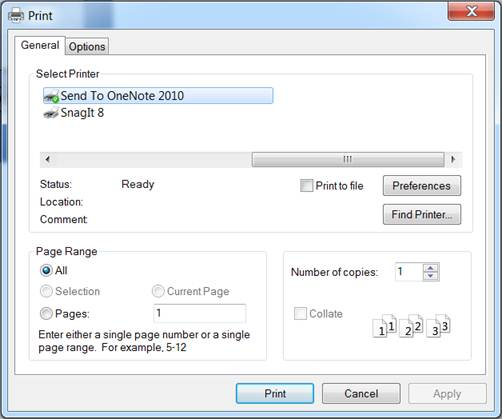

::: {style="DISPLAY: none"}
{#d2h_url_template}{#d2h_package_url style="WIDTH: 0px; DISPLAY: none; HEIGHT: 0px"}
:::

::::: {#nsbanner .d2h_main_nsbanner style="BORDER-BOTTOM: #999999 1px solid; POSITION: relative; PADDING-BOTTOM: 0px; BACKGROUND-COLOR: transparent; PADDING-LEFT: 0px; PADDING-RIGHT: 0px; DISPLAY: none; BORDER-TOP: #999999 1px solid; PADDING-TOP: 0px; LEFT: 0px"}
:::: {#TitleRow .d2h_main_titlerow style="PADDING-BOTTOM: 4px; BACKGROUND-COLOR: transparent; PADDING-LEFT: 22px; WIDTH: 100%; PADDING-RIGHT: 10px; DISPLAY: none; PADDING-TOP: 4px"}
::: {#ienav .d2h_main_ienav style="DISPLAY: none"}
{#D2HPrevious .D2HPreviousEnabled}  {#D2HNext .D2HNextEnabled}
:::
::::
:::::

:::: {#nstext .d2h_main_nstext style="PADDING-BOTTOM: 10px; BACKGROUND-COLOR: transparent; PADDING-LEFT: 22px; PADDING-RIGHT: 10px; HEIGHT: 100%; OVERFLOW: auto; PADDING-TOP: 5px" hasuserbackground="true" valign="bottom"}
::: {#d2h_breadcrumbs .d2h_breadcrumbs}
[Essential Studio User Guide Documentation](ms-xhelp:///?Id=12457748-09e3-4d74-a240-8e049cedf030){.d2h_breadcrumbsNormal}[ \> ]{.d2h_breadcrumbsLinkSeparator}[Business Intelligence Edition](ms-xhelp:///?Id=fdf33dd8-62b2-47b9-ad7b-fc50e590bca5){.d2h_breadcrumbsNormal}[ \> ]{.d2h_breadcrumbsLinkSeparator}[Essential BI ASP.NET](ms-xhelp:///?Id=99c6694e-59c3-4c59-abb5-ce9ce9a948bc){.d2h_breadcrumbsNormal}[ \> ]{.d2h_breadcrumbsLinkSeparator}[Essential BI Chart]{.d2h_breadcrumbsContentsOnly}[ \> ]{.d2h_breadcrumbsLinkSeparator}[Concepts and Features](ms-xhelp:///?Id=be4e11fe-e0a1-44d7-aa3a-05cf8b78bdb8){.d2h_breadcrumbsNormal}
:::

## Print and Print Preview {#print-and-print-preview style="tab-stops: 0pt"}

The OLAP Chart can be printed by using the following code snippets. Also, a preview of the control is possible before printing it.

+----------------------------------------------------------------------------------------------------------------------------------------------------------------------------------------------------------------------------------------------------------------------------------------------------------------------------------------+
| **[\[C#\]]{style="FONT-FAMILY: 'Courier New'; COLOR: black"}**[]{style="FONT-FAMILY: 'Courier New'; COLOR: black"}                                                                                                                                                                                                                     |
|                                                                                                                                                                                                                                                                                                                                        |
| [Bitmap]{style="FONT-FAMILY: 'Courier New'; COLOR: #2b91af"}[ bmp = [new]{style="COLOR: blue"} [Bitmap]{style="COLOR: #2b91af"}(([int]{style="COLOR: blue"})[this]{style="COLOR: blue"}.olapChart1.Width.Value, ([int]{style="COLOR: blue"})[this]{style="COLOR: blue"}.olapChart1.Height.Value);]{style="FONT-FAMILY: 'Courier New'"} |
|                                                                                                                                                                                                                                                                                                                                        |
| [this]{style="FONT-FAMILY: 'Courier New'; COLOR: blue"}[.olapChart1.Draw(bmp);]{style="FONT-FAMILY: 'Courier New'"}                                                                                                                                                                                                                    |
|                                                                                                                                                                                                                                                                                                                                        |
| [ImageResourceInfo]{style="FONT-FAMILY: 'Courier New'; COLOR: #2b91af"}[ iri = [new]{style="COLOR: blue"} [ImageResourceInfo]{style="COLOR: #2b91af"}(bmp, System.Drawing.Imaging.[ImageFormat]{style="COLOR: #2b91af"}.Png, [this]{style="COLOR: blue"}.olapChart1.Parent.ID);]{style="FONT-FAMILY: 'Courier New'"}                   |
|                                                                                                                                                                                                                                                                                                                                        |
| [ResourceHolder]{style="FONT-FAMILY: 'Courier New'; COLOR: #2b91af"}[ printHolder = [new]{style="COLOR: blue"} [ResourceHolder]{style="COLOR: #2b91af"}([this]{style="COLOR: blue"}.Page, [this]{style="COLOR: blue"}.olapChart1);]{style="FONT-FAMILY: 'Courier New'"}                                                                |
|                                                                                                                                                                                                                                                                                                                                        |
| [printHolder.AddResource(iri);]{style="FONT-FAMILY: 'Courier New'"}                                                                                                                                                                                                                                                                    |
|                                                                                                                                                                                                                                                                                                                                        |
| [ChartUtils]{style="FONT-FAMILY: 'Courier New'; COLOR: #2b91af"}[.PrintImageOnClient([this]{style="COLOR: blue"}.Page, printHolder.GetResourceUrl(iri));]{style="FONT-FAMILY: 'Courier New'"}[]{style="FONT-FAMILY: 'Courier New'"}                                                                                                    |
+----------------------------------------------------------------------------------------------------------------------------------------------------------------------------------------------------------------------------------------------------------------------------------------------------------------------------------------+

[]{style="COLOR: black"} 

+------------------------------------------------------------------------------------------------------------------------------------------------------------------------------------------------------------------------------------------------------------------------------------------------------------------------------------------------+
| **[\[VB\]]{style="FONT-FAMILY: 'Courier New'; COLOR: black"}**[]{style="FONT-FAMILY: 'Courier New'; COLOR: black"}                                                                                                                                                                                                                             |
|                                                                                                                                                                                                                                                                                                                                                |
| [Dim]{style="FONT-FAMILY: 'Courier New'; COLOR: blue"}[ bmp [As]{style="COLOR: blue"} Bitmap = [New]{style="COLOR: blue"} Bitmap([CInt]{style="COLOR: blue"}(Fix([Me]{style="COLOR: blue"}.olapChart1.Width.Value)), [CInt]{style="COLOR: blue"}(Fix([Me]{style="COLOR: blue"}.olapChart1.Height.Value)))]{style="FONT-FAMILY: 'Courier New'"} |
|                                                                                                                                                                                                                                                                                                                                                |
| [Me]{style="FONT-FAMILY: 'Courier New'; COLOR: blue"}[.olapChart1.Draw(bmp)]{style="FONT-FAMILY: 'Courier New'"}                                                                                                                                                                                                                               |
|                                                                                                                                                                                                                                                                                                                                                |
| [Dim]{style="FONT-FAMILY: 'Courier New'; COLOR: blue"}[ iri [As]{style="COLOR: blue"} ImageResourceInfo = [New]{style="COLOR: blue"} ImageResourceInfo(bmp, System.Drawing.Imaging.ImageFormat.Png, [Me]{style="COLOR: blue"}.olapChart1.Parent.ID)]{style="FONT-FAMILY: 'Courier New'"}                                                       |
|                                                                                                                                                                                                                                                                                                                                                |
| [Dim]{style="FONT-FAMILY: 'Courier New'; COLOR: blue"}[ printHolder [As]{style="COLOR: blue"} ResourceHolder = [New]{style="COLOR: blue"} ResourceHolder([Me]{style="COLOR: blue"}.Page, [Me]{style="COLOR: blue"}.olapChart1)]{style="FONT-FAMILY: 'Courier New'"}                                                                            |
|                                                                                                                                                                                                                                                                                                                                                |
| [printHolder.AddResource(iri)]{style="FONT-FAMILY: 'Courier New'"}                                                                                                                                                                                                                                                                             |
|                                                                                                                                                                                                                                                                                                                                                |
| [ChartUtils.PrintImageOnClient([Me]{style="COLOR: blue"}.Page, printHolder.GetResourceUrl(iri))]{style="FONT-FAMILY: 'Courier New'"}                                                                                                                                                                                                           |
+------------------------------------------------------------------------------------------------------------------------------------------------------------------------------------------------------------------------------------------------------------------------------------------------------------------------------------------------+

 

{border="0"}

 

Figure 49: Print option

Sample Location

 

A sample demo is available at the following location:

 

..\\Syncfusion\\EssentialStudio\\\<Version Number\>\\BI\\Web\\OlapChart.Web\\Samples\\3.5\\ Exporting\\Exporting Chart Demo\\[]{style="FONT-FAMILY: 'Cambria','serif'; COLOR: black; FONT-SIZE: 12pt"}

[]{#related-topics}
::::
