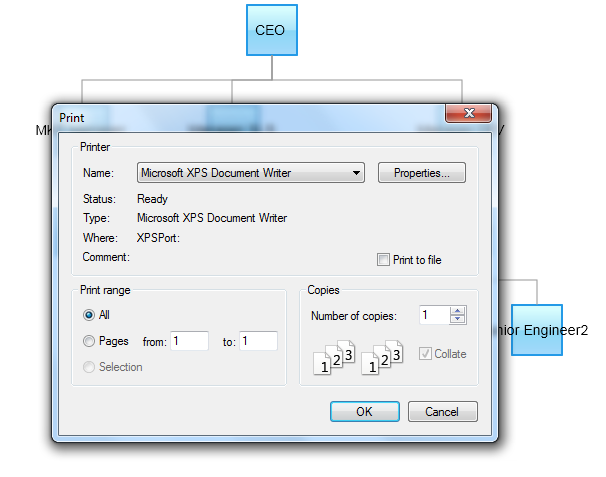

::: {style="DISPLAY: none"}
{#d2h_url_template}{#d2h_package_url style="WIDTH: 0px; DISPLAY: none; HEIGHT: 0px"}
:::

::::: {#nsbanner .d2h_main_nsbanner style="BORDER-BOTTOM: #999999 1px solid; POSITION: relative; PADDING-BOTTOM: 0px; BACKGROUND-COLOR: transparent; PADDING-LEFT: 0px; PADDING-RIGHT: 0px; DISPLAY: none; BORDER-TOP: #999999 1px solid; PADDING-TOP: 0px; LEFT: 0px"}
:::: {#TitleRow .d2h_main_titlerow style="PADDING-BOTTOM: 4px; BACKGROUND-COLOR: transparent; PADDING-LEFT: 22px; WIDTH: 100%; PADDING-RIGHT: 10px; DISPLAY: none; PADDING-TOP: 4px"}
::: {#ienav .d2h_main_ienav style="DISPLAY: none"}
{#D2HPrevious .D2HPreviousEnabled}  {#D2HNext .D2HNextEnabled}
:::
::::
:::::

::::: {#nstext .d2h_main_nstext style="PADDING-BOTTOM: 10px; BACKGROUND-COLOR: transparent; PADDING-LEFT: 22px; PADDING-RIGHT: 10px; HEIGHT: 100%; OVERFLOW: auto; PADDING-TOP: 5px" hasuserbackground="true" valign="bottom"}
::: {#d2h_breadcrumbs .d2h_breadcrumbs}
[Essential Studio User Guide Documentation](ms-xhelp:///?Id=12457748-09e3-4d74-a240-8e049cedf030){.d2h_breadcrumbsNormal}[ \> ]{.d2h_breadcrumbsLinkSeparator}[User Interface Edition](ms-xhelp:///?Id=c29296b7-531c-413b-a0ec-488ca1f7f669){.d2h_breadcrumbsNormal}[ \> ]{.d2h_breadcrumbsLinkSeparator}[Essential ASP.NET MVC](ms-xhelp:///?Id=4b14e7d1-65c4-4f67-b1aa-2c37709905a5){.d2h_breadcrumbsNormal}[ \> ]{.d2h_breadcrumbsLinkSeparator}[Essential Diagram]{.d2h_breadcrumbsContentsOnly}[ \> ]{.d2h_breadcrumbsLinkSeparator}[Concepts and Features](ms-xhelp:///?Id=04839cdf-94fc-4d24-9f6b-119fdbd7bbfb){.d2h_breadcrumbsNormal}[ \> ]{.d2h_breadcrumbsLinkSeparator}[Printing](ms-xhelp:///?Id=79f44dbe-7cbc-45e9-b550-9fb3903b3e49){.d2h_breadcrumbsNormal}
:::

### Print Diagram Page {#print-diagram-page style="tab-stops: 0pt"}

The following code snippet illustrates how to print the diagram page.

1.  [In the **controller**, pass the data to the **view** page.]{style="FONT-FAMILY: 'Arial','sans-serif'"}

::: {align="center"}
+------------------------------------------------------------------------------------------------------------------------------------------------------------------------+
| **[Controller]{style="FONT-FAMILY: 'Courier New'"}[]{style="FONT-FAMILY: 'Courier New'"}**                                                                             |
|                                                                                                                                                                        |
| []{style="FONT-FAMILY: Consolas; COLOR: #2b91af; FONT-SIZE: 9.5pt"}                                                                                                    |
|                                                                                                                                                                        |
| [Northwind]{style="FONT-FAMILY: Consolas; COLOR: #2b91af; FONT-SIZE: 9.5pt"}[ context = [null]{style="COLOR: blue"};]{style="FONT-FAMILY: Consolas; FONT-SIZE: 9.5pt"} |
|                                                                                                                                                                        |
| [        [public]{style="COLOR: blue"} [ActionResult]{style="COLOR: #2b91af"} ExportDiagram()]{style="FONT-FAMILY: Consolas; FONT-SIZE: 9.5pt"}                        |
|                                                                                                                                                                        |
| [        {]{style="FONT-FAMILY: Consolas; FONT-SIZE: 9.5pt"}                                                                                                           |
|                                                                                                                                                                        |
| [            context = SqlCE;]{style="FONT-FAMILY: Consolas; FONT-SIZE: 9.5pt"}                                                                                        |
|                                                                                                                                                                        |
| [            [return]{style="COLOR: blue"} View(context.DiagramDataBinding);]{style="FONT-FAMILY: Consolas; FONT-SIZE: 9.5pt"}                                         |
|                                                                                                                                                                        |
| [        }]{style="FONT-FAMILY: Consolas; FONT-SIZE: 9.5pt"}                                                                                                           |
+------------------------------------------------------------------------------------------------------------------------------------------------------------------------+
:::

[]{style="COLOR: black"} 

[2.   Create a ]{style="COLOR: black"}[[Strongly Typed View]{.UGHyperlink}](http://help.syncfusion.com/ug_94/User%20Interface/ASP.NET%20MVC/Diagram/default.htm?turl=Documents%2Fcreateastronglytypedview.htm)[. ]{style="COLOR: black"}

3.  [In the **view**, invoke the **Diagram** helper with the control ID, and set the **DataDource**, **BindTo**, **DiagramMode**, and **Mapper** methods.]{style="FONT-FAMILY: 'Arial','sans-serif'"}

 

+-------------------------------------------------------------------------------------------------------------------------------------+
| **[\[ASPX\]]{style="FONT-FAMILY: 'Courier New'"}**                                                                                  |
|                                                                                                                                     |
| [\<%]{style="FONT-FAMILY: Consolas; BACKGROUND: yellow; FONT-SIZE: 9.5pt"}[{]{style="FONT-FAMILY: Consolas; FONT-SIZE: 9.5pt"}      |
|                                                                                                                                     |
| [      Html.Syncfusion().Diagram([\"ExportDiagram\"]{style="COLOR: #a31515"})]{style="FONT-FAMILY: Consolas; FONT-SIZE: 9.5pt"}     |
|                                                                                                                                     |
| [        .DataSource(Model)]{style="FONT-FAMILY: Consolas; FONT-SIZE: 9.5pt"}                                                       |
|                                                                                                                                     |
| [        .BindTo(bind =\>]{style="FONT-FAMILY: Consolas; FONT-SIZE: 9.5pt"}                                                         |
|                                                                                                                                     |
| [            bind.NodeId([\"NodeId\"]{style="COLOR: #a31515"})]{style="FONT-FAMILY: Consolas; FONT-SIZE: 9.5pt"}                    |
|                                                                                                                                     |
| [            .ParentNodeId([\"ParentNodeId\"]{style="COLOR: #a31515"})]{style="FONT-FAMILY: Consolas; FONT-SIZE: 9.5pt"}            |
|                                                                                                                                     |
| [            .NodeText([\"NodeText\"]{style="COLOR: #a31515"})]{style="FONT-FAMILY: Consolas; FONT-SIZE: 9.5pt"}                    |
|                                                                                                                                     |
| [            .NodeShape([\"Shape\"]{style="COLOR: #a31515"}))]{style="FONT-FAMILY: Consolas; FONT-SIZE: 9.5pt"}                     |
|                                                                                                                                     |
| [        .DiagramMode([DiagramMode]{style="COLOR: #2b91af"}.SVG)]{style="FONT-FAMILY: Consolas; FONT-SIZE: 9.5pt"}                  |
|                                                                                                                                     |
| [        .LayoutType([LayoutType]{style="COLOR: #2b91af"}.HierarchicalTreeLayout)]{style="FONT-FAMILY: Consolas; FONT-SIZE: 9.5pt"} |
|                                                                                                                                     |
| [        .Orientation([TreeOrientation]{style="COLOR: #2b91af"}.TopBottom)]{style="FONT-FAMILY: Consolas; FONT-SIZE: 9.5pt"}        |
|                                                                                                                                     |
| [        .Width(750)]{style="FONT-FAMILY: Consolas; FONT-SIZE: 9.5pt"}                                                              |
|                                                                                                                                     |
| [        .Height(450)]{style="FONT-FAMILY: Consolas; FONT-SIZE: 9.5pt"}                                                             |
|                                                                                                                                     |
| [        .Render();]{style="FONT-FAMILY: Consolas; FONT-SIZE: 9.5pt"}                                                               |
|                                                                                                                                     |
| [  }[%\>]{style="BACKGROUND: yellow"}]{style="FONT-FAMILY: Consolas; FONT-SIZE: 9.5pt"}                                             |
|                                                                                                                                     |
| []{style="FONT-FAMILY: Consolas; BACKGROUND: yellow; FONT-SIZE: 9.5pt"}                                                             |
|                                                                                                                                     |
| **[\[Razor\]]{style="FONT-FAMILY: 'Courier New'"}**                                                                                 |
|                                                                                                                                     |
| [\@{]{style="FONT-FAMILY: Consolas; BACKGROUND: yellow; FONT-SIZE: 9.5pt"}[]{style="FONT-FAMILY: Consolas; FONT-SIZE: 9.5pt"}       |
|                                                                                                                                     |
| [    Html.Syncfusion().Diagram([\"ExportDiagram\"]{style="COLOR: #a31515"})]{style="FONT-FAMILY: Consolas; FONT-SIZE: 9.5pt"}       |
|                                                                                                                                     |
| [      .DataSource(Model)]{style="FONT-FAMILY: Consolas; FONT-SIZE: 9.5pt"}                                                         |
|                                                                                                                                     |
| [      .BindTo(bind =\>]{style="FONT-FAMILY: Consolas; FONT-SIZE: 9.5pt"}                                                           |
|                                                                                                                                     |
| [          bind.NodeId([\"NodeId\"]{style="COLOR: #a31515"})]{style="FONT-FAMILY: Consolas; FONT-SIZE: 9.5pt"}                      |
|                                                                                                                                     |
| [          .ParentNodeId([\"ParentNodeId\"]{style="COLOR: #a31515"})]{style="FONT-FAMILY: Consolas; FONT-SIZE: 9.5pt"}              |
|                                                                                                                                     |
| [          .NodeText([\"NodeText\"]{style="COLOR: #a31515"})]{style="FONT-FAMILY: Consolas; FONT-SIZE: 9.5pt"}                      |
|                                                                                                                                     |
| [          .NodeShape([\"Shape\"]{style="COLOR: #a31515"}))]{style="FONT-FAMILY: Consolas; FONT-SIZE: 9.5pt"}                       |
|                                                                                                                                     |
| [      .DiagramMode([DiagramMode]{style="COLOR: #2b91af"}.SVG)]{style="FONT-FAMILY: Consolas; FONT-SIZE: 9.5pt"}                    |
|                                                                                                                                     |
| [      .LayoutType([LayoutType]{style="COLOR: #2b91af"}.HierarchicalTreeLayout)]{style="FONT-FAMILY: Consolas; FONT-SIZE: 9.5pt"}   |
|                                                                                                                                     |
| [      .Orientation([TreeOrientation]{style="COLOR: #2b91af"}.TopBottom)]{style="FONT-FAMILY: Consolas; FONT-SIZE: 9.5pt"}          |
|                                                                                                                                     |
| [      .Width(750)]{style="FONT-FAMILY: Consolas; FONT-SIZE: 9.5pt"}                                                                |
|                                                                                                                                     |
| [      .Height(450)]{style="FONT-FAMILY: Consolas; FONT-SIZE: 9.5pt"}                                                               |
|                                                                                                                                     |
| [      .Render();]{style="FONT-FAMILY: Consolas; FONT-SIZE: 9.5pt"}                                                                 |
|                                                                                                                                     |
| [}]{style="FONT-FAMILY: Consolas; BACKGROUND: yellow; FONT-SIZE: 9.5pt"}[]{style="FONT-FAMILY: Consolas; FONT-SIZE: 9.5pt"}         |
+-------------------------------------------------------------------------------------------------------------------------------------+

[]{style="FONT-SIZE: 9pt"} 

4.  [Include the following JavaScript files in the **Site.Master** page]{style="FONT-FAMILY: 'Arial','sans-serif'"}

+-------------------------------------------------------------------------------------------------------------------------------------------------------------------------------------------------------------------------------------------------------------------------------------------------------------------------------------------------------------------------------------------------------------------------------------------------------------------+
| **[\[ASPX\]]{style="FONT-FAMILY: 'Courier New'"}**                                                                                                                                                                                                                                                                                                                                                                                                                |
|                                                                                                                                                                                                                                                                                                                                                                                                                                                                   |
| [    [\<%]{style="BACKGROUND: yellow"}[\-- Download the below javascript files from this location: http://code.google.com/p/canvg/\--]{style="COLOR: darkgreen"}[%\>]{style="BACKGROUND: yellow"}]{style="FONT-FAMILY: Consolas; FONT-SIZE: 9.5pt"}                                                                                                                                                                                                               |
|                                                                                                                                                                                                                                                                                                                                                                                                                                                                   |
| [    [\<]{style="COLOR: blue"}[script]{style="COLOR: maroon"} [src]{style="COLOR: red"}[=\"]{style="COLOR: blue"}[\<%]{style="BACKGROUND: yellow"}[=]{style="COLOR: blue"}Url.Content(\"\~/Scripts/canvg.js\") [%\>]{style="BACKGROUND: yellow"}[\"]{style="COLOR: blue"} [type]{style="COLOR: red"}[=\"text/javascript\"\>\</]{style="COLOR: blue"}[script]{style="COLOR: maroon"}[\>]{style="COLOR: blue"}]{style="FONT-FAMILY: Consolas; FONT-SIZE: 9.5pt"}    |
|                                                                                                                                                                                                                                                                                                                                                                                                                                                                   |
| [    [\<]{style="COLOR: blue"}[script]{style="COLOR: maroon"} [src]{style="COLOR: red"}[=\"]{style="COLOR: blue"}[\<%]{style="BACKGROUND: yellow"}[=]{style="COLOR: blue"}Url.Content(\"\~/Scripts/rgbcolor.js\") [%\>]{style="BACKGROUND: yellow"}[\"]{style="COLOR: blue"} [type]{style="COLOR: red"}[=\"text/javascript\"\>\</]{style="COLOR: blue"}[script]{style="COLOR: maroon"}[\>]{style="COLOR: blue"}]{style="FONT-FAMILY: Consolas; FONT-SIZE: 9.5pt"} |
|                                                                                                                                                                                                                                                                                                                                                                                                                                                                   |
| []{style="FONT-FAMILY: Consolas; FONT-SIZE: 9.5pt"}                                                                                                                                                                                                                                                                                                                                                                                                               |
|                                                                                                                                                                                                                                                                                                                                                                                                                                                                   |
| []{style="FONT-FAMILY: Consolas; BACKGROUND: yellow; FONT-SIZE: 9.5pt"}                                                                                                                                                                                                                                                                                                                                                                                           |
|                                                                                                                                                                                                                                                                                                                                                                                                                                                                   |
| **[\[Razor\]]{style="FONT-FAMILY: 'Courier New'"}**                                                                                                                                                                                                                                                                                                                                                                                                               |
|                                                                                                                                                                                                                                                                                                                                                                                                                                                                   |
| [    [@\*]{style="BACKGROUND: yellow"}[Download the below javascript files from this location: http://code.google.com/p/canvg/]{style="COLOR: darkgreen"}[\*@]{style="BACKGROUND: yellow"}]{style="FONT-FAMILY: Consolas; FONT-SIZE: 9.5pt"}                                                                                                                                                                                                                      |
|                                                                                                                                                                                                                                                                                                                                                                                                                                                                   |
| [    [\<]{style="COLOR: blue"}[script]{style="COLOR: maroon"} [src]{style="COLOR: red"}[=\"]{style="COLOR: blue"}[@]{style="BACKGROUND: yellow"}[Url.Content(]{style="COLOR: blue"}[\"\~/Scripts/canvg.js\"]{style="COLOR: #a31515"}[)\"]{style="COLOR: blue"} [type]{style="COLOR: red"}[=\"text/javascript\"\>\</]{style="COLOR: blue"}[script]{style="COLOR: maroon"}[\>]{style="COLOR: blue"}]{style="FONT-FAMILY: Consolas; FONT-SIZE: 9.5pt"}               |
|                                                                                                                                                                                                                                                                                                                                                                                                                                                                   |
| [    [\<]{style="COLOR: blue"}[script]{style="COLOR: maroon"} [src]{style="COLOR: red"}[=\"]{style="COLOR: blue"}[@]{style="BACKGROUND: yellow"}[Url.Content(]{style="COLOR: blue"}[\"\~/Scripts/rgbcolor.js\"]{style="COLOR: #a31515"}[)\"]{style="COLOR: blue"} [type]{style="COLOR: red"}[=\"text/javascript\"\>\</]{style="COLOR: blue"}[script]{style="COLOR: maroon"}[\>]{style="COLOR: blue"}]{style="FONT-FAMILY: Consolas; FONT-SIZE: 9.5pt"}            |
|                                                                                                                                                                                                                                                                                                                                                                                                                                                                   |
| []{style="FONT-FAMILY: Consolas; FONT-SIZE: 9.5pt"}                                                                                                                                                                                                                                                                                                                                                                                                               |
+-------------------------------------------------------------------------------------------------------------------------------------------------------------------------------------------------------------------------------------------------------------------------------------------------------------------------------------------------------------------------------------------------------------------------------------------------------------------+

 

5.  [Call the **print()** method with the optional argument as width and height.]{style="FONT-FAMILY: 'Arial','sans-serif'"}

+------------------------------------------------------------------------------------------------------------------------------------------------------------------------------------+
| **[\[JavaScript\]]{style="FONT-FAMILY: 'Courier New'"}**                                                                                                                           |
|                                                                                                                                                                                    |
| [    \$([\"#btnPrint\"]{style="COLOR: maroon"}).bind([\"click\"]{style="COLOR: maroon"}, [function]{style="COLOR: blue"} (evt) {]{style="FONT-FAMILY: Consolas; FONT-SIZE: 9.5pt"} |
|                                                                                                                                                                                    |
| [        [var]{style="COLOR: blue"} diagram = \$find([\"PrintDiagram\"]{style="COLOR: maroon"});]{style="FONT-FAMILY: Consolas; FONT-SIZE: 9.5pt"}                                 |
|                                                                                                                                                                                    |
| [        diagram.print();]{style="FONT-FAMILY: Consolas; FONT-SIZE: 9.5pt"}                                                                                                        |
|                                                                                                                                                                                    |
| [    });]{style="FONT-FAMILY: Consolas; FONT-SIZE: 9.5pt"}                                                                                                                         |
|                                                                                                                                                                                    |
| []{style="FONT-FAMILY: Consolas; FONT-SIZE: 9.5pt"}                                                                                                                                |
+------------------------------------------------------------------------------------------------------------------------------------------------------------------------------------+

 

6.  [Build and run the application.]{style="FONT-FAMILY: 'Arial','sans-serif'"}

{border="0"}

Figure 136: Diagram with Print Dialog

[]{#related-topics}
:::::
