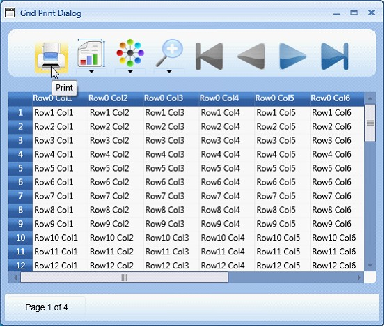
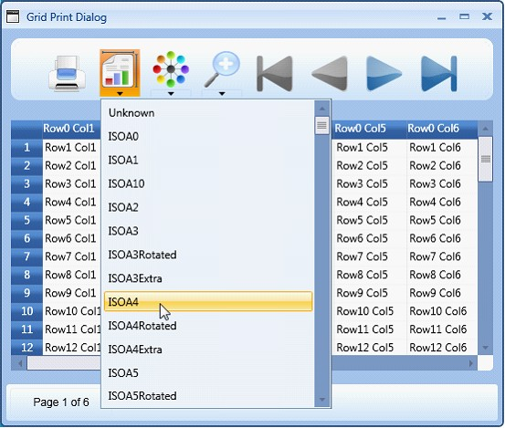
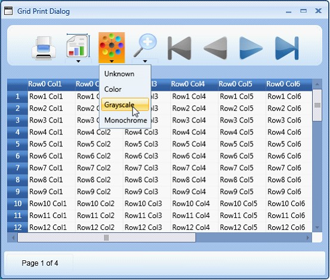
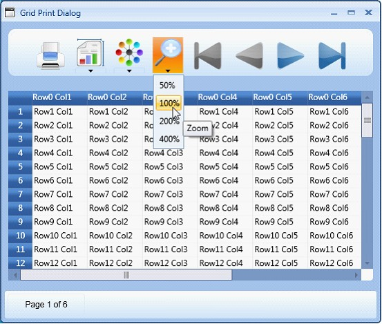
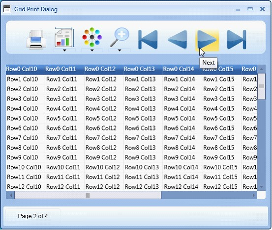

::: {style="DISPLAY: none"}
{#d2h_url_template}{#d2h_package_url style="WIDTH: 0px; DISPLAY: none; HEIGHT: 0px"}
:::

::::: {.d2h_secondary_topic style="PADDING-BOTTOM: 10pt; MARGIN: 0pt; PADDING-LEFT: 0pt; PADDING-RIGHT: 0pt; PADDING-TOP: 0pt"}
#### Print Dialog Options[]{#p214} {#print-dialog-options style="tab-stops: 0pt"}

The Print Dialog provides numerous options to configure the output.

**[]{style="COLOR: #15428b"}** 

Print Button

**[]{style="COLOR: #15428b"}** 

Clicking the Print button allows the user to send the grid content to the printer for printing.

[]{style="COLOR: #15428b"} 

{border="0"}

Figure 89: Print

 

Page Size Drop-down

 

This drop down lists out various available paper sizes for printing. For example: ISOA4, ISOA1, ISOA3etc. Selecting the required paper size allows the user to print the grid data in the paper of same size.

 

::: {style="BORDER-BOTTOM: windowtext 1pt solid; BORDER-LEFT: medium none; PADDING-BOTTOM: 1pt; MARGIN-TOP: 9pt; PADDING-LEFT: 0pt; PADDING-RIGHT: 0pt; MARGIN-BOTTOM: 9pt; BORDER-TOP: windowtext 1pt solid; BORDER-RIGHT: medium none; PADDING-TOP: 1pt"}
{border="0"}Note: The paper sizes are also marked in the following way:
:::

::: {style="BORDER-BOTTOM: windowtext 1pt solid; BORDER-LEFT: medium none; PADDING-BOTTOM: 1pt; MARGIN: 9pt 0pt 9pt 18pt; PADDING-LEFT: 0pt; PADDING-RIGHT: 0pt; BORDER-TOP: windowtext 1pt solid; BORDER-RIGHT: medium none; PADDING-TOP: 1pt"}
***[·    ]{style="FONT-FAMILY: Symbol"}***Extra-Extra increases the space in addition to the predefined size of the paper, for example- A3.

***[·    ]{style="FONT-FAMILY: Symbol"}***Rotated -The output is rotated by a defined angle for the selected page size.
:::

[]{style="COLOR: #15428b"} 

For more information, check the following link: [[http://msdn.microsoft.com/en-us/library/system.printing.pagemediasizename.aspx]{.UGHyperlink}](http://msdn.microsoft.com/en-us/library/system.printing.pagemediasizename.aspx)

[]{style="COLOR: #15428b"} 

{border="0"}

Figure 90: Page Size

**[]{style="FONT-FAMILY: 'Calibri','sans-serif'"}** 

Color Drop-down

 

The options in this drop-down allow you select the color for the data to be printed. Following are the options provided:

[·      ]{style="FONT-FAMILY: Symbol"}Monochrome---Selecting this option allows the user to print the grid data in the shades of a single color or hue.

[·      ]{style="FONT-FAMILY: Symbol"}Color---Selecting this option allows the user to print the grid data in the selected color.

[·      ]{style="FONT-FAMILY: Symbol"}Grayscale---Selecting this option allows the user to print the grid data in a range of shades of gray without apparent color, the darkest shade being black and the lightest shade being white.

[·      ]{style="FONT-FAMILY: Symbol"}Unknown---This option can be selected in cases where you receive any print configuration settings which does not fall within the other 3 options. The application that is using this configuration will internally set the color option as unknown in such cases.

**[]{style="COLOR: #15428b"}** 

{border="0"}

Figure 91: Color Drop-down

**[]{style="FONT-FAMILY: 'Calibri','sans-serif'"}** 

Zoom Drop-down

 

The options in this drop-down allow you select the required percentage magnification for viewing the grid data to be printed. Selecting the required option allows you to magnify the preview to various preset zoom levels like 50%, 100%, 200% and 400%.

 

{border="0"}

Figure 92: Zoom Drop-down

**[]{style="FONT-FAMILY: 'Calibri','sans-serif'"}** 

Navigation Options

 

The Print dialog provides four navigational buttons to navigate the grid preview:

[]{style="COLOR: #15428b"} 

{border="0"}-This button allows you to move to the first page

**[]{style="COLOR: #15428b"}** 

{border="0"}-This button allows you to move to the last page

**[]{style="COLOR: #15428b"}** 

**{border="0"}**-This button allows you to move to the previous page

 

{border="0"}-This button allows you to move to the next page

**[]{style="FONT-FAMILY: 'Calibri','sans-serif'"}** 

The following image shows the next button highlighted for an example.

[]{style="FONT-FAMILY: 'Calibri','sans-serif'"} 

{border="0"}

Figure 93: Navigation Options

 

[]{#related-topics}
:::::
