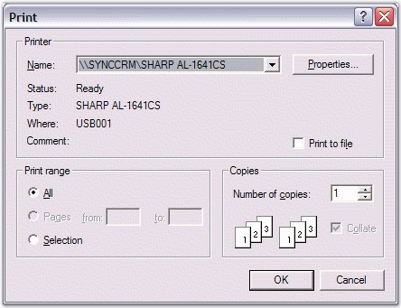
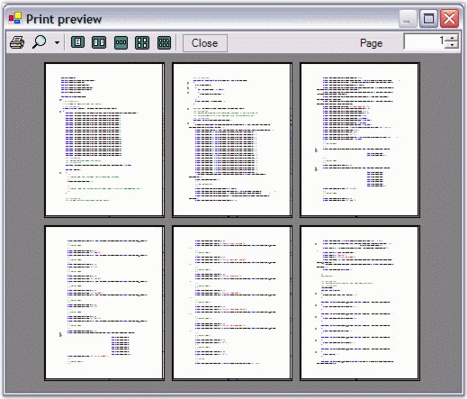
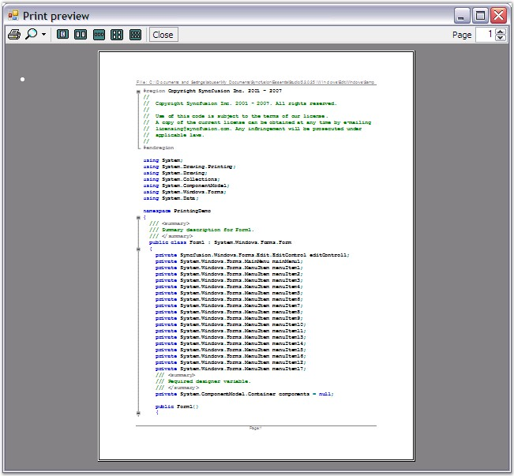

::: {style="DISPLAY: none"}
{#d2h_url_template}{#d2h_package_url style="WIDTH: 0px; DISPLAY: none; HEIGHT: 0px"}
:::

::::: {#nsbanner .d2h_main_nsbanner style="BORDER-BOTTOM: #999999 1px solid; POSITION: relative; PADDING-BOTTOM: 0px; BACKGROUND-COLOR: transparent; PADDING-LEFT: 0px; PADDING-RIGHT: 0px; DISPLAY: none; BORDER-TOP: #999999 1px solid; PADDING-TOP: 0px; LEFT: 0px"}
:::: {#TitleRow .d2h_main_titlerow style="PADDING-BOTTOM: 4px; BACKGROUND-COLOR: transparent; PADDING-LEFT: 22px; WIDTH: 100%; PADDING-RIGHT: 10px; DISPLAY: none; PADDING-TOP: 4px"}
::: {#ienav .d2h_main_ienav style="DISPLAY: none"}
{#D2HPrevious .D2HPreviousEnabled}  {#D2HNext .D2HNextEnabled}
:::
::::
:::::

:::::::: {#nstext .d2h_main_nstext style="PADDING-BOTTOM: 10px; BACKGROUND-COLOR: transparent; PADDING-LEFT: 22px; PADDING-RIGHT: 10px; HEIGHT: 100%; OVERFLOW: auto; PADDING-TOP: 5px" hasuserbackground="true" valign="bottom"}
::: {#d2h_breadcrumbs .d2h_breadcrumbs}
[Essential Studio User Guide Documentation](ms-xhelp:///?Id=12457748-09e3-4d74-a240-8e049cedf030){.d2h_breadcrumbsNormal}[ \> ]{.d2h_breadcrumbsLinkSeparator}[User Interface Edition](ms-xhelp:///?Id=c29296b7-531c-413b-a0ec-488ca1f7f669){.d2h_breadcrumbsNormal}[ \> ]{.d2h_breadcrumbsLinkSeparator}[Essential Windows](ms-xhelp:///?Id=e60759d8-47a4-4570-9d7a-16a68d63f2ea){.d2h_breadcrumbsNormal}[ \> ]{.d2h_breadcrumbsLinkSeparator}[Essential Edit]{.d2h_breadcrumbsContentsOnly}[ \> ]{.d2h_breadcrumbsLinkSeparator}[Concepts And Features](ms-xhelp:///?Id=7c39cee6-8434-4711-a18e-efaba8ac85c0){.d2h_breadcrumbsNormal}
:::

## Printing {#printing style="tab-stops: 0pt"}

[]{style="FONT-FAMILY: 'Trebuchet MS','sans-serif'; COLOR: #15428b; FONT-SIZE: 9pt"} 

The Edit Control provides complete support for printing its contents. You can either print the entire document, just the current page, specific pages, or selected text. The printing implementation is very similar to the one available in standard applications such as MS Office or Visual Studio.NET. A Print dialog box provides options to customize the printer settings, number of copies, the pages to be printed, and so on. Edit Control also includes a Print Preview feature that allows you to view the document before printing. Moreover, features like customizable header and footer are also available in Essential Edit.

[]{style="FONT-FAMILY: 'Trebuchet MS','sans-serif'; COLOR: #15428b; FONT-SIZE: 9pt"} 

In brief, the printing functionality of the Edit Control supports the following features.

[]{style="FONT-FAMILY: 'Trebuchet MS','sans-serif'; COLOR: #15428b; FONT-SIZE: 9pt"} 

[·      ]{style="FONT-FAMILY: Symbol"}Print Preview

[·      ]{style="FONT-FAMILY: Symbol"}Custom Header and Footer Text

[·      ]{style="FONT-FAMILY: Symbol"}Document Name

[·      ]{style="FONT-FAMILY: Symbol"}Page Numbers

[[·      ]{style="FONT-FAMILY: Symbol; TEXT-DECORATION: none; text-underline: none"}]{.UGHyperlink}[Content Dividers]{.UGHyperlink}[]{.UGHyperlink}

[[·      ]{style="FONT-FAMILY: Symbol; TEXT-DECORATION: none; text-underline: none"}]{.UGHyperlink}[Wordwrap]{.UGHyperlink}[]{.UGHyperlink}

[·      ]{style="FONT-FAMILY: Symbol"}Color Printing to preserve Syntax Highlighting

[·      ]{style="FONT-FAMILY: Symbol"}Selected Text Printing

[[·      ]{style="FONT-FAMILY: Symbol; TEXT-DECORATION: none; text-underline: none"}]{.UGHyperlink}[Line Numbers]{.UGHyperlink}[]{.UGHyperlink}

[·      ]{style="FONT-FAMILY: Symbol"}Printing a Specific Page or Set of Pages

[·      ]{style="FONT-FAMILY: Symbol"}Printing Entire Document

[·      ]{style="FONT-FAMILY: Symbol"}Creating a Printer Document

[·      ]{style="FONT-FAMILY: Symbol"}Current Page Printing

[·      ]{style="FONT-FAMILY: Symbol"}Printer Dialog

[·      ]{style="FONT-FAMILY: Symbol"}Outlining Blocks

[]{style="FONT-FAMILY: 'Trebuchet MS','sans-serif'; COLOR: #15428b; FONT-SIZE: 9pt"} 

You can invoke the Print dialog box by using the **Print** method of the Edit Control, as shown in the below code snippet.

[]{style="FONT-FAMILY: 'Trebuchet MS','sans-serif'; COLOR: #15428b; FONT-SIZE: 9pt"} 

+---------------------------------------------------------------------------------------------------------------------+
| **[\[C#\]]{style="FONT-FAMILY: 'Courier New'; COLOR: black"}**                                                      |
|                                                                                                                     |
| []{style="FONT-FAMILY: 'Courier New'; COLOR: black"}                                                                |
|                                                                                                                     |
| [// Invoke the print dialog.]{style="FONT-FAMILY: 'Courier New'; COLOR: green"}                                     |
|                                                                                                                     |
| [this]{style="FONT-FAMILY: 'Courier New'; COLOR: blue"}[.editControl1.Print();]{style="FONT-FAMILY: 'Courier New'"} |
+---------------------------------------------------------------------------------------------------------------------+

[]{style="FONT-FAMILY: 'Trebuchet MS','sans-serif'; COLOR: #15428b; FONT-SIZE: 9pt"} 

+------------------------------------------------------------------------------------------------------------------+
| **[\[VB.NET\]]{style="FONT-FAMILY: 'Courier New'; COLOR: black"}**                                               |
|                                                                                                                  |
| []{style="FONT-FAMILY: 'Courier New'; COLOR: black"}                                                             |
|                                                                                                                  |
| [\' Invoke the print dialog.]{style="FONT-FAMILY: 'Courier New'; COLOR: green"}                                  |
|                                                                                                                  |
| [Me]{style="FONT-FAMILY: 'Courier New'; COLOR: blue"}[.editControl1.Print()]{style="FONT-FAMILY: 'Courier New'"} |
+------------------------------------------------------------------------------------------------------------------+

[]{style="FONT-FAMILY: 'Trebuchet MS','sans-serif'; COLOR: #15428b; FONT-SIZE: 9pt"} 

{border="0"}

Figure 75: Print Dialog Box

 

Use the **PrintPreview** method to view the contents of the Edit Control before they are printed.

 

+----------------------------------------------------------------------------------------------------------------------------+
| **[\[C#\]]{style="FONT-FAMILY: 'Courier New'; COLOR: black"}**                                                             |
|                                                                                                                            |
| []{style="FONT-FAMILY: 'Courier New'; COLOR: black"}                                                                       |
|                                                                                                                            |
| [// View the contents of the Edit Control before printing.]{style="FONT-FAMILY: 'Courier New'; COLOR: green"}              |
|                                                                                                                            |
| [this]{style="FONT-FAMILY: 'Courier New'; COLOR: blue"}[.editControl1.PrintPreview();]{style="FONT-FAMILY: 'Courier New'"} |
+----------------------------------------------------------------------------------------------------------------------------+

[]{style="FONT-FAMILY: 'Trebuchet MS','sans-serif'; COLOR: #15428b; FONT-SIZE: 9pt"} 

+-------------------------------------------------------------------------------------------------------------------------+
| **[\[VB.NET\]]{style="FONT-FAMILY: 'Courier New'; COLOR: black"}**                                                      |
|                                                                                                                         |
| []{style="FONT-FAMILY: 'Courier New'; COLOR: black"}                                                                    |
|                                                                                                                         |
| [\' View the contents of the Edit Control before printing.]{style="FONT-FAMILY: 'Courier New'; COLOR: green"}           |
|                                                                                                                         |
| [Me]{style="FONT-FAMILY: 'Courier New'; COLOR: blue"}[.editControl1.PrintPreview()]{style="FONT-FAMILY: 'Courier New'"} |
+-------------------------------------------------------------------------------------------------------------------------+

[]{style="FONT-FAMILY: 'Trebuchet MS','sans-serif'; COLOR: #15428b; FONT-SIZE: 9pt"} 

{border="0"}

Figure 76: Print Preview

[]{style="FONT-FAMILY: 'Trebuchet MS','sans-serif'; COLOR: #15428b; FONT-SIZE: 9pt"} 

Specifying Printing Options

 

The following methods allow you to specify the options for printing.

 

::: {align="center"}
  --------------------- --------------------------------------------
  Edit Control Method   Description
  PrintCurrentPage      Prints current page on default printer.
  PrintNoDialog         Prints entire document on default printer.
  PrintSelection        Prints selected area on default printer.
  PrintPages            Prints the pages in the specified range.
  --------------------- --------------------------------------------
:::

 

+--------------------------------------------------------------------------------------------------------------------------------+
| **[\[C#\]]{style="FONT-FAMILY: 'Courier New'; COLOR: black"}**                                                                 |
|                                                                                                                                |
| []{style="FONT-FAMILY: 'Courier New'; COLOR: black"}                                                                           |
|                                                                                                                                |
| [// Print the current page.]{style="FONT-FAMILY: 'Courier New'; COLOR: green"}                                                 |
|                                                                                                                                |
| [this]{style="FONT-FAMILY: 'Courier New'; COLOR: blue"}[.editControl1.PrintCurrentPage();]{style="FONT-FAMILY: 'Courier New'"} |
|                                                                                                                                |
| []{style="FONT-FAMILY: 'Courier New'"}                                                                                         |
|                                                                                                                                |
| [// Print the entire document.]{style="FONT-FAMILY: 'Courier New'; COLOR: green"}                                              |
|                                                                                                                                |
| [this]{style="FONT-FAMILY: 'Courier New'; COLOR: blue"}[.editControl1.PrintNoDialog();]{style="FONT-FAMILY: 'Courier New'"}    |
|                                                                                                                                |
| []{style="FONT-FAMILY: 'Courier New'"}                                                                                         |
|                                                                                                                                |
| [// Print the selected area.]{style="FONT-FAMILY: 'Courier New'; COLOR: green"}                                                |
|                                                                                                                                |
| [this]{style="FONT-FAMILY: 'Courier New'; COLOR: blue"}[.editControl1.PrintPages(1, 10);]{style="FONT-FAMILY: 'Courier New'"}  |
|                                                                                                                                |
| []{style="FONT-FAMILY: 'Courier New'"}                                                                                         |
|                                                                                                                                |
| [// Print the pages in the specified range.]{style="FONT-FAMILY: 'Courier New'; COLOR: green"}                                 |
|                                                                                                                                |
| [this]{style="FONT-FAMILY: 'Courier New'; COLOR: blue"}[.editControl1.PrintSelection();]{style="FONT-FAMILY: 'Courier New'"}   |
+--------------------------------------------------------------------------------------------------------------------------------+

[]{style="FONT-FAMILY: 'Trebuchet MS','sans-serif'; COLOR: #15428b; FONT-SIZE: 9pt"} 

+-----------------------------------------------------------------------------------------------------------------------------+
| **[\[VB.NET\]]{style="FONT-FAMILY: 'Courier New'; COLOR: black"}**                                                          |
|                                                                                                                             |
| []{style="FONT-FAMILY: 'Courier New'; COLOR: black"}                                                                        |
|                                                                                                                             |
| [\' Print the current page.]{style="FONT-FAMILY: 'Courier New'; COLOR: green"}                                              |
|                                                                                                                             |
| [Me]{style="FONT-FAMILY: 'Courier New'; COLOR: blue"}[.editControl1.PrintCurrentPage()]{style="FONT-FAMILY: 'Courier New'"} |
|                                                                                                                             |
| []{style="FONT-FAMILY: 'Courier New'"}                                                                                      |
|                                                                                                                             |
| [\' Print the entire document.]{style="FONT-FAMILY: 'Courier New'; COLOR: green"}                                           |
|                                                                                                                             |
| [Me]{style="FONT-FAMILY: 'Courier New'; COLOR: blue"}[.editControl1.PrintNoDialog()]{style="FONT-FAMILY: 'Courier New'"}    |
|                                                                                                                             |
| []{style="FONT-FAMILY: 'Courier New'"}                                                                                      |
|                                                                                                                             |
| [\' Print the selected area.]{style="FONT-FAMILY: 'Courier New'; COLOR: green"}                                             |
|                                                                                                                             |
| [Me]{style="FONT-FAMILY: 'Courier New'; COLOR: blue"}[.editControl1.PrintPages(1, 10)]{style="FONT-FAMILY: 'Courier New'"}  |
|                                                                                                                             |
| []{style="FONT-FAMILY: 'Courier New'"}                                                                                      |
|                                                                                                                             |
| [\' Print the pages in the specified range.]{style="FONT-FAMILY: 'Courier New'; COLOR: green"}                              |
|                                                                                                                             |
| [Me]{style="FONT-FAMILY: 'Courier New'; COLOR: blue"}[.editControl1.PrintSelection()]{style="FONT-FAMILY: 'Courier New'"}   |
+-----------------------------------------------------------------------------------------------------------------------------+

[]{style="COLOR: #4a5c8c; FONT-SIZE: 8pt"} 

Customized Header Footer

 

Header and Footer can be shown / hidden while printing the document by using the **PageHeaderAndFooterVisible** property.

 

The following properties are used to print the contents of the editor, the document name as the header, and the page number as footer.

 

::: {align="center"}
  ----------------------- ----------------------------------------------------------------------------
  Edit Control Property   Description
  PrintDocument           Gets print document, that can be used to print the contents of the editor.
  PrintDocumentName       Gets / sets value indicating whether the document name should be printed.
  PrintPageNumber         Gets / sets value indicating whether the page number should be printed.
  ----------------------- ----------------------------------------------------------------------------
:::

 

Users can also specify their desired text in the header and footer by handling the **PrintHeader** and **PrintFooter** events.

 

The default text in the header and footer is the fully qualified path of the file including the file name and page number respectively.

 

::: {align="center"}
  ----------------------- -------------------------------------
  Edit Control Property   Description
  PrintHeader             Occurs when page header is printed.
  PrintFooter             Occurs when page footer is printed.
  ----------------------- -------------------------------------
:::

[]{style="FONT-FAMILY: 'Trebuchet MS','sans-serif'; COLOR: #15428b; FONT-SIZE: 9pt"} 

+----------------------------------------------------------------------------------------------------------------------------------------------------------------------------------------------------------------------------------------------------------------------------+
| **[\[C#\]]{style="FONT-FAMILY: 'Courier New'; COLOR: black"}**                                                                                                                                                                                                             |
|                                                                                                                                                                                                                                                                            |
| []{style="FONT-FAMILY: 'Courier New'; COLOR: black"}                                                                                                                                                                                                                       |
|                                                                                                                                                                                                                                                                            |
| [private]{style="FONT-FAMILY: 'Courier New'; COLOR: blue"}[ [void]{style="COLOR: blue"} editControl1_PrintHeader([object]{style="COLOR: blue"} sender, Syncfusion.Windows.Forms.Edit.[PrintHeadlineEventArgs]{style="COLOR: teal"} e)]{style="FONT-FAMILY: 'Courier New'"} |
|                                                                                                                                                                                                                                                                            |
| [{]{style="FONT-FAMILY: 'Courier New'"}                                                                                                                                                                                                                                    |
|                                                                                                                                                                                                                                                                            |
| [// Set the desired text in the header. The default text in the header is the full path and the name of the file.]{style="FONT-FAMILY: 'Courier New'; COLOR: green"}                                                                                                       |
|                                                                                                                                                                                                                                                                            |
| [e.Text = [\"This is the header\"]{style="COLOR: maroon"};]{style="FONT-FAMILY: 'Courier New'"}                                                                                                                                                                            |
|                                                                                                                                                                                                                                                                            |
| [}]{style="FONT-FAMILY: 'Courier New'"}                                                                                                                                                                                                                                    |
|                                                                                                                                                                                                                                                                            |
| []{style="FONT-FAMILY: 'Courier New'"}                                                                                                                                                                                                                                     |
|                                                                                                                                                                                                                                                                            |
| [private]{style="FONT-FAMILY: 'Courier New'; COLOR: blue"}[ [void]{style="COLOR: blue"} editControl1_PrintFooter([object]{style="COLOR: blue"} sender, Syncfusion.Windows.Forms.Edit.[PrintHeadlineEventArgs]{style="COLOR: teal"} e)]{style="FONT-FAMILY: 'Courier New'"} |
|                                                                                                                                                                                                                                                                            |
| [{]{style="FONT-FAMILY: 'Courier New'"}                                                                                                                                                                                                                                    |
|                                                                                                                                                                                                                                                                            |
| [// Set desired text in the footer. The default text in the footer is the page number.]{style="FONT-FAMILY: 'Courier New'; COLOR: green"}                                                                                                                                  |
|                                                                                                                                                                                                                                                                            |
| [e.Text = [\"This is the footer\"]{style="COLOR: maroon"};]{style="FONT-FAMILY: 'Courier New'"}                                                                                                                                                                            |
|                                                                                                                                                                                                                                                                            |
| [}]{style="FONT-FAMILY: 'Courier New'"}                                                                                                                                                                                                                                    |
+----------------------------------------------------------------------------------------------------------------------------------------------------------------------------------------------------------------------------------------------------------------------------+

[]{style="FONT-FAMILY: 'Trebuchet MS','sans-serif'; COLOR: #15428b; FONT-SIZE: 9pt"} 

+--------------------------------------------------------------------------------------------------------------------------------------------------------------------------------------------------------------------------------------------------------------------------------------------------------------------------------------------------------------------------------------------------------------------------+
| **[\[VB.NET\]]{style="FONT-FAMILY: 'Courier New'; COLOR: black"}**                                                                                                                                                                                                                                                                                                                                                       |
|                                                                                                                                                                                                                                                                                                                                                                                                                          |
| []{style="FONT-FAMILY: 'Courier New'; COLOR: black"}                                                                                                                                                                                                                                                                                                                                                                     |
|                                                                                                                                                                                                                                                                                                                                                                                                                          |
| [Private]{style="FONT-FAMILY: 'Courier New'; COLOR: blue"}[ [Sub]{style="COLOR: blue"} editControl1_PrintHeader([ByVal]{style="COLOR: blue"} sender [As]{style="COLOR: blue"} [Object]{style="COLOR: blue"}, [ByVal]{style="COLOR: blue"} e [As]{style="COLOR: blue"} Syncfusion.Windows.Forms.Edit.PrintHeadlineEventArgs) [Handles]{style="COLOR: blue"} EditControl1.PrintHeader]{style="FONT-FAMILY: 'Courier New'"} |
|                                                                                                                                                                                                                                                                                                                                                                                                                          |
| [\' Set the desired text in the header. The default text in the header is the full path and the name of the file.]{style="FONT-FAMILY: 'Courier New'; COLOR: green"}                                                                                                                                                                                                                                                     |
|                                                                                                                                                                                                                                                                                                                                                                                                                          |
| [e.Text = [\"This is the header\"]{style="COLOR: maroon"}]{style="FONT-FAMILY: 'Courier New'"}                                                                                                                                                                                                                                                                                                                           |
|                                                                                                                                                                                                                                                                                                                                                                                                                          |
| [End]{style="FONT-FAMILY: 'Courier New'; COLOR: blue"}[ [Sub]{style="COLOR: blue"} [\'editControl1_PrintHeader]{style="COLOR: green"}]{style="FONT-FAMILY: 'Courier New'"}                                                                                                                                                                                                                                               |
|                                                                                                                                                                                                                                                                                                                                                                                                                          |
| []{style="FONT-FAMILY: 'Courier New'; COLOR: green"}                                                                                                                                                                                                                                                                                                                                                                     |
|                                                                                                                                                                                                                                                                                                                                                                                                                          |
| [Private]{style="FONT-FAMILY: 'Courier New'; COLOR: blue"}[ [Sub]{style="COLOR: blue"} editControl1_PrintFooter([ByVal]{style="COLOR: blue"} sender [As]{style="COLOR: blue"} [Object]{style="COLOR: blue"}, [ByVal]{style="COLOR: blue"} e [As]{style="COLOR: blue"} Syncfusion.Windows.Forms.Edit.PrintHeadlineEventArgs) [Handles]{style="COLOR: blue"} EditControl1.PrintFooter]{style="FONT-FAMILY: 'Courier New'"} |
|                                                                                                                                                                                                                                                                                                                                                                                                                          |
| [\' Set desired text in the footer. The default text in the footer is the page number.]{style="FONT-FAMILY: 'Courier New'; COLOR: green"}                                                                                                                                                                                                                                                                                |
|                                                                                                                                                                                                                                                                                                                                                                                                                          |
| [e.Text = [\"This is the footer\"]{style="COLOR: maroon"}]{style="FONT-FAMILY: 'Courier New'"}                                                                                                                                                                                                                                                                                                                           |
|                                                                                                                                                                                                                                                                                                                                                                                                                          |
| [End]{style="FONT-FAMILY: 'Courier New'; COLOR: blue"}[ [Sub]{style="COLOR: blue"}]{style="FONT-FAMILY: 'Courier New'"}                                                                                                                                                                                                                                                                                                  |
+--------------------------------------------------------------------------------------------------------------------------------------------------------------------------------------------------------------------------------------------------------------------------------------------------------------------------------------------------------------------------------------------------------------------------+

 

The following image shows a typical page with a header and footer in Print Preview mode.

 

{border="0"}

Figure 77: Preview of Header and Footer

[]{style="FONT-FAMILY: 'Trebuchet MS','sans-serif'; COLOR: #15428b; FONT-SIZE: 9pt"} 

Page Border Settings

 

Edit Control provides the following methods to display page borders for the Edit Control.

 

::: {align="center"}
  --------------------- ----------------------------------------------------------
  Edit Control Method   Description
  SetPageBorder         Sets parameters of border that\'s drawn in page preview.
  RemovePageBorder      Removes border drawing in page preview.
  --------------------- ----------------------------------------------------------
:::

 

+--------------------------------------------------------------------------------------------------------------------------------------------------------------------------------------------------------------------------------------------------------------------------------------------------------------------------------+
| **[\[C#\]]{style="FONT-FAMILY: 'Courier New'; COLOR: black"}**                                                                                                                                                                                                                                                                 |
|                                                                                                                                                                                                                                                                                                                                |
| []{style="FONT-FAMILY: 'Courier New'; COLOR: black"}                                                                                                                                                                                                                                                                           |
|                                                                                                                                                                                                                                                                                                                                |
| [// Set the page border. ]{style="FONT-FAMILY: 'Courier New'; COLOR: green"}                                                                                                                                                                                                                                                   |
|                                                                                                                                                                                                                                                                                                                                |
| [this]{style="FONT-FAMILY: 'Courier New'; COLOR: blue"}[.editControl1.SetPageBorder(Syncfusion.Windows.Forms.Edit.Enums.[FrameBorderStyle]{style="COLOR: teal"}.DashDot, [Color]{style="COLOR: teal"}.Red, Syncfusion.Windows.Forms.Edit.Enums.[BorderWeight]{style="COLOR: teal"}.Bold);]{style="FONT-FAMILY: 'Courier New'"} |
|                                                                                                                                                                                                                                                                                                                                |
| []{style="FONT-FAMILY: 'Courier New'"}                                                                                                                                                                                                                                                                                         |
|                                                                                                                                                                                                                                                                                                                                |
| [// Remove the page border.]{style="FONT-FAMILY: 'Courier New'; COLOR: green"}                                                                                                                                                                                                                                                 |
|                                                                                                                                                                                                                                                                                                                                |
| [this]{style="FONT-FAMILY: 'Courier New'; COLOR: blue"}[.editControl1.RemovePageBorder();]{style="FONT-FAMILY: 'Courier New'"}                                                                                                                                                                                                 |
+--------------------------------------------------------------------------------------------------------------------------------------------------------------------------------------------------------------------------------------------------------------------------------------------------------------------------------+

[]{style="FONT-FAMILY: 'Trebuchet MS','sans-serif'; COLOR: #15428b; FONT-SIZE: 9pt"} 

+--------------------------------------------------------------------------------------------------------------------------------------------------------------------------------------------------------------------------------------------------------+
| **[\[VB.NET\]]{style="FONT-FAMILY: 'Courier New'; COLOR: black"}**                                                                                                                                                                                     |
|                                                                                                                                                                                                                                                        |
| []{style="FONT-FAMILY: 'Courier New'; COLOR: black"}                                                                                                                                                                                                   |
|                                                                                                                                                                                                                                                        |
| [\' Set the page border. ]{style="FONT-FAMILY: 'Courier New'; COLOR: green"}                                                                                                                                                                           |
|                                                                                                                                                                                                                                                        |
| [Me]{style="FONT-FAMILY: 'Courier New'; COLOR: blue"}[.editControl1.SetPageBorder(Syncfusion.Windows.Forms.Edit.Enums.FrameBorderStyle.DashDot, Color.Red, Syncfusion.Windows.Forms.Edit.Enums.BorderWeight.Bold)]{style="FONT-FAMILY: 'Courier New'"} |
|                                                                                                                                                                                                                                                        |
| []{style="FONT-FAMILY: 'Courier New'"}                                                                                                                                                                                                                 |
|                                                                                                                                                                                                                                                        |
| [\' Remove the page border.]{style="FONT-FAMILY: 'Courier New'; COLOR: green"}                                                                                                                                                                         |
|                                                                                                                                                                                                                                                        |
| [Me]{style="FONT-FAMILY: 'Courier New'; COLOR: blue"}[.editControl1.RemovePageBorder()]{style="FONT-FAMILY: 'Courier New'"}                                                                                                                            |
+--------------------------------------------------------------------------------------------------------------------------------------------------------------------------------------------------------------------------------------------------------+

 

Refer to the Printing Demo sample for more information in this regard.

 

***..\\My Documents\\Syncfusion\\EssentialStudio\\Version Number\\Windows\\Edit.Windows\\Samples\\2.0\\Printing Support\\PrintingDemo***

[]{#p107} 

[]{#related-topics}
::::::::
