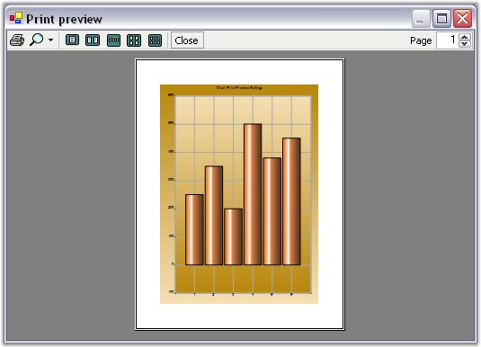
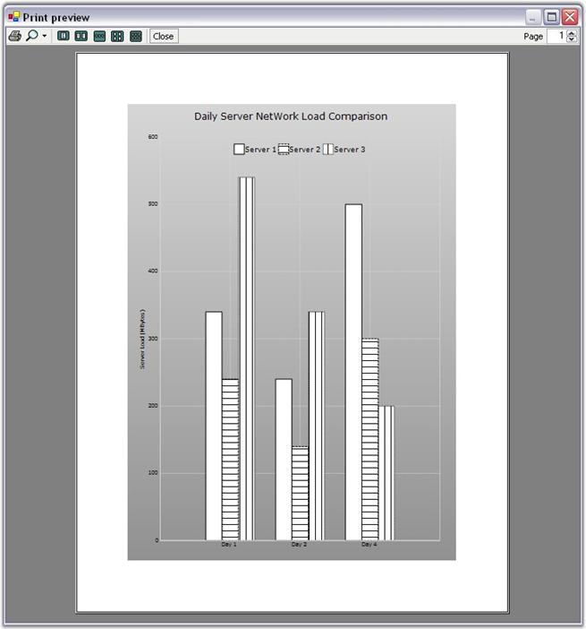

::: {style="DISPLAY: none"}
{#d2h_url_template}{#d2h_package_url style="WIDTH: 0px; DISPLAY: none; HEIGHT: 0px"}
:::

::::: {#nsbanner .d2h_main_nsbanner style="BORDER-BOTTOM: #999999 1px solid; POSITION: relative; PADDING-BOTTOM: 0px; BACKGROUND-COLOR: transparent; PADDING-LEFT: 0px; PADDING-RIGHT: 0px; DISPLAY: none; BORDER-TOP: #999999 1px solid; PADDING-TOP: 0px; LEFT: 0px"}
:::: {#TitleRow .d2h_main_titlerow style="PADDING-BOTTOM: 4px; BACKGROUND-COLOR: transparent; PADDING-LEFT: 22px; WIDTH: 100%; PADDING-RIGHT: 10px; DISPLAY: none; PADDING-TOP: 4px"}
::: {#ienav .d2h_main_ienav style="DISPLAY: none"}
{#D2HPrevious .D2HPreviousEnabled}  {#D2HNext .D2HNextEnabled}
:::
::::
:::::

::::: {#nstext .d2h_main_nstext style="PADDING-BOTTOM: 10px; BACKGROUND-COLOR: transparent; PADDING-LEFT: 22px; PADDING-RIGHT: 10px; HEIGHT: 100%; OVERFLOW: auto; PADDING-TOP: 5px" hasuserbackground="true" valign="bottom"}
::: {#d2h_breadcrumbs .d2h_breadcrumbs}
[Essential Studio User Guide Documentation](ms-xhelp:///?Id=12457748-09e3-4d74-a240-8e049cedf030){.d2h_breadcrumbsNormal}[ \> ]{.d2h_breadcrumbsLinkSeparator}[User Interface Edition](ms-xhelp:///?Id=c29296b7-531c-413b-a0ec-488ca1f7f669){.d2h_breadcrumbsNormal}[ \> ]{.d2h_breadcrumbsLinkSeparator}[Essential Windows](ms-xhelp:///?Id=e60759d8-47a4-4570-9d7a-16a68d63f2ea){.d2h_breadcrumbsNormal}[ \> ]{.d2h_breadcrumbsLinkSeparator}[Essential Chart]{.d2h_breadcrumbsContentsOnly}[ \> ]{.d2h_breadcrumbsLinkSeparator}[Concepts and Features](ms-xhelp:///?Id=71321e9c-336c-4c1c-a127-be9f135ad4bb){.d2h_breadcrumbsNormal}
:::

## Printing and Print Preview {#printing-and-print-preview style="tab-stops: 0pt"}

 

Print Preview

 

The chart provides a **PrintDocument** that can be sent to the .NET **PrintPreviewDialog** to get a preview of the chart that gets printed. Here is some code that shows how this is done.

 

+------------------------------------------------------------------------------------------------------------------------------------------------------------------------------------+
| **[\[C#\]]{style="FONT-FAMILY: 'Courier New'; COLOR: black"}**                                                                                                                     |
|                                                                                                                                                                                    |
| []{style="COLOR: black; FONT-SIZE: 12pt"}                                                                                                                                          |
|                                                                                                                                                                                    |
| [PrintPreviewDialog ]{style="FONT-FAMILY: 'Courier New'; COLOR: teal"}[printPreviewDialog1 = new [PrintPreviewDialog();]{style="COLOR: teal"}]{style="FONT-FAMILY: 'Courier New'"} |
|                                                                                                                                                                                    |
| [printPreviewDialog1.Document = [this]{style="COLOR: blue"}.chartControl1.PrintDocument;]{style="FONT-FAMILY: 'Courier New'"}                                                      |
|                                                                                                                                                                                    |
| [printPreviewDialog1.ShowDialog();]{style="FONT-FAMILY: 'Courier New'"}                                                                                                            |
+------------------------------------------------------------------------------------------------------------------------------------------------------------------------------------+

 

+--------------------------------------------------------------------------------------------------------------------------------------------------------------------------------------+
| **[\[VB]{style="FONT-FAMILY: 'Courier New'; COLOR: black"}[.NET]{style="FONT-FAMILY: 'Courier New'; COLOR: black"}[\]]{style="FONT-FAMILY: 'Courier New'; COLOR: black"}**           |
|                                                                                                                                                                                      |
| []{style="FONT-FAMILY: 'Courier New'; COLOR: blue"}                                                                                                                                  |
|                                                                                                                                                                                      |
| [Me]{style="FONT-FAMILY: 'Courier New'; COLOR: blue"}[.printPreviewDialog1 = [New]{style="COLOR: blue"} System.Windows.Forms.PrintPreviewDialog]{style="FONT-FAMILY: 'Courier New'"} |
|                                                                                                                                                                                      |
| [printPreviewDialog1.Document = [Me]{style="COLOR: blue"}.chartControl1.PrintDocument]{style="FONT-FAMILY: 'Courier New'"}                                                           |
|                                                                                                                                                                                      |
| [printPreviewDialog1.ShowDialog()]{style="FONT-FAMILY: 'Courier New'"}                                                                                                               |
+--------------------------------------------------------------------------------------------------------------------------------------------------------------------------------------+

 

{border="0"}

 

Figure 357: Print Preview Dialog Box

 

Printing\
\

Print a chart control using the **PrintDocument** exposed by the chart control as follows:

 

+------------------------------------------------------------------------------------------------------------------------------------+
| **[\[C#\]]{style="FONT-FAMILY: 'Courier New'; COLOR: black"}**                                                                     |
|                                                                                                                                    |
| []{style="COLOR: black; FONT-SIZE: 12pt"}                                                                                          |
|                                                                                                                                    |
| [this]{style="FONT-FAMILY: 'Courier New'; COLOR: blue"}[.chartControl1.PrintDocument.Print();]{style="FONT-FAMILY: 'Courier New'"} |
+------------------------------------------------------------------------------------------------------------------------------------+

 

+----------------------------------------------------------------------------------------------------------------------------------------------------------------------------+
| **[\[VB]{style="FONT-FAMILY: 'Courier New'; COLOR: black"}[.NET]{style="FONT-FAMILY: 'Courier New'; COLOR: black"}[\]]{style="FONT-FAMILY: 'Courier New'; COLOR: black"}** |
|                                                                                                                                                                            |
| []{style="COLOR: black; FONT-SIZE: 12pt"}                                                                                                                                  |
|                                                                                                                                                                            |
| [Me]{style="FONT-FAMILY: 'Courier New'; COLOR: blue"}[.chartControl1.PrintDocument.Print()]{style="FONT-FAMILY: 'Courier New'"}                                            |
+----------------------------------------------------------------------------------------------------------------------------------------------------------------------------+

 

You can also specify if you want to print the chart in Color or GrayScale using this property.

 

::: {align="center"}
+-----------------------------------+---------------------------------------------------------------------------------------------------------------------------------------------+
| **Chart control Property**        | **Description**                                                                                                                             |
+-----------------------------------+---------------------------------------------------------------------------------------------------------------------------------------------+
| PrintColorMode                    | Indicates the color mode during printing. Possible Values:                                                                                  |
|                                   |                                                                                                                                             |
|                                   |                                                                                                                                             |
|                                   |                                                                                                                                             |
|                                   | [·      ]{style="FONT-FAMILY: Symbol"}**Color** - Always Print in Color.                                                                    |
|                                   |                                                                                                                                             |
|                                   | [·      ]{style="FONT-FAMILY: Symbol"}**GrayScale** - Always Print using GrayScale.                                                         |
|                                   |                                                                                                                                             |
|                                   | [·      ]{style="FONT-FAMILY: Symbol"}**CheckPrinter** - If printer allows color print in color, otherwise use grayscale (default setting). |
+-----------------------------------+---------------------------------------------------------------------------------------------------------------------------------------------+
:::

 

+------------------------------------------------------------------------------------------------------------------------------------------------------------------------------------+
| **[\[C#\]]{style="FONT-FAMILY: 'Courier New'; COLOR: black"}**                                                                                                                     |
|                                                                                                                                                                                    |
| []{style="COLOR: black; FONT-SIZE: 12pt"}                                                                                                                                          |
|                                                                                                                                                                                    |
| [this]{style="FONT-FAMILY: 'Courier New'; COLOR: blue"}[.chartControl1.PrintColorMode = [ChartPrintColorMode]{style="COLOR: teal"}.GrayScale;]{style="FONT-FAMILY: 'Courier New'"} |
+------------------------------------------------------------------------------------------------------------------------------------------------------------------------------------+

 

+---------------------------------------------------------------------------------------------------------------------------------------------------------------------------------+
| **[\[VB]{style="FONT-FAMILY: 'Courier New'; COLOR: black"}[.NET]{style="FONT-FAMILY: 'Courier New'; COLOR: black"}[\]]{style="FONT-FAMILY: 'Courier New'; COLOR: black"}**      |
|                                                                                                                                                                                 |
| []{style="COLOR: black; FONT-SIZE: 12pt"}                                                                                                                                       |
|                                                                                                                                                                                 |
| [Me]{style="FONT-FAMILY: 'Courier New'; COLOR: blue"}[.chartControl1.PrintColorMode = [ChartPrintColorMode]{style="COLOR: teal"}.GrayScale]{style="FONT-FAMILY: 'Courier New'"} |
+---------------------------------------------------------------------------------------------------------------------------------------------------------------------------------+

 

Automatic Grayscale Handling

 

Setting **GrayScale** print mode for the chart, lets you print the chart in a gray scale and when multiple series are printed in this case, chart data points are automatically rendered with a patterned brush to differentiate the different series as shown in the image below.

 

{border="0"}

 

Figure 358: Column Chart with 2nd and 3rd Series rendered with Patterned Brush

 

A sample illustrating the printing features is available in the below location.

 

..\\My Documents\\Syncfusion\\EssentialStudio\\***Version Number***\\Windows\\Chart.Windows\\Samples\\2.0\\Print\\Chart Print

 

Displaying ToolBar while printing

 

**ShowToolBar** property should be set to **true** to display a toolbar in the Chart. You can show or hide the [toolbar]{style="COLOR: black"} while printing a Chart using **PrintToolBar** property.

 

+---------------------------------------------------------------------------------------------------------------+
| **[\[C#\]]{style="FONT-FAMILY: 'Courier New'; COLOR: black"}**                                                |
|                                                                                                               |
| []{style="FONT-FAMILY: 'Courier New'; COLOR: black"}                                                          |
|                                                                                                               |
| [chartControl1.ShowToolbar = [true]{style="COLOR: blue"};]{style="FONT-FAMILY: 'Courier New'"}                |
|                                                                                                               |
| [chartControl1.PrintDocument.PrintToolBar = [true]{style="COLOR: blue"};]{style="FONT-FAMILY: 'Courier New'"} |
+---------------------------------------------------------------------------------------------------------------+

 

+----------------------------------------------------------------------------------------------------------------------------------------------------------------------------+
| **[\[VB]{style="FONT-FAMILY: 'Courier New'; COLOR: black"}[.NET]{style="FONT-FAMILY: 'Courier New'; COLOR: black"}[\]]{style="FONT-FAMILY: 'Courier New'; COLOR: black"}** |
|                                                                                                                                                                            |
| []{style="FONT-FAMILY: 'Courier New'; COLOR: blue"}                                                                                                                        |
|                                                                                                                                                                            |
| [chartControl1.ShowToolbar = [True]{style="COLOR: blue"}]{style="FONT-FAMILY: 'Courier New'"}                                                                              |
|                                                                                                                                                                            |
| [chartControl1.PrintDocument.PrintToolBar = [True]{style="COLOR: blue"}]{style="FONT-FAMILY: 'Courier New'"}                                                               |
+----------------------------------------------------------------------------------------------------------------------------------------------------------------------------+

[]{#p262}[]{style="FONT-SIZE: 12pt"} 

[]{#related-topics}
:::::
