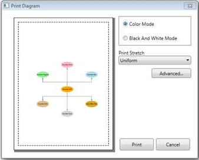

::: {style="DISPLAY: none"}
{#d2h_url_template}{#d2h_package_url style="WIDTH: 0px; DISPLAY: none; HEIGHT: 0px"}
:::

::::: {#nsbanner .d2h_main_nsbanner style="BORDER-BOTTOM: #999999 1px solid; POSITION: relative; PADDING-BOTTOM: 0px; BACKGROUND-COLOR: transparent; PADDING-LEFT: 0px; PADDING-RIGHT: 0px; DISPLAY: none; BORDER-TOP: #999999 1px solid; PADDING-TOP: 0px; LEFT: 0px"}
:::: {#TitleRow .d2h_main_titlerow style="PADDING-BOTTOM: 4px; BACKGROUND-COLOR: transparent; PADDING-LEFT: 22px; WIDTH: 100%; PADDING-RIGHT: 10px; DISPLAY: none; PADDING-TOP: 4px"}
::: {#ienav .d2h_main_ienav style="DISPLAY: none"}
{#D2HPrevious .D2HPreviousEnabled}  {#D2HNext .D2HNextEnabled}
:::
::::
:::::

:::::::: {#nstext .d2h_main_nstext style="PADDING-BOTTOM: 10px; BACKGROUND-COLOR: transparent; PADDING-LEFT: 22px; PADDING-RIGHT: 10px; HEIGHT: 100%; OVERFLOW: auto; PADDING-TOP: 5px" hasuserbackground="true" valign="bottom"}
::: {#d2h_breadcrumbs .d2h_breadcrumbs}
[Essential Studio User Guide Documentation](ms-xhelp:///?Id=12457748-09e3-4d74-a240-8e049cedf030){.d2h_breadcrumbsNormal}[ \> ]{.d2h_breadcrumbsLinkSeparator}[User Interface Edition](ms-xhelp:///?Id=c29296b7-531c-413b-a0ec-488ca1f7f669){.d2h_breadcrumbsNormal}[ \> ]{.d2h_breadcrumbsLinkSeparator}[Essential WPF](ms-xhelp:///?Id=7f4f82c5-151c-4262-94d0-75c4626c77bc){.d2h_breadcrumbsNormal}[ \> ]{.d2h_breadcrumbsLinkSeparator}[Essential Diagram]{.d2h_breadcrumbsContentsOnly}[ \> ]{.d2h_breadcrumbsLinkSeparator}[Concepts and Features](ms-xhelp:///?Id=8625d466-6e21-495a-b811-4ecee754da81){.d2h_breadcrumbsNormal}[ \> ]{.d2h_breadcrumbsLinkSeparator}[Diagram View](ms-xhelp:///?Id=5fbfa644-6dd8-4969-8866-3f1b867be204){.d2h_breadcrumbsNormal}
:::

### Printing Enhancements for Diagram Page {#printing-enhancements-for-diagram-page style="tab-stops: 0pt"}

This feature enables you to print a copy of the diagram page, with or without using Print Dialog Box. [This feature comes with two functionalities:]{style="COLOR: black"}

1.   Printing a diagram using Print Dialog and Print Preview, and

2.   Printing a diagram without using Print Dialog.

[]{style="FONT-FAMILY: 'Calibri','sans-serif'; FONT-SIZE: 11pt"} 

Use Case Scenarios

To print the diagram page, you can use this feature as it enables printing with different functionalities.

 

Tables for Properties, Methods and Events

Properties

Table 74: Properties Table for PrintParameters

+--------------+----------------------------------------------------------+--------------+-----------------------+----------------+---------------------------------------------------+
| Property     | Description                                              | Type         | Value It Accepts      | Default Values | Any other dependencies/ sub properties associated |
+--------------+----------------------------------------------------------+--------------+-----------------------+----------------+---------------------------------------------------+
| ShowDialog   | Gets or sets the Print Dialog to show or not.            | CLR property | Bool (true/false)     | True           | No                                                |
+--------------+----------------------------------------------------------+--------------+-----------------------+----------------+---------------------------------------------------+
| PrintStretch | Gets or sets the page stretch for printing the document. | CLR property | Stretch.Fill,         | \-             | No                                                |
|              |                                                          |              |                       |                |                                                   |
|              |                                                          |              | Stretch.None,         |                |                                                   |
|              |                                                          |              |                       |                |                                                   |
|              |                                                          |              | Stretch.Uniform,      |                |                                                   |
|              |                                                          |              |                       |                |                                                   |
|              |                                                          |              | Stretch.UniformToFill |                |                                                   |
+--------------+----------------------------------------------------------+--------------+-----------------------+----------------+---------------------------------------------------+

[]{style="FONT-FAMILY: 'Calibri','sans-serif'; COLOR: black"} 

Methods

Table 75: Methods Table

  Method   Description                                                                Parameters        Return Type   Reference links
  -------- -------------------------------------------------------------------------- ----------------- ------------- -----------------
  Print    Prints the diagram page using Print Dialog Box and Print Preview           void              void          No
  Print    Prints the diagram page without using Print Dialog Box and Print Preview   PrintParameters   void          No

 

Sample Link

To view the sample for this feature:

1.   Open the WPF Sample Browser from the Dashboard.

2.   Navigate to **Diagram** -\> **Static Diagram** -\>**Export Demo**.

[]{style="FONT-FAMILY: 'Myriad Pro','sans-serif'"} 

Adding Printing Enhancements for Diagram Page to an Application

This feature enables you to print a copy of diagram though:

[·      ]{style="FONT-FAMILY: Symbol"}PrintPeview,

[·      ]{style="FONT-FAMILY: Symbol"}Without PrintDialog (though code behind)

 

Print Preview

Diagram can be printed though PrintPreview using following code snippet:

[·      ]{style="FONT-FAMILY: Symbol"}Through Code behind.

 

::: {align="center"}
+----------------------------------------------------------------------------------------------------------------------------------------------------------------------------------------------------------------------------------------+
| **[\[C#\]]{style="FONT-FAMILY: 'Courier New'"}**                                                                                                                                                                                       |
|                                                                                                                                                                                                                                        |
| [       DiagramView]{style="FONT-FAMILY: 'Courier New'; COLOR: #2b91af"}[ diagramView = [new]{style="COLOR: blue"} [DiagramView]{style="COLOR: #2b91af"}();]{style="FONT-FAMILY: 'Courier New'"}[]{style="FONT-FAMILY: 'Courier New'"} |
|                                                                                                                                                                                                                                        |
| [diagramView.Print();]{style="FONT-FAMILY: 'Courier New'"}[]{style="FONT-FAMILY: 'Courier New'"}                                                                                                                                       |
+----------------------------------------------------------------------------------------------------------------------------------------------------------------------------------------------------------------------------------------+
:::

**[]{style="FONT-SIZE: 12pt"}** 

::: {align="center"}
+--------------------------------------------------------------------------------------------------------------------------------------------------------------------------------------------------------------------------------------------------------------------------------------------------------------------------------------+
| **[\[VB\]]{style="FONT-FAMILY: 'Courier New'"}**                                                                                                                                                                                                                                                                                     |
|                                                                                                                                                                                                                                                                                                                                      |
| [       ]{style="FONT-FAMILY: 'Courier New'; COLOR: #2b91af"}[Dim]{style="FONT-FAMILY: 'Courier New'; COLOR: blue"}[ diagramView [As]{style="COLOR: blue"} [New]{style="COLOR: blue"} ]{style="FONT-FAMILY: 'Courier New'"}[DiagramView]{style="FONT-FAMILY: 'Courier New'; COLOR: #2b91af"}[()]{style="FONT-FAMILY: 'Courier New'"} |
|                                                                                                                                                                                                                                                                                                                                      |
| [      diagramView.Print()]{style="FONT-FAMILY: 'Courier New'"}[]{style="FONT-FAMILY: 'Courier New'"}                                                                                                                                                                                                                                |
+--------------------------------------------------------------------------------------------------------------------------------------------------------------------------------------------------------------------------------------------------------------------------------------------------------------------------------------+
:::

**[]{style="FONT-SIZE: 12pt"}** 

The following custom options can be customized using PrintPreview.[]{style="FONT-FAMILY: 'Calibri','sans-serif'; FONT-SIZE: 11pt"}

[·      ]{style="FONT-FAMILY: Symbol"}Print Preview---To view the page before printing

[·      ]{style="FONT-FAMILY: Symbol"}Different modes---To select printing such as Color, and Black and White

[·      ]{style="FONT-FAMILY: Symbol"}Stretch---To adjust the fit of the image on the page

 

{border="0"}

Figure 165: Print and PrintPreview Dialog Box

 

Printing a Diagram without PrintDialog Box

Diagram can be printed without using PrintDialog or PrintPreview, and by sending PrintPreview as an argument for printing as shown blow:

 

Print without dialog box:           

::: {align="center"}
+----------------------------------------------------------------------------------------------------------------------------------------------------------------------------------------------------------------------------------------+
| **[\[C#\]]{style="FONT-FAMILY: 'Courier New'"}**                                                                                                                                                                                       |
|                                                                                                                                                                                                                                        |
| [       DiagramView]{style="FONT-FAMILY: 'Courier New'; COLOR: #2b91af"}[ diagramView = [new]{style="COLOR: blue"} [DiagramView]{style="COLOR: #2b91af"}();]{style="FONT-FAMILY: 'Courier New'"}[]{style="FONT-FAMILY: 'Courier New'"} |
|                                                                                                                                                                                                                                        |
| [PrintParameters p = new PrintParameters();]{style="FONT-FAMILY: 'Courier New'"}                                                                                                                                                       |
|                                                                                                                                                                                                                                        |
| [p.ShowDialog = false;]{style="FONT-FAMILY: 'Courier New'"}                                                                                                                                                                            |
|                                                                                                                                                                                                                                        |
| [p.PrintStretch = Stretch.Fill;]{style="FONT-FAMILY: 'Courier New'"}                                                                                                                                                                   |
|                                                                                                                                                                                                                                        |
| [diagramView.Print(p);]{style="FONT-FAMILY: 'Courier New'"}[]{style="FONT-FAMILY: 'Courier New'"}                                                                                                                                      |
|                                                                                                                                                                                                                                        |
| []{style="FONT-FAMILY: 'Courier New'"}                                                                                                                                                                                                 |
+----------------------------------------------------------------------------------------------------------------------------------------------------------------------------------------------------------------------------------------+
:::

**[]{style="FONT-SIZE: 12pt"}** 

::: {align="center"}
+------------------------------------------------------------------------------------------------------------------------------------------------------------------------------------------------------------------------------------------+
| **[\[VB\]]{style="FONT-FAMILY: 'Courier New'"}**                                                                                                                                                                                         |
|                                                                                                                                                                                                                                          |
| [       ]{style="FONT-FAMILY: 'Courier New'; COLOR: #2b91af"}[Dim]{style="FONT-FAMILY: 'Courier New'; COLOR: blue"}[ diagramView [As]{style="COLOR: blue"} [New]{style="COLOR: blue"} DiagramView()]{style="FONT-FAMILY: 'Courier New'"} |
|                                                                                                                                                                                                                                          |
| [      Dim]{style="FONT-FAMILY: 'Courier New'; COLOR: blue"}[ p [As]{style="COLOR: blue"} [New]{style="COLOR: blue"} PrintParameters()]{style="FONT-FAMILY: 'Courier New'"}                                                              |
|                                                                                                                                                                                                                                          |
| [      p.ShowDialog = [False]{style="COLOR: blue"}]{style="FONT-FAMILY: 'Courier New'"}                                                                                                                                                  |
|                                                                                                                                                                                                                                          |
| [      p.PrintStretch = Stretch.Fill]{style="FONT-FAMILY: 'Courier New'"}                                                                                                                                                                |
|                                                                                                                                                                                                                                          |
| [      diagramView.Print(p)]{style="FONT-FAMILY: 'Courier New'"}                                                                                                                                                                         |
|                                                                                                                                                                                                                                          |
| []{style="FONT-FAMILY: 'Courier New'"}                                                                                                                                                                                                   |
+------------------------------------------------------------------------------------------------------------------------------------------------------------------------------------------------------------------------------------------+
:::

**[]{style="FONT-SIZE: 12pt"}** 

More:

[ ]{#related-topics}

[{border="0" align="absMiddle"}Support to Print the Diagram Shapes with Effects](ms-xhelp:///?Id=f3d87ec6-9061-4c60-b3ab-903b1b4ec308){style="TEXT-DECORATION: none"}
::::::::
