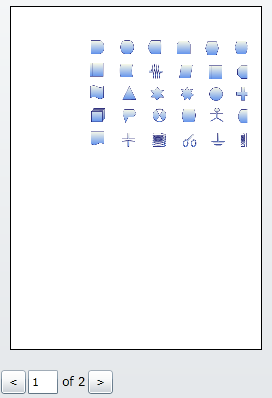
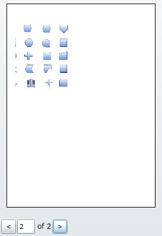
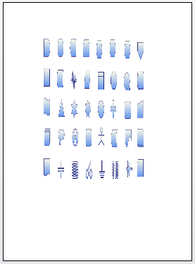
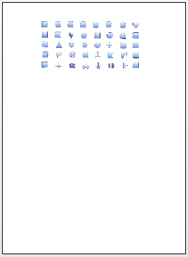
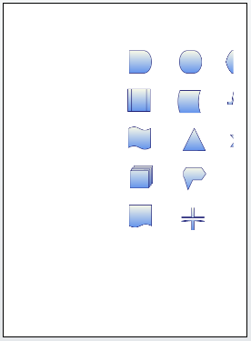

::: {style="DISPLAY: none"}
{#d2h_url_template}{#d2h_package_url style="WIDTH: 0px; DISPLAY: none; HEIGHT: 0px"}
:::

::::: {#nsbanner .d2h_main_nsbanner style="BORDER-BOTTOM: #999999 1px solid; POSITION: relative; PADDING-BOTTOM: 0px; BACKGROUND-COLOR: transparent; PADDING-LEFT: 0px; PADDING-RIGHT: 0px; DISPLAY: none; BORDER-TOP: #999999 1px solid; PADDING-TOP: 0px; LEFT: 0px"}
:::: {#TitleRow .d2h_main_titlerow style="PADDING-BOTTOM: 4px; BACKGROUND-COLOR: transparent; PADDING-LEFT: 22px; WIDTH: 100%; PADDING-RIGHT: 10px; DISPLAY: none; PADDING-TOP: 4px"}
::: {#ienav .d2h_main_ienav style="DISPLAY: none"}
{#D2HPrevious .D2HPreviousEnabled}  {#D2HNext .D2HNextEnabled}
:::
::::
:::::

::::::::::: {#nstext .d2h_main_nstext style="PADDING-BOTTOM: 10px; BACKGROUND-COLOR: transparent; PADDING-LEFT: 22px; PADDING-RIGHT: 10px; HEIGHT: 100%; OVERFLOW: auto; PADDING-TOP: 5px" hasuserbackground="true" valign="bottom"}
::: {#d2h_breadcrumbs .d2h_breadcrumbs}
[Essential Studio User Guide Documentation](ms-xhelp:///?Id=12457748-09e3-4d74-a240-8e049cedf030){.d2h_breadcrumbsNormal}[ \> ]{.d2h_breadcrumbsLinkSeparator}[User Interface Edition](ms-xhelp:///?Id=c29296b7-531c-413b-a0ec-488ca1f7f669){.d2h_breadcrumbsNormal}[ \> ]{.d2h_breadcrumbsLinkSeparator}[Essential Silverlight](ms-xhelp:///?Id=66221bd1-ba2e-43c2-94a7-618f50e01d24){.d2h_breadcrumbsNormal}[ \> ]{.d2h_breadcrumbsLinkSeparator}[Essential Diagram]{.d2h_breadcrumbsContentsOnly}[ \> ]{.d2h_breadcrumbsLinkSeparator}[Concepts and Features](ms-xhelp:///?Id=d592a058-dcc0-44a4-994e-e7901da8db52){.d2h_breadcrumbsNormal}[ \> ]{.d2h_breadcrumbsLinkSeparator}[Diagram View](ms-xhelp:///?Id=4568432e-bb61-4069-b712-775b3032bf95){.d2h_breadcrumbsNormal}
:::

### Printing Support for Diagram Page {#printing-support-for-diagram-page style="tab-stops: 0pt"}

 

Features

This feature allows you to print a copy of the diagram page, using a print dialog box. The Print feature comes[ with two functionalities:]{style="COLOR: black"}

1.   Print Dialog

 The Print Dialog box is used to print the diagram page.

2.   Print Preview

Print Preview is used to see how the page looks before taking a print out[.]{style="FONT-FAMILY: 'Trebuchet MS','sans-serif'; FONT-SIZE: 9pt"} The following are the options to customize the preview.

[·      ]{style="FONT-FAMILY: Symbol"}Stretch support

[·      ]{style="FONT-FAMILY: Symbol"}Page size

[·      ]{style="FONT-FAMILY: Symbol"}Margins

 

Use Case Scenarios

            You can see the output of the document before print the document, or diagram that you intend to print, using the print preview. This way, you will not have to take actual prints to see how it turns out.

 

Tables for Properties and Methods

Properties

Table 11: Properties Table

::: {align="center"}
+--------------------+----------------------------------------------------------------------+---------------------+-------------------------------------+----------------------------------------------+---------------------------------------------------+
| Property           | Description                                                          | Type                | Value It Accepts                    | Default Values                               | Any other dependencies/ sub properties associated |
+--------------------+----------------------------------------------------------------------+---------------------+-------------------------------------+----------------------------------------------+---------------------------------------------------+
| DiagramPrintDialog | Gets or sets the  width and height, margins and stretch of the page. | CLR property.       | DiagramPrintDialog                  | DiagramPrintDialog                           | No                                                |
|                    |                                                                      |                     |                                     |                                              |                                                   |
|                    |                                                                      |                     |                                     |                                              |                                                   |
+--------------------+----------------------------------------------------------------------+---------------------+-------------------------------------+----------------------------------------------+---------------------------------------------------+
| DocumentName       | Gets or sets the name of the printing document.                      | Dependency Property | string                              | string.Empty                                 | No                                                |
|                    |                                                                      |                     |                                     |                                              |                                                   |
|                    |                                                                      |                     |                                     |                                              |                                                   |
+--------------------+----------------------------------------------------------------------+---------------------+-------------------------------------+----------------------------------------------+---------------------------------------------------+
| CurrentPage        | Gets or sets which page is current page.                             | Dependency Property | int                                 | 1                                            | No                                                |
|                    |                                                                      |                     |                                     |                                              |                                                   |
|                    |                                                                      |                     |                                     |                                              |                                                   |
+--------------------+----------------------------------------------------------------------+---------------------+-------------------------------------+----------------------------------------------+---------------------------------------------------+
| PageCount          | Gets the no. of pages to be printed.                                 | Dependency Property | int                                 | 1                                            | No                                                |
|                    |                                                                      |                     |                                     |                                              |                                                   |
|                    |                                                                      |                     |                                     |                                              |                                                   |
+--------------------+----------------------------------------------------------------------+---------------------+-------------------------------------+----------------------------------------------+---------------------------------------------------+
| PageHeight         | Gets or sets the page height.                                        | Dependency Property | double                              | 1169                                         | No                                                |
|                    |                                                                      |                     |                                     |                                              |                                                   |
|                    |                                                                      |                     |                                     |                                              |                                                   |
+--------------------+----------------------------------------------------------------------+---------------------+-------------------------------------+----------------------------------------------+---------------------------------------------------+
| PageWidth          | Gets or sets the page width.                                         | Dependency Property | double                              | 827                                          | No                                                |
|                    |                                                                      |                     |                                     |                                              |                                                   |
|                    |                                                                      |                     |                                     |                                              |                                                   |
+--------------------+----------------------------------------------------------------------+---------------------+-------------------------------------+----------------------------------------------+---------------------------------------------------+
| PageMargin         | Gets or sets the page margin(L,T,R,B) for printing page.             | Dependency Property | Thickness(left, top, right, bottom) | Left - 50, Top - 50, Right - 50, Bottom - 50 | No                                                |
|                    |                                                                      |                     |                                     |                                              |                                                   |
|                    |                                                                      |                     |                                     |                                              |                                                   |
+--------------------+----------------------------------------------------------------------+---------------------+-------------------------------------+----------------------------------------------+---------------------------------------------------+
| PageStretch        | Gets or sets the page stretch for printing document.                 | Dependency Property | Stretch.Fill                        | Stretch.Fill                                 | No                                                |
|                    |                                                                      |                     |                                     |                                              |                                                   |
|                    |                                                                      |                     | Stretch.None                        |                                              |                                                   |
|                    |                                                                      |                     |                                     |                                              |                                                   |
|                    |                                                                      |                     | Stretch.Uniform                     |                                              |                                                   |
|                    |                                                                      |                     |                                     |                                              |                                                   |
|                    |                                                                      |                     | Stretch.UniformTo Fill              |                                              |                                                   |
+--------------------+----------------------------------------------------------------------+---------------------+-------------------------------------+----------------------------------------------+---------------------------------------------------+
:::

[]{style="FONT-FAMILY: 'Calibri','sans-serif'; COLOR: black"} 

Methods

*[Table ]{style="LINE-HEIGHT: 115%; FONT-SIZE: 9pt"}[12]{style="LINE-HEIGHT: 115%; FONT-SIZE: 9pt"}[: Methods Table]{style="LINE-HEIGHT: 115%; FONT-SIZE: 9pt"}*

::: {align="center"}
  Method         Description                                                                   Parameters   Return Type   Reference links
  -------------- ----------------------------------------------------------------------------- ------------ ------------- -----------------
  PrintDialog    Print the diagram page using framework print dialog, without print preview.   null         void          No
  PrintPreview   This method is used to show the preview of the diagram to be printed.         null         void          No
:::

[]{style="FONT-FAMILY: 'Calibri','sans-serif'; COLOR: black"} 

 

Sample Link

  To view the sample for this feature, follow the steps given below:

1.   Open the Silverlight Sample Browser from the Dashboard.

2.   Navigate to **Diagram** -\> **Static Diagram** -\>**Print Demo**

[]{style="FONT-FAMILY: 'Myriad Pro','sans-serif'"} 

 

Adding Printing support for Diagram Page to an Application

PrintPreview

When you call the DiagramView's PrintPreview method, you will see the Print Preview for the diagram  in a child window.

The method is in the Diagram View and can be used through Code behind:

 

+----------------------------------------------------------------------------------------------------------------------------------------------------------------------------------------------------------------------------------------+
| **[\[C#\]]{style="FONT-FAMILY: 'Courier New'"}**[]{style="FONT-FAMILY: 'Courier New'"}                                                                                                                                                 |
|                                                                                                                                                                                                                                        |
| [       DiagramView]{style="FONT-FAMILY: 'Courier New'; COLOR: #2b91af"}[ diagramView = [new]{style="COLOR: blue"} [DiagramView]{style="COLOR: #2b91af"}();]{style="FONT-FAMILY: 'Courier New'"}[]{style="FONT-FAMILY: 'Courier New'"} |
|                                                                                                                                                                                                                                        |
| [       diagramView.PrintPreview();]{style="FONT-FAMILY: 'Courier New'"}[]{style="FONT-FAMILY: 'Courier New'"}                                                                                                                         |
+----------------------------------------------------------------------------------------------------------------------------------------------------------------------------------------------------------------------------------------+

[]{style="LINE-HEIGHT: 115%; FONT-FAMILY: 'Calibri','sans-serif'; COLOR: black; FONT-SIZE: 11pt"} 

+----------------------------------------------------------------------------------------------------------------------------------------------------------------------------------------------------------------------------------------------------------------------------------------------------------------------------------------------------------------------------+
| **[\[VB\]]{style="FONT-FAMILY: 'Courier New'"}**[]{style="FONT-FAMILY: 'Courier New'"}                                                                                                                                                                                                                                                                                     |
|                                                                                                                                                                                                                                                                                                                                                                            |
| [       ]{style="FONT-FAMILY: 'Courier New'; COLOR: #2b91af"}[Dim]{style="FONT-FAMILY: 'Courier New'; COLOR: blue"}[ diagramView [As]{style="COLOR: blue"} [New]{style="COLOR: blue"} ]{style="FONT-FAMILY: 'Courier New'"}[DiagramView]{style="FONT-FAMILY: 'Courier New'; COLOR: #2b91af"}[()]{style="FONT-FAMILY: 'Courier New'"}[]{style="FONT-FAMILY: 'Courier New'"} |
|                                                                                                                                                                                                                                                                                                                                                                            |
| [       diagramView.PrintPreview()]{style="FONT-FAMILY: 'Courier New'"}[]{style="FONT-FAMILY: 'Courier New'"}                                                                                                                                                                                                                                                              |
+----------------------------------------------------------------------------------------------------------------------------------------------------------------------------------------------------------------------------------------------------------------------------------------------------------------------------------------------------------------------------+

[]{style="LINE-HEIGHT: 115%; FONT-FAMILY: 'Calibri','sans-serif'; COLOR: black; FONT-SIZE: 11pt"} 

PrintPreview Customizations

You can customise the preview of the diagram using the following options:

[·      ]{style="FONT-FAMILY: Symbol"}Page Stretch

[·      ]{style="FONT-FAMILY: Symbol"}Page Size

[·      ]{style="FONT-FAMILY: Symbol"}Page Margins

**[]{style="FONT-FAMILY: 'Myriad Pro','sans-serif'"}** 

Page Stretch:

The Stretch property controls how a diagram is stretched to fill the page it's on. It accepts the following values:

[·      ]{style="FONT-FAMILY: Symbol"}None

[·      ]{style="FONT-FAMILY: Symbol"}Fill

[·      ]{style="FONT-FAMILY: Symbol"}Uniform

[·      ]{style="FONT-FAMILY: Symbol"}UniformToFill

 

The default value is **Fill**.

The following images show the various output from the example and demonstrates the effect different Stretch settings have when applied to a diagram.

 

Different stretch settings:

 

[·      ]{style="FONT-FAMILY: Symbol"}**None**: The diagram will not be stretched to fill the page area. If the diagram is larger than the page area, the diagram will be split into multiple pages. An option for  navigation is provided in the print preview window to view one of the multiple pages.

**     **

{border="0"}{border="0"}

*Figure* *135:PrintStretch = None in PrintPreview*

 

[·      ]{style="FONT-FAMILY: Symbol"}**Fill**: The diagram is scaled to fit the output area. Because the diagram's height and width are scaled independently, the original aspect ratio of the diagram is not  preserved. This means the diagram might be warped, if necessary, in order to completely fill the page area.

{border="0"}

Figure 136:PrintStretch = Fill in PrintPreview

 

[·      ]{style="FONT-FAMILY: Symbol"}**Uniform**: The diagram is scaled, while preserving its aspect ratio, so that it fits completely within the output area.

 

{border="0"}

Figure 137: PrintStretch = Uniform in PrintPreview

 

 

[·      ]{style="FONT-FAMILY: Symbol"}**UniformToFill**: The diagram is scaled so that it completely fills the page area while preserving the diagram\'s original aspect ratio.

 

{border="0"}

Figure 138: PrintStretch = UniformToFill in PrintPreview

   

 

 

Page Size:

The Page size property shows how a diagram is resized. It uses the following values:

[·    ]{style="FONT-FAMILY: Symbol; FONT-SIZE: 12pt"}**PageHeight** :  To change or resize the height of the page. Its default value is 1169[.]{style="FONT-FAMILY: 'Times New Roman','serif'; FONT-SIZE: 12pt"}

[·    ]{style="FONT-FAMILY: Symbol; FONT-SIZE: 12pt"}**PageWidth** : You change or resize the width of the pageusing this value The default value is 827[.]{style="FONT-FAMILY: 'Times New Roman','serif'; FONT-SIZE: 12pt"}

**[]{style="FONT-FAMILY: 'Myriad Pro','sans-serif'"}** 

Page Margins:

The Page margin property is used to set the margin of the page. The Page margin property accepts the four values. That is Left, Top, Right, and Bottom.

The default is (50,50,50,50).**[]{style="FONT-FAMILY: 'Times New Roman','serif'; FONT-SIZE: 12pt"}**

 

These properties are in DiagramPrinDialog in DiagramView and can be used through Code behind.

 

::: {align="center"}
+-----------------------------------------------------------------------------------------------------------------------------------------------------------------------------------------------------------------------------------------+
| **[\[C#\]]{style="FONT-FAMILY: 'Courier New'"}**[]{style="FONT-FAMILY: 'Courier New'"}                                                                                                                                                  |
|                                                                                                                                                                                                                                         |
| [        DiagramView]{style="FONT-FAMILY: 'Courier New'; COLOR: #2b91af"}[ diagramView = [new]{style="COLOR: blue"} [DiagramView]{style="COLOR: #2b91af"}();]{style="FONT-FAMILY: 'Courier New'"}[]{style="FONT-FAMILY: 'Courier New'"} |
|                                                                                                                                                                                                                                         |
| [       ]{style="FONT-FAMILY: 'Courier New'"}                                                                                                                                                                                           |
|                                                                                                                                                                                                                                         |
| [        diagramView.DiagramPrintDialog.DocumentName = [\"Silverlight\"]{style="COLOR: #a31515"};            ]{style="FONT-FAMILY: 'Courier New'"}                                                                                      |
|                                                                                                                                                                                                                                         |
| []{style="FONT-FAMILY: 'Courier New'"}                                                                                                                                                                                                  |
|                                                                                                                                                                                                                                         |
| [        diagramView.DiagramPrintDialog.PageHeight = 1000;]{style="FONT-FAMILY: 'Courier New'"}                                                                                                                                         |
|                                                                                                                                                                                                                                         |
| [        diagramView.DiagramPrintDialog.PageWidth = 800;]{style="FONT-FAMILY: 'Courier New'"}                                                                                                                                           |
|                                                                                                                                                                                                                                         |
| [        ]{style="FONT-FAMILY: 'Courier New'"}                                                                                                                                                                                          |
|                                                                                                                                                                                                                                         |
| [        diagramView.DiagramPrintDialog.PageMargin = [new]{style="COLOR: blue"} [Thickness]{style="COLOR: #2b91af"}(20,20,20,20);]{style="FONT-FAMILY: 'Courier New'"}                                                                  |
|                                                                                                                                                                                                                                         |
| [        ]{style="FONT-FAMILY: 'Courier New'"}                                                                                                                                                                                          |
|                                                                                                                                                                                                                                         |
| [        diagramView.DiagramPrintDialog.PageStretch = [Stretch]{style="COLOR: #2b91af"}.None;]{style="FONT-FAMILY: 'Courier New'"}                                                                                                      |
|                                                                                                                                                                                                                                         |
| []{style="FONT-FAMILY: 'Courier New'"}                                                                                                                                                                                                  |
|                                                                                                                                                                                                                                         |
| [        diagramView.PrintPreview();]{style="FONT-FAMILY: 'Courier New'"}[]{style="FONT-FAMILY: 'Courier New'"}                                                                                                                         |
+-----------------------------------------------------------------------------------------------------------------------------------------------------------------------------------------------------------------------------------------+
:::

[]{style="COLOR: #c00000"} 

::: {align="center"}
+---------------------------------------------------------------------------------------------------------------------------------------------------------------------------------------------------------------------------------------------------------------------+
| **[\[VB\]]{style="FONT-FAMILY: 'Courier New'"}**[]{style="FONT-FAMILY: 'Courier New'"}                                                                                                                                                                              |
|                                                                                                                                                                                                                                                                     |
| [        ]{style="FONT-FAMILY: 'Courier New'; COLOR: #2b91af"}[Dim]{style="FONT-FAMILY: 'Courier New'; COLOR: blue"}[ diagramView [As]{style="COLOR: blue"} [New]{style="COLOR: blue"} [DiagramView]{style="COLOR: #2b91af"}()]{style="FONT-FAMILY: 'Courier New'"} |
|                                                                                                                                                                                                                                                                     |
| []{style="FONT-FAMILY: 'Courier New'"}                                                                                                                                                                                                                              |
|                                                                                                                                                                                                                                                                     |
| [                  diagramView.DiagramPrintDialog.DocumentName = \"Silverlight\"]{style="FONT-FAMILY: 'Courier New'"}                                                                                                                                               |
|                                                                                                                                                                                                                                                                     |
| []{style="FONT-FAMILY: 'Courier New'"}                                                                                                                                                                                                                              |
|                                                                                                                                                                                                                                                                     |
| [                  diagramView.DiagramPrintDialog.PageHeight = 1000]{style="FONT-FAMILY: 'Courier New'"}                                                                                                                                                            |
|                                                                                                                                                                                                                                                                     |
| [                  diagramView.DiagramPrintDialog.PageWidth = 800]{style="FONT-FAMILY: 'Courier New'"}                                                                                                                                                              |
|                                                                                                                                                                                                                                                                     |
| []{style="FONT-FAMILY: 'Courier New'"}                                                                                                                                                                                                                              |
|                                                                                                                                                                                                                                                                     |
| [                  diagramView.DiagramPrintDialog.PageMargin = [New]{style="COLOR: blue"} Thickness(20,20,20,20)]{style="FONT-FAMILY: 'Courier New'"}                                                                                                               |
|                                                                                                                                                                                                                                                                     |
| []{style="FONT-FAMILY: 'Courier New'"}                                                                                                                                                                                                                              |
|                                                                                                                                                                                                                                                                     |
| [                  diagramView.DiagramPrintDialog.PageStretch = Stretch.None]{style="FONT-FAMILY: 'Courier New'"}                                                                                                                                                   |
|                                                                                                                                                                                                                                                                     |
| []{style="FONT-FAMILY: 'Courier New'"}                                                                                                                                                                                                                              |
|                                                                                                                                                                                                                                                                     |
| [                  diagramView.PrintPreview()]{style="FONT-FAMILY: 'Courier New'"}[]{style="FONT-FAMILY: 'Courier New'"}                                                                                                                                            |
+---------------------------------------------------------------------------------------------------------------------------------------------------------------------------------------------------------------------------------------------------------------------+
:::

[]{style="COLOR: #c00000"} 

::: {style="BORDER-BOTTOM: windowtext 1pt solid; BORDER-LEFT: medium none; PADDING-BOTTOM: 1pt; MARGIN-TOP: 9pt; PADDING-LEFT: 0pt; PADDING-RIGHT: 0pt; MARGIN-BOTTOM: 9pt; BORDER-TOP: windowtext 1pt solid; BORDER-RIGHT: medium none; PADDING-TOP: 1pt"}
Note: Printing works independently from PrintPreview, and shows the exact preview of the print out, but only when the printer settings and the PrintPreview settings (PageMargin, PageWidth, PageHeight) are the same. 
:::

 

PrintDialog

         

Prints can be made without having to go through a preview.

 

The diagram can be printed with a framework print dialog, i.e. without any preview (through code behind) as shown here:

 

::: {align="center"}
+----------------------------------------------------------------------------------------------------------------------------------------------------------------------------------------------------------------------------------------+
| **[\[C#\]]{style="FONT-FAMILY: 'Courier New'"}**                                                                                                                                                                                       |
|                                                                                                                                                                                                                                        |
| [       DiagramView]{style="FONT-FAMILY: 'Courier New'; COLOR: #2b91af"}[ diagramView = [new]{style="COLOR: blue"} [DiagramView]{style="COLOR: #2b91af"}();]{style="FONT-FAMILY: 'Courier New'"}[]{style="FONT-FAMILY: 'Courier New'"} |
|                                                                                                                                                                                                                                        |
| [       diagramView.PrintDialog();]{style="FONT-FAMILY: 'Courier New'"}[]{style="FONT-FAMILY: 'Courier New'"}                                                                                                                          |
+----------------------------------------------------------------------------------------------------------------------------------------------------------------------------------------------------------------------------------------+
:::

 

::: {align="center"}
+----------------------------------------------------------------------------------------------------------------------------------------------------------------------------------------------------------------------------------------------------------------------------------------------------------------------------------------------------------------------------+
| **[\[VB\]]{style="FONT-FAMILY: 'Courier New'"}**                                                                                                                                                                                                                                                                                                                           |
|                                                                                                                                                                                                                                                                                                                                                                            |
| [       ]{style="FONT-FAMILY: 'Courier New'; COLOR: #2b91af"}[Dim]{style="FONT-FAMILY: 'Courier New'; COLOR: blue"}[ diagramView [As]{style="COLOR: blue"} [New]{style="COLOR: blue"} ]{style="FONT-FAMILY: 'Courier New'"}[DiagramView]{style="FONT-FAMILY: 'Courier New'; COLOR: #2b91af"}[()]{style="FONT-FAMILY: 'Courier New'"}[]{style="FONT-FAMILY: 'Courier New'"} |
|                                                                                                                                                                                                                                                                                                                                                                            |
| [       diagramView.PrintDialog()]{style="FONT-FAMILY: 'Courier New'"}[]{style="FONT-FAMILY: 'Courier New'"}                                                                                                                                                                                                                                                               |
+----------------------------------------------------------------------------------------------------------------------------------------------------------------------------------------------------------------------------------------------------------------------------------------------------------------------------------------------------------------------------+
:::

[]{#related-topics}
:::::::::::
