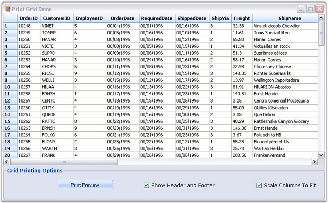
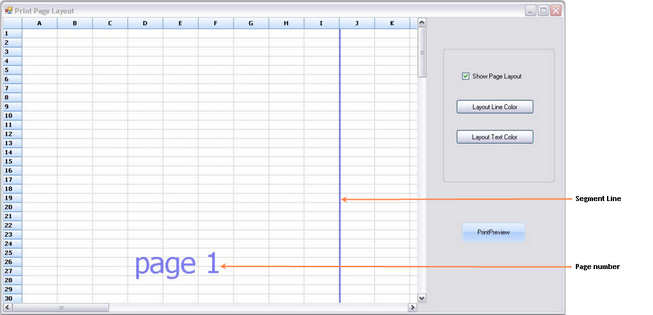
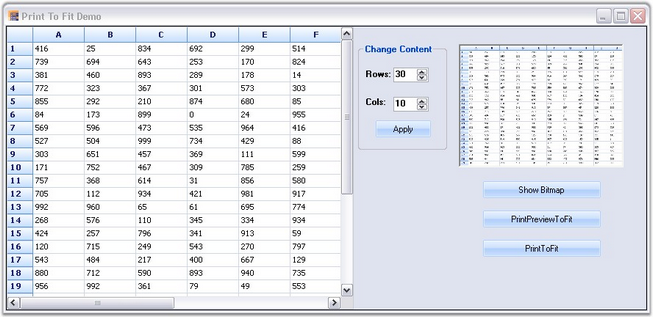

::: {style="DISPLAY: none"}
{#d2h_url_template}{#d2h_package_url style="WIDTH: 0px; DISPLAY: none; HEIGHT: 0px"}
:::

:::: {.d2h_secondary_topic style="PADDING-BOTTOM: 10pt; MARGIN: 0pt; PADDING-LEFT: 0pt; PADDING-RIGHT: 0pt; PADDING-TOP: 0pt"}
#### Print Preview and Printing {#print-preview-and-printing style="tab-stops: 0pt"}

[]{style="FONT-FAMILY: 'Trebuchet MS','sans-serif'; COLOR: #15428b; FONT-SIZE: 9pt"} 

Essential Grid directly supports printing and print previews through the .NET Framework classes **Systems.Windows.Forms.PrintPreviewDialog** and **Systems.Windows.Forms.PrintDialog**. A derived **PrintDocument**, **GridPrintDocument** is passed to these classes. This GridPrintDocument implements the printing logic that is needed to print multi-page grids.

 

Following code example illustrates how to enable print previewing.

[]{style="FONT-FAMILY: 'Trebuchet MS','sans-serif'; COLOR: #15428b; FONT-SIZE: 9pt"} 

1.   Using C#

[]{style="FONT-FAMILY: 'Trebuchet MS','sans-serif'; COLOR: #15428b; FONT-SIZE: 9pt"} 

[]{style="FONT-FAMILY: 'Trebuchet MS','sans-serif'; COLOR: #15428b; FONT-SIZE: 9pt"} 

+----------------------------------------------------------------------------------------------------------------------------------------------------------------------------------------------------------------------------------------------------+
| **[\[C#\]]{style="FONT-FAMILY: 'Courier New'; COLOR: black"}**                                                                                                                                                                                     |
|                                                                                                                                                                                                                                                    |
| []{style="FONT-FAMILY: 'Courier New'; COLOR: black"}                                                                                                                                                                                               |
|                                                                                                                                                                                                                                                    |
| [// PrintPreview button handler.]{style="FONT-FAMILY: 'Courier New'; COLOR: green"}                                                                                                                                                                |
|                                                                                                                                                                                                                                                    |
| [private]{style="FONT-FAMILY: 'Courier New'; COLOR: blue"}[ [void]{style="COLOR: blue"} PrintPreview_Click([object]{style="COLOR: blue"} sender, System.[EventArgs]{style="COLOR: #2b91af"} e)]{style="FONT-FAMILY: 'Courier New'"}                |
|                                                                                                                                                                                                                                                    |
| [{]{style="FONT-FAMILY: 'Courier New'"}                                                                                                                                                                                                            |
|                                                                                                                                                                                                                                                    |
| [    [if]{style="COLOR: blue"} ([this]{style="COLOR: blue"}.gridControl1 != [null]{style="COLOR: blue"})]{style="FONT-FAMILY: 'Courier New'"}                                                                                                      |
|                                                                                                                                                                                                                                                    |
| [    {]{style="FONT-FAMILY: 'Courier New'"}                                                                                                                                                                                                        |
|                                                                                                                                                                                                                                                    |
| [        [try]{style="COLOR: blue"} ]{style="FONT-FAMILY: 'Courier New'"}                                                                                                                                                                          |
|                                                                                                                                                                                                                                                    |
| [        {]{style="FONT-FAMILY: 'Courier New'"}                                                                                                                                                                                                    |
|                                                                                                                                                                                                                                                    |
| [            [// Uses the default printer.]{style="COLOR: green"}]{style="FONT-FAMILY: 'Courier New'"}                                                                                                                                             |
|                                                                                                                                                                                                                                                    |
| [            [GridPrintDocument]{style="COLOR: #2b91af"} pd = [new]{style="COLOR: blue"} [GridPrintDocument]{style="COLOR: #2b91af"}([this]{style="COLOR: blue"}.gridControl1, [true]{style="COLOR: blue"}); ]{style="FONT-FAMILY: 'Courier New'"} |
|                                                                                                                                                                                                                                                    |
| [            [PrintPreviewDialog]{style="COLOR: #2b91af"} dlg = [new]{style="COLOR: blue"} [PrintPreviewDialog]{style="COLOR: #2b91af"}() ;]{style="FONT-FAMILY: 'Courier New'"}                                                                   |
|                                                                                                                                                                                                                                                    |
| [            dlg.Document = pd;]{style="FONT-FAMILY: 'Courier New'"}                                                                                                                                                                               |
|                                                                                                                                                                                                                                                    |
| [            dlg.ShowDialog();]{style="FONT-FAMILY: 'Courier New'"}                                                                                                                                                                                |
|                                                                                                                                                                                                                                                    |
| [        } ]{style="FONT-FAMILY: 'Courier New'"}                                                                                                                                                                                                   |
|                                                                                                                                                                                                                                                    |
| [        [catch]{style="COLOR: blue"}([Exception]{style="COLOR: #2b91af"} ex) ]{style="FONT-FAMILY: 'Courier New'"}                                                                                                                                |
|                                                                                                                                                                                                                                                    |
| [        { ]{style="FONT-FAMILY: 'Courier New'"}                                                                                                                                                                                                   |
|                                                                                                                                                                                                                                                    |
| [            [MessageBox]{style="COLOR: #2b91af"}.Show([\"An error occurred attempting to preview the grid - \"]{style="COLOR: #a31515"} + ex.Message);]{style="FONT-FAMILY: 'Courier New'"}                                                       |
|                                                                                                                                                                                                                                                    |
| [        }]{style="FONT-FAMILY: 'Courier New'"}                                                                                                                                                                                                    |
|                                                                                                                                                                                                                                                    |
| [    }]{style="FONT-FAMILY: 'Courier New'"}                                                                                                                                                                                                        |
|                                                                                                                                                                                                                                                    |
| [}]{style="FONT-FAMILY: 'Courier New'"}                                                                                                                                                                                                            |
|                                                                                                                                                                                                                                                    |
| []{style="FONT-FAMILY: 'Courier New'"}                                                                                                                                                                                                             |
|                                                                                                                                                                                                                                                    |
| [private]{style="FONT-FAMILY: 'Courier New'; COLOR: blue"}[ [void]{style="COLOR: blue"} Print_Click([object]{style="COLOR: blue"} sender, System.[EventArgs]{style="COLOR: #2b91af"} e)]{style="FONT-FAMILY: 'Courier New'"}                       |
|                                                                                                                                                                                                                                                    |
| [{]{style="FONT-FAMILY: 'Courier New'"}                                                                                                                                                                                                            |
|                                                                                                                                                                                                                                                    |
| [    [if]{style="COLOR: blue"} ([this]{style="COLOR: blue"}.gridControl1 != [null]{style="COLOR: blue"})]{style="FONT-FAMILY: 'Courier New'"}                                                                                                      |
|                                                                                                                                                                                                                                                    |
| [    {]{style="FONT-FAMILY: 'Courier New'"}                                                                                                                                                                                                        |
|                                                                                                                                                                                                                                                    |
| [        [try]{style="COLOR: blue"} ]{style="FONT-FAMILY: 'Courier New'"}                                                                                                                                                                          |
|                                                                                                                                                                                                                                                    |
| [        {]{style="FONT-FAMILY: 'Courier New'"}                                                                                                                                                                                                    |
|                                                                                                                                                                                                                                                    |
| [            [GridPrintDocument]{style="COLOR: #2b91af"} pd = [new]{style="COLOR: blue"} [GridPrintDocument]{style="COLOR: #2b91af"}([this]{style="COLOR: blue"}.gridControl1, [true]{style="COLOR: blue"}); ]{style="FONT-FAMILY: 'Courier New'"} |
|                                                                                                                                                                                                                                                    |
| [            [PrintDialog]{style="COLOR: #2b91af"} dlg = [new]{style="COLOR: blue"} [PrintDialog]{style="COLOR: #2b91af"}() ;]{style="FONT-FAMILY: 'Courier New'"}                                                                                 |
|                                                                                                                                                                                                                                                    |
| [            dlg.Document = pd;]{style="FONT-FAMILY: 'Courier New'"}                                                                                                                                                                               |
|                                                                                                                                                                                                                                                    |
| [            [if]{style="COLOR: blue"}( dlg.ShowDialog() == [DialogResult]{style="COLOR: #2b91af"}.OK)]{style="FONT-FAMILY: 'Courier New'"}                                                                                                        |
|                                                                                                                                                                                                                                                    |
| [                pd.Print();]{style="FONT-FAMILY: 'Courier New'"}                                                                                                                                                                                  |
|                                                                                                                                                                                                                                                    |
| [        } ]{style="FONT-FAMILY: 'Courier New'"}                                                                                                                                                                                                   |
|                                                                                                                                                                                                                                                    |
| [        [catch]{style="COLOR: blue"}([Exception]{style="COLOR: #2b91af"} ex) ]{style="FONT-FAMILY: 'Courier New'"}                                                                                                                                |
|                                                                                                                                                                                                                                                    |
| [        { ]{style="FONT-FAMILY: 'Courier New'"}                                                                                                                                                                                                   |
|                                                                                                                                                                                                                                                    |
| [            [MessageBox]{style="COLOR: #2b91af"}.Show([\"An error occurred attempting to print the grid - \"]{style="COLOR: #a31515"} + ex.Message);]{style="FONT-FAMILY: 'Courier New'"}                                                         |
|                                                                                                                                                                                                                                                    |
| [        }]{style="FONT-FAMILY: 'Courier New'"}                                                                                                                                                                                                    |
|                                                                                                                                                                                                                                                    |
| [    }]{style="FONT-FAMILY: 'Courier New'"}                                                                                                                                                                                                        |
|                                                                                                                                                                                                                                                    |
| [}]{style="FONT-FAMILY: 'Courier New'"}                                                                                                                                                                                                            |
+----------------------------------------------------------------------------------------------------------------------------------------------------------------------------------------------------------------------------------------------------+

[]{style="FONT-FAMILY: 'Trebuchet MS','sans-serif'; COLOR: #15428b; FONT-SIZE: 9pt"} 

2.   Using VB.NET

[]{style="FONT-FAMILY: 'Trebuchet MS','sans-serif'; COLOR: #15428b; FONT-SIZE: 9pt"} 

[]{style="FONT-FAMILY: 'Trebuchet MS','sans-serif'; COLOR: #15428b; FONT-SIZE: 9pt"} 

+-----------------------------------------------------------------------------------------------------------------------------------------------------------------------------------------------------------------------------------------------------------------------------------------------------------------+
| **[\[VB.NET\]]{style="FONT-FAMILY: 'Courier New'; COLOR: black"}**                                                                                                                                                                                                                                              |
|                                                                                                                                                                                                                                                                                                                 |
| []{style="FONT-FAMILY: 'Courier New'; COLOR: black"}                                                                                                                                                                                                                                                            |
|                                                                                                                                                                                                                                                                                                                 |
| [\' PrintPreview button handler.]{style="FONT-FAMILY: 'Courier New'; COLOR: green"}                                                                                                                                                                                                                             |
|                                                                                                                                                                                                                                                                                                                 |
| [Private]{style="FONT-FAMILY: 'Courier New'; COLOR: blue"}[ [Sub]{style="COLOR: blue"} PrintPreview_Click([ByVal]{style="COLOR: blue"} sender [As]{style="COLOR: blue"} [Object]{style="COLOR: blue"}, [ByVal]{style="COLOR: blue"} e [As]{style="COLOR: blue"} EventArgs)]{style="FONT-FAMILY: 'Courier New'"} |
|                                                                                                                                                                                                                                                                                                                 |
| [    [If]{style="COLOR: blue"} ([Not]{style="COLOR: blue"} (gridControl1) [Is]{style="COLOR: blue"} [Nothing]{style="COLOR: blue"}) [Then]{style="COLOR: blue"}]{style="FONT-FAMILY: 'Courier New'"}                                                                                                            |
|                                                                                                                                                                                                                                                                                                                 |
| [        [Try]{style="COLOR: blue"}]{style="FONT-FAMILY: 'Courier New'"}                                                                                                                                                                                                                                        |
|                                                                                                                                                                                                                                                                                                                 |
| [            [Dim]{style="COLOR: blue"} pd [As]{style="COLOR: blue"} GridPrintDocument]{style="FONT-FAMILY: 'Courier New'"}                                                                                                                                                                                     |
|                                                                                                                                                                                                                                                                                                                 |
| [            pd = [New]{style="COLOR: blue"} GridPrintDocument(gridControl1, [True]{style="COLOR: blue"})]{style="FONT-FAMILY: 'Courier New'"}                                                                                                                                                                  |
|                                                                                                                                                                                                                                                                                                                 |
| []{style="FONT-FAMILY: 'Courier New'"}                                                                                                                                                                                                                                                                          |
|                                                                                                                                                                                                                                                                                                                 |
| [            [\'Uses the default printer.]{style="COLOR: green"}]{style="FONT-FAMILY: 'Courier New'"}                                                                                                                                                                                                           |
|                                                                                                                                                                                                                                                                                                                 |
| [            [Dim]{style="COLOR: blue"} dlg [As]{style="COLOR: blue"} PrintPreviewDialog]{style="FONT-FAMILY: 'Courier New'"}                                                                                                                                                                                   |
|                                                                                                                                                                                                                                                                                                                 |
| [            dlg = [New]{style="COLOR: blue"} PrintPreviewDialog()]{style="FONT-FAMILY: 'Courier New'"}                                                                                                                                                                                                         |
|                                                                                                                                                                                                                                                                                                                 |
| [            dlg.Document = pd]{style="FONT-FAMILY: 'Courier New'"}                                                                                                                                                                                                                                             |
|                                                                                                                                                                                                                                                                                                                 |
| [            dlg.ShowDialog()]{style="FONT-FAMILY: 'Courier New'"}                                                                                                                                                                                                                                              |
|                                                                                                                                                                                                                                                                                                                 |
| []{style="FONT-FAMILY: 'Courier New'"}                                                                                                                                                                                                                                                                          |
|                                                                                                                                                                                                                                                                                                                 |
| [        [Catch]{style="COLOR: blue"} ex [As]{style="COLOR: blue"} Exception]{style="FONT-FAMILY: 'Courier New'"}                                                                                                                                                                                               |
|                                                                                                                                                                                                                                                                                                                 |
| [            MessageBox.Show(([\"An error occurred attempting to preview the grid - \"]{style="COLOR: #a31515"} + ex.Message))]{style="FONT-FAMILY: 'Courier New'"}                                                                                                                                             |
|                                                                                                                                                                                                                                                                                                                 |
| [        [End]{style="COLOR: blue"} [Try]{style="COLOR: blue"}]{style="FONT-FAMILY: 'Courier New'"}                                                                                                                                                                                                             |
|                                                                                                                                                                                                                                                                                                                 |
| [    [End]{style="COLOR: blue"} [If]{style="COLOR: blue"}]{style="FONT-FAMILY: 'Courier New'"}                                                                                                                                                                                                                  |
|                                                                                                                                                                                                                                                                                                                 |
| [End]{style="FONT-FAMILY: 'Courier New'; COLOR: blue"}[ [Sub]{style="COLOR: blue"}]{style="FONT-FAMILY: 'Courier New'"}                                                                                                                                                                                         |
|                                                                                                                                                                                                                                                                                                                 |
| []{style="FONT-FAMILY: 'Courier New'; COLOR: blue"}                                                                                                                                                                                                                                                             |
|                                                                                                                                                                                                                                                                                                                 |
| [\' Print button handler.]{style="FONT-FAMILY: 'Courier New'; COLOR: green"}                                                                                                                                                                                                                                    |
|                                                                                                                                                                                                                                                                                                                 |
| [Private]{style="FONT-FAMILY: 'Courier New'; COLOR: blue"}[ [Sub]{style="COLOR: blue"} Print_Click([ByVal]{style="COLOR: blue"} sender [As]{style="COLOR: blue"} [Object]{style="COLOR: blue"}, [ByVal]{style="COLOR: blue"} e [As]{style="COLOR: blue"} EventArgs)]{style="FONT-FAMILY: 'Courier New'"}        |
|                                                                                                                                                                                                                                                                                                                 |
| [    [If]{style="COLOR: blue"} ([Not]{style="COLOR: blue"} (gridControl1) [Is]{style="COLOR: blue"} [Nothing]{style="COLOR: blue"}) [Then]{style="COLOR: blue"}]{style="FONT-FAMILY: 'Courier New'"}                                                                                                            |
|                                                                                                                                                                                                                                                                                                                 |
| [        [Try]{style="COLOR: blue"}]{style="FONT-FAMILY: 'Courier New'"}                                                                                                                                                                                                                                        |
|                                                                                                                                                                                                                                                                                                                 |
| [            [Dim]{style="COLOR: blue"} pd [As]{style="COLOR: blue"} GridPrintDocument]{style="FONT-FAMILY: 'Courier New'"}                                                                                                                                                                                     |
|                                                                                                                                                                                                                                                                                                                 |
| [            pd = [New]{style="COLOR: blue"} GridPrintDocument(gridControl1, [True]{style="COLOR: blue"})]{style="FONT-FAMILY: 'Courier New'"}                                                                                                                                                                  |
|                                                                                                                                                                                                                                                                                                                 |
| []{style="FONT-FAMILY: 'Courier New'"}                                                                                                                                                                                                                                                                          |
|                                                                                                                                                                                                                                                                                                                 |
| [            [\' Uses the default printer.]{style="COLOR: green"}]{style="FONT-FAMILY: 'Courier New'"}                                                                                                                                                                                                          |
|                                                                                                                                                                                                                                                                                                                 |
| [            [Dim]{style="COLOR: blue"} dlg [As]{style="COLOR: blue"} PrintDialog]{style="FONT-FAMILY: 'Courier New'"}                                                                                                                                                                                          |
|                                                                                                                                                                                                                                                                                                                 |
| [            dlg = [New]{style="COLOR: blue"} PrintDialog()]{style="FONT-FAMILY: 'Courier New'"}                                                                                                                                                                                                                |
|                                                                                                                                                                                                                                                                                                                 |
| [            dlg.Document = pd]{style="FONT-FAMILY: 'Courier New'"}                                                                                                                                                                                                                                             |
|                                                                                                                                                                                                                                                                                                                 |
| [            [If]{style="COLOR: blue"} dlg.ShowDialog() = DialogResult.OK [Then]{style="COLOR: blue"}]{style="FONT-FAMILY: 'Courier New'"}                                                                                                                                                                      |
|                                                                                                                                                                                                                                                                                                                 |
| [                pd.Print()]{style="FONT-FAMILY: 'Courier New'"}                                                                                                                                                                                                                                                |
|                                                                                                                                                                                                                                                                                                                 |
| [            [End]{style="COLOR: blue"} [If]{style="COLOR: blue"}]{style="FONT-FAMILY: 'Courier New'"}                                                                                                                                                                                                          |
|                                                                                                                                                                                                                                                                                                                 |
| []{style="FONT-FAMILY: 'Courier New'; COLOR: blue"}                                                                                                                                                                                                                                                             |
|                                                                                                                                                                                                                                                                                                                 |
| [        [Catch]{style="COLOR: blue"} ex [As]{style="COLOR: blue"} Exception]{style="FONT-FAMILY: 'Courier New'"}                                                                                                                                                                                               |
|                                                                                                                                                                                                                                                                                                                 |
| [             MessageBox.Show(([\"An error occurred attempting to print the grid - \"]{style="COLOR: #a31515"} + ex.Message))]{style="FONT-FAMILY: 'Courier New'"}                                                                                                                                              |
|                                                                                                                                                                                                                                                                                                                 |
| [        [End]{style="COLOR: blue"} [Try]{style="COLOR: blue"}]{style="FONT-FAMILY: 'Courier New'"}                                                                                                                                                                                                             |
|                                                                                                                                                                                                                                                                                                                 |
| [    [End]{style="COLOR: blue"} [If]{style="COLOR: blue"}]{style="FONT-FAMILY: 'Courier New'"}                                                                                                                                                                                                                  |
|                                                                                                                                                                                                                                                                                                                 |
| [End]{style="FONT-FAMILY: 'Courier New'; COLOR: blue"}[ [Sub]{style="COLOR: blue"}]{style="FONT-FAMILY: 'Courier New'"}                                                                                                                                                                                         |
+-----------------------------------------------------------------------------------------------------------------------------------------------------------------------------------------------------------------------------------------------------------------------------------------------------------------+

**[]{style="FONT-FAMILY: 'Trebuchet MS','sans-serif'; COLOR: #15428b"}** 

Grid Helper Features

[]{style="FONT-FAMILY: 'Trebuchet MS','sans-serif'; COLOR: #15428b; FONT-SIZE: 9pt"} 

The following are the features of the **Grid Helper** that supports print preview and printing:

[]{style="FONT-FAMILY: 'Trebuchet MS','sans-serif'; COLOR: #15428b; FONT-SIZE: 9pt"} 

[·      ]{style="FONT-FAMILY: Symbol"}Advanced printing

[·      ]{style="FONT-FAMILY: Symbol"}Page layout

[·      ]{style="FONT-FAMILY: Symbol"}Print Column To Fit

[]{style="FONT-FAMILY: 'Times New Roman','serif'; FONT-SIZE: 12pt"} 

Advanced Printing

[]{style="FONT-FAMILY: 'Times New Roman','serif'; FONT-SIZE: 12pt"} 

Multiple grids can be printed across various pages using the helper class **GridPrintDocumentAdv**. This is achieved by drawing the full size grid to a large bitmap and then scaling this bitmap to fit the output page.

[]{style="FONT-FAMILY: 'Trebuchet MS','sans-serif'; COLOR: #15428b; FONT-SIZE: 9pt"} 

[·      ]{style="FONT-FAMILY: Symbol"}The Print Preview can be enabled by using **GridPrintDocumentAdv** class or by clicking the Print Preview button under the **Grid Printing Options** in the UI.

[·      ]{style="FONT-FAMILY: Symbol"}Columns can be specified to fit in a single page using the **ScaleColumnsToFitPage** property or selecting the **Scale Columns To Fit** check box on under the **Grid Printing Options** in the UI.

[·      ]{style="FONT-FAMILY: Symbol"}Headers and footers can be added by using the **DrawGridPrintHeader** and **DrawGridPrintFooter** events or by selecting the **Show Header and Footer** check box under the **Grid Printing Options** in the UI**.**

[]{style="FONT-FAMILY: 'Trebuchet MS','sans-serif'; COLOR: #15428b; FONT-SIZE: 9pt"} 

Following code example illustrates Advanced Printing in Grid.

[]{style="FONT-FAMILY: 'Trebuchet MS','sans-serif'; COLOR: #15428b; FONT-SIZE: 9pt"} 

1.   Using C#

[]{style="FONT-FAMILY: 'Trebuchet MS','sans-serif'; COLOR: #15428b; FONT-SIZE: 9pt"} 

+-----------------------------------------------------------------------------------------------------------------------------------------------------------------------------------------------------------+
| **[\[C#\]]{style="FONT-FAMILY: 'Courier New'; COLOR: black"}**                                                                                                                                            |
|                                                                                                                                                                                                           |
| []{style="FONT-FAMILY: 'Courier New'; COLOR: black"}                                                                                                                                                      |
|                                                                                                                                                                                                           |
| [Syncfusion.GridHelperClasses.[GridPrintDocumentAdv]{style="COLOR: #2b91af"} pd = [new]{style="COLOR: blue"}]{style="FONT-FAMILY: 'Courier New'"}                                                         |
|                                                                                                                                                                                                           |
| [Syncfusion.GridHelperClasses.[GridPrintDocumentAdv]{style="COLOR: #2b91af"}([this]{style="COLOR: blue"}.gridControl1);]{style="FONT-FAMILY: 'Courier New'"}                                              |
|                                                                                                                                                                                                           |
| [pd.DefaultPageSettings.Margins = [new]{style="COLOR: blue"} System.Drawing.Printing.[Margins]{style="COLOR: #2b91af"}(25, 25, 25, 25);]{style="FONT-FAMILY: 'Courier New'"}                              |
|                                                                                                                                                                                                           |
| [pd.HeaderHeight = 70;]{style="FONT-FAMILY: 'Courier New'"}                                                                                                                                               |
|                                                                                                                                                                                                           |
| [pd.FooterHeight = 50;]{style="FONT-FAMILY: 'Courier New'"}                                                                                                                                               |
|                                                                                                                                                                                                           |
| []{style="FONT-FAMILY: 'Courier New'"}                                                                                                                                                                    |
|                                                                                                                                                                                                           |
| [pd.ScaleColumnsToFitPage = [true]{style="COLOR: blue"};]{style="FONT-FAMILY: 'Courier New'"}                                                                                                             |
|                                                                                                                                                                                                           |
| []{style="FONT-FAMILY: 'Courier New'"}                                                                                                                                                                    |
|                                                                                                                                                                                                           |
| [PrintPreviewDialog]{style="FONT-FAMILY: 'Courier New'; COLOR: #2b91af"}[ previewDialog = [new]{style="COLOR: blue"} [PrintPreviewDialog]{style="COLOR: #2b91af"}();]{style="FONT-FAMILY: 'Courier New'"} |
|                                                                                                                                                                                                           |
| [previewDialog.Document = pd;]{style="FONT-FAMILY: 'Courier New'"}                                                                                                                                        |
|                                                                                                                                                                                                           |
| [previewDialog.Show();]{style="FONT-FAMILY: 'Courier New'"}                                                                                                                                               |
+-----------------------------------------------------------------------------------------------------------------------------------------------------------------------------------------------------------+

[]{style="FONT-FAMILY: 'Trebuchet MS','sans-serif'; COLOR: #15428b; FONT-SIZE: 9pt"} 

2.   Using VB.NET

[]{style="FONT-FAMILY: 'Trebuchet MS','sans-serif'; COLOR: #15428b; FONT-SIZE: 9pt"} 

+-----------------------------------------------------------------------------------------------------------------------------------------------------------------------------------------------------------+
| **[\[VB.NET\]]{style="FONT-FAMILY: 'Courier New'; COLOR: black"}**                                                                                                                                        |
|                                                                                                                                                                                                           |
| []{style="FONT-FAMILY: 'Courier New'; COLOR: black"}                                                                                                                                                      |
|                                                                                                                                                                                                           |
| [Dim]{style="FONT-FAMILY: 'Courier New'; COLOR: blue"}[ pd [As]{style="COLOR: blue"} Syncfusion.GridHelperClasses.GridPrintDocumentAdv = [New]{style="COLOR: blue"}]{style="FONT-FAMILY: 'Courier New'"}  |
|                                                                                                                                                                                                           |
| [Syncfusion.GridHelperClasses.GridPrintDocumentAdv([Me]{style="COLOR: blue"}.gridControl1)]{style="FONT-FAMILY: 'Courier New'"}                                                                           |
|                                                                                                                                                                                                           |
| [pd.DefaultPageSettings.Margins = [New]{style="COLOR: blue"} System.Drawing.Printing.Margins(25, 25, 25, 25)]{style="FONT-FAMILY: 'Courier New'"}                                                         |
|                                                                                                                                                                                                           |
| [pd.HeaderHeight = 70]{style="FONT-FAMILY: 'Courier New'"}                                                                                                                                                |
|                                                                                                                                                                                                           |
| [pd.FooterHeight = 50]{style="FONT-FAMILY: 'Courier New'"}                                                                                                                                                |
|                                                                                                                                                                                                           |
| []{style="FONT-FAMILY: 'Courier New'"}                                                                                                                                                                    |
|                                                                                                                                                                                                           |
| [pd.ScaleColumnsToFitPage = [True]{style="COLOR: blue"}]{style="FONT-FAMILY: 'Courier New'"}                                                                                                              |
|                                                                                                                                                                                                           |
| []{style="FONT-FAMILY: 'Courier New'; COLOR: blue"}                                                                                                                                                       |
|                                                                                                                                                                                                           |
| [Dim]{style="FONT-FAMILY: 'Courier New'; COLOR: blue"}[ previewDialog [As]{style="COLOR: blue"} PrintPreviewDialog = [New]{style="COLOR: blue"} PrintPreviewDialog()]{style="FONT-FAMILY: 'Courier New'"} |
|                                                                                                                                                                                                           |
| [previewDialog.Document = pd]{style="FONT-FAMILY: 'Courier New'"}                                                                                                                                         |
|                                                                                                                                                                                                           |
| [previewDialog.Show()]{style="FONT-FAMILY: 'Courier New'"}                                                                                                                                                |
+-----------------------------------------------------------------------------------------------------------------------------------------------------------------------------------------------------------+

 

Following screen shot illustrates Advanced Printing functionality provided by the **GridPrintDocumentAdv** class.

**[]{style="FONT-FAMILY: 'Trebuchet MS','sans-serif'; COLOR: #15428b; FONT-SIZE: 9pt"}** 

{border="0"}

[]{style="FONT-FAMILY: 'Trebuchet MS','sans-serif'; COLOR: #15428b; FONT-SIZE: 9pt"} 

*[Figure ]{style="FONT-SIZE: 9pt"}[182]{style="FONT-SIZE: 9pt"}[: Print Grid]{style="FONT-SIZE: 9pt"}*

**[]{style="FONT-FAMILY: 'Trebuchet MS','sans-serif'; COLOR: #15428b; FONT-SIZE: 9pt"}** 

Page Layout

**[]{style="FONT-FAMILY: 'Trebuchet MS','sans-serif'; COLOR: #15428b"}** 

The print Page Layout feature helps to view the printing layout for the grid by displaying a segment line and a page number with each segment. This helps users to analyze page breaks within the grid and manage them accordingly. Colors for the line and text of the page layout can be defined with the properties available. Following code example illustrates this.

**[]{style="FONT-FAMILY: 'Trebuchet MS','sans-serif'; COLOR: #15428b; FONT-SIZE: 9pt"}** 

1.   Using C#

[]{style="FONT-FAMILY: 'Trebuchet MS','sans-serif'; COLOR: #15428b; FONT-SIZE: 9pt"} 

+----------------------------------------------------------------------------------------------------------------------------------------------+
| **[\[C#\]]{style="FONT-FAMILY: 'Courier New'; COLOR: black"}**                                                                               |
|                                                                                                                                              |
| []{style="FONT-FAMILY: 'Courier New'; COLOR: black"}                                                                                         |
|                                                                                                                                              |
| [LayoutSupportHelper]{style="FONT-FAMILY: 'Courier New'; COLOR: #2b91af"}[ layoutHelper;]{style="FONT-FAMILY: 'Courier New'"}                |
|                                                                                                                                              |
| [layoutHelper = [new]{style="COLOR: blue"} [LayoutSupportHelper]{style="COLOR: #2b91af"}(gridControl1);]{style="FONT-FAMILY: 'Courier New'"} |
|                                                                                                                                              |
| [layoutHelper.LineColor = [Color]{style="COLOR: #2b91af"}.Blue;]{style="FONT-FAMILY: 'Courier New'"}                                         |
|                                                                                                                                              |
| [layoutHelper.TextColor = [Color]{style="COLOR: #2b91af"}.Green;]{style="FONT-FAMILY: 'Courier New'"}                                        |
+----------------------------------------------------------------------------------------------------------------------------------------------+

[]{style="FONT-FAMILY: 'Trebuchet MS','sans-serif'; COLOR: #15428b; FONT-SIZE: 9pt"} 

2.   Using VB.NET

**[]{style="FONT-FAMILY: 'Trebuchet MS','sans-serif'; COLOR: #15428b; FONT-SIZE: 9pt"}** 

+---------------------------------------------------------------------------------------------------------------------------------------------------------+
| **[\[VB.NET\]]{style="FONT-FAMILY: 'Courier New'; COLOR: black"}**                                                                                      |
|                                                                                                                                                         |
| []{style="FONT-FAMILY: 'Courier New'; COLOR: black"}                                                                                                    |
|                                                                                                                                                         |
| [Dim]{style="FONT-FAMILY: 'Courier New'; COLOR: blue"}[ layoutHelper [As ]{style="COLOR: blue"}LayoutSupportHelper]{style="FONT-FAMILY: 'Courier New'"} |
|                                                                                                                                                         |
| [layoutHelper = [New ]{style="COLOR: blue"}LayoutSupportHelper(gridControl1)]{style="FONT-FAMILY: 'Courier New'"}                                       |
|                                                                                                                                                         |
| [layoutHelper.LineColor = Color.Blue]{style="FONT-FAMILY: 'Courier New'"}                                                                               |
|                                                                                                                                                         |
| [layoutHelper.TextColor = Color.Green]{style="FONT-FAMILY: 'Courier New'"}                                                                              |
+---------------------------------------------------------------------------------------------------------------------------------------------------------+

[]{style="FONT-FAMILY: 'Trebuchet MS','sans-serif'; COLOR: #15428b; FONT-SIZE: 9pt"} 

Following screen shot shows the page layout of the grid, with the segment line and page number.

[]{style="FONT-FAMILY: 'Trebuchet MS','sans-serif'; COLOR: #15428b; FONT-SIZE: 9pt"} 

{border="0"}

[]{style="FONT-FAMILY: 'Trebuchet MS','sans-serif'; COLOR: #15428b; FONT-SIZE: 9pt"} 

*[Figure ]{style="FONT-SIZE: 9pt"}[183]{style="FONT-SIZE: 9pt"}[: Print Page]{style="FONT-SIZE: 9pt"}*

[]{style="FONT-FAMILY: 'Trebuchet MS','sans-serif'; COLOR: #15428b; FONT-SIZE: 9pt"} 

::: {style="BORDER-BOTTOM: windowtext 1pt solid; BORDER-LEFT: medium none; PADDING-BOTTOM: 1pt; MARGIN-TOP: 9pt; PADDING-LEFT: 0pt; PADDING-RIGHT: 0pt; MARGIN-BOTTOM: 9pt; BORDER-TOP: windowtext 1pt solid; BORDER-RIGHT: medium none; PADDING-TOP: 1pt"}
{border="0"}Note: The functionality mentioned above can also be achieved on UI by selecting Show Page Layout check box on the UI, which allows the user to view the page layout.
:::

[]{style="FONT-FAMILY: 'Trebuchet MS','sans-serif'; COLOR: #15428b; FONT-SIZE: 9pt"} 

Print To Fit

[]{style="FONT-FAMILY: 'Trebuchet MS','sans-serif'; COLOR: #15428b; FONT-SIZE: 9pt"} 

An entire grid can be printed on a single page by deriving **GridPrintDocument** class to handle the printing of entire grid on a single page. The class achieves this by drawing the full-size grid to a large bitmap and then scaling the same to fit the output page. Following code example illustrates this.

[]{style="FONT-FAMILY: 'Trebuchet MS','sans-serif'; COLOR: #15428b; FONT-SIZE: 9pt"} 

+-----------------------------------------------------------------------------------------------------------------------------------------------------------------------------------------------------------------------------------------------------------------------------+
| **[\[C#\]]{style="FONT-FAMILY: 'Courier New'; COLOR: black"}**                                                                                                                                                                                                              |
|                                                                                                                                                                                                                                                                             |
| []{style="FONT-FAMILY: 'Courier New'; COLOR: black"}                                                                                                                                                                                                                        |
|                                                                                                                                                                                                                                                                             |
| [GridPrintToFitDocument]{style="FONT-FAMILY: 'Courier New'; COLOR: #2b91af"}[ pd = [new]{style="COLOR: blue"} [GridPrintToFitDocument]{style="COLOR: #2b91af"}([this]{style="COLOR: blue"}.gridControl1, [true]{style="COLOR: blue"});]{style="FONT-FAMILY: 'Courier New'"} |
|                                                                                                                                                                                                                                                                             |
| [PrintDialog]{style="FONT-FAMILY: 'Courier New'; COLOR: #2b91af"}[ dlg = [new]{style="COLOR: blue"} [PrintDialog]{style="COLOR: #2b91af"}();]{style="FONT-FAMILY: 'Courier New'"}                                                                                           |
|                                                                                                                                                                                                                                                                             |
| [dlg.Document = pd;]{style="FONT-FAMILY: 'Courier New'"}                                                                                                                                                                                                                    |
|                                                                                                                                                                                                                                                                             |
| [if]{style="FONT-FAMILY: 'Courier New'; COLOR: blue"}[ (dlg.ShowDialog() == [DialogResult]{style="COLOR: #2b91af"}.OK)]{style="FONT-FAMILY: 'Courier New'"}                                                                                                                 |
|                                                                                                                                                                                                                                                                             |
| [pd.Print();]{style="FONT-FAMILY: 'Courier New'"}                                                                                                                                                                                                                           |
+-----------------------------------------------------------------------------------------------------------------------------------------------------------------------------------------------------------------------------------------------------------------------------+

[]{style="FONT-FAMILY: 'Trebuchet MS','sans-serif'; COLOR: #15428b; FONT-SIZE: 9pt"} 

+-----------------------------------------------------------------------------------------------------------------------------------------------------------------------------------+
| **[\[VB.NET\]]{style="FONT-FAMILY: 'Courier New'; COLOR: black"}**                                                                                                                |
|                                                                                                                                                                                   |
| []{style="FONT-FAMILY: 'Courier New'; COLOR: black"}                                                                                                                              |
|                                                                                                                                                                                   |
| [Dim]{style="FONT-FAMILY: 'Courier New'; COLOR: blue"}[ dlg [As ]{style="COLOR: blue"}PrintDialog = [New ]{style="COLOR: blue"}PrintDialog()]{style="FONT-FAMILY: 'Courier New'"} |
|                                                                                                                                                                                   |
| [dlg.Document = pd]{style="FONT-FAMILY: 'Courier New'"}                                                                                                                           |
|                                                                                                                                                                                   |
| [If]{style="FONT-FAMILY: 'Courier New'; COLOR: blue"}[ dlg.ShowDialog() = DialogResult.OK [Then]{style="COLOR: blue"}]{style="FONT-FAMILY: 'Courier New'"}                        |
|                                                                                                                                                                                   |
| [pd.Print()]{style="FONT-FAMILY: 'Courier New'"}                                                                                                                                  |
|                                                                                                                                                                                   |
| [End]{style="FONT-FAMILY: 'Courier New'; COLOR: blue"}[ [If]{style="COLOR: blue"}]{style="FONT-FAMILY: 'Courier New'"}                                                            |
+-----------------------------------------------------------------------------------------------------------------------------------------------------------------------------------+

[]{style="FONT-FAMILY: 'Trebuchet MS','sans-serif'; COLOR: #15428b; FONT-SIZE: 9pt"} 

Following screen shot illustrates the Grid\'s **Print To Fit** feature.

[]{style="FONT-FAMILY: 'Trebuchet MS','sans-serif'; COLOR: #15428b; FONT-SIZE: 9pt"} 

{border="0"}

[]{style="FONT-FAMILY: 'Trebuchet MS','sans-serif'; COLOR: #15428b; FONT-SIZE: 9pt"} 

*[Figure ]{style="FONT-SIZE: 9pt"}[184]{style="FONT-SIZE: 9pt"}[: Print To Fit]{style="FONT-SIZE: 9pt"}*

[]{style="FONT-FAMILY: 'Trebuchet MS','sans-serif'; COLOR: #15428b; FONT-SIZE: 9pt"} 

This functionality can also be achieved by clicking the **PrintToFit** button on the UI. Refer Figure 3 on this page.

 

[]{#p340} 

 

[]{#related-topics}
::::
