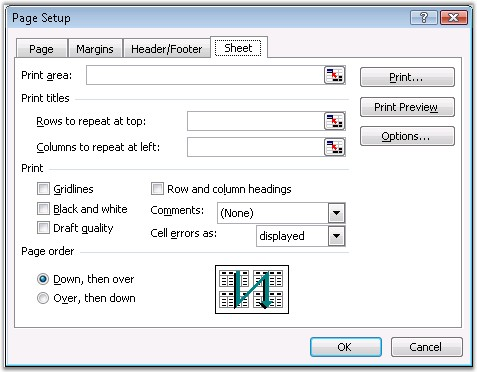

::: {style="DISPLAY: none"}
{#d2h_url_template}{#d2h_package_url style="WIDTH: 0px; DISPLAY: none; HEIGHT: 0px"}
:::

::: {.d2h_secondary_topic style="PADDING-BOTTOM: 10pt; MARGIN: 0pt; PADDING-LEFT: 0pt; PADDING-RIGHT: 0pt; PADDING-TOP: 0pt"}
#### Print settings {#print-settings style="tab-stops: 0pt"}

 

MS Excel enables to customize the print settings through the following options.

 

[·      ]{style="FONT-FAMILY: Symbol"}Print Area

[·      ]{style="FONT-FAMILY: Symbol"}Print Titles

[·      ]{style="FONT-FAMILY: Symbol"}Printing Options

[·      ]{style="FONT-FAMILY: Symbol"}Page Order

[]{style="FONT-FAMILY: 'Trebuchet MS','sans-serif'; COLOR: #15428b; FONT-SIZE: 9pt"} 

{border="0"}

Figure 116: Page Setup - Sheet[]{style="FONT-FAMILY: 'Trebuchet MS','sans-serif'; COLOR: #15428b"}

 

This section explains the XlsIO\'s support for setting these options through simple APIs.

 

Print Area

 

The Print Area specifies the range of cells to be printed. You can set the printing range through the **PrintArea** property.

 

+------------------------------------------------------------------------------------------------------------------------------------------------+
| **[\[C#\]]{style="FONT-FAMILY: 'Courier New'"}**                                                                                               |
|                                                                                                                                                |
| **[]{style="FONT-FAMILY: 'Courier New'"}**                                                                                                     |
|                                                                                                                                                |
| [//Sets printing range ]{style="FONT-FAMILY: 'Courier New'; COLOR: green"}                                                                     |
|                                                                                                                                                |
| [sheet.PageSetup.PrintArea = [\"\$G\$7:\$K\$9,\$G\$11,\$H\$12,\$I\$13,\$J\$14\"]{style="COLOR: #a31515"};]{style="FONT-FAMILY: 'Courier New'"} |
+------------------------------------------------------------------------------------------------------------------------------------------------+

[]{style="FONT-FAMILY: 'Trebuchet MS','sans-serif'; COLOR: #15428b; FONT-SIZE: 9pt"} 

+-----------------------------------------------------------------------------------------------------------------------------------------------+
| **[\[VB.NET\]]{style="FONT-FAMILY: 'Courier New'"}**                                                                                          |
|                                                                                                                                               |
| **[]{style="FONT-FAMILY: 'Courier New'"}**                                                                                                    |
|                                                                                                                                               |
| [\'Sets printing range]{style="FONT-FAMILY: 'Courier New'; COLOR: green"}                                                                     |
|                                                                                                                                               |
| [sheet.PageSetup.PrintArea = [\"\$G\$7:\$K\$9,\$G\$11,\$H\$12,\$I\$13,\$J\$14\"]{style="COLOR: maroon"};]{style="FONT-FAMILY: 'Courier New'"} |
+-----------------------------------------------------------------------------------------------------------------------------------------------+

 

Print Titles

 

MS Excel provides an option to repeat rows and columns, so that the labels will be displayed on every page that it takes to print the sheet. This can be selected through the Sheet tab of the Page Setup dialog box.

 

XlsIO allows setting these titles through the APIs discussed in the following code.

  

+----------------------------------------------------------------------------------------------------------------------------+
| **[\[C#\]]{style="FONT-FAMILY: 'Courier New'"}**                                                                           |
|                                                                                                                            |
| []{style="FONT-FAMILY: 'Courier New'"}                                                                                     |
|                                                                                                                            |
| [sheet.PageSetup.PrintTitleColumns = [\"\$B\$1:\$C\$65536\"]{style="COLOR: #a31515"};]{style="FONT-FAMILY: 'Courier New'"} |
|                                                                                                                            |
| [sheet.PageSetup.PrintTitleRows = [\"\"]{style="COLOR: #a31515"};]{style="FONT-FAMILY: 'Courier New'"}                     |
+----------------------------------------------------------------------------------------------------------------------------+

[]{style="FONT-FAMILY: 'Trebuchet MS','sans-serif'; COLOR: #15428b; FONT-SIZE: 9pt"} 

+--------------------------------------------------------------------------------------------------------------------------+
| **[\[VB.NET\]]{style="FONT-FAMILY: 'Courier New'"}**                                                                     |
|                                                                                                                          |
| []{style="FONT-FAMILY: 'Courier New'"}                                                                                   |
|                                                                                                                          |
| [sheet.PageSetup.PrintTitleColumns = [\"\$B\$1:\$C\$65536\"]{style="COLOR: maroon"}]{style="FONT-FAMILY: 'Courier New'"} |
|                                                                                                                          |
| [sheet.PageSetup.PrintTitleRows = [\"\"]{style="COLOR: maroon"}]{style="FONT-FAMILY: 'Courier New'"}                     |
+--------------------------------------------------------------------------------------------------------------------------+

[]{style="FONT-FAMILY: 'Trebuchet MS','sans-serif'; COLOR: #15428b; FONT-SIZE: 9pt"} 

Print Options

 

There are other settings that can be used to customize the Print options. They are as follows.

 

Grid Lines

 

These are the gray lines that separate the cells. Checking the box will enable them to print. These can be enabled/disabled through XlsIO by using the PrintGridlines property of IPageSetup interface.

 

Headings

[]{style="FONT-FAMILY: 'Trebuchet MS','sans-serif'; COLOR: #15428b; FONT-SIZE: 9pt"} 

Row and column headings are the row numbers and the column letters. Checking the box enables them to print in MS Excel. XlsIO has the option to enable/disable headings through the **PrintHeadings** property of IPageSetup. Remember, headings are not the same as the labels created.

  

Color

 

Excel allows to set the colors for printing. You can print a sheet without colors by using the **BlackAndWhite** property of the **IPageSetup** interface in XlsIO.

  

Quality

[]{style="FONT-FAMILY: 'Trebuchet MS','sans-serif'; COLOR: #15428b; FONT-SIZE: 9pt"} 

Excel provides options to toggle the quality by using the \"DraftQuality\" option. Draft quality is a fast, but not a crisp print quality. XlsIO allows to enable this option through the **Draft** property of the IPageSetup interface. You can also set the print quality that controls the dpi by using the **PrintQuality** property.

  

Comments

 

Comments are little notes that you can attach to cells. They can be printed all together at the end of the sheet, or within the sheet, or not at all. This can be set through XlsIO by using the **PrintNotes** property.

 

Page Order

 

[Excel allows to set the page order in which the sections of a worksheet should be printed, when it does not fit on one paper page. The default option is DownThenOver.]{style="FONT-SIZE: 9pt"}

[]{style="FONT-SIZE: 9pt"} 

[The other option, OverThenDown, prints the cells across the top of the sheet, first, and then moves down to print the next set of rows.]{style="FONT-SIZE: 9pt"}

[]{style="FONT-SIZE: 9pt"} 

[XlsIO allows to set the print direction as illustrated in the following code example.]{style="FONT-SIZE: 9pt"}

[]{style="FONT-SIZE: 9pt"} 

+----------------------------------------------------------------------------------------------------------------------------------+
| **[\[C#\]]{style="FONT-FAMILY: 'Courier New'"}**                                                                                 |
|                                                                                                                                  |
| **[]{style="FONT-FAMILY: 'Courier New'"}**                                                                                       |
|                                                                                                                                  |
| [// Set direction of printing.]{style="FONT-FAMILY: 'Courier New'; COLOR: green"}                                                |
|                                                                                                                                  |
| [workbook.Worksheets\[0\].PageSetup.Order = [ExcelOrder]{style="COLOR: teal"}.DownThenOver;]{style="FONT-FAMILY: 'Courier New'"} |
+----------------------------------------------------------------------------------------------------------------------------------+

[]{style="FONT-FAMILY: 'Trebuchet MS','sans-serif'; COLOR: #15428b; FONT-SIZE: 9pt"} 

+------------------------------------------------------------------------------------------------------------------------------------------+
| **[\[VB.NET\]]{style="FONT-FAMILY: 'Courier New'"}**                                                                                     |
|                                                                                                                                          |
| **[]{style="FONT-FAMILY: 'Courier New'"}**                                                                                               |
|                                                                                                                                          |
| [\' Set direction of printing.]{style="FONT-FAMILY: 'Courier New'; COLOR: green"}[   ]{style="FONT-FAMILY: 'Courier New'; COLOR: black"} |
|                                                                                                                                          |
| [workbook.Worksheets\[0\].PageSetup.Order = [ExcelOrder]{style="COLOR: black"}.DownThenOver]{style="FONT-FAMILY: 'Courier New'"}         |
+------------------------------------------------------------------------------------------------------------------------------------------+

 

[]{#p97} 

[]{#related-topics}
:::
