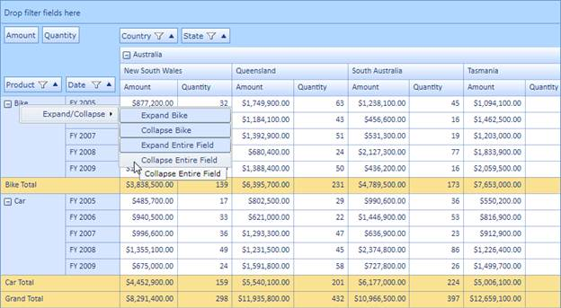

::: {style="DISPLAY: none"}
{#d2h_url_template}{#d2h_package_url style="WIDTH: 0px; DISPLAY: none; HEIGHT: 0px"}
:::

::::: {#nsbanner .d2h_main_nsbanner style="BORDER-BOTTOM: #999999 1px solid; POSITION: relative; PADDING-BOTTOM: 0px; BACKGROUND-COLOR: transparent; PADDING-LEFT: 0px; PADDING-RIGHT: 0px; DISPLAY: none; BORDER-TOP: #999999 1px solid; PADDING-TOP: 0px; LEFT: 0px"}
:::: {#TitleRow .d2h_main_titlerow style="PADDING-BOTTOM: 4px; BACKGROUND-COLOR: transparent; PADDING-LEFT: 22px; WIDTH: 100%; PADDING-RIGHT: 10px; DISPLAY: none; PADDING-TOP: 4px"}
::: {#ienav .d2h_main_ienav style="DISPLAY: none"}
{#D2HPrevious .D2HPreviousEnabled}  {#D2HNext .D2HNextEnabled}
:::
::::
:::::

::: {#nstext .d2h_main_nstext style="PADDING-BOTTOM: 10px; BACKGROUND-COLOR: transparent; PADDING-LEFT: 22px; PADDING-RIGHT: 10px; HEIGHT: 100%; OVERFLOW: auto; PADDING-TOP: 5px" hasuserbackground="true" valign="bottom"}
### Programmatic and UI-Level Support for Expand/Collapse Operations {#programmatic-and-ui-level-support-for-expandcollapse-operations style="tab-stops: 0pt"}

Expand/collapse operations can be done at both the UI and programmatic level. The context menu will be shown when right-clicking on the expander cell. Its skin will change with respect to the grid's background color and it is localizable too. Expand/collapse operations can be handled at the row level and column level individually. The header cell's UniqueText will be shown as a ToolTip for each context menu item.

Use Case Scenarios

Enabling UI-level expand/collapse will allow the end user to expand and collapse the particular cell and entire row or column individually. Programmatically, they can expand and collapse any number of rows or columns.

 

{border="0"}

Figure 31: Expand/Collapse via Context Menu

[]{#related-topics}
:::
