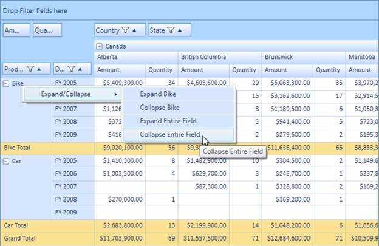

::: {style="DISPLAY: none"}
{#d2h_url_template} {#d2h_package_url style="WIDTH: 0px; DISPLAY: none; HEIGHT: 0px"}
:::

::: {.d2h_secondary_topic style="PADDING-BOTTOM: 10pt; MARGIN: 0pt; PADDING-LEFT: 0pt; PADDING-RIGHT: 0pt; PADDING-TOP: 0pt"}
##### Programmatic and UI level support for expand collapse operation {#programmatic-and-ui-level-support-for-expand-collapse-operation style="tab-stops: 0pt"}

Expand/collapse operations can be done at both the UI and programmatic level. The context menu will be shown while right-clicking on the expander cell. Its skin will change with respect to the grid's background color, and it is localizable too. Expand/collapse operations can be handled at the row level and column level individually. The header cell's UniqueText will be shown as a ToolTip for each context menu item.

Use Case Scenarios

Enabling UI-level expand/collapse operations will allow the end user to expand and collapse the particular cell and entire row or column individually. Programmatically, they can expand/collapse any number of rows or columns.

 

{border="0"}

Figure 46: Expand/Collapse via Context Menu

[]{#related-topics}
:::
