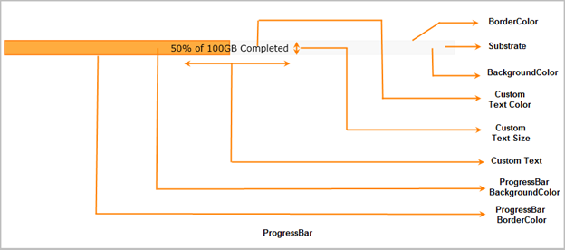

::: {style="DISPLAY: none"}
{#d2h_url_template}{#d2h_package_url style="WIDTH: 0px; DISPLAY: none; HEIGHT: 0px"}
:::

::::: {#nsbanner .d2h_main_nsbanner style="BORDER-BOTTOM: #999999 1px solid; POSITION: relative; PADDING-BOTTOM: 0px; BACKGROUND-COLOR: transparent; PADDING-LEFT: 0px; PADDING-RIGHT: 0px; DISPLAY: none; BORDER-TOP: #999999 1px solid; PADDING-TOP: 0px; LEFT: 0px"}
:::: {#TitleRow .d2h_main_titlerow style="PADDING-BOTTOM: 4px; BACKGROUND-COLOR: transparent; PADDING-LEFT: 22px; WIDTH: 100%; PADDING-RIGHT: 10px; DISPLAY: none; PADDING-TOP: 4px"}
::: {#ienav .d2h_main_ienav style="DISPLAY: none"}
{#D2HPrevious .D2HPreviousEnabled}  {#D2HNext .D2HNextEnabled}
:::
::::
:::::

:::: {#nstext .d2h_main_nstext style="PADDING-BOTTOM: 10px; BACKGROUND-COLOR: transparent; PADDING-LEFT: 22px; PADDING-RIGHT: 10px; HEIGHT: 100%; OVERFLOW: auto; PADDING-TOP: 5px" hasuserbackground="true" valign="bottom"}
::: {#d2h_breadcrumbs .d2h_breadcrumbs}
[Essential Studio User Guide Documentation](ms-xhelp:///?Id=12457748-09e3-4d74-a240-8e049cedf030){.d2h_breadcrumbsNormal}[ \> ]{.d2h_breadcrumbsLinkSeparator}[User Interface Edition](ms-xhelp:///?Id=c29296b7-531c-413b-a0ec-488ca1f7f669){.d2h_breadcrumbsNormal}[ \> ]{.d2h_breadcrumbsLinkSeparator}[Essential ASP.NET MVC](ms-xhelp:///?Id=4b14e7d1-65c4-4f67-b1aa-2c37709905a5){.d2h_breadcrumbsNormal}[ \> ]{.d2h_breadcrumbsLinkSeparator}[Essential Tools]{.d2h_breadcrumbsContentsOnly}[ \> ]{.d2h_breadcrumbsLinkSeparator}[Controls and Components](ms-xhelp:///?Id=f0af2fff-6f00-4ca4-85a6-54e41ac5dc96){.d2h_breadcrumbsNormal}
:::

## Progress Bar {#progress-bar style="tab-stops: 0pt"}

The Progress bar in HTML5 helps you to graphically represent the progress of an ongoing process.

You can customize the look and feel of the progress bar, as it uses the HTML5 Canvas element.

This is a client-side control and therefore information can be loaded quickly.

Use Case Scenario-

The progress bar can be used in a user-friendly program, since it provides indications to the user that the task is occurring.

It gives the user an estimate for how long the task might take, and how much work has already been done, as a way of indicating the work status.

 

Appearance and Structure

The following figure gives you a basic idea of the structure and appearance of the Progress Bar control in MVC Tools-

 

{border="0"}

Figure 171: Progress Bar

 

More:

[ ]{#related-topics}

[{border="0" align="absMiddle"}Where do I find Installed samples?](ms-xhelp:///?Id=3780abbc-e433-46d2-a4cc-85c884fbc270){style="TEXT-DECORATION: none"}

[{border="0" align="absMiddle"}Adding ProgressBar control to MVC Tools](ms-xhelp:///?Id=39aed087-6637-42be-91ba-6fd47ee52f90){style="TEXT-DECORATION: none"}

[{border="0" align="absMiddle"}Concepts and Features](ms-xhelp:///?Id=1cc0b5f6-68c2-47a2-81ec-2646310339e0){style="TEXT-DECORATION: none"}
::::
