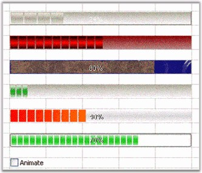

::: {style="DISPLAY: none"}
{#d2h_url_template}{#d2h_package_url style="WIDTH: 0px; DISPLAY: none; HEIGHT: 0px"}
:::

::: {.d2h_secondary_topic style="PADDING-BOTTOM: 10pt; MARGIN: 0pt; PADDING-LEFT: 0pt; PADDING-RIGHT: 0pt; PADDING-TOP: 0pt"}
##### Progress Bar {#progress-bar style="tab-stops: 0pt"}

[]{style="FONT-FAMILY: 'Trebuchet MS','sans-serif'; COLOR: #15428b; FONT-SIZE: 9pt"} 

There are several formatting options that can be applied to an ProgressBar cell type embedded into the grid control. The following code example illustrates this.

[]{style="FONT-FAMILY: 'Trebuchet MS','sans-serif'; COLOR: #15428b; FONT-SIZE: 9pt"} 

+--------------------------------------------------------------------------------------------------------------------------------------------------------------------------------+
| **[\[C#\]]{style="FONT-FAMILY: 'Courier New'; COLOR: black"}**                                                                                                                 |
|                                                                                                                                                                                |
| []{style="FONT-FAMILY: 'Courier New'; COLOR: black"}                                                                                                                           |
|                                                                                                                                                                                |
| [// Set up a Progress Bar Control.]{style="FONT-FAMILY: 'Courier New'; COLOR: green"}                                                                                          |
|                                                                                                                                                                                |
| [GridStyleInfo]{style="FONT-FAMILY: 'Courier New'; COLOR: #2b91af"}[ style3 = gridControl1\[12, 2\];]{style="FONT-FAMILY: 'Courier New'"}                                      |
|                                                                                                                                                                                |
| [GridProgressBarInfo]{style="FONT-FAMILY: 'Courier New'; COLOR: #2b91af"}[ progressBarEx3 = style3.ProgressBar;]{style="FONT-FAMILY: 'Courier New'"}                           |
|                                                                                                                                                                                |
| [style3.CellType = [\"ProgressBar\"]{style="COLOR: #a31515"};]{style="FONT-FAMILY: 'Courier New'"}                                                                             |
|                                                                                                                                                                                |
| [style3.Themed = [false]{style="COLOR: blue"};]{style="FONT-FAMILY: 'Courier New'"}                                                                                            |
|                                                                                                                                                                                |
| []{style="FONT-FAMILY: 'Courier New'"}                                                                                                                                         |
|                                                                                                                                                                                |
| [// Apply Styles.]{style="FONT-FAMILY: 'Courier New'; COLOR: green"}                                                                                                           |
|                                                                                                                                                                                |
| [progressBarEx3.BackGradientEndColor = System.Drawing.[Color]{style="COLOR: #2b91af"}.RosyBrown;]{style="FONT-FAMILY: 'Courier New'"}                                          |
|                                                                                                                                                                                |
| [progressBarEx3.BackGradientStartColor = System.Drawing.[Color]{style="COLOR: #2b91af"}.DarkRed;]{style="FONT-FAMILY: 'Courier New'"}                                          |
|                                                                                                                                                                                |
| [progressBarEx3.BackgroundStyle = Syncfusion.Windows.Forms.Tools.[ProgressBarBackgroundStyles]{style="COLOR: #2b91af"}.VerticalGradient; ]{style="FONT-FAMILY: 'Courier New'"} |
|                                                                                                                                                                                |
| [progressBarEx3.BackMultipleColors = [new]{style="COLOR: blue"} System.Drawing.[Color]{style="COLOR: #2b91af"}\[0\];]{style="FONT-FAMILY: 'Courier New'"}                      |
|                                                                                                                                                                                |
| [progressBarEx3.BackSegments = [false]{style="COLOR: blue"};]{style="FONT-FAMILY: 'Courier New'"}                                                                              |
|                                                                                                                                                                                |
| [progressBarEx3.BackTubeEndColor = System.Drawing.[SystemColors]{style="COLOR: #2b91af"}.Control;]{style="FONT-FAMILY: 'Courier New'"}                                         |
|                                                                                                                                                                                |
| [progressBarEx3.BackTubeStartColor = System.Drawing.[Color]{style="COLOR: #2b91af"}.LightGray;]{style="FONT-FAMILY: 'Courier New'"}                                            |
|                                                                                                                                                                                |
| [progressBarEx3.FontColor = System.Drawing.[Color]{style="COLOR: #2b91af"}.Lime;]{style="FONT-FAMILY: 'Courier New'"}                                                          |
|                                                                                                                                                                                |
| [progressBarEx3.ForegroundImage = [null]{style="COLOR: blue"};]{style="FONT-FAMILY: 'Courier New'"}                                                                            |
|                                                                                                                                                                                |
| [progressBarEx3.GradientEndColor = System.Drawing.[Color]{style="COLOR: #2b91af"}.Lime;]{style="FONT-FAMILY: 'Courier New'"}                                                   |
|                                                                                                                                                                                |
| [progressBarEx3.GradientStartColor = System.Drawing.[Color]{style="COLOR: #2b91af"}.Red;]{style="FONT-FAMILY: 'Courier New'"}                                                  |
|                                                                                                                                                                                |
| [progressBarEx3.MultipleColors = [new]{style="COLOR: blue"} System.Drawing.[Color]{style="COLOR: #2b91af"}\[\] ]{style="FONT-FAMILY: 'Courier New'"}                           |
|                                                                                                                                                                                |
| [{ ]{style="FONT-FAMILY: 'Courier New'"}                                                                                                                                       |
|                                                                                                                                                                                |
| [System.Drawing.[SystemColors]{style="COLOR: #2b91af"}.ControlDarkDark,]{style="FONT-FAMILY: 'Courier New'"}                                                                   |
|                                                                                                                                                                                |
| [System.Drawing.[SystemColors]{style="COLOR: #2b91af"}.ControlLight,]{style="FONT-FAMILY: 'Courier New'"}                                                                      |
|                                                                                                                                                                                |
| [System.Drawing.[SystemColors]{style="COLOR: #2b91af"}.ControlDark,]{style="FONT-FAMILY: 'Courier New'"}                                                                       |
|                                                                                                                                                                                |
| [System.Drawing.[SystemColors]{style="COLOR: #2b91af"}.Control]{style="FONT-FAMILY: 'Courier New'"}                                                                            |
|                                                                                                                                                                                |
| [};]{style="FONT-FAMILY: 'Courier New'"}                                                                                                                                       |
|                                                                                                                                                                                |
| [progressBarEx3.ProgressStyle = Syncfusion.Windows.Forms.Tools.[ProgressBarStyles]{style="COLOR: #2b91af"}.Tube;]{style="FONT-FAMILY: 'Courier New'"}                          |
|                                                                                                                                                                                |
| [progressBarEx3.SegmentWidth = 12;]{style="FONT-FAMILY: 'Courier New'"}                                                                                                        |
|                                                                                                                                                                                |
| [progressBarEx3.TextVisible = [false]{style="COLOR: blue"};]{style="FONT-FAMILY: 'Courier New'"}                                                                               |
|                                                                                                                                                                                |
| [progressBarEx3.TubeEndColor = System.Drawing.[Color]{style="COLOR: #2b91af"}.Black;]{style="FONT-FAMILY: 'Courier New'"}                                                      |
|                                                                                                                                                                                |
| [progressBarEx3.TubeStartColor = System.Drawing.[Color]{style="COLOR: #2b91af"}.Red;]{style="FONT-FAMILY: 'Courier New'"}                                                      |
|                                                                                                                                                                                |
| [progressBarEx3.ProgressValue = 75;]{style="FONT-FAMILY: 'Courier New'"}                                                                                                       |
+--------------------------------------------------------------------------------------------------------------------------------------------------------------------------------+

[]{style="FONT-FAMILY: 'Courier New'; COLOR: #15428b"} 

+------------------------------------------------------------------------------------------------------------------------------------------------------------------------------------------------------------------------------------------------------------------------------+
| **[\[VB.NET\]]{style="FONT-FAMILY: 'Courier New'; COLOR: black"}**                                                                                                                                                                                                           |
|                                                                                                                                                                                                                                                                              |
| []{style="FONT-FAMILY: 'Courier New'; COLOR: black"}                                                                                                                                                                                                                         |
|                                                                                                                                                                                                                                                                              |
| [\' Set up a Progress Bar Control.]{style="FONT-FAMILY: 'Courier New'; COLOR: green"}                                                                                                                                                                                        |
|                                                                                                                                                                                                                                                                              |
| [Dim]{style="FONT-FAMILY: 'Courier New'; COLOR: blue"}[ style3 ]{style="FONT-FAMILY: 'Courier New'; COLOR: black"}[As]{style="FONT-FAMILY: 'Courier New'; COLOR: blue"}[ GridStyleInfo = gridControl1(12, 2)]{style="FONT-FAMILY: 'Courier New'; COLOR: black"}              |
|                                                                                                                                                                                                                                                                              |
| [Dim]{style="FONT-FAMILY: 'Courier New'; COLOR: blue"}[ progressBarEx3 ]{style="FONT-FAMILY: 'Courier New'; COLOR: black"}[As]{style="FONT-FAMILY: 'Courier New'; COLOR: blue"}[ GridProgressBarInfo = style3.ProgressBar]{style="FONT-FAMILY: 'Courier New'; COLOR: black"} |
|                                                                                                                                                                                                                                                                              |
| [style3.CellType = ]{style="FONT-FAMILY: 'Courier New'; COLOR: black"}[\"ProgressBar\"]{style="FONT-FAMILY: 'Courier New'; COLOR: #a31515"}                                                                                                                                  |
|                                                                                                                                                                                                                                                                              |
| [style3.Themed = ]{style="FONT-FAMILY: 'Courier New'; COLOR: black"}[False]{style="FONT-FAMILY: 'Courier New'; COLOR: blue"}                                                                                                                                                 |
|                                                                                                                                                                                                                                                                              |
| []{style="FONT-FAMILY: 'Courier New'; COLOR: blue"}                                                                                                                                                                                                                          |
|                                                                                                                                                                                                                                                                              |
| [\' Apply Styles.]{style="FONT-FAMILY: 'Courier New'; COLOR: green"}                                                                                                                                                                                                         |
|                                                                                                                                                                                                                                                                              |
| [progressBarEx3.BackGradientEndColor = System.Drawing.Color.RosyBrown]{style="FONT-FAMILY: 'Courier New'; COLOR: black"}                                                                                                                                                     |
|                                                                                                                                                                                                                                                                              |
| [progressBarEx3.BackGradientStartColor = System.Drawing.Color.DarkRed]{style="FONT-FAMILY: 'Courier New'; COLOR: black"}                                                                                                                                                     |
|                                                                                                                                                                                                                                                                              |
| [progressBarEx3.BackgroundStyle = Syncfusion.Windows.Forms.Tools.ProgressBarBackgroundStyles.VerticalGradient]{style="FONT-FAMILY: 'Courier New'; COLOR: black"}                                                                                                             |
|                                                                                                                                                                                                                                                                              |
| [progressBarEx3.BackMultipleColors = ]{style="FONT-FAMILY: 'Courier New'; COLOR: black"}[New]{style="FONT-FAMILY: 'Courier New'; COLOR: blue"}[ System.Drawing.Color(0) {}]{style="FONT-FAMILY: 'Courier New'; COLOR: black"}                                                |
|                                                                                                                                                                                                                                                                              |
| [progressBarEx3.BackSegments = ]{style="FONT-FAMILY: 'Courier New'; COLOR: black"}[False]{style="FONT-FAMILY: 'Courier New'; COLOR: blue"}                                                                                                                                   |
|                                                                                                                                                                                                                                                                              |
| [progressBarEx3.BackTubeEndColor = System.Drawing.SystemColors.Control]{style="FONT-FAMILY: 'Courier New'; COLOR: black"}                                                                                                                                                    |
|                                                                                                                                                                                                                                                                              |
| [progressBarEx3.BackTubeStartColor = System.Drawing.Color.LightGray]{style="FONT-FAMILY: 'Courier New'; COLOR: black"}                                                                                                                                                       |
|                                                                                                                                                                                                                                                                              |
| [progressBarEx3.FontColor = System.Drawing.Color.Lime]{style="FONT-FAMILY: 'Courier New'; COLOR: black"}                                                                                                                                                                     |
|                                                                                                                                                                                                                                                                              |
| [progressBarEx3.ForegroundImage = ]{style="FONT-FAMILY: 'Courier New'; COLOR: black"}[Nothing]{style="FONT-FAMILY: 'Courier New'; COLOR: blue"}                                                                                                                              |
|                                                                                                                                                                                                                                                                              |
| [progressBarEx3.GradientEndColor = System.Drawing.Color.Lime]{style="FONT-FAMILY: 'Courier New'; COLOR: black"}                                                                                                                                                              |
|                                                                                                                                                                                                                                                                              |
| [progressBarEx3.GradientStartColor = System.Drawing.Color.Red]{style="FONT-FAMILY: 'Courier New'; COLOR: black"}                                                                                                                                                             |
|                                                                                                                                                                                                                                                                              |
| [progressBarEx3.MultipleColors = ]{style="FONT-FAMILY: 'Courier New'; COLOR: black"}[New]{style="FONT-FAMILY: 'Courier New'; COLOR: blue"}[ System.Drawing.Color() { \_System.Drawing.SystemColors.ControlDarkDark, \_]{style="FONT-FAMILY: 'Courier New'; COLOR: black"}    |
|                                                                                                                                                                                                                                                                              |
| [System.Drawing.SystemColors.ControlLight,\_System.Drawing.SystemColors.ControlDark, \_System.Drawing.SystemColors.Control}]{style="FONT-FAMILY: 'Courier New'; COLOR: black"}                                                                                               |
|                                                                                                                                                                                                                                                                              |
| [progressBarEx3.ProgressStyle = Syncfusion.Windows.Forms.Tools.ProgressBarStyles.Tube]{style="FONT-FAMILY: 'Courier New'; COLOR: black"}                                                                                                                                     |
|                                                                                                                                                                                                                                                                              |
| [progressBarEx3.SegmentWidth = 12]{style="FONT-FAMILY: 'Courier New'; COLOR: black"}                                                                                                                                                                                         |
|                                                                                                                                                                                                                                                                              |
| [progressBarEx3.TextVisible = ]{style="FONT-FAMILY: 'Courier New'; COLOR: black"}[False]{style="FONT-FAMILY: 'Courier New'; COLOR: blue"}                                                                                                                                    |
|                                                                                                                                                                                                                                                                              |
| [progressBarEx3.TubeEndColor = System.Drawing.Color.Black]{style="FONT-FAMILY: 'Courier New'; COLOR: black"}                                                                                                                                                                 |
|                                                                                                                                                                                                                                                                              |
| [progressBarEx3.TubeStartColor = System.Drawing.Color.Red]{style="FONT-FAMILY: 'Courier New'; COLOR: black"}                                                                                                                                                                 |
|                                                                                                                                                                                                                                                                              |
| [progressBarEx3.ProgressValue = 75 ]{style="FONT-FAMILY: 'Courier New'; COLOR: black"}                                                                                                                                                                                       |
+------------------------------------------------------------------------------------------------------------------------------------------------------------------------------------------------------------------------------------------------------------------------------+

[]{style="FONT-FAMILY: 'Trebuchet MS','sans-serif'; COLOR: #15428b; FONT-SIZE: 9pt"} 

{border="0"}

**[]{style="FONT-FAMILY: 'Trebuchet MS','sans-serif'; COLOR: #15428b; FONT-SIZE: 9pt"}** 

*[Figure ]{style="FONT-SIZE: 9pt"}[86]{style="FONT-SIZE: 9pt"}[: Push Button Cells]{style="FONT-SIZE: 9pt"}*

***[]{style="FONT-FAMILY: 'Trebuchet MS','sans-serif'; COLOR: #15428b; FONT-SIZE: 9pt"}*** 

For other code samples, refer to the sample in the following location:

[]{style="FONT-FAMILY: 'Trebuchet MS','sans-serif'; COLOR: #15428b; FONT-SIZE: 9pt"} 

***C:\\Syncfusion\\EssentialStudio\\\[Version Number\]\\Windows\\Grid.Windows\\Samples\\2.0\\Cell Types\\Progress Bar Cell Demo***

 

[]{#p62} 

 

[]{#related-topics}
:::
