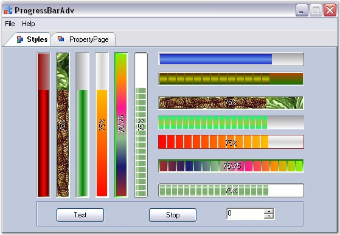

::: {style="DISPLAY: none"}
{#d2h_url_template}{#d2h_package_url style="WIDTH: 0px; DISPLAY: none; HEIGHT: 0px"}
:::

::::: {#nsbanner .d2h_main_nsbanner style="BORDER-BOTTOM: #999999 1px solid; POSITION: relative; PADDING-BOTTOM: 0px; BACKGROUND-COLOR: transparent; PADDING-LEFT: 0px; PADDING-RIGHT: 0px; DISPLAY: none; BORDER-TOP: #999999 1px solid; PADDING-TOP: 0px; LEFT: 0px"}
:::: {#TitleRow .d2h_main_titlerow style="PADDING-BOTTOM: 4px; BACKGROUND-COLOR: transparent; PADDING-LEFT: 22px; WIDTH: 100%; PADDING-RIGHT: 10px; DISPLAY: none; PADDING-TOP: 4px"}
::: {#ienav .d2h_main_ienav style="DISPLAY: none"}
{#D2HPrevious .D2HPreviousEnabled}  {#D2HNext .D2HNextEnabled}
:::
::::
:::::

:::: {#nstext .d2h_main_nstext style="PADDING-BOTTOM: 10px; BACKGROUND-COLOR: transparent; PADDING-LEFT: 22px; PADDING-RIGHT: 10px; HEIGHT: 100%; OVERFLOW: auto; PADDING-TOP: 5px" hasuserbackground="true" valign="bottom"}
::: {#d2h_breadcrumbs .d2h_breadcrumbs}
[Essential Studio User Guide Documentation](ms-xhelp:///?Id=12457748-09e3-4d74-a240-8e049cedf030){.d2h_breadcrumbsNormal}[ \> ]{.d2h_breadcrumbsLinkSeparator}[User Interface Edition](ms-xhelp:///?Id=c29296b7-531c-413b-a0ec-488ca1f7f669){.d2h_breadcrumbsNormal}[ \> ]{.d2h_breadcrumbsLinkSeparator}[Essential Windows](ms-xhelp:///?Id=e60759d8-47a4-4570-9d7a-16a68d63f2ea){.d2h_breadcrumbsNormal}[ \> ]{.d2h_breadcrumbsLinkSeparator}[Essential Tools]{.d2h_breadcrumbsContentsOnly}[ \> ]{.d2h_breadcrumbsLinkSeparator}[Tools Controls](ms-xhelp:///?Id=13c3c4f4-9d16-4b69-93f2-7e98eec67452){.d2h_breadcrumbsNormal}[ \> ]{.d2h_breadcrumbsLinkSeparator}[Notification Package](ms-xhelp:///?Id=2a7ddb82-ecdf-4d47-be30-1996e2c8244c){.d2h_breadcrumbsNormal}
:::

### ProgressBarAdv {#progressbaradv style="MARGIN-LEFT: 18pt; tab-stops: 18.0pt"}

[]{style="COLOR: #15428b"} 

ProgressBars are used in applications to provide a visual cue during lengthy operations such as installation, copying, and printing. It also lets users know the time remaining to complete a lengthy operation. When an application is performing a lengthy task in the background, users may not be sure if the application is still working. A ProgressBar can be used to provide a visual cue that the application is indeed working and the task is being completed.

[]{style="COLOR: #15428b"} 

{border="0"}

[]{style="COLOR: #15428b"} 

Figure 953: Different Properties of the ProgressBarAdv Control

[]{style="COLOR: #15428b"} 

The **ProgressBarAdv** is an advanced progressbar with a wide array of properties that can be set using the properties window. It comes with many styles which can be set through the **BackgroundStyle** and **ProgressStyle** properties. The orientation of a ProgressBarAdv can be set to vertical or horizontal using the **ProgressOrientation** property.

[]{style="COLOR: #15428b"} 

 

 

 

[]{#p702} 

More:

[ ]{#related-topics}

[{border="0" align="absMiddle"}Features](ms-xhelp:///?Id=e89bf161-9637-4fc1-855a-25103d0574e2){style="TEXT-DECORATION: none"}

[{border="0" align="absMiddle"}Creating ProgressBarAdv](ms-xhelp:///?Id=ce2f9d65-ffd2-46d1-bbdc-d549d56c54ab){style="TEXT-DECORATION: none"}

[{border="0" align="absMiddle"}Concepts and Features](ms-xhelp:///?Id=604053e8-6b39-49e6-8730-f0833dd1a836){style="TEXT-DECORATION: none"}

[{border="0" align="absMiddle"}ProgressBarAdv Events](ms-xhelp:///?Id=36a288cc-e4b7-4d2d-b941-8efd43c40467){style="TEXT-DECORATION: none"}

[{border="0" align="absMiddle"}Frequently Asked Questions](ms-xhelp:///?Id=e87de9b3-f3e7-47b6-ba00-630fb6d7a550){style="TEXT-DECORATION: none"}
::::
