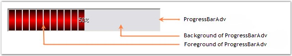

::: {style="DISPLAY: none"}
{#d2h_url_template}{#d2h_package_url style="WIDTH: 0px; DISPLAY: none; HEIGHT: 0px"}
:::

::: {.d2h_secondary_topic style="PADDING-BOTTOM: 10pt; MARGIN: 0pt; PADDING-LEFT: 0pt; PADDING-RIGHT: 0pt; PADDING-TOP: 0pt"}
##### ProgressBarAdv Overview {#progressbaradv-overview style="MARGIN-LEFT: 18pt; tab-stops: 18.0pt"}

[]{style="COLOR: #15428b"} 

The various sections of ProgressBarAdv and their descriptions are given below.

[]{style="COLOR: #15428b"} 

{border="0"}

[]{style="COLOR: #15428b"} 

Figure 957: Sections of ProgressBarAdv

[]{style="COLOR: #15428b"} 

ProgressBarAdv

[]{style="COLOR: #15428b"} 

The ProgressBarAdv is an extension to the standard progressbar which will help you to display task completion status with lots of background, border and foreground styles.

[]{style="COLOR: #15428b"} 

Foreground of ProgressBarAdv

[]{style="FONT-FAMILY: 'Verdana','sans-serif'; COLOR: #4a5c8c; FONT-SIZE: 8pt"} 

This is the area which indicates task completion in the ProgressBarAdv control.

 

Background of ProgressBarAdv

[]{style="FONT-FAMILY: 'Verdana','sans-serif'; COLOR: #4a5c8c; FONT-SIZE: 8pt"} 

This is the area over which the foreground is displayed.

[]{style="COLOR: #15428b"} 

See Also

**[]{style="COLOR: #15428b"}** 

[[Background Settings]{.UGHyperlink}](../../../../../../../../Documents%20and%20Settings/sylviap/Desktop/Tools%20-%20Part%202.docx#_Background_Settings)[, ]{style="COLOR: #15428b"}[[Foreground Settings]{.UGHyperlink}](../../../../../../../../Documents%20and%20Settings/sylviap/Desktop/Tools%20-%20Part%202.docx#_Foreground_Settings)[]{style="COLOR: black"}

 

 

 

[]{#p708} 

[]{#related-topics}
:::
