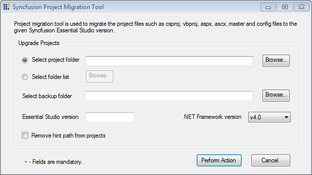

::: {style="DISPLAY: none"}
{#d2h_url_template}{#d2h_package_url style="WIDTH: 0px; DISPLAY: none; HEIGHT: 0px"}
:::

::::: {#nsbanner .d2h_main_nsbanner style="BORDER-BOTTOM: #999999 1px solid; POSITION: relative; PADDING-BOTTOM: 0px; BACKGROUND-COLOR: transparent; PADDING-LEFT: 0px; PADDING-RIGHT: 0px; DISPLAY: none; BORDER-TOP: #999999 1px solid; PADDING-TOP: 0px; LEFT: 0px"}
:::: {#TitleRow .d2h_main_titlerow style="PADDING-BOTTOM: 4px; BACKGROUND-COLOR: transparent; PADDING-LEFT: 22px; WIDTH: 100%; PADDING-RIGHT: 10px; DISPLAY: none; PADDING-TOP: 4px"}
::: {#ienav .d2h_main_ienav style="DISPLAY: none"}
{#D2HPrevious .D2HPreviousEnabled}  {#D2HNext .D2HNextEnabled}
:::
::::
:::::

::::: {#nstext .d2h_main_nstext style="PADDING-BOTTOM: 10px; BACKGROUND-COLOR: transparent; PADDING-LEFT: 22px; PADDING-RIGHT: 10px; HEIGHT: 100%; OVERFLOW: auto; PADDING-TOP: 5px" hasuserbackground="true" valign="bottom"}
::: {#d2h_breadcrumbs .d2h_breadcrumbs}
[Essential Studio User Guide Documentation](ms-xhelp:///?Id=12457748-09e3-4d74-a240-8e049cedf030){.d2h_breadcrumbsNormal}[ \> ]{.d2h_breadcrumbsLinkSeparator}[Essential Common](ms-xhelp:///?Id=2bfe10b6-fac1-4f91-a173-04db314f10c3){.d2h_breadcrumbsNormal}[ \> ]{.d2h_breadcrumbsLinkSeparator}[Other Utilities](ms-xhelp:///?Id=a8cc7430-cdfc-4de3-a351-6b323ce09ef1){.d2h_breadcrumbsNormal}
:::

## Project Migration {#project-migration style="tab-stops: 0pt"}

Project migration tool enables you to migrate the project files to the given Syncfusion Essential Studio Version. 

The following steps illustrate how to migrate a project. 

1.   Click **Start \> All Program \> Syncfusion \> Essential Studio x.x.x.x \> Tools \>** **Project migration \> Syncfusion Project Migration.**

 

{border="0"}

Figure 132: Syncfusion Project Migration

 

2.   Select the required project to be upgraded in the **Select project folder field**.

::: {style="BORDER-BOTTOM: windowtext 1pt solid; BORDER-LEFT: medium none; PADDING-BOTTOM: 1pt; MARGIN-TOP: 9pt; PADDING-LEFT: 0pt; PADDING-RIGHT: 0pt; MARGIN-BOTTOM: 9pt; BORDER-TOP: windowtext 1pt solid; BORDER-RIGHT: medium none; PADDING-TOP: 1pt"}
{border="0"}Note: You can also select multiple projects using the Select folder list option.
:::

3.   Select a folder to store a backup in the **Select backup folder** field.

4.   Enter the Essential Studio version number in the **Essential Studio version** field.(Ex:10.1.0.44)

5.   Select the required .NET version from the **.NET Framework version** drop-down.

6.   Select the **Remove** **hint path from project** check box, if you want to remove the hint from the project.

7.   Click **Preform Action**. The utility will upgrade the selected projects to the newer versions.

 

 

[]{#related-topics}
:::::
