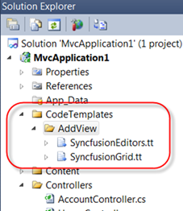
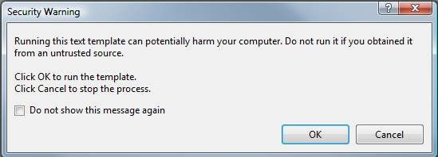
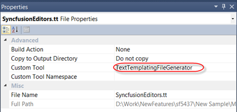
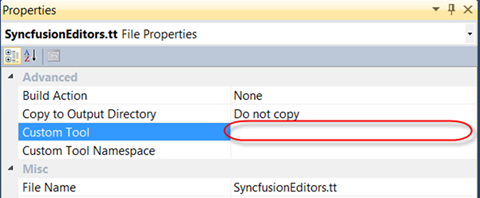

::: {style="DISPLAY: none"}
{#d2h_url_template}{#d2h_package_url style="WIDTH: 0px; DISPLAY: none; HEIGHT: 0px"}
:::

:::: {.d2h_secondary_topic style="PADDING-BOTTOM: 10pt; MARGIN: 0pt; PADDING-LEFT: 0pt; PADDING-RIGHT: 0pt; PADDING-TOP: 0pt"}
#### Project Reference {#project-reference style="tab-stops: 0pt"}

 

To place T4 templates by per-project basis:

 

1.   Create a folder named 'CodeTemplates' and then create a folder named  'AddView' under this. Paste the Custom Syncfusion T4 Templates to this folder and include the files in the root of your project, which helps to create the templates in the above location. Then customize the templates on a per-project basis. The following image illustrates this:

 

{border="0"}

Figure 18: Including CodeTemplates

 

::: {style="BORDER-BOTTOM: windowtext 1pt solid; BORDER-LEFT: medium none; PADDING-BOTTOM: 1pt; MARGIN-TOP: 9pt; PADDING-LEFT: 0pt; PADDING-RIGHT: 0pt; MARGIN-BOTTOM: 9pt; BORDER-TOP: windowtext 1pt solid; BORDER-RIGHT: medium none; PADDING-TOP: 1pt"}
{border="0"} Note: When you copy the above folder (any time you add a T4 template(.tt)  file) into the project, you will see warnings as follows:

 
:::

{border="0"}

Figure 19: Template Execution Warning

 

2.   Click **Cancel** so that you don't run the T4 template (if you are adding multiple .tt files, you have to click Cancel every time you get the Template Execution Warning window.). 

3.   As soon as the project sees a .tt file, a property on the file called **CustomTool** will get set to TextTemplatingFileGenerator.  This tells Visual Studio to use the default T4 host to execute the template and create a new file (nested underneath the template) based on the template. The following image illustrates this:

 

{border="0"}

Figure 20: Custom Tool Property

[]{style="FONT-FAMILY: 'Times New Roman','serif'; FONT-SIZE: 12pt"} 

4.   Empty the text for **Custom Tool** Property and build the project as shown in the following image.

[]{style="FONT-FAMILY: 'Times New Roman','serif'; FONT-SIZE: 12pt"} 

{border="0"}

Figure 21: Setting empty text in Custom Tool property

**[]{style="FONT-FAMILY: 'Myriad Pro','sans-serif'"}** 

[]{#related-topics}
::::
