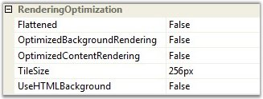
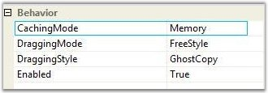
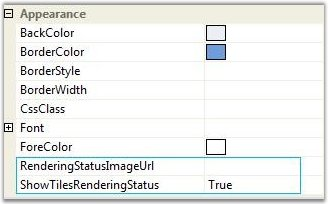
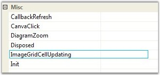

::: {style="DISPLAY: none"}
{#d2h_url_template}{#d2h_package_url style="WIDTH: 0px; DISPLAY: none; HEIGHT: 0px"}
:::

::::: {#nsbanner .d2h_main_nsbanner style="BORDER-BOTTOM: #999999 1px solid; POSITION: relative; PADDING-BOTTOM: 0px; BACKGROUND-COLOR: transparent; PADDING-LEFT: 0px; PADDING-RIGHT: 0px; DISPLAY: none; BORDER-TOP: #999999 1px solid; PADDING-TOP: 0px; LEFT: 0px"}
:::: {#TitleRow .d2h_main_titlerow style="PADDING-BOTTOM: 4px; BACKGROUND-COLOR: transparent; PADDING-LEFT: 22px; WIDTH: 100%; PADDING-RIGHT: 10px; DISPLAY: none; PADDING-TOP: 4px"}
::: {#ienav .d2h_main_ienav style="DISPLAY: none"}
{#D2HPrevious .D2HPreviousEnabled}  {#D2HNext .D2HNextEnabled}
:::
::::
:::::

::::: {#nstext .d2h_main_nstext style="PADDING-BOTTOM: 10px; BACKGROUND-COLOR: transparent; PADDING-LEFT: 22px; PADDING-RIGHT: 10px; HEIGHT: 100%; OVERFLOW: auto; PADDING-TOP: 5px" hasuserbackground="true" valign="bottom"}
::: {#d2h_breadcrumbs .d2h_breadcrumbs}
[Essential Studio User Guide Documentation](ms-xhelp:///?Id=12457748-09e3-4d74-a240-8e049cedf030){.d2h_breadcrumbsNormal}[ \> ]{.d2h_breadcrumbsLinkSeparator}[User Interface Edition](ms-xhelp:///?Id=c29296b7-531c-413b-a0ec-488ca1f7f669){.d2h_breadcrumbsNormal}[ \> ]{.d2h_breadcrumbsLinkSeparator}[Essential ASP.NET](ms-xhelp:///?Id=25c35330-c127-4dad-9a92-ed79dc7261a6){.d2h_breadcrumbsNormal}[ \> ]{.d2h_breadcrumbsLinkSeparator}[Essential Diagram]{.d2h_breadcrumbsContentsOnly}[ \> ]{.d2h_breadcrumbsLinkSeparator}[Concepts and Features](ms-xhelp:///?Id=f9aa55fb-f8cf-43da-a8be-de231dc0d949){.d2h_breadcrumbsNormal}[ \> ]{.d2h_breadcrumbsLinkSeparator}[Optimization](ms-xhelp:///?Id=b87d4bc7-af66-4e6f-81ff-c63c4bc639b4){.d2h_breadcrumbsNormal}
:::

### [     ]{style="COLOR: windowtext; TEXT-DECORATION: none; text-underline: none"}Properties and Events {#properties-and-events style="tab-stops: 0pt"}

[]{style="FONT-FAMILY: 'Trebuchet MS','sans-serif'; COLOR: #15428b; FONT-SIZE: 9pt"} 

There are eight properties and one event for manipulating the optimization modes.

[]{style="FONT-FAMILY: 'Trebuchet MS','sans-serif'; COLOR: #15428b; FONT-SIZE: 9pt"} 

[·      ]{style="FONT-FAMILY: Symbol"}Properties in RenderingOptimization Section

[]{style="FONT-FAMILY: 'Trebuchet MS','sans-serif'; COLOR: #15428b; FONT-SIZE: 9pt"} 

{border="0"}

[]{style="FONT-FAMILY: 'Trebuchet MS','sans-serif'; COLOR: #15428b; FONT-SIZE: 9pt"} 

Figure 32: Rendering Optimization

[]{style="FONT-FAMILY: 'Trebuchet MS','sans-serif'; COLOR: #15428b; FONT-SIZE: 9pt"} 

[·      ]{style="FONT-FAMILY: Symbol"}Property in Behavior Section

[]{style="FONT-FAMILY: 'Trebuchet MS','sans-serif'; COLOR: #15428b; FONT-SIZE: 9pt"} 

{border="0"}

[]{style="FONT-FAMILY: 'Trebuchet MS','sans-serif'; COLOR: #15428b; FONT-SIZE: 9pt"} 

 Figure 33: Behavior Section

[]{style="FONT-FAMILY: 'Trebuchet MS','sans-serif'; COLOR: #15428b; FONT-SIZE: 9pt"} 

[·      ]{style="FONT-FAMILY: Symbol"}Properties in Appearance Section

**[]{style="FONT-FAMILY: 'Trebuchet MS','sans-serif'; COLOR: #15428b; FONT-SIZE: 9pt"}** 

{border="0"}

[]{style="FONT-FAMILY: 'Trebuchet MS','sans-serif'; COLOR: #15428b; FONT-SIZE: 9pt"} 

Figure 34: Appearance Section

[]{style="FONT-FAMILY: 'Trebuchet MS','sans-serif'; COLOR: #15428b; FONT-SIZE: 9pt"} 

[·      ]{style="FONT-FAMILY: Symbol"}Event in Misc Section

**[]{style="FONT-FAMILY: 'Trebuchet MS','sans-serif'; COLOR: #15428b; FONT-SIZE: 9pt"}** 

{border="0"}

[]{style="FONT-FAMILY: 'Trebuchet MS','sans-serif'; COLOR: #15428b; FONT-SIZE: 9pt"} 

Figure 35: Misc Section

[]{style="FONT-FAMILY: 'Trebuchet MS','sans-serif'; COLOR: #15428b; FONT-SIZE: 9pt"} 

Properties

[]{style="FONT-FAMILY: 'Trebuchet MS','sans-serif'; COLOR: #15428b; FONT-SIZE: 9pt"} 

::: {align="center"}
+------------------------------+-------------------------------------------------------------------------------------+-----------------------+
|                              |                                                                                     |                       |
|                              |                                                                                     |                       |
| Property                     | Description                                                                         | Default Value         |
+------------------------------+-------------------------------------------------------------------------------------+-----------------------+
| Flattened                    | Turn on or off flattened mode.                                                      | False                 |
+------------------------------+-------------------------------------------------------------------------------------+-----------------------+
| OptimizedBackgroundRendering | Turn on or off OptimizedBackgroundRendering mode.                                   | False                 |
+------------------------------+-------------------------------------------------------------------------------------+-----------------------+
| OptimizedContentRendering    | Turn on or off OptimizedContentRendering mode.                                      | False                 |
+------------------------------+-------------------------------------------------------------------------------------+-----------------------+
| TilesSize                    | Sets or gets tile size in OptimizedBackgroundRendering mode.                        | 256px                 |
+------------------------------+-------------------------------------------------------------------------------------+-----------------------+
| UseHTMLBackground            | Turn on or off background optimization via HTML element.                            | False                 |
+------------------------------+-------------------------------------------------------------------------------------+-----------------------+
| CachingMode                  | Sets or gets image caching mode in OptimizedBackgroundRendering mode.               | Memory                |
+------------------------------+-------------------------------------------------------------------------------------+-----------------------+
| ShowTilesRenderingStatus     | Turn on or off showing rendering status image in OptimizedBackgroundRendering mode. | True                  |
+------------------------------+-------------------------------------------------------------------------------------+-----------------------+
| RenderingStatusImageUrl      | Sets or gets url for rendering status image.                                        | Empty                 |
+------------------------------+-------------------------------------------------------------------------------------+-----------------------+
:::

[]{style="FONT-FAMILY: 'Trebuchet MS','sans-serif'; COLOR: #15428b; FONT-SIZE: 9pt"} 

**[]{style="FONT-FAMILY: 'Trebuchet MS','sans-serif'; COLOR: #15428b"}** 

Events

**[]{style="FONT-FAMILY: 'Trebuchet MS','sans-serif'; COLOR: #15428b; FONT-SIZE: 9pt"}** 

[ImageGridCellUpdating]{.UGHyperlink} event is raised when the DiagramWebControl needs a new image in the \"OptimizedBackgroundRendering\" mode (CachingMode set to \"Virtual\").

[]{style="FONT-FAMILY: 'Trebuchet MS','sans-serif'; COLOR: #15428b; FONT-SIZE: 9pt"} 

See Also

[]{style="FONT-FAMILY: 'Trebuchet MS','sans-serif'; COLOR: #15428b; FONT-SIZE: 9pt"} 

[Optimization]{.UGHyperlink}[, ]{.UGHyperlink}[Optimized Background Rendering Mode]{.UGHyperlink}[, ]{.UGHyperlink}[Optimized Content Rendering Mode]{.UGHyperlink}[, ]{.UGHyperlink}[Flattened Mode]{.UGHyperlink}[, ]{.UGHyperlink}[Diagram Optimization via HTML Elements]{.UGHyperlink}[, ]{.UGHyperlink}[Diagram Caching Modes]{.UGHyperlink}[, ]{.UGHyperlink}[Virtual Caching Type and Image Grid Cell Updating Event]{.UGHyperlink}[, ]{.UGHyperlink}[Optimization Customization]{.UGHyperlink}[]{.UGHyperlink}

[]{#related-topics}
:::::
