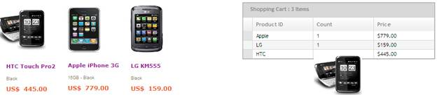
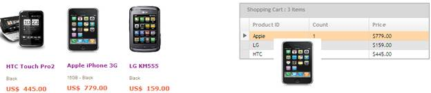
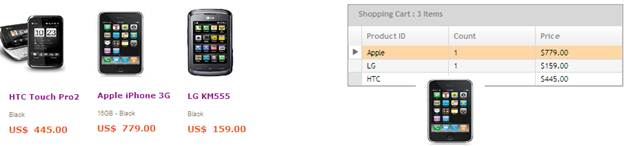
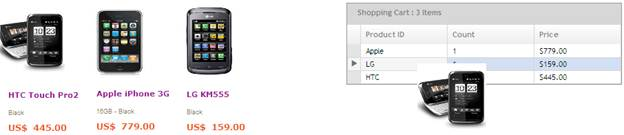

::: {style="DISPLAY: none"}
{#d2h_url_template}{#d2h_package_url style="WIDTH: 0px; DISPLAY: none; HEIGHT: 0px"}
:::

::: {.d2h_secondary_topic style="PADDING-BOTTOM: 10pt; MARGIN: 0pt; PADDING-LEFT: 0pt; PADDING-RIGHT: 0pt; PADDING-TOP: 0pt"}
#### Properties Explanation {#properties-explanation style="tab-stops: 0pt"}

 

**[EnableSelectionOnDragging]{style="COLOR: black"}:** Type: Boolean (Dependency on[ ]{style="COLOR: #2b91af"}**Droppable** property)

This property is set if a row needs to be selected while a draggable element is being dragged on your **GridRow**. This happens only if no row is already selected.

The following screenshot explains the **EnableSelectionOnDragging**.

When **EnableSelectionOnDragging** is **True**:

 

+-----------------------------------------------------------------------------------------------------------------------------------------------------------------------------------------------------+
| [GridPropertiesModel]{style="FONT-FAMILY: 'Courier New'; COLOR: #2b91af"}[ model = [new]{style="COLOR: blue"} [GridPropertiesModel]{style="COLOR: #2b91af"}();]{style="FONT-FAMILY: 'Courier New'"} |
|                                                                                                                                                                                                     |
| [  model.]{style="FONT-FAMILY: 'Courier New'"}[ EnableSelectionOnDragging ]{style="FONT-FAMILY: 'Courier New'; COLOR: black"}[=[true]{style="COLOR: #0070c0"};]{style="FONT-FAMILY: 'Courier New'"} |
+-----------------------------------------------------------------------------------------------------------------------------------------------------------------------------------------------------+

[]{style="FONT-FAMILY: 'Courier New'"} 

{border="0"}

Figure 242: EnableSelectionOnDragging is True

 

When **EnableSelectionOnDragging** is **False**:

 

+------------------------------------------------------------------------------------------------------------------------------------------------------------------------------------------------------+
| [  [GridPropertiesModel]{style="COLOR: #2b91af"} model = [new]{style="COLOR: blue"} [GridPropertiesModel]{style="COLOR: #2b91af"}();]{style="FONT-FAMILY: 'Courier New'"}                            |
|                                                                                                                                                                                                      |
| [  model.]{style="FONT-FAMILY: 'Courier New'"}[ EnableSelectionOnDragging ]{style="FONT-FAMILY: 'Courier New'; COLOR: black"}[=[false]{style="COLOR: #0070c0"};]{style="FONT-FAMILY: 'Courier New'"} |
+------------------------------------------------------------------------------------------------------------------------------------------------------------------------------------------------------+

 

 

{border="0"}

Figure 243: EnableSelectionOnDragging is False

 

 

**[EnableHighlighting]{style="COLOR: black"}:** Type: Boolean (Dependency on[ ]{style="COLOR: #2b91af"}**EnableSelectionOnDragging** property)

This property is set if a row (the current row accepting the droppable item) needs to be highlighted while draggable element is dragging on your **GridRow**.

Following screenshot explains the **[EnableHighlighting]{style="COLOR: black"}**.

When **[EnableHighlighting]{style="COLOR: black"}** is **True**:

+-----------------------------------------------------------------------------------------------------------------------------------------------------------------------------------------------------+
| [GridPropertiesModel]{style="FONT-FAMILY: 'Courier New'; COLOR: #2b91af"}[ model = [new]{style="COLOR: blue"} [GridPropertiesModel]{style="COLOR: #2b91af"}();]{style="FONT-FAMILY: 'Courier New'"} |
|                                                                                                                                                                                                     |
| [  model.]{style="FONT-FAMILY: 'Courier New'"}[EnableHighlighting]{style="FONT-FAMILY: 'Courier New'; COLOR: black"}[ =[true]{style="COLOR: #0070c0"};]{style="FONT-FAMILY: 'Courier New'"}         |
+-----------------------------------------------------------------------------------------------------------------------------------------------------------------------------------------------------+

[]{style="FONT-FAMILY: 'Courier New'"} 

Case 1: If Now row is already selected.

In this screenshot, you can understand that the current **Dragging** row is selected and also denotes that highlighted row is ready to accept the drop.

 

 

{border="0"}

Figure 244: Dragging Row is Selected

 

Case 2: If any row is already selected

In this case, on mouse move the grid always highlights the selected row. It denotes that, in this case, the selected row is always ready to accept the drop.

 

{border="0"}

Figure 245: Selected Row is Highlighted

 

When **EnableHighlighting** is **False**:

+-----------------------------------------------------------------------------------------------------------------------------------------------------------------------------------------------------+
| [GridPropertiesModel]{style="FONT-FAMILY: 'Courier New'; COLOR: #2b91af"}[ model = [new]{style="COLOR: blue"} [GridPropertiesModel]{style="COLOR: #2b91af"}();]{style="FONT-FAMILY: 'Courier New'"} |
|                                                                                                                                                                                                     |
| [  model.]{style="FONT-FAMILY: 'Courier New'"}[EnableHighlighting]{style="FONT-FAMILY: 'Courier New'; COLOR: black"}[ =[false]{style="COLOR: #0070c0"};]{style="FONT-FAMILY: 'Courier New'"}        |
+-----------------------------------------------------------------------------------------------------------------------------------------------------------------------------------------------------+

[]{style="FONT-FAMILY: 'Courier New'"} 

In this case selected row is not highlighting.

 

{border="0"}

Figure 246: Selected Row is Not Highlighted

[]{#related-topics}
:::
