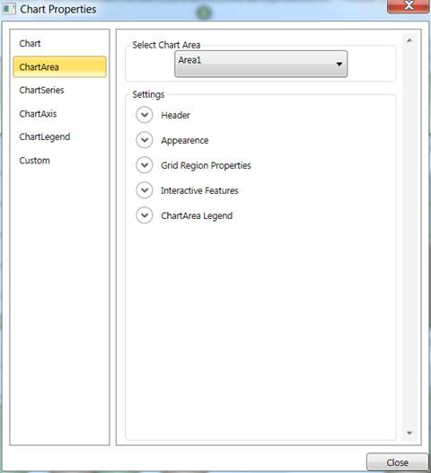
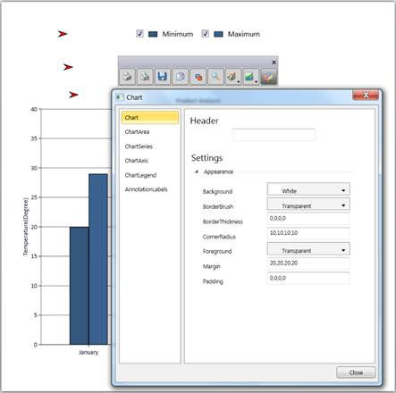

::: {style="DISPLAY: none"}
{#d2h_url_template}{#d2h_package_url style="WIDTH: 0px; DISPLAY: none; HEIGHT: 0px"}
:::

::::::: {.d2h_secondary_topic style="PADDING-BOTTOM: 10pt; MARGIN: 0pt; PADDING-LEFT: 0pt; PADDING-RIGHT: 0pt; PADDING-TOP: 0pt"}
##### Property Dialog for Chart {#property-dialog-for-chart style="tab-stops: 0pt"}

The property dialog or property window lets you to modify the values of properties of the Chart control at run time. The property dialog helps you to accurately modify the look and feel of the control.

The property dialog has tabbed structure. There are five tabs available by default, namely Chart, ChartArea, ChartSeries, ChartAxis and ChartLegend. You can also add custom tabs to property window, which would help you to access the properties that are not available in these default tabs (For example, you can add custom tab which would modify the Chart Annotation points).

The property window has [[localization support]{.UGHyperlink}](http://help.syncfusion.com/ug_84/User%20Interface/WPF/Chart/default.htm?turl=localizationsupport.htm). The properties and their options can be viewed in local languages just by adding .resx file with local string for corresponding key values in the application.

 

::: {style="BORDER-BOTTOM: windowtext 1pt solid; BORDER-LEFT: medium none; PADDING-BOTTOM: 1pt; MARGIN-TOP: 9pt; PADDING-LEFT: 0pt; PADDING-RIGHT: 0pt; MARGIN-BOTTOM: 9pt; BORDER-TOP: windowtext 1pt solid; BORDER-RIGHT: medium none; PADDING-TOP: 1pt"}
Note: Any changes done in the property window will directly affect the Chart control from Essential studio version 9.1 onwards whereas earlier versions have a preview chart in the property window to view the modifications.
:::

 

Use Case Scenarios

[·      ]{style="FONT-FAMILY: Symbol"}When the Chart control is used in an application and deployed, the end user or client can customize the look and feel of the Chart at run time. End user can set their own brushes, headers for Chart, Annotation Labels of Chart and etc. using the Chart property window.

[·      ]{style="FONT-FAMILY: Symbol"}If you need to change the Annotation labels of the Chart Control at run time, then you can add a custom tab, in which you can define controls to change the Chart Annotation label's properties. The property window will have this addition tab added to it and hence you can modify the Annotation labels of Chart at run time.

 

Tables for Properties, Methods, and Events

Properties

*[Table ]{style="FONT-SIZE: 9pt"}[167]{style="FONT-SIZE: 9pt"}[: Property Table]{style="FONT-SIZE: 9pt"}*

::: {align="center"}
  -------------------- ------------------------------------------------------------------------------ --------------------- ------------------- -----------------
  Property             Description                                                                    Type                  Data Type           Reference links
  PropertyWindowTabs   Represents the collection of tabs that are displayed in the property window.   Dependency property   TabItemCollection   NA
  -------------------- ------------------------------------------------------------------------------ --------------------- ------------------- -----------------
:::

[]{style="FONT-FAMILY: 'Calibri','sans-serif'; COLOR: black"} 

Methods

*[Table ]{style="FONT-SIZE: 9pt"}[168]{style="FONT-SIZE: 9pt"}[: Method Table]{style="FONT-SIZE: 9pt"}*

::: {align="center"}
+---------------------+------------------------------------+-----------------------------------+-----------+-----------------+---------------------+
| **Method**          | **Description**                    | **Parameters**                    | **Type**  | **Return Type** | **Reference links** |
+---------------------+------------------------------------+-----------------------------------+-----------+-----------------+---------------------+
| ShowPropertyWindow  | Displays the Chart Property window | public void ShowPropertyDialog()  | N/A       | Void            | NA                  |
|                     |                                    |                                   |           |                 |                     |
|                     |                                    |                                   |           |                 |                     |
+---------------------+------------------------------------+-----------------------------------+-----------+-----------------+---------------------+
| ClosePropertyWindow | Hides the Chart Property window    | public void ClosePropertyDialog() | N/A       | Void            | NA                  |
|                     |                                    |                                   |           |                 |                     |
|                     |                                    |                                   |           |                 |                     |
+=====================+====================================+===================================+===========+=================+=====================+
:::

[]{style="FONT-FAMILY: 'Calibri','sans-serif'; COLOR: black"} 

Events

*[Table ]{style="FONT-SIZE: 9pt"}[169]{style="FONT-SIZE: 9pt"}[: Events Table]{style="FONT-SIZE: 9pt"}*

::: {align="center"}
+----------------------------+--------------------------------------------------------------------+---------------------------------------------------+--------------+---------------------+
| **Event**                  | **Description**                                                    | **Arguments**                                     | **Type**     | **Reference links** |
+----------------------------+--------------------------------------------------------------------+---------------------------------------------------+--------------+---------------------+
| ChartPropertyWindowOpening | The property is triggered before the property window is displayed. | ChartPropertyWindowCancelEventArgs e.             | Routed Event |                     |
|                            |                                                                    |                                                   |              |                     |
|                            | This event is cancellable.                                         | e.PropertyWindow gives the entire property window |              |                     |
+----------------------------+--------------------------------------------------------------------+---------------------------------------------------+--------------+---------------------+
| ChartPropertyWindowOpened  | The property is triggered after the property window is displayed.  | ChartPropertyWindowCancelEventArgs e.             | Routed Event |                     |
|                            |                                                                    |                                                   |              |                     |
|                            |                                                                    | e.PropertyWindow gives the entire property window |              |                     |
|                            |                                                                    |                                                   |              |                     |
|                            |                                                                    |                                                   |              |                     |
|                            |                                                                    |                                                   |              |                     |
|                            |                                                                    |                                                   |              |                     |
+----------------------------+--------------------------------------------------------------------+---------------------------------------------------+--------------+---------------------+
| ChartPropertyWindowClosing | The property is triggered before the property window is displayed. | ChartPropertyWindowCancelEventArgs e.             | Routed Event |                     |
|                            |                                                                    |                                                   |              |                     |
|                            | This event is cancellable.                                         | e.PropertyWindow gives the entire property window |              |                     |
|                            |                                                                    |                                                   |              |                     |
|                            |                                                                    |                                                   |              |                     |
+----------------------------+--------------------------------------------------------------------+---------------------------------------------------+--------------+---------------------+
| ChartPropertyWindowClosed  | The property is triggered before the property window is displayed. | ChartPropertyWindowCancelEventArgs e.             | Routed Event |                     |
|                            |                                                                    |                                                   |              |                     |
|                            |                                                                    | e.PropertyWindow gives the entire property window |              |                     |
|                            |                                                                    |                                                   |              |                     |
|                            |                                                                    |                                                   |              |                     |
+============================+====================================================================+===================================================+==============+=====================+
:::

[]{style="FONT-FAMILY: 'Calibri','sans-serif'; COLOR: black"}[]{style="COLOR: #c00000"} 

Sample Link

To run the UI WPF sample:

1.   Open Essential Studio Dashboard by selecting Start -\> Program -\> Syncfusion-\> Essential Studio \<\<Version Number\>\> -\> Dashboard.[]{style="FONT-FAMILY: 'Verdana','sans-serif'"}

2.   Select Run locally installed samples, from the WPF drop-down list on the User Interface pane.[]{style="FONT-FAMILY: 'Verdana','sans-serif'"}

3.   Select Chart in the sample browser.[]{style="FONT-FAMILY: 'Verdana','sans-serif'"}

4.   Select User Interaction -\> Property Dialog Demo on the Essential Chart pane and click the Run Sample button.[]{style="FONT-FAMILY: 'Verdana','sans-serif'"}

 

To open the sample project:

Go to the following sample location in your system: 

***"\<sample installation location\>\\Syncfusion\\EssentialStudio\\Version Number \\WPF\\Chart.WPF\\Samples\\3.5\\WindowsSamples\\User Interaction\\Property Dialog Demo"***

This location contains two sub folders CS and VB.  You can open the sample projects from the respective folders based on your application developing language.

            []{style="COLOR: #c00000"}

Adding Property Dialog to an Application

There are two ways to invoke the Property dialog. They are, using **Toolbar** and **ShowPropertyDialog**. The following section will brief these two options.

[]{style="COLOR: black"} 

Opening Property Dialog through code

[]{style="COLOR: black"} 

+-------------------------------------------------------------------------------------------------------------------------------+
| **[\[C#\]]{style="FONT-FAMILY: 'Courier New'"}**                                                                              |
|                                                                                                                               |
| []{style="FONT-FAMILY: Consolas; FONT-SIZE: 9.5pt"}                                                                           |
|                                                                                                                               |
| [Chart1.ShowPropertyDialog();]{style="FONT-FAMILY: 'Courier New'"}**[]{style="FONT-FAMILY: 'Courier New'; FONT-SIZE: 11pt"}** |
|                                                                                                                               |
|                                                                                                                               |
+-------------------------------------------------------------------------------------------------------------------------------+

 

{border="0"}

Figure 253: Chart Property Dialog

Using Toolbar

 

By clicking the Properties Tool Item in the Toolbar, the property settings dialog can be invoked.

 

{border="0"}

Figure 254: Chart Property Dialog opened through Toolbar

 

Adding custom tabs to property window of Chart

You can include a custom tab to the property window in your application easily by adding a tab to the **PropertyWindowTabs** property. The below code snippet will explain adding custom tab to the property window through XAML and in C#.

 

+-----------------------------------------------------------------------------------------------------------------------------------------------------------------------------------------------------------------------------------------------------------------------------------------------------------------------------------------------------------------------------------------------------------------------------------------------------------------------------------------------------------------------------------------------------------------------------------------------------------------------------------------------------------------------------------------------------------------------------------------------------------------+
| **[\[XAML\]]{style="FONT-FAMILY: 'Courier New'"}**                                                                                                                                                                                                                                                                                                                                                                                                                                                                                                                                                                                                                                                                                                              |
|                                                                                                                                                                                                                                                                                                                                                                                                                                                                                                                                                                                                                                                                                                                                                                 |
| [\<]{style="FONT-FAMILY: 'Courier New'; COLOR: blue"}[syncfusion]{style="FONT-FAMILY: 'Courier New'; COLOR: #a31515"}[:]{style="FONT-FAMILY: 'Courier New'; COLOR: blue"}[Chart]{style="FONT-FAMILY: 'Courier New'; COLOR: #a31515"}[ Margin]{style="FONT-FAMILY: 'Courier New'; COLOR: red"}[=\"20\"]{style="FONT-FAMILY: 'Courier New'; COLOR: blue"}[ Grid.Row]{style="FONT-FAMILY: 'Courier New'; COLOR: red"}[=\"1\"]{style="FONT-FAMILY: 'Courier New'; COLOR: blue"}[ Grid.Column]{style="FONT-FAMILY: 'Courier New'; COLOR: red"}[=\"0\"]{style="FONT-FAMILY: 'Courier New'; COLOR: blue"}[ Name]{style="FONT-FAMILY: 'Courier New'; COLOR: red"}[=\"Chart1\"\>]{style="FONT-FAMILY: 'Courier New'; COLOR: blue"}[]{style="FONT-FAMILY: 'Courier New'"} |
|                                                                                                                                                                                                                                                                                                                                                                                                                                                                                                                                                                                                                                                                                                                                                                 |
| [            ]{style="FONT-FAMILY: 'Courier New'; COLOR: #a31515"}[\<]{style="FONT-FAMILY: 'Courier New'; COLOR: blue"}[syncfusion]{style="FONT-FAMILY: 'Courier New'; COLOR: #a31515"}[:]{style="FONT-FAMILY: 'Courier New'; COLOR: blue"}[Chart.PropertyWindowTabs]{style="FONT-FAMILY: 'Courier New'; COLOR: #a31515"}[\>]{style="FONT-FAMILY: 'Courier New'; COLOR: blue"}[]{style="FONT-FAMILY: 'Courier New'"}                                                                                                                                                                                                                                                                                                                                            |
|                                                                                                                                                                                                                                                                                                                                                                                                                                                                                                                                                                                                                                                                                                                                                                 |
| [                ]{style="FONT-FAMILY: 'Courier New'; COLOR: #a31515"}[\<]{style="FONT-FAMILY: 'Courier New'; COLOR: blue"}[TabItem]{style="FONT-FAMILY: 'Courier New'; COLOR: #a31515"}[ Header]{style="FONT-FAMILY: 'Courier New'; COLOR: red"}[=\"AnnotationLabels\"\>]{style="FONT-FAMILY: 'Courier New'; COLOR: blue"}[]{style="FONT-FAMILY: 'Courier New'"}                                                                                                                                                                                                                                                                                                                                                                                               |
|                                                                                                                                                                                                                                                                                                                                                                                                                                                                                                                                                                                                                                                                                                                                                                 |
| [                    ]{style="FONT-FAMILY: 'Courier New'; COLOR: #a31515"}[\<]{style="FONT-FAMILY: 'Courier New'; COLOR: blue"}[TabItem.Content]{style="FONT-FAMILY: 'Courier New'; COLOR: #a31515"}[\>]{style="FONT-FAMILY: 'Courier New'; COLOR: blue"}[]{style="FONT-FAMILY: 'Courier New'"}                                                                                                                                                                                                                                                                                                                                                                                                                                                                 |
|                                                                                                                                                                                                                                                                                                                                                                                                                                                                                                                                                                                                                                                                                                                                                                 |
| [                    ]{style="FONT-FAMILY: 'Courier New'; COLOR: #a31515"}[\</]{style="FONT-FAMILY: 'Courier New'; COLOR: blue"}[TabItem.Content]{style="FONT-FAMILY: 'Courier New'; COLOR: #a31515"}[\>]{style="FONT-FAMILY: 'Courier New'; COLOR: blue"}[]{style="FONT-FAMILY: 'Courier New'"}                                                                                                                                                                                                                                                                                                                                                                                                                                                                |
|                                                                                                                                                                                                                                                                                                                                                                                                                                                                                                                                                                                                                                                                                                                                                                 |
| [                ]{style="FONT-FAMILY: 'Courier New'; COLOR: #a31515"}[\</]{style="FONT-FAMILY: 'Courier New'; COLOR: blue"}[TabItem]{style="FONT-FAMILY: 'Courier New'; COLOR: #a31515"}[\>]{style="FONT-FAMILY: 'Courier New'; COLOR: blue"}[]{style="FONT-FAMILY: 'Courier New'"}                                                                                                                                                                                                                                                                                                                                                                                                                                                                            |
|                                                                                                                                                                                                                                                                                                                                                                                                                                                                                                                                                                                                                                                                                                                                                                 |
| [            ]{style="FONT-FAMILY: 'Courier New'; COLOR: #a31515"}[\</]{style="FONT-FAMILY: 'Courier New'; COLOR: blue"}[syncfusion]{style="FONT-FAMILY: 'Courier New'; COLOR: #a31515"}[:]{style="FONT-FAMILY: 'Courier New'; COLOR: blue"}[Chart.PropertyWindowTabs]{style="FONT-FAMILY: 'Courier New'; COLOR: #a31515"}[\>]{style="FONT-FAMILY: 'Courier New'; COLOR: blue"}[]{style="FONT-FAMILY: 'Courier New'"}                                                                                                                                                                                                                                                                                                                                           |
|                                                                                                                                                                                                                                                                                                                                                                                                                                                                                                                                                                                                                                                                                                                                                                 |
| [\</]{style="FONT-FAMILY: 'Courier New'; COLOR: blue"}[syncfusion]{style="FONT-FAMILY: 'Courier New'; COLOR: #a31515"}[:]{style="FONT-FAMILY: 'Courier New'; COLOR: blue"}[Chart]{style="FONT-FAMILY: 'Courier New'; COLOR: #a31515"}[\>]{style="FONT-FAMILY: 'Courier New'; COLOR: blue"}                                                                                                                                                                                                                                                                                                                                                                                                                                                                      |
|                                                                                                                                                                                                                                                                                                                                                                                                                                                                                                                                                                                                                                                                                                                                                                 |
|                                                                                                                                                                                                                                                                                                                                                                                                                                                                                                                                                                                                                                                                                                                                                                 |
+-----------------------------------------------------------------------------------------------------------------------------------------------------------------------------------------------------------------------------------------------------------------------------------------------------------------------------------------------------------------------------------------------------------------------------------------------------------------------------------------------------------------------------------------------------------------------------------------------------------------------------------------------------------------------------------------------------------------------------------------------------------------+

 

+---------------------------------------------------------------------------------------------------------------------------------------------------------------------------------+
| **[\[C#\]]{style="FONT-FAMILY: 'Courier New'"}**                                                                                                                                |
|                                                                                                                                                                                 |
| [TabItem]{style="FONT-FAMILY: 'Courier New'; COLOR: #2b91af"}[ CustomTab = [new]{style="COLOR: blue"} [TabItem]{style="COLOR: #2b91af"}();]{style="FONT-FAMILY: 'Courier New'"} |
|                                                                                                                                                                                 |
| [Chart1.PropertyWindowTabs.Add(CustomTab);]{style="FONT-FAMILY: 'Courier New'"}                                                                                                 |
|                                                                                                                                                                                 |
|                                                                                                                                                                                 |
+---------------------------------------------------------------------------------------------------------------------------------------------------------------------------------+

 

Listen to opening and closing of the property window

You can listen to opening of the property window by adding a delegate method to the event ChartPropertyWindowOpening. Similarly, you can listen to opening of the property window by adding a delegate method to the event ChartPropertyWindowClosing.

 

+-----------------------------------------------------------------------------------------------------------------------------------------------------------------------------------------------------------+
| **[\[C#\]]{style="FONT-FAMILY: 'Courier New'"}**                                                                                                                                                          |
|                                                                                                                                                                                                           |
| [Chart1.ChartPropertyWindowOpening += [new]{style="COLOR: blue"} [ChartPropertyWindowCancelEventHandler]{style="COLOR: #2b91af"}(Chart1_ChartPropertyWindowOpening);]{style="FONT-FAMILY: 'Courier New'"} |
|                                                                                                                                                                                                           |
| []{style="FONT-FAMILY: 'Courier New'"}                                                                                                                                                                    |
|                                                                                                                                                                                                           |
| [Chart1.ChartPropertyWindowClosing += [new]{style="COLOR: blue"} [ChartPropertyWindowCancelEventHandler]{style="COLOR: #2b91af"}(Chart1_ChartPropertyWindowClosing);]{style="FONT-FAMILY: 'Courier New'"} |
|                                                                                                                                                                                                           |
|                                                                                                                                                                                                           |
+-----------------------------------------------------------------------------------------------------------------------------------------------------------------------------------------------------------+

 

+-------------------------------------------------------------------------------------------------------------------------------------------------------------------------------------------------------------------------------------------------------------------------------------------------------------------------------------------------------------------------------------------------------------------------------------------------------------------------------------------------------------------------------------------------------------------------------------------------------------------------------------------------------------------------------------------------------------------------------------------------------------------------------------------------------------------------------------------------------------------------------------------------------------------------------------------------------------------------------------------------------------------------------------------------------------------------+
| **[\[XAML\]]{style="FONT-FAMILY: 'Courier New'"}**                                                                                                                                                                                                                                                                                                                                                                                                                                                                                                                                                                                                                                                                                                                                                                                                                                                                                                                                                                                                                      |
|                                                                                                                                                                                                                                                                                                                                                                                                                                                                                                                                                                                                                                                                                                                                                                                                                                                                                                                                                                                                                                                                         |
| [\<]{style="FONT-FAMILY: 'Courier New'; COLOR: blue"}[syncfusion]{style="FONT-FAMILY: 'Courier New'; COLOR: #a31515"}[:]{style="FONT-FAMILY: 'Courier New'; COLOR: blue"}[Chart]{style="FONT-FAMILY: 'Courier New'; COLOR: #a31515"}[ Margin]{style="FONT-FAMILY: 'Courier New'; COLOR: red"}[=\"20\"]{style="FONT-FAMILY: 'Courier New'; COLOR: blue"}[ Grid.Row]{style="FONT-FAMILY: 'Courier New'; COLOR: red"}[=\"1\"]{style="FONT-FAMILY: 'Courier New'; COLOR: blue"}[ Grid.Column]{style="FONT-FAMILY: 'Courier New'; COLOR: red"}[=\"0\"]{style="FONT-FAMILY: 'Courier New'; COLOR: blue"}[ Name]{style="FONT-FAMILY: 'Courier New'; COLOR: red"}[=\"Chart1\"]{style="FONT-FAMILY: 'Courier New'; COLOR: blue"}[ ChartPropertyWindowOpening]{style="FONT-FAMILY: 'Courier New'; COLOR: red"}[=\"Chart1_ChartPropertyWindowOpening\"]{style="FONT-FAMILY: 'Courier New'; COLOR: blue"}[ ChartPropertyWindowClosing]{style="FONT-FAMILY: 'Courier New'; COLOR: red"}[=\"Chart1_ChartPropertyWindowClosing\" /\>]{style="FONT-FAMILY: 'Courier New'; COLOR: blue"} |
|                                                                                                                                                                                                                                                                                                                                                                                                                                                                                                                                                                                                                                                                                                                                                                                                                                                                                                                                                                                                                                                                         |
|                                                                                                                                                                                                                                                                                                                                                                                                                                                                                                                                                                                                                                                                                                                                                                                                                                                                                                                                                                                                                                                                         |
+-------------------------------------------------------------------------------------------------------------------------------------------------------------------------------------------------------------------------------------------------------------------------------------------------------------------------------------------------------------------------------------------------------------------------------------------------------------------------------------------------------------------------------------------------------------------------------------------------------------------------------------------------------------------------------------------------------------------------------------------------------------------------------------------------------------------------------------------------------------------------------------------------------------------------------------------------------------------------------------------------------------------------------------------------------------------------+

 

 

[]{#related-topics}
:::::::
