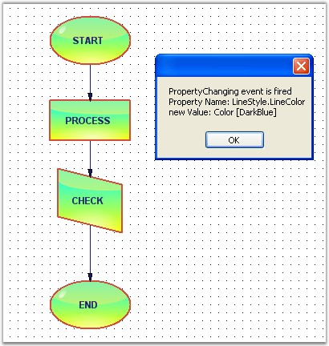

::: {style="DISPLAY: none"}
{#d2h_url_template}{#d2h_package_url style="WIDTH: 0px; DISPLAY: none; HEIGHT: 0px"}
:::

:::::: {.d2h_secondary_topic style="PADDING-BOTTOM: 10pt; MARGIN: 0pt; PADDING-LEFT: 0pt; PADDING-RIGHT: 0pt; PADDING-TOP: 0pt"}
#### Property Events {#property-events style="tab-stops: 0pt"}

[]{#p57}[]{style="FONT-FAMILY: 'Trebuchet MS','sans-serif'; COLOR: #15428b; FONT-SIZE: 9pt"} 

Each node has different properties (Name,Color,Size etc). The below events are handled when changing these properties.

 

Property Events are as follows.

[]{style="FONT-FAMILY: 'Trebuchet MS','sans-serif'; COLOR: #15428b; FONT-SIZE: 9pt"} 

::: {align="center"}
+-----------------------------------+------------------------------------------------------+
|                                   |                                                      |
|                                   |                                                      |
| DocumentEventSink                 | Description                                          |
+-----------------------------------+------------------------------------------------------+
| PropertyChanged                   | Triggered after the property of any node is changed. |
+-----------------------------------+------------------------------------------------------+
| PropertyChanging                  | Triggered when the property value is changed.        |
+-----------------------------------+------------------------------------------------------+
:::

[]{style="FONT-FAMILY: 'Trebuchet MS','sans-serif'; COLOR: #15428b; FONT-SIZE: 9pt"} 

Data can be retrieved or set using the following members.

[]{style="FONT-FAMILY: 'Trebuchet MS','sans-serif'; COLOR: #15428b; FONT-SIZE: 9pt"} 

::: {align="center"}
+-----------------------------------+------------------------------------------------------+
|                                   |                                                      |
|                                   |                                                      |
| PropertyChanging EventArgs Member | Description                                          |
+-----------------------------------+------------------------------------------------------+
| Cancel                            | Cancels the PropertyChanged event.                   |
+-----------------------------------+------------------------------------------------------+
| NewValue                          | Returns the new value assigned to the property.      |
+-----------------------------------+------------------------------------------------------+
| PropertyContainer                 | Returns the container for the property.              |
+-----------------------------------+------------------------------------------------------+
| PropertyName                      | Returns name of the property whose value is changed. |
+-----------------------------------+------------------------------------------------------+
:::

[]{style="FONT-FAMILY: 'Trebuchet MS','sans-serif'; COLOR: #15428b; FONT-SIZE: 9pt"} 

::: {align="center"}
+-----------------------------------+----------------------------------------------------------+
|                                   |                                                          |
|                                   |                                                          |
| PropertyChanged EventArgs Member  | Description                                              |
+-----------------------------------+----------------------------------------------------------+
| NodeAffected                      | Returns the name of the node whose property is changed.  |
+-----------------------------------+----------------------------------------------------------+
| PropertyName                      | Returns the name of the property whose value is changed. |
+-----------------------------------+----------------------------------------------------------+
:::

[]{style="FONT-FAMILY: 'Trebuchet MS','sans-serif'; COLOR: #15428b; FONT-SIZE: 9pt"} 

Programmatically the events are written as follows:

[]{style="FONT-FAMILY: 'Times New Roman','serif'; FONT-SIZE: 12pt"} 

+----------------------------------------------------------------------------------------------------------------------------------------------------------------------------------------------------------------------------------------------------------------------------------------------------------------------------------------------------------------------------+
| **[\[C#\]]{style="FONT-FAMILY: 'Courier New'; COLOR: black"}**                                                                                                                                                                                                                                                                                                             |
|                                                                                                                                                                                                                                                                                                                                                                            |
| **[]{style="FONT-FAMILY: 'Courier New'; COLOR: black"}**                                                                                                                                                                                                                                                                                                                   |
|                                                                                                                                                                                                                                                                                                                                                                            |
| [public]{style="FONT-FAMILY: 'Courier New'; COLOR: blue"}[ [void]{style="COLOR: blue"} Form1_Load([object]{style="COLOR: blue"} sender, [EventArgs]{style="COLOR: teal"} e)]{style="FONT-FAMILY: 'Courier New'"}                                                                                                                                                           |
|                                                                                                                                                                                                                                                                                                                                                                            |
| [{]{style="FONT-FAMILY: 'Courier New'"}                                                                                                                                                                                                                                                                                                                                    |
|                                                                                                                                                                                                                                                                                                                                                                            |
| [    ((DocumentEventSink)model1.EventSink).PropertyChanged += [new]{style="COLOR: blue"} Syncfusion.Windows.Forms.Diagram.PropertyChangedEventHandler]{style="FONT-FAMILY: 'Courier New'"}                                                                                                                                                                                 |
|                                                                                                                                                                                                                                                                                                                                                                            |
| [        (Form1_PropertyChanged);]{style="FONT-FAMILY: 'Courier New'"}                                                                                                                                                                                                                                                                                                     |
|                                                                                                                                                                                                                                                                                                                                                                            |
| [    ((DocumentEventSink)model1.EventSink).PropertyChanging += [new]{style="COLOR: blue"} [PropertyChangingEventHandler]{style="COLOR: teal"}(Form1_PropertyChanging);]{style="FONT-FAMILY: 'Courier New'"}                                                                                                                                                                |
|                                                                                                                                                                                                                                                                                                                                                                            |
| [}]{style="FONT-FAMILY: 'Courier New'"}                                                                                                                                                                                                                                                                                                                                    |
|                                                                                                                                                                                                                                                                                                                                                                            |
| [private]{style="FONT-FAMILY: 'Courier New'; COLOR: blue"}[ [void]{style="COLOR: blue"} Form1_PropertyChanged(Syncfusion.Windows.Forms.Diagram.PropertyChangedEventArgs evtArgs)]{style="FONT-FAMILY: 'Courier New'"}                                                                                                                                                      |
|                                                                                                                                                                                                                                                                                                                                                                            |
| [{]{style="FONT-FAMILY: 'Courier New'"}                                                                                                                                                                                                                                                                                                                                    |
|                                                                                                                                                                                                                                                                                                                                                                            |
| [    [MessageBox]{style="COLOR: teal"}.Show([\"PropertyChanged event is fired\"]{style="COLOR: maroon"} + [\"\\n\"]{style="COLOR: maroon"} + [\"Property Name: \"]{style="COLOR: maroon"} + evtArgs.PropertyName);]{style="FONT-FAMILY: 'Courier New'"}                                                                                                                    |
|                                                                                                                                                                                                                                                                                                                                                                            |
| [}]{style="FONT-FAMILY: 'Courier New'"}                                                                                                                                                                                                                                                                                                                                    |
|                                                                                                                                                                                                                                                                                                                                                                            |
| [private]{style="FONT-FAMILY: 'Courier New'; COLOR: blue"}[ [void]{style="COLOR: blue"} Form1_PropertyChanging(Syncfusion.Windows.Forms.Diagram.PropertyChangingEventArgs eprop)]{style="FONT-FAMILY: 'Courier New'"}                                                                                                                                                      |
|                                                                                                                                                                                                                                                                                                                                                                            |
| [{]{style="FONT-FAMILY: 'Courier New'"}                                                                                                                                                                                                                                                                                                                                    |
|                                                                                                                                                                                                                                                                                                                                                                            |
| [    [MessageBox]{style="COLOR: teal"}.Show([\"PropertyChanging event is fired\"]{style="COLOR: maroon"} + [\"\\n\"]{style="COLOR: maroon"} + [\"Property Name: \"]{style="COLOR: maroon"} + eprop.PropertyName + [\"\\n\"]{style="COLOR: maroon"} + [\"new                      Value: \"]{style="COLOR: maroon"} + eprop.NewValue);]{style="FONT-FAMILY: 'Courier New'"} |
|                                                                                                                                                                                                                                                                                                                                                                            |
| [}]{style="FONT-FAMILY: 'Courier New'"}                                                                                                                                                                                                                                                                                                                                    |
+----------------------------------------------------------------------------------------------------------------------------------------------------------------------------------------------------------------------------------------------------------------------------------------------------------------------------------------------------------------------------+

[]{style="FONT-FAMILY: 'Courier New'"} 

+-------------------------------------------------------------------------------------------------------------------------------------------------------------------------------------------------------------------------------------------------------------------------------------------------------------------------------------------+
| **[\[VB\]]{style="FONT-FAMILY: 'Courier New'; COLOR: black"}**                                                                                                                                                                                                                                                                            |
|                                                                                                                                                                                                                                                                                                                                           |
| []{style="FONT-FAMILY: 'Courier New'; COLOR: blue"}                                                                                                                                                                                                                                                                                       |
|                                                                                                                                                                                                                                                                                                                                           |
| [Public]{style="FONT-FAMILY: 'Courier New'; COLOR: blue"}[ [Sub]{style="COLOR: blue"} Form1_Load([ByVal]{style="COLOR: blue"} sender [As]{style="COLOR: blue"} [Object]{style="COLOR: blue"}, [ByVal]{style="COLOR: blue"} e [As]{style="COLOR: blue"} EventArgs)]{style="FONT-FAMILY: 'Courier New'"}                                    |
|                                                                                                                                                                                                                                                                                                                                           |
| [    [AddHandler]{style="COLOR: blue"} [DirectCast]{style="COLOR: blue"}(model1.EventSink, DocumentEventSink).PropertyChanged, [AddressOf]{style="COLOR: blue"} Form1_PropertyChanged]{style="FONT-FAMILY: 'Courier New'"}                                                                                                                |
|                                                                                                                                                                                                                                                                                                                                           |
| [    [AddHandler]{style="COLOR: blue"} [DirectCast]{style="COLOR: blue"}(model1.EventSink, DocumentEventSink).PropertyChanging, [AddressOf]{style="COLOR: blue"} Form1_PropertyChanging]{style="FONT-FAMILY: 'Courier New'"}                                                                                                              |
|                                                                                                                                                                                                                                                                                                                                           |
| [End]{style="FONT-FAMILY: 'Courier New'; COLOR: blue"}[ [Sub]{style="COLOR: blue"}]{style="FONT-FAMILY: 'Courier New'"}                                                                                                                                                                                                                   |
|                                                                                                                                                                                                                                                                                                                                           |
| [Private]{style="FONT-FAMILY: 'Courier New'; COLOR: blue"}[ [Sub]{style="COLOR: blue"} Form1_PropertyChanged([ByVal]{style="COLOR: blue"} evtArgs [As]{style="COLOR: blue"} Syncfusion.Windows.Forms.Diagram.PropertyChangedEventArgs)]{style="FONT-FAMILY: 'Courier New'"}                                                               |
|                                                                                                                                                                                                                                                                                                                                           |
| [    MessageBox.Show(([\"PropertyChanged event is fired\"]{style="COLOR: maroon"} & vbLf & [\"Property Name: \"]{style="COLOR: maroon"}) + evtArgs.PropertyName)]{style="FONT-FAMILY: 'Courier New'"}                                                                                                                                     |
|                                                                                                                                                                                                                                                                                                                                           |
| [End]{style="FONT-FAMILY: 'Courier New'; COLOR: blue"}[ [Sub]{style="COLOR: blue"}]{style="FONT-FAMILY: 'Courier New'"}                                                                                                                                                                                                                   |
|                                                                                                                                                                                                                                                                                                                                           |
| [Private]{style="FONT-FAMILY: 'Courier New'; COLOR: blue"}[ [Sub]{style="COLOR: blue"} Form1_PropertyChanging([ByVal]{style="COLOR: blue"} eprop [As]{style="COLOR: blue"} Syncfusion.Windows.Forms.Diagram.PropertyChangingEventArgs)]{style="FONT-FAMILY: 'Courier New'"}                                                               |
|                                                                                                                                                                                                                                                                                                                                           |
| [    MessageBox.Show((([\"PropertyChanging event is fired\"]{style="COLOR: maroon"} & vbLf & [\"Property Name: \"]{style="COLOR: maroon"}) + eprop.PropertyName & vbLf & [\"new \"]{style="COLOR: maroon"} & vbTab & vbTab & vbTab & vbTab & [\"Value: \"]{style="COLOR: maroon"}) + eprop.NewValue)]{style="FONT-FAMILY: 'Courier New'"} |
|                                                                                                                                                                                                                                                                                                                                           |
| [End]{style="FONT-FAMILY: 'Courier New'; COLOR: blue"}[ [Sub]{style="COLOR: blue"}]{style="FONT-FAMILY: 'Courier New'"}                                                                                                                                                                                                                   |
+-------------------------------------------------------------------------------------------------------------------------------------------------------------------------------------------------------------------------------------------------------------------------------------------------------------------------------------------+

[]{style="FONT-FAMILY: 'Trebuchet MS','sans-serif'; COLOR: #15428b; FONT-SIZE: 9pt"} 

Sample diagram is as follows:

**[]{style="FONT-FAMILY: 'Trebuchet MS','sans-serif'; COLOR: #15428b; FONT-SIZE: 9pt"}** 

{border="0"}

[]{style="FONT-FAMILY: 'Trebuchet MS','sans-serif'; COLOR: #15428b; FONT-SIZE: 9pt"} 

Figure 65: Property Changing Event

**[]{style="FONT-FAMILY: 'Trebuchet MS','sans-serif'; COLOR: #15428b; FONT-SIZE: 9pt"}** 

{border="0"}

[]{style="FONT-FAMILY: 'Trebuchet MS','sans-serif'; COLOR: #15428b; FONT-SIZE: 9pt"} 

Figure 66: Property Changed Event

[]{#p58} 

[]{#related-topics}
::::::
