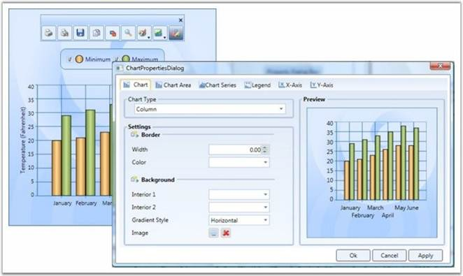
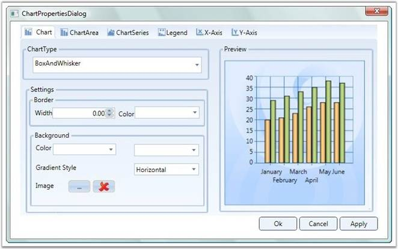
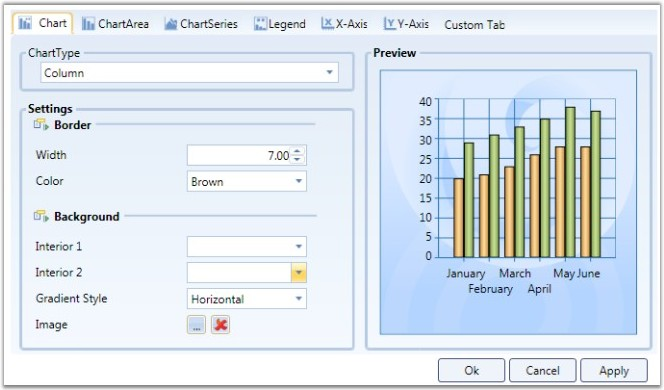
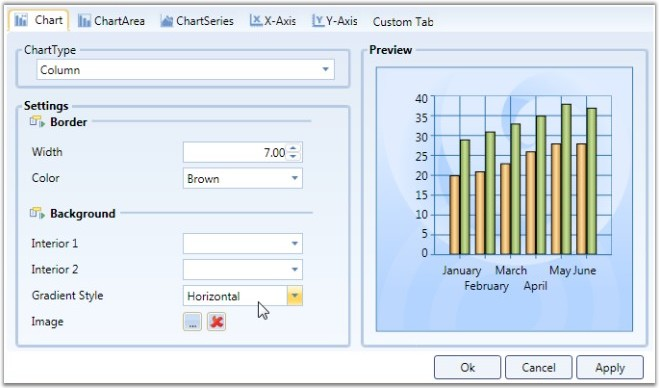

::: {style="DISPLAY: none"}
{#d2h_url_template}{#d2h_package_url style="WIDTH: 0px; DISPLAY: none; HEIGHT: 0px"}
:::

:::: {.d2h_secondary_topic style="PADDING-BOTTOM: 10pt; MARGIN: 0pt; PADDING-LEFT: 0pt; PADDING-RIGHT: 0pt; PADDING-TOP: 0pt"}
##### Property Settings Dialog {#property-settings-dialog style="tab-stops: 0pt"}

This topic provides an introduction to Property Settings Dialog. Property Settings Dialog lets you to change the properties of the chart during runtime.

 

This topic encapsulates the following details:

 

[·      ]{style="FONT-FAMILY: Symbol"}Property Settings Dialog

[·      ]{style="FONT-FAMILY: Symbol"}What are all the properties that can be set?

[·      ]{style="FONT-FAMILY: Symbol"}Advantages Of Property Settings Dialog

[·      ]{style="FONT-FAMILY: Symbol"}Special Features of Property Settings Dialog

[]{style="FONT-FAMILY: 'Trebuchet MS','sans-serif'; COLOR: #15428b; FONT-SIZE: 9pt"} 

Property Settings Dialog

Essential Chart for WPF provides the Property Settings Dialog, to change the properties of the chart during runtime. This is to provide the developer, the ability to change the chart properties without the using the code.

 

There are two ways to invoke this dialog. They are, Using Tool Bar and ShowPropertyDialog. The following section will brief these two options.

 

Using ToolBar

By clicking the **Properties** Tool Item in the Toolbar, the property settings dialog can be invoked.

 

{border="0"}

Figure 243: Properties Tool Item in the Toolbar clicked to open the Chart Properties Dialog Box

 

Using ShowPropertyDialog

The API, **Show Propert dialog**, helps you to invoke the property settings dialog[.]{style="COLOR: #4f81bd"}

[]{style="FONT-FAMILY: 'Trebuchet MS','sans-serif'; COLOR: #15428b"} 

+-----------------------------------------------------------------------------------------------------------------------------------------------------------------------------------------------------------------------------------------+
| **[\[C#\]]{style="FONT-FAMILY: 'Courier New'; COLOR: black"}**                                                                                                                                                                          |
|                                                                                                                                                                                                                                         |
| []{style="FONT-FAMILY: 'Courier New'; COLOR: blue"}                                                                                                                                                                                     |
|                                                                                                                                                                                                                                         |
| [// Invokes the property dialog box.]{style="FONT-FAMILY: 'Courier New'; COLOR: green"}                                                                                                                                                 |
|                                                                                                                                                                                                                                         |
| [private]{style="FONT-FAMILY: 'Courier New'; COLOR: blue"}[ [void]{style="COLOR: blue"} PropertyDialogbtn_Click([object]{style="COLOR: blue"} sender, [RoutedEventArgs]{style="COLOR: #2b91af"} e)]{style="FONT-FAMILY: 'Courier New'"} |
|                                                                                                                                                                                                                                         |
| [{]{style="FONT-FAMILY: 'Courier New'"}                                                                                                                                                                                                 |
|                                                                                                                                                                                                                                         |
| [     [if]{style="COLOR: blue"} (Chart1 != [null]{style="COLOR: blue"})]{style="FONT-FAMILY: 'Courier New'"}                                                                                                                            |
|                                                                                                                                                                                                                                         |
| [     {[                ]{style="COLOR: green"}]{style="FONT-FAMILY: 'Courier New'"}                                                                                                                                                    |
|                                                                                                                                                                                                                                         |
| [         Chart1.ShowPropertyDialog();]{style="FONT-FAMILY: 'Courier New'"}                                                                                                                                                             |
|                                                                                                                                                                                                                                         |
| [     }                      ]{style="FONT-FAMILY: 'Courier New'"}                                                                                                                                                                      |
|                                                                                                                                                                                                                                         |
| [}]{style="FONT-FAMILY: 'Courier New'"}                                                                                                                                                                                                 |
+-----------------------------------------------------------------------------------------------------------------------------------------------------------------------------------------------------------------------------------------+

[]{style="FONT-FAMILY: 'Trebuchet MS','sans-serif'; COLOR: #15428b"} 

+----------------------------------------------------------------------------------------------------------------------------------------------------------------------------------------------------------------------------------------------------------------------------------------------------------------------------+
| **[\[VB\]]{style="FONT-FAMILY: 'Courier New'; COLOR: black"}**                                                                                                                                                                                                                                                             |
|                                                                                                                                                                                                                                                                                                                            |
| []{style="FONT-FAMILY: 'Courier New'; COLOR: blue"}                                                                                                                                                                                                                                                                        |
|                                                                                                                                                                                                                                                                                                                            |
| [\' Invokes the property dialog box.]{style="FONT-FAMILY: 'Courier New'; COLOR: green"}                                                                                                                                                                                                                                    |
|                                                                                                                                                                                                                                                                                                                            |
| [Private]{style="FONT-FAMILY: 'Courier New'; COLOR: blue"}[ [Sub]{style="COLOR: blue"} PropertyDialogbtn_Click([ByVal]{style="COLOR: blue"} sender [As]{style="COLOR: blue"} [Object]{style="COLOR: blue"}, [ByVal]{style="COLOR: blue"} e [As]{style="COLOR: blue"} RoutedEventArgs)]{style="FONT-FAMILY: 'Courier New'"} |
|                                                                                                                                                                                                                                                                                                                            |
| [    [If]{style="COLOR: blue"} Chart1 [IsNot]{style="COLOR: blue"} [Nothing]{style="COLOR: blue"} [Then]{style="COLOR: blue"}]{style="FONT-FAMILY: 'Courier New'"}                                                                                                                                                         |
|                                                                                                                                                                                                                                                                                                                            |
| [        Chart1.ShowPropertyDialog()]{style="FONT-FAMILY: 'Courier New'"}                                                                                                                                                                                                                                                  |
|                                                                                                                                                                                                                                                                                                                            |
| [    [End]{style="COLOR: blue"} [If]{style="COLOR: blue"}]{style="FONT-FAMILY: 'Courier New'"}                                                                                                                                                                                                                             |
|                                                                                                                                                                                                                                                                                                                            |
| [End]{style="FONT-FAMILY: 'Courier New'; COLOR: blue"}[ [Sub]{style="COLOR: blue"}]{style="FONT-FAMILY: 'Courier New'"}                                                                                                                                                                                                    |
+----------------------------------------------------------------------------------------------------------------------------------------------------------------------------------------------------------------------------------------------------------------------------------------------------------------------------+

[]{style="FONT-FAMILY: 'Trebuchet MS','sans-serif'; COLOR: #15428b; FONT-SIZE: 9pt"} 

Setting Properties

The property settings dialog allows you to set various properties of the chart. The chart properties are grouped together according to their functionality. The Property Settings Dialog contains the following Tab items.

 

[·      ]{style="FONT-FAMILY: Symbol"}Chart

[·      ]{style="FONT-FAMILY: Symbol"}Chart Area

[·      ]{style="FONT-FAMILY: Symbol"}Chart Series

[·      ]{style="FONT-FAMILY: Symbol"}Legend

[·      ]{style="FONT-FAMILY: Symbol"}x-axis

[·      ]{style="FONT-FAMILY: Symbol"}y-axis 

[]{style="FONT-FAMILY: 'Trebuchet MS','sans-serif'; COLOR: #15428b; FONT-SIZE: 9pt"} 

::: {align="center"}
+-----------------------------------+-------------------------------------------------------------------------------------------------+
| Tab Item                          | Description                                                                                     |
+-----------------------------------+-------------------------------------------------------------------------------------------------+
| Chart                             | contains the properties specifically related to Chart                                           |
|                                   |                                                                                                 |
|                                   | For example, Chart Background property, Chart Border property, and so on.                       |
+-----------------------------------+-------------------------------------------------------------------------------------------------+
| Chart Area                        | contains the properties specifically related to Chart Area                                      |
|                                   |                                                                                                 |
|                                   | For example, Chart Area Background property.                                                    |
+-----------------------------------+-------------------------------------------------------------------------------------------------+
| Chart Series                      | contains the properties specifically related to Chart Series                                    |
|                                   |                                                                                                 |
|                                   | For example, SeriesNumber, AdornmentInfo, and so on                                             |
+-----------------------------------+-------------------------------------------------------------------------------------------------+
| Legend                            | contains the properties specifically related to Legend                                          |
|                                   |                                                                                                 |
|                                   | For example, RowCount, ColumnCount, and so on.                                                  |
+-----------------------------------+-------------------------------------------------------------------------------------------------+
| X-Axis                            | contains the properties specific to Primary axis of the Chart                                   |
|                                   |                                                                                                 |
|                                   | For example, AxisLineWidth, AxisTitle, and so on.                                               |
+-----------------------------------+-------------------------------------------------------------------------------------------------+
| Y-Axis                            | contains the properties specific to Secondary axis of the Chart, which is similar to x-axis tab |
+-----------------------------------+-------------------------------------------------------------------------------------------------+
:::

[]{style="FONT-FAMILY: 'Trebuchet MS','sans-serif'; COLOR: #15428b; FONT-SIZE: 9pt"} 

{border="0"}

Figure 244: Property Settings displayed in the Chart Properties Dialog Box

 

The modified settings can be applied to the Main Chart when you click Apply or Ok.

 

Methods

1.   Custom Tab

 

The WPF Chart property settings dialog allows you to add your own custom tabs in the dialog. The added custom tab also has features through other tabs, like initializing the properties, changing the settings of the properties, Applying settings to the main chart. The following segment will illustrate this special feature.

 

This option is to allow the developer to add his/her own tab into the property settings dialog. To add custom tab, AddCustomTabs API is used.

 

+------------------------------------------------------------------------------------------------------------------------------------------------------------------------------------------------------------------------------+
| **[\[C#\]]{style="FONT-FAMILY: 'Courier New'; COLOR: black"}**                                                                                                                                                               |
|                                                                                                                                                                                                                              |
| []{style="FONT-FAMILY: 'Courier New'; COLOR: blue"}                                                                                                                                                                          |
|                                                                                                                                                                                                                              |
| [  [//  Adding the Custom Tab]{style="COLOR: green"} ]{style="FONT-FAMILY: 'Courier New'"}                                                                                                                                   |
|                                                                                                                                                                                                                              |
| [private]{style="FONT-FAMILY: 'Courier New'; COLOR: blue"}[ [void]{style="COLOR: blue"} AddTab_Click([object]{style="COLOR: blue"} sender, [RoutedEventArgs]{style="COLOR: #2b91af"} e)]{style="FONT-FAMILY: 'Courier New'"} |
|                                                                                                                                                                                                                              |
| [{]{style="FONT-FAMILY: 'Courier New'"}                                                                                                                                                                                      |
|                                                                                                                                                                                                                              |
| [    tbi.Header = [\"Custom Tab\"]{style="COLOR: #a31515"};           ]{style="FONT-FAMILY: 'Courier New'"}                                                                                                                  |
|                                                                                                                                                                                                                              |
| [    Chart1.AddCustomTabs(tbi);  ]{style="FONT-FAMILY: 'Courier New'"}                                                                                                                                                       |
|                                                                                                                                                                                                                              |
| [}]{style="FONT-FAMILY: 'Courier New'"}                                                                                                                                                                                      |
+------------------------------------------------------------------------------------------------------------------------------------------------------------------------------------------------------------------------------+

[]{style="FONT-FAMILY: 'Trebuchet MS','sans-serif'; COLOR: #15428b"} 

+-----------------------------------------------------------------------------------------------------------------------------------------------------------------------------------------------------------------------------------------------------------------------------------------------------------------+
| **[\[VB\]]{style="FONT-FAMILY: 'Courier New'; COLOR: black"}**                                                                                                                                                                                                                                                  |
|                                                                                                                                                                                                                                                                                                                 |
| []{style="FONT-FAMILY: 'Courier New'; COLOR: blue"}                                                                                                                                                                                                                                                             |
|                                                                                                                                                                                                                                                                                                                 |
| [\'Adding the Custom Tab]{style="FONT-FAMILY: 'Courier New'; COLOR: green"}[        ]{style="FONT-FAMILY: 'Courier New'"}                                                                                                                                                                                       |
|                                                                                                                                                                                                                                                                                                                 |
| [Private]{style="FONT-FAMILY: 'Courier New'; COLOR: blue"}[ [Sub]{style="COLOR: blue"} AddTab_Click([ByVal]{style="COLOR: blue"} sender [As]{style="COLOR: blue"} [Object]{style="COLOR: blue"}, [ByVal]{style="COLOR: blue"} e [As]{style="COLOR: blue"} RoutedEventArgs)]{style="FONT-FAMILY: 'Courier New'"} |
|                                                                                                                                                                                                                                                                                                                 |
| [   tbi.Header = [\"Custom Tab\"]{style="COLOR: #a31515"}]{style="FONT-FAMILY: 'Courier New'"}                                                                                                                                                                                                                  |
|                                                                                                                                                                                                                                                                                                                 |
| [   Chart1.AddCustomTabs(tbi)]{style="FONT-FAMILY: 'Courier New'"}                                                                                                                                                                                                                                              |
|                                                                                                                                                                                                                                                                                                                 |
| [End]{style="FONT-FAMILY: 'Courier New'; COLOR: blue"}[ [Sub]{style="COLOR: blue"}]{style="FONT-FAMILY: 'Courier New'"}                                                                                                                                                                                         |
+-----------------------------------------------------------------------------------------------------------------------------------------------------------------------------------------------------------------------------------------------------------------------------------------------------------------+

[]{style="FONT-FAMILY: 'Trebuchet MS','sans-serif'; COLOR: #15428b; FONT-SIZE: 9pt"} 

{border="0"}

Figure 245: Custom tab added to the Chart Properties Dialog Box

[]{style="FONT-FAMILY: 'Trebuchet MS','sans-serif'; COLOR: #15428b; FONT-SIZE: 9pt"} 

+--------------------------------------------------------------------------------------------------+
| **[\[C#\]]{style="FONT-FAMILY: 'Courier New'; COLOR: black"}**                                   |
|                                                                                                  |
| []{style="FONT-FAMILY: 'Courier New'; COLOR: blue"}                                              |
|                                                                                                  |
| [//Adding the custom tab in the propertdialog]{style="FONT-FAMILY: 'Courier New'; COLOR: green"} |
|                                                                                                  |
| [Chart1.AddCustomTabs(tabItem);   ]{style="FONT-FAMILY: 'Courier New'"}                          |
+--------------------------------------------------------------------------------------------------+

[]{style="FONT-FAMILY: 'Trebuchet MS','sans-serif'; COLOR: #15428b; FONT-SIZE: 9pt"} 

2.   Hiding the Tab

You can hide the tab that is not required using the **Chart.HideTabItem(tabIndex)** method.

[]{style="COLOR: #15428b"} 

{border="0"}

Figure 246: Legend tab hidden by using the HideTabItem Method

[]{style="FONT-FAMILY: 'Trebuchet MS','sans-serif'; COLOR: #15428b; FONT-SIZE: 9pt"} 

+------------------------------------------------------------------------------------------+
| **[\[C#\]]{style="FONT-FAMILY: 'Courier New'; COLOR: black"}**                           |
|                                                                                          |
| []{style="FONT-FAMILY: 'Courier New'; COLOR: blue"}                                      |
|                                                                                          |
| [//To hide the ChartSeries Tab.      ]{style="FONT-FAMILY: 'Courier New'; COLOR: green"} |
|                                                                                          |
| [Chart1.HideTabItem(3);]{style="FONT-FAMILY: 'Courier New'"}                             |
+------------------------------------------------------------------------------------------+

 

[Events]{style="COLOR: #4f81bd"}

 

Various events that can be used while invoking a property Dialog are listed below:

 

1\. Initialize CustomTab Page

The InitializeCustomTabPages event is used to intialize the Custom tab that is created using the above code.

 

+------------------------------------------------------------------------------------------------------------------------------------------------------------------------------------------------------------------------------+
| **[\[C#\]]{style="FONT-FAMILY: 'Courier New'; COLOR: black"}**                                                                                                                                                               |
|                                                                                                                                                                                                                              |
| []{style="FONT-FAMILY: 'Courier New'; COLOR: blue"}                                                                                                                                                                          |
|                                                                                                                                                                                                                              |
| [//event raised]{style="FONT-FAMILY: 'Courier New'; COLOR: green"}                                                                                                                                                           |
|                                                                                                                                                                                                                              |
| [Chart1.InitializeCustomTabPages += [new]{style="COLOR: blue"} [RoutedEventHandler]{style="COLOR: #2b91af"}(Chart1_ItemAdded);]{style="FONT-FAMILY: 'Courier New'"}                                                          |
|                                                                                                                                                                                                                              |
| []{style="FONT-FAMILY: 'Courier New'"}                                                                                                                                                                                       |
|                                                                                                                                                                                                                              |
| [//Initialize the custom tab:]{style="FONT-FAMILY: 'Courier New'; COLOR: green"}                                                                                                                                             |
|                                                                                                                                                                                                                              |
| []{style="FONT-FAMILY: 'Courier New'"}                                                                                                                                                                                       |
|                                                                                                                                                                                                                              |
| [private]{style="FONT-FAMILY: 'Courier New'; COLOR: blue"}[ [void]{style="COLOR: blue"} AddTab_Click([object]{style="COLOR: blue"} sender, [RoutedEventArgs]{style="COLOR: #2b91af"} e)]{style="FONT-FAMILY: 'Courier New'"} |
|                                                                                                                                                                                                                              |
| [{]{style="FONT-FAMILY: 'Courier New'"}                                                                                                                                                                                      |
|                                                                                                                                                                                                                              |
| [   //Tab item Initialization ]{style="FONT-FAMILY: 'Courier New'; COLOR: green"}                                                                                                                                            |
|                                                                                                                                                                                                                              |
| [}]{style="FONT-FAMILY: 'Courier New'"}                                                                                                                                                                                      |
+------------------------------------------------------------------------------------------------------------------------------------------------------------------------------------------------------------------------------+

[]{style="FONT-FAMILY: 'Trebuchet MS','sans-serif'; COLOR: #15428b; FONT-SIZE: 9pt"} 

2\. Apply Custom Tab Page

The Custom Tab page properties can be applied to the Main chart, similar to applying property settings available in the other tabs. This can be achieved by raising the **ApplyCustomTabPages** event.

 

+--------------------------------------------------------------------------------------------------------------------------------------------------------------------------+
| **[\[C#\]]{style="FONT-FAMILY: 'Courier New'; COLOR: black"}**                                                                                                           |
|                                                                                                                                                                          |
| []{style="FONT-FAMILY: 'Courier New'; COLOR: blue"}                                                                                                                      |
|                                                                                                                                                                          |
| [// Event raising]{style="FONT-FAMILY: 'Courier New'; COLOR: green"}                                                                                                     |
|                                                                                                                                                                          |
| []{style="FONT-FAMILY: 'Courier New'"}                                                                                                                                   |
|                                                                                                                                                                          |
| [Chart1.ApplyCustomTabPages += [new]{style="COLOR: blue"} [RoutedEventHandler]{style="COLOR: #2b91af"}(Chart1_ItemApplied);]{style="FONT-FAMILY: 'Courier New'"}         |
|                                                                                                                                                                          |
| []{style="FONT-FAMILY: 'Courier New'"}                                                                                                                                   |
|                                                                                                                                                                          |
| [//Applying the Custom tab item]{style="FONT-FAMILY: 'Courier New'; COLOR: green"}                                                                                       |
|                                                                                                                                                                          |
| [ [void]{style="COLOR: blue"} Chart1_ItemApplied([object]{style="COLOR: blue"} sender, [RoutedEventArgs]{style="COLOR: #2b91af"} e)]{style="FONT-FAMILY: 'Courier New'"} |
|                                                                                                                                                                          |
| [{]{style="FONT-FAMILY: 'Courier New'"}                                                                                                                                  |
|                                                                                                                                                                          |
| [     [//Code for applying the custom tab item.]{style="COLOR: green"}]{style="FONT-FAMILY: 'Courier New'"}                                                              |
|                                                                                                                                                                          |
| [}]{style="FONT-FAMILY: 'Courier New'"}                                                                                                                                  |
+--------------------------------------------------------------------------------------------------------------------------------------------------------------------------+

[]{style="FONT-FAMILY: 'Trebuchet MS','sans-serif'; COLOR: #15428b; FONT-SIZE: 9pt"} 

{border="0"}*** ***For more details, refer to the sample in the following location:

 

***\...\\My Documents\\Syncfusion\\EssentialStudio\\\<Version Number\>\\WPF\\Chart.WPF\\Samples\\3.5\\WindowsSamples\\User Interaction\\Property Dialog Demo***

 

[]{#related-topics}
::::
