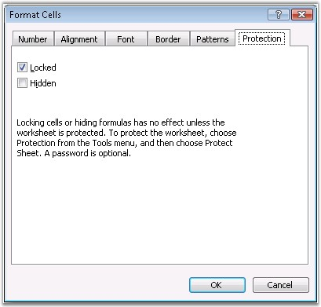
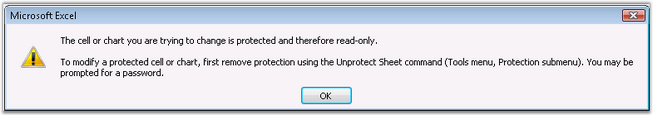

::: {style="DISPLAY: none"}
{#d2h_url_template}{#d2h_package_url style="WIDTH: 0px; DISPLAY: none; HEIGHT: 0px"}
:::

::: {.d2h_secondary_topic style="PADDING-BOTTOM: 10pt; MARGIN: 0pt; PADDING-LEFT: 0pt; PADDING-RIGHT: 0pt; PADDING-TOP: 0pt"}
##### Protection {#protection style="tab-stops: 0pt"}

[]{style="FONT-FAMILY: 'Trebuchet MS','sans-serif'; COLOR: #15428b; FONT-SIZE: 9pt"} 

Excel provides various options to protect worksheet and workbook elements. Protection prevents a user from accidentally or deliberately changing, moving, or deleting important data. There are various options to protect worksheets and workbooks.

 

 Refer to the [[Changes]{.UGHyperlink}](ms-xhelp:///?Id=74f3b7c2-08af-4fcb-b9bd-278ceb300350) section for more details.

 

This section explains how cell protection can be applied in MS Excel by using XlsIO.

 

###### []{#p68}[]{#_Lock_Cells}4.1.3.3.4.1 Lock Cells {#lock-cells style="tab-stops: 0pt"}

 

Cell modification can be prevented by locking the cell, by using the **Protection** tab in the **Format** **Cells** dialog box.

 

{border="0"}

Figure 71: Format Cells dialog - Protection[]{style="FONT-FAMILY: 'Trebuchet MS','sans-serif'; COLOR: #15428b"}

[]{style="FONT-FAMILY: 'Trebuchet MS','sans-serif'; COLOR: #15428b"} 

[]{style="FONT-FAMILY: 'Trebuchet MS','sans-serif'; COLOR: #15428b; FONT-SIZE: 9pt"} 

This will prompt the following error message at run time, when a user tries to modify the cell.

[]{style="FONT-FAMILY: 'Trebuchet MS','sans-serif'; COLOR: #15428b; FONT-SIZE: 9pt"} 

{border="0"}

Figure 72: Error on modifying the protected cell[]{style="FONT-FAMILY: 'Trebuchet MS','sans-serif'; COLOR: #15428b"}

[]{style="FONT-FAMILY: 'Trebuchet MS','sans-serif'; COLOR: #15428b; FONT-SIZE: 9pt"} 

Locking and Unlocking in XlsIO

[]{style="FONT-FAMILY: 'Trebuchet MS','sans-serif'; COLOR: #15428b; FONT-SIZE: 9pt"} 

XlsIO supports locking and unlocking cells by using the cell\'s **Locked** property, which can be manipulated to make certain cells editable in a protected worksheet. Please note that locking/unlocking a cell in an unprotected worksheet has no effect. For protecting the worksheet, see [[Worksheet Protection]{.UGHyperlink}](ms-xhelp:///?Id=727f3451-a991-4a2f-858e-0b968dc0d6f3).

[]{style="FONT-FAMILY: 'Trebuchet MS','sans-serif'; COLOR: #15428b; FONT-SIZE: 9pt"} 

+--------------------------------------------------------------------------------------------------------------------------------------------------------------------------------------------------------+
| **[\[C#\]]{style="FONT-FAMILY: 'Courier New'"}**                                                                                                                                                       |
|                                                                                                                                                                                                        |
| **[]{style="FONT-FAMILY: 'Courier New'"}**                                                                                                                                                             |
|                                                                                                                                                                                                        |
| [// Opening the Existing (Protected) Worksheet from a Workbook]{style="FONT-FAMILY: 'Courier New'; COLOR: green"}                                                                                      |
|                                                                                                                                                                                                        |
| [IWorkbook]{style="FONT-FAMILY: 'Courier New'; COLOR: #2b91af"}[ workbook = application.Workbooks.Open([\"CellProtectionTemplate.xls\"]{style="COLOR: #a31515"});]{style="FONT-FAMILY: 'Courier New'"} |
|                                                                                                                                                                                                        |
| []{style="FONT-FAMILY: 'Courier New'"}                                                                                                                                                                 |
|                                                                                                                                                                                                        |
| [// Unlocking the cell which, need to be edited.]{style="FONT-FAMILY: 'Courier New'; COLOR: green"}                                                                                                    |
|                                                                                                                                                                                                        |
| [sheet.Range\[[\"A1\"]{style="COLOR: #a31515"}\].CellStyle.Locked = [false]{style="COLOR: blue"};]{style="FONT-FAMILY: 'Courier New'"}                                                                 |
+--------------------------------------------------------------------------------------------------------------------------------------------------------------------------------------------------------+

[]{style="FONT-FAMILY: 'Trebuchet MS','sans-serif'; COLOR: #15428b; FONT-SIZE: 9pt"} 

+---------------------------------------------------------------------------------------------------------------------------------------------------------------------------------------------------------------------------------+
| **[\[VB.NET\]]{style="FONT-FAMILY: 'Courier New'"}**                                                                                                                                                                            |
|                                                                                                                                                                                                                                 |
| **[]{style="FONT-FAMILY: 'Courier New'"}**                                                                                                                                                                                      |
|                                                                                                                                                                                                                                 |
| [\' Opening the Existing (Protected) Worksheet from a Workbook]{style="FONT-FAMILY: 'Courier New'; COLOR: green"}                                                                                                               |
|                                                                                                                                                                                                                                 |
| [Dim]{style="FONT-FAMILY: 'Courier New'; COLOR: blue"}[ workbook [As]{style="COLOR: blue"} IWorkbook = application.Workbooks.Open([\"CellProtectionTemplate.xls\"]{style="COLOR: maroon"})]{style="FONT-FAMILY: 'Courier New'"} |
|                                                                                                                                                                                                                                 |
| []{style="FONT-FAMILY: 'Courier New'"}                                                                                                                                                                                          |
|                                                                                                                                                                                                                                 |
| [\' Unlocking the cells which, need to be edited.]{style="FONT-FAMILY: 'Courier New'; COLOR: green"}                                                                                                                            |
|                                                                                                                                                                                                                                 |
| [sheet.Range([\"A1\"]{style="COLOR: maroon"}).CellStyle.Locked = [False]{style="COLOR: blue"}]{style="FONT-FAMILY: 'Courier New'"}                                                                                              |
+---------------------------------------------------------------------------------------------------------------------------------------------------------------------------------------------------------------------------------+

 

[]{#related-topics}
:::
