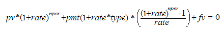

::: {style="DISPLAY: none"}
{#d2h_url_template}{#d2h_package_url style="WIDTH: 0px; DISPLAY: none; HEIGHT: 0px"}
:::

::::: {#nsbanner .d2h_main_nsbanner style="BORDER-BOTTOM: #999999 1px solid; POSITION: relative; PADDING-BOTTOM: 0px; BACKGROUND-COLOR: transparent; PADDING-LEFT: 0px; PADDING-RIGHT: 0px; DISPLAY: none; BORDER-TOP: #999999 1px solid; PADDING-TOP: 0px; LEFT: 0px"}
:::: {#TitleRow .d2h_main_titlerow style="PADDING-BOTTOM: 4px; BACKGROUND-COLOR: transparent; PADDING-LEFT: 22px; WIDTH: 100%; PADDING-RIGHT: 10px; DISPLAY: none; PADDING-TOP: 4px"}
::: {#ienav .d2h_main_ienav style="DISPLAY: none"}
{#D2HPrevious .D2HPreviousEnabled}  {#D2HNext .D2HNextEnabled}
:::
::::
:::::

:::: {#nstext .d2h_main_nstext style="PADDING-BOTTOM: 10px; BACKGROUND-COLOR: transparent; PADDING-LEFT: 22px; PADDING-RIGHT: 10px; HEIGHT: 100%; OVERFLOW: auto; PADDING-TOP: 5px" hasuserbackground="true" valign="bottom"}
::: {#d2h_breadcrumbs .d2h_breadcrumbs}
[Essential Studio User Guide Documentation](ms-xhelp:///?Id=12457748-09e3-4d74-a240-8e049cedf030){.d2h_breadcrumbsNormal}[ \> ]{.d2h_breadcrumbsLinkSeparator}[Reporting Edition](ms-xhelp:///?Id=027aa5b6-6676-4f93-ad23-c20e8c45792e){.d2h_breadcrumbsNormal}[ \> ]{.d2h_breadcrumbsLinkSeparator}[Essential Calculate](ms-xhelp:///?Id=2ea52c7f-a332-43bd-9ca7-2ea0898ff54e){.d2h_breadcrumbsNormal}[ \> ]{.d2h_breadcrumbsLinkSeparator}[Concepts and Features](ms-xhelp:///?Id=91222e44-d3ca-4392-8f0f-41bd2ae3dd3f){.d2h_breadcrumbsNormal}[ \> ]{.d2h_breadcrumbsLinkSeparator}[Function Reference Section](ms-xhelp:///?Id=64c2cb3d-2548-4fe4-b0d1-0c2249ee26c8){.d2h_breadcrumbsNormal}
:::

### PV {#pv style="tab-stops: 0pt"}

 

Returns the present value of an investment. The present value is the total amount that a series of future payments is worth now.

 

**Syntax**

 

**PV(rate, nper, pmt, fv, type)**

 

where:

**rate** is the interest rate per period. For example, if you obtain an automobile loan at a 10% annual interest rate and make monthly payments, your interest rate per month is 10%/12 or 0.83%. You would enter 10%/12 or 0.83% or 0.0083, into the formula as the rate.

**nper** is the total number of payment periods in an annuity. For example, if you get a four-year car loan and make monthly payments, your loan has 4\*12 (or 48) periods. You would enter 48 into the formula for nper.

**pmt** is the payment made for each period and cannot change over the life of the annuity. Typically, pmt includes principal and interest but, no other fees or taxes. For example, the monthly payments on a \$10,000, four-year car loan at 12 percent are \$263.33. You will have to enter -263.33 into the formula as the pmt. If pmt is omitted, you must include the fv argument.

**fv** is the future value or a cash balance that you want to attain after the last payment is made. If fv is omitted, it is assumed to be 0 (the future value of a loan, for example, is 0). For example, if you want to save \$50,000 to pay for a special project in 18 years, then \$50,000 is the future value. You could then make a conservative guess at an interest rate and determine how much you must save each month. If fv is omitted, you must include the pmt argument.

**type** is the number 0 or 1 and indicates when payments are due. If type equals:

[·      ]{style="FONT-FAMILY: Symbol"}0 - Payments are due at the end of the period.

[·      ]{style="FONT-FAMILY: Symbol"}1 - Payments are due at the beginning of the period.

[\
]{style="FONT-SIZE: 9pt"}Remarks[ ]{style="FONT-FAMILY: 'Times New Roman','serif'; FONT-SIZE: 12pt"}

[]{style="FONT-FAMILY: 'Trebuchet MS','sans-serif'; COLOR: #15428b; FONT-SIZE: 9pt"} 

[·      ]{style="FONT-FAMILY: Symbol"}Make sure that you are consistent about the units you use for specifying rate and nper. If you make monthly payments on a four-year loan at 12 percent annual interest, use 12%/12 for rate and 4\*12 for nper. If you make annual payments on the same loan, use 12% for rate and 4 for nper.

[·      ]{style="FONT-FAMILY: Symbol"}In annuity functions, the cash you pay out such as a deposit to savings is represented by a negative number; the cash you receive such as a dividend check is represented by a positive number.

[·      ]{style="FONT-FAMILY: Symbol"}One financial argument is solved for in terms of the others. If rate is not 0, then,

[]{style="FONT-FAMILY: 'Trebuchet MS','sans-serif'; COLOR: #15428b; FONT-SIZE: 9pt"} 

{border="0"}

 

If rate is 0:

 

**(pmt \* nper) + pv + fv = 0**

 

[]{#related-topics}
::::
