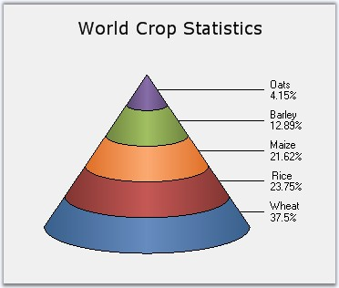

::: {style="DISPLAY: none"}
{#d2h_url_template}{#d2h_package_url style="WIDTH: 0px; DISPLAY: none; HEIGHT: 0px"}
:::

:::: {.d2h_secondary_topic style="PADDING-BOTTOM: 10pt; MARGIN: 0pt; PADDING-LEFT: 0pt; PADDING-RIGHT: 0pt; PADDING-TOP: 0pt"}
#### Pyramid Chart {#pyramid-chart style="tab-stops: 0pt"}

[]{style="FONT-FAMILY: 'Trebuchet MS','sans-serif'; FONT-SIZE: 9pt"} 

Pyramid chart is similar to the funnel chart. It\'s often used for geographical purposes. The Pyramid Chart type displays the data, which when totalled will be 100%. This type of chart is a single series chart representing the data as portions of 100%, and this chart does not use any axes. Pyramid chart can be viewed as 2D or 3D.

 

The following images are some sample Pyramid Charts.

[]{style="FONT-FAMILY: 'Trebuchet MS','sans-serif'; FONT-SIZE: 9pt"} 

{border="0"}

[]{style="FONT-FAMILY: 'Trebuchet MS','sans-serif'; FONT-SIZE: 9pt"} 

Figure 64: 2D Pyramid Chart

[]{style="FONT-FAMILY: 'Trebuchet MS','sans-serif'; FONT-SIZE: 9pt"} 

{border="0"}

**[]{style="FONT-FAMILY: 'Trebuchet MS','sans-serif'; FONT-SIZE: 9pt"}** 

Figure 65: 3D Pyramid-FigureBase-Circle Chart

**[]{style="FONT-FAMILY: 'Trebuchet MS','sans-serif'; FONT-SIZE: 9pt"}** 

{border="0"}

**[]{style="FONT-FAMILY: 'Trebuchet MS','sans-serif'; FONT-SIZE: 9pt"}** 

Figure 66: 3D Pyramid-FigureBase-Square Chart

**[]{style="FONT-FAMILY: 'Trebuchet MS','sans-serif'; FONT-SIZE: 9pt"}** 

{border="0"}

**[]{style="FONT-FAMILY: 'Trebuchet MS','sans-serif'; FONT-SIZE: 9pt"}** 

Figure 67: 3D Pyramid Chart with Gap ratio 0.1

**[]{style="FONT-FAMILY: 'Trebuchet MS','sans-serif'; FONT-SIZE: 9pt"}** 

::: {align="center"}
+------------------------------+------------------------+
| Details                                               |
+------------------------------+------------------------+
| Number of Y values per point | 1                      |
+------------------------------+------------------------+
| Number of Series             | One.                   |
+------------------------------+------------------------+
| Cannot be Combined with      | Any other chart types. |
+------------------------------+------------------------+
:::

[]{style="FONT-FAMILY: 'Trebuchet MS','sans-serif'; FONT-SIZE: 9pt"} 

+---------------------------------------------------------------------------------------------------------------------------------------------------------------------------------------------+
| **[\[C#\]]{style="FONT-FAMILY: 'Courier New'; COLOR: black"}**                                                                                                                              |
|                                                                                                                                                                                             |
| **[]{style="FONT-FAMILY: 'Courier New'; COLOR: black"}**                                                                                                                                    |
|                                                                                                                                                                                             |
| [ChartSeries series1 = [this]{style="COLOR: blue"}.chartControl1.Model.NewSeries([\"Pyramid chart\"]{style="COLOR: maroon"}, ChartSeriesType.Pyramid);]{style="FONT-FAMILY: 'Courier New'"} |
|                                                                                                                                                                                             |
| [series1.Points.Add(0, 25.3);]{style="FONT-FAMILY: 'Courier New'"}                                                                                                                          |
|                                                                                                                                                                                             |
| [series1.Points.Add(1, 45.7);]{style="FONT-FAMILY: 'Courier New'"}                                                                                                                          |
|                                                                                                                                                                                             |
| [series1.Points.Add(2, 97.3);]{style="FONT-FAMILY: 'Courier New'"}                                                                                                                          |
|                                                                                                                                                                                             |
| [series1.Points.Add(3, 20.6);]{style="FONT-FAMILY: 'Courier New'"}                                                                                                                          |
|                                                                                                                                                                                             |
| [series1.Points.Add(4, 125.8);]{style="FONT-FAMILY: 'Courier New'"}                                                                                                                         |
|                                                                                                                                                                                             |
| [series1.Points.Add(5, 216.1);]{style="FONT-FAMILY: 'Courier New'"}                                                                                                                         |
|                                                                                                                                                                                             |
| [this]{style="FONT-FAMILY: 'Courier New'; COLOR: blue"}[.chartControl1.Series.Add(series1);]{style="FONT-FAMILY: 'Courier New'"}                                                            |
+---------------------------------------------------------------------------------------------------------------------------------------------------------------------------------------------+

[]{style="FONT-FAMILY: 'Trebuchet MS','sans-serif'; FONT-SIZE: 9pt"} 

+---------------------------------------------------------------------------------------------------------------------------------------------------------------------------------------------------------------------------------------------------------------------------+
| **[\[VB.NET\]]{style="FONT-FAMILY: 'Courier New'; COLOR: black"}**                                                                                                                                                                                                        |
|                                                                                                                                                                                                                                                                           |
| **[]{style="FONT-FAMILY: 'Courier New'; COLOR: black"}**                                                                                                                                                                                                                  |
|                                                                                                                                                                                                                                                                           |
| [Dim]{style="FONT-FAMILY: 'Courier New'; COLOR: blue"}[ series1 [As]{style="COLOR: blue"} ChartSeries = [Me]{style="COLOR: blue"}.chartControl1.Model.NewSeries([\"Pyramid chart\"]{style="COLOR: maroon"}, ChartSeriesType.Pyramid)]{style="FONT-FAMILY: 'Courier New'"} |
|                                                                                                                                                                                                                                                                           |
| [series1.Points.Add(0,25.3)]{style="FONT-FAMILY: 'Courier New'"}                                                                                                                                                                                                          |
|                                                                                                                                                                                                                                                                           |
| [series1.Points.Add(1,45.7)]{style="FONT-FAMILY: 'Courier New'"}                                                                                                                                                                                                          |
|                                                                                                                                                                                                                                                                           |
| [series1.Points.Add(2,97.3)]{style="FONT-FAMILY: 'Courier New'"}                                                                                                                                                                                                          |
|                                                                                                                                                                                                                                                                           |
| [series1.Points.Add(3,20.6)]{style="FONT-FAMILY: 'Courier New'"}                                                                                                                                                                                                          |
|                                                                                                                                                                                                                                                                           |
| [series1.Points.Add(4,125.8)]{style="FONT-FAMILY: 'Courier New'"}                                                                                                                                                                                                         |
|                                                                                                                                                                                                                                                                           |
| [series1.Points.Add(5,216.1)]{style="FONT-FAMILY: 'Courier New'"}                                                                                                                                                                                                         |
|                                                                                                                                                                                                                                                                           |
| [Me]{style="FONT-FAMILY: 'Courier New'; COLOR: blue"}[.chartControl1.Series.Add(series1)]{style="FONT-FAMILY: 'Courier New'"}                                                                                                                                             |
+---------------------------------------------------------------------------------------------------------------------------------------------------------------------------------------------------------------------------------------------------------------------------+

[]{#p56} 

+--------------------------------------------------------------------------------------------------------------------------------------------------------------------------------------------------------------------------------------------------------------------------------------------------------------------------------------------------------------------------------------------------------------------------------------------------------------------------------------------------------------------------------------------------------------------------------------------------------------------------------------------------------------------------------------------------------------------------------------------------------------------------------------------------------------------------------------------------------------------------------------------------------------------------------------------------------------------------------------------------------------------------------------------------------------------------------------------------------------------------------------------------------------------------------------------------------------------------------------------------------------+
| []{style="COLOR: black; FONT-SIZE: 8pt"}                                                                                                                                                                                                                                                                                                                                                                                                                                                                                                                                                                                                                                                                                                                                                                                                                                                                                                                                                                                                                                                                                                                                                                                                                     |
|                                                                                                                                                                                                                                                                                                                                                                                                                                                                                                                                                                                                                                                                                                                                                                                                                                                                                                                                                                                                                                                                                                                                                                                                                                                              |
| Customization Options[]{style="FONT-FAMILY: 'Trebuchet MS','sans-serif'; FONT-SIZE: 9pt; FONT-WEIGHT: normal"}                                                                                                                                                                                                                                                                                                                                                                                                                                                                                                                                                                                                                                                                                                                                                                                                                                                                                                                                                                                                                                                                                                                                               |
+--------------------------------------------------------------------------------------------------------------------------------------------------------------------------------------------------------------------------------------------------------------------------------------------------------------------------------------------------------------------------------------------------------------------------------------------------------------------------------------------------------------------------------------------------------------------------------------------------------------------------------------------------------------------------------------------------------------------------------------------------------------------------------------------------------------------------------------------------------------------------------------------------------------------------------------------------------------------------------------------------------------------------------------------------------------------------------------------------------------------------------------------------------------------------------------------------------------------------------------------------------------+
| [[DisplayShadow]{.UGHyperlink}](ms-xhelp:///?Id=578ae524-f29b-4163-8add-469ab91c04ec)[, ]{.UGHyperlink}[[DisplayText]{.UGHyperlink}](ms-xhelp:///?Id=9b6bab69-b305-46ad-b9e3-46315084aec6)[, ]{.UGHyperlink}[[DrawErrorBars]{.UGHyperlink}](ms-xhelp:///?Id=9b6bab69-b305-46ad-b9e3-46315084aec6)[, ]{.UGHyperlink}[[DrawSeriesNameInDepth]{.UGHyperlink}](ms-xhelp:///?Id=c38a553c-a780-4c23-8d64-1c1a43c3bf7a)[, ]{.UGHyperlink}[[ElementBorders]{.UGHyperlink}](ms-xhelp:///?Id=c38a553c-a780-4c23-8d64-1c1a43c3bf7a)[, ]{.UGHyperlink}[[ErrorBarsSymbolShape]{.UGHyperlink}](ms-xhelp:///?Id=c38a553c-a780-4c23-8d64-1c1a43c3bf7a)[, ]{.UGHyperlink}[[HighlightInterior]{.UGHyperlink}](ms-xhelp:///?Id=04fa0a51-9b81-4f2b-adcc-8d8b3502f038)[, ]{.UGHyperlink}[[HitTestRadius]{.UGHyperlink}](ms-xhelp:///?Id=5cae42e5-3458-4608-9b2c-653a75175b48)[, ]{.UGHyperlink}[[Images]{.UGHyperlink}](ms-xhelp:///?Id=b4e6a0de-f2a4-41d4-8e20-2b69555a0cfb)[]{.UGHyperlink}                                                                                                                                                                                                                                                                                     |
|                                                                                                                                                                                                                                                                                                                                                                                                                                                                                                                                                                                                                                                                                                                                                                                                                                                                                                                                                                                                                                                                                                                                                                                                                                                              |
| [[ImageIndex]{.UGHyperlink}](ms-xhelp:///?Id=14cfeba3-de3e-4180-bb9b-1b23016173ab)[, ]{.UGHyperlink}[[Rotate]{.UGHyperlink}](ms-xhelp:///?Id=c88d080c-ec5e-4858-8ed9-c1b8e9e3d418)[, ]{.UGHyperlink}[[Spacing Between Series]{.UGHyperlink}](ms-xhelp:///?Id=91545f50-e8ab-4b79-8ce1-139be19e5d2f)[, ]{.UGHyperlink}[[ShadowInterior]{.UGHyperlink}](ms-xhelp:///?Id=43a286db-8619-4eb5-b53a-e2dfb5bb38dd)[, ]{.UGHyperlink}[[ShadowOffset]{.UGHyperlink}](ms-xhelp:///?Id=71291c1d-369c-4264-9215-95fe5c7b6e10)[, ]{.UGHyperlink}[[FancyToolTip]{.UGHyperlink}](ms-xhelp:///?Id=2b05f541-f80e-42ac-8b96-dff440a7da54)[, ]{.UGHyperlink}[[Font]{.UGHyperlink}](ms-xhelp:///?Id=baa78835-756c-40a8-ac98-60e59dacb9ba)[, ]{.UGHyperlink}[[Interior]{.UGHyperlink}](ms-xhelp:///?Id=e2c289d7-8c9b-4618-b7f6-d294912e35ae)[, ]{.UGHyperlink}[[LegendItem]{.UGHyperlink}](ms-xhelp:///?Id=7feab346-9261-489f-996b-8c455c2a2caa)[, ]{.UGHyperlink}[[Name,]{.UGHyperlink}](ms-xhelp:///?Id=39b8b7d5-49f4-4f25-99cc-5f73502e23e4)[ ]{.UGHyperlink}[[PointsToolTipFormat]{.UGHyperlink}](ms-xhelp:///?Id=39b8b7d5-49f4-4f25-99cc-5f73502e23e4)[, ]{.UGHyperlink}[[SmartLabels]{.UGHyperlink}](ms-xhelp:///?Id=bfab51b5-a6ff-477f-b687-e232fed1351a)[, ]{.UGHyperlink} |
|                                                                                                                                                                                                                                                                                                                                                                                                                                                                                                                                                                                                                                                                                                                                                                                                                                                                                                                                                                                                                                                                                                                                                                                                                                                              |
| [[Summary]{.UGHyperlink}](ms-xhelp:///?Id=bfab51b5-a6ff-477f-b687-e232fed1351a)[, ]{.UGHyperlink}[[Text]{.UGHyperlink}](ms-xhelp:///?Id=505d05fd-b830-4da5-bc6a-8b17f1a05b16)[, ]{.UGHyperlink}[[TextColor]{.UGHyperlink}](ms-xhelp:///?Id=4020f60c-48c4-4fb2-b37e-9ea7babdc123)[, ]{.UGHyperlink}[[TextFormat]{.UGHyperlink}](ms-xhelp:///?Id=4020f60c-48c4-4fb2-b37e-9ea7babdc123)[, ]{.UGHyperlink}[[TextOffset]{.UGHyperlink}](ms-xhelp:///?Id=4020f60c-48c4-4fb2-b37e-9ea7babdc123)[, ]{.UGHyperlink}[[TextOrientation]{.UGHyperlink}](ms-xhelp:///?Id=2c3fe673-8356-4c6f-9ab8-e154932d0b07)[, ]{.UGHyperlink}[[Visible]{.UGHyperlink}](ms-xhelp:///?Id=601b05d8-27b2-4084-a7be-dc09b2a19251)[]{style="FONT-FAMILY: 'Trebuchet MS','sans-serif'; COLOR: black; FONT-SIZE: 9pt"}                                                                                                                                                                                                                                                                                                                                                                                                                                                                         |
+--------------------------------------------------------------------------------------------------------------------------------------------------------------------------------------------------------------------------------------------------------------------------------------------------------------------------------------------------------------------------------------------------------------------------------------------------------------------------------------------------------------------------------------------------------------------------------------------------------------------------------------------------------------------------------------------------------------------------------------------------------------------------------------------------------------------------------------------------------------------------------------------------------------------------------------------------------------------------------------------------------------------------------------------------------------------------------------------------------------------------------------------------------------------------------------------------------------------------------------------------------------+

 

[]{#related-topics}
::::
