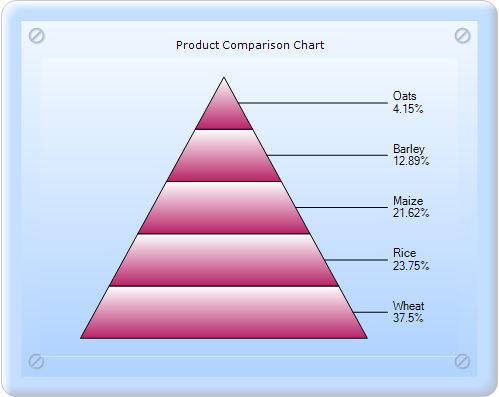
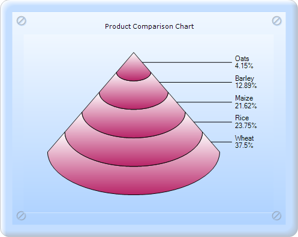
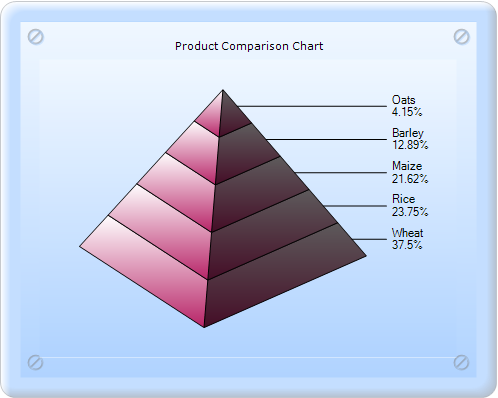
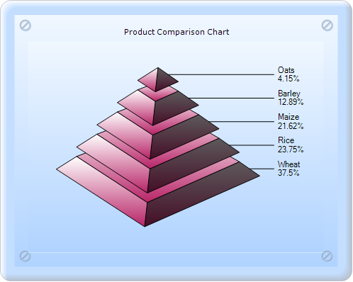

::: {style="DISPLAY: none"}
{#d2h_url_template}{#d2h_package_url style="WIDTH: 0px; DISPLAY: none; HEIGHT: 0px"}
:::

:::: {.d2h_secondary_topic style="PADDING-BOTTOM: 10pt; MARGIN: 0pt; PADDING-LEFT: 0pt; PADDING-RIGHT: 0pt; PADDING-TOP: 0pt"}
#### Pyramid Chart {#pyramid-chart style="tab-stops: 0pt"}

 

Pyramid chart is similar to the Funnel chart. It\'s often used for geographical purposes. The Pyramid chart type displays the data, which when totaled will be hundred percent. This type of chart is a single series chart representing the data as portions of hundred percent, and this chart does not use any axes. Pyramid chart can be viewed as 2D or 3D.

The following images are some samples of the Pyramid chart:

[]{style="FONT-FAMILY: 'Times New Roman','serif'; FONT-SIZE: 12pt"} 

[]{style="FONT-FAMILY: 'Calibri','sans-serif'"} 

{border="0"}

[]{style="FONT-FAMILY: 'Calibri','sans-serif'"} 

Figure 115: 2D Pyramid chart

[]{style="FONT-FAMILY: 'Calibri','sans-serif'"} 

{border="0"}

[]{style="FONT-FAMILY: 'Calibri','sans-serif'"} 

Figure 116: 3D Pyramid-FigureBase-Circle chart

[]{style="FONT-FAMILY: 'Calibri','sans-serif'"} 

{border="0"}

[]{style="FONT-FAMILY: 'Calibri','sans-serif'"} 

Figure 117: 3D Pyramid-FigureBase-Square chart

[]{style="FONT-FAMILY: 'Calibri','sans-serif'"} 

{border="0"}

[]{style="FONT-FAMILY: 'Calibri','sans-serif'"} 

Figure 118: 3D Pyramid chart with Gap ratio 0.2

Pyramid chart can be created in two ways:

[·      ]{style="FONT-FAMILY: Symbol"}Builder

[·      ]{style="FONT-FAMILY: Symbol"}ChartModel

 

Chart Details

 

::: {align="center"}
+------------------------------+-----------------------+
| Details                                              |
+------------------------------+-----------------------+
| Number of Y values per point | 1                     |
+------------------------------+-----------------------+
| Number of Series             | One                   |
+------------------------------+-----------------------+
| Cannot be Combined with      | Any other chart type. |
+------------------------------+-----------------------+
:::

More:

[ ]{#related-topics}

[{border="0" align="absMiddle"}Builder](ms-xhelp:///?Id=578d5a50-0b84-4764-8855-30abfa6bef25){style="TEXT-DECORATION: none"}

[{border="0" align="absMiddle"}ChartModel](ms-xhelp:///?Id=8e4f49bb-2b3f-42c7-a108-b19695a9551d){style="TEXT-DECORATION: none"}

[{border="0" align="absMiddle"}Customization Details for the Funnel and Pyramid Charts](ms-xhelp:///?Id=ed82841d-e284-4df4-9ebe-ac3dcb02b9a5){style="TEXT-DECORATION: none"}
::::
