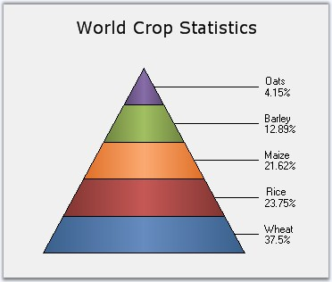
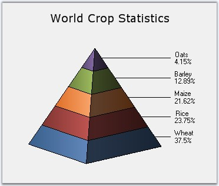
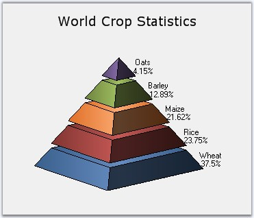

::: {style="DISPLAY: none"}
{#d2h_url_template}{#d2h_package_url style="WIDTH: 0px; DISPLAY: none; HEIGHT: 0px"}
:::

:::: {.d2h_secondary_topic style="PADDING-BOTTOM: 10pt; MARGIN: 0pt; PADDING-LEFT: 0pt; PADDING-RIGHT: 0pt; PADDING-TOP: 0pt"}
#### Pyramid Chart {#pyramid-chart style="tab-stops: 0pt"}

 

Pyramid chart is similar to the funnel chart. It\'s often used for geographical purposes. The Pyramid Chart type displays the data, which when totalled will be 100%. This type of chart is a single series chart representing the data as portions of 100%, and this chart does not use any axes. Pyramid chart can be viewed as 2D or 3D.

 

The following images are some sample Pyramid Charts.

 

{border="0"}

 

Figure 66: 2DPyramid Chart

 

{border="0"}

 

Figure 67: 3D Pyramid-FigureBase-Circle Chart

 

{border="0"}

 

Figure 68: 3D Pyramid-FigureBase-Square Chart

 

{border="0"}

 

Figure 69: 3D Pyramid Chart with Gap ratio 0.1**[]{style="FONT-STYLE: normal"}**

 

::: {align="center"}
+----------------------------------+------------------------+
| Details                                                   |
+----------------------------------+------------------------+
| **Number of Y values per point** | 1                      |
+----------------------------------+------------------------+
| **Number of Series         **    | One.                   |
+----------------------------------+------------------------+
| **Cannot be Combined with   **   | Any other chart types. |
+----------------------------------+------------------------+
:::

 

+---------------------------------------------------------------------------------------------------------------------------------------------------------------------------------------------+
| **[\[C#\]]{style="FONT-FAMILY: 'Courier New'; COLOR: black"}**                                                                                                                              |
|                                                                                                                                                                                             |
| **[]{style="FONT-FAMILY: 'Courier New'; COLOR: black"}**                                                                                                                                    |
|                                                                                                                                                                                             |
| [ChartSeries series1 = [this]{style="COLOR: blue"}.chartControl1.Model.NewSeries([\"Pyramid chart\"]{style="COLOR: maroon"}, ChartSeriesType.Pyramid);]{style="FONT-FAMILY: 'Courier New'"} |
|                                                                                                                                                                                             |
| [series1.Points.Add(0, 25.3);]{style="FONT-FAMILY: 'Courier New'"}                                                                                                                          |
|                                                                                                                                                                                             |
| [series1.Points.Add(1, 45.7);]{style="FONT-FAMILY: 'Courier New'"}                                                                                                                          |
|                                                                                                                                                                                             |
| [series1.Points.Add(2, 97.3);]{style="FONT-FAMILY: 'Courier New'"}                                                                                                                          |
|                                                                                                                                                                                             |
| [series1.Points.Add(3, 20.6);]{style="FONT-FAMILY: 'Courier New'"}                                                                                                                          |
|                                                                                                                                                                                             |
| [series1.Points.Add(4, 125.8);]{style="FONT-FAMILY: 'Courier New'"}                                                                                                                         |
|                                                                                                                                                                                             |
| [series1.Points.Add(5, 216.1);]{style="FONT-FAMILY: 'Courier New'"}                                                                                                                         |
|                                                                                                                                                                                             |
| [this]{style="FONT-FAMILY: 'Courier New'; COLOR: blue"}[.chartControl1.Series.Add(series1);]{style="FONT-FAMILY: 'Courier New'"}                                                            |
+---------------------------------------------------------------------------------------------------------------------------------------------------------------------------------------------+

 

+---------------------------------------------------------------------------------------------------------------------------------------------------------------------------------------------------------------------------------------------------------------------------+
| **[\[VB.NET\]]{style="FONT-FAMILY: 'Courier New'; COLOR: black"}**                                                                                                                                                                                                        |
|                                                                                                                                                                                                                                                                           |
| **[]{style="FONT-FAMILY: 'Courier New'; COLOR: black"}**                                                                                                                                                                                                                  |
|                                                                                                                                                                                                                                                                           |
| [Dim]{style="FONT-FAMILY: 'Courier New'; COLOR: blue"}[ series1 [As]{style="COLOR: blue"} ChartSeries = [Me]{style="COLOR: blue"}.chartControl1.Model.NewSeries([\"Pyramid chart\"]{style="COLOR: maroon"}, ChartSeriesType.Pyramid)]{style="FONT-FAMILY: 'Courier New'"} |
|                                                                                                                                                                                                                                                                           |
| [series1.Points.Add(0,25.3)]{style="FONT-FAMILY: 'Courier New'"}                                                                                                                                                                                                          |
|                                                                                                                                                                                                                                                                           |
| [series1.Points.Add(1,45.7)]{style="FONT-FAMILY: 'Courier New'"}                                                                                                                                                                                                          |
|                                                                                                                                                                                                                                                                           |
| [series1.Points.Add(2,97.3)]{style="FONT-FAMILY: 'Courier New'"}                                                                                                                                                                                                          |
|                                                                                                                                                                                                                                                                           |
| [series1.Points.Add(3,20.6)]{style="FONT-FAMILY: 'Courier New'"}                                                                                                                                                                                                          |
|                                                                                                                                                                                                                                                                           |
| [series1.Points.Add(4,125.8)]{style="FONT-FAMILY: 'Courier New'"}                                                                                                                                                                                                         |
|                                                                                                                                                                                                                                                                           |
| [series1.Points.Add(5,216.1)]{style="FONT-FAMILY: 'Courier New'"}                                                                                                                                                                                                         |
|                                                                                                                                                                                                                                                                           |
| [Me]{style="FONT-FAMILY: 'Courier New'; COLOR: blue"}[.chartControl1.Series.Add(series1)]{style="FONT-FAMILY: 'Courier New'"}                                                                                                                                             |
+---------------------------------------------------------------------------------------------------------------------------------------------------------------------------------------------------------------------------------------------------------------------------+

 

+----------------------------------------------------------------------------------------------------------------------------------------------------------------------------------------------------------------------------------------------------------------------------------------------------------------+
| []{style="FONT-FAMILY: 'Segoe UI','sans-serif'; COLOR: black"}                                                                                                                                                                                                                                                 |
|                                                                                                                                                                                                                                                                                                                |
| Customization Options                                                                                                                                                                                                                                                                                          |
+----------------------------------------------------------------------------------------------------------------------------------------------------------------------------------------------------------------------------------------------------------------------------------------------------------------+
| Border, DisplayText, DrawSeriesNameInDepth, FigureBase, GapRatio, HighlightInterior, LabelPlacement, LabelStyle, PyramidMode, FancyToolTip, Font, Interior, LegendItem, Name, PointsToolTipFormat, SmartLabels, Summary, Text, TextColor, TextFormat, TextOffset, TextOrientation, Visible, ShowDataBindLabels |
+----------------------------------------------------------------------------------------------------------------------------------------------------------------------------------------------------------------------------------------------------------------------------------------------------------------+

 

[]{#p54} 

 

[]{#related-topics}
::::
