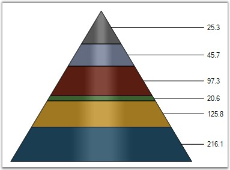

::: {style="DISPLAY: none"}
{#d2h_url_template}{#d2h_package_url style="WIDTH: 0px; DISPLAY: none; HEIGHT: 0px"}
:::

:::: {.d2h_secondary_topic style="PADDING-BOTTOM: 10pt; MARGIN: 0pt; PADDING-LEFT: 0pt; PADDING-RIGHT: 0pt; PADDING-TOP: 0pt"}
#### PyramidMode {#pyramidmode style="tab-stops: 0pt"}

**[]{style="FONT-FAMILY: 'Trebuchet MS','sans-serif'"}** 

Specifies the mode in which the y values should be interpreted. In Linear mode the y values are proportional to the length of the sides of the Pyramid. In Surface Mode the y values are proportional to the surface area of the corresponding blocks.

[]{style="FONT-FAMILY: 'Trebuchet MS','sans-serif'; FONT-SIZE: 9pt"} 

::: {align="center"}
+-------------------------------------+----------------------------------------------+
| Details                                                                            |
+-------------------------------------+----------------------------------------------+
| Possible Values                     | Linear -  Draw pyramid chart in linear mode\ |
|                                     | Surface - Draw pyramid chart in surface mode |
+-------------------------------------+----------------------------------------------+
| Default Value                       | Linear                                       |
+-------------------------------------+----------------------------------------------+
| 2D / 3D Limitations                 | No                                           |
+-------------------------------------+----------------------------------------------+
| Applies to Chart Element            | Any Series                                   |
+-------------------------------------+----------------------------------------------+
| Applies to Chart Types              | Pyramid                                      |
+-------------------------------------+----------------------------------------------+
:::

[]{style="FONT-FAMILY: 'Trebuchet MS','sans-serif'; FONT-SIZE: 9pt"} 

Here is some sample code.

[]{style="FONT-FAMILY: 'Trebuchet MS','sans-serif'; FONT-SIZE: 9pt"} 

+-------------------------------------------------------------------------------------------------------------------------------------------------------------------------------------------------------------------------------------------------+
| **[\[C#\]]{style="FONT-FAMILY: 'Courier New'; COLOR: black"}**                                                                                                                                                                                  |
|                                                                                                                                                                                                                                                 |
| **[]{style="FONT-FAMILY: 'Courier New'; COLOR: black; FONT-SIZE: 9pt"}**                                                                                                                                                                        |
|                                                                                                                                                                                                                                                 |
| [this]{style="FONT-FAMILY: 'Courier New'; COLOR: blue; FONT-SIZE: 9pt"}[.ChartWebControl1.Series\[0\].ConfigItems.PyramidItem.PyramidMode=[ChartPyramidMode]{style="COLOR: teal"}.Surface;]{style="FONT-FAMILY: 'Courier New'; FONT-SIZE: 9pt"} |
+-------------------------------------------------------------------------------------------------------------------------------------------------------------------------------------------------------------------------------------------------+

[]{style="FONT-FAMILY: 'Trebuchet MS','sans-serif'; FONT-SIZE: 9pt"} 

+----------------------------------------------------------------------------------------------------------------------------------------------------------------------------------------------------------------------------------------------------------------------------------------------------------------------------------------------------------------------------------+
| **[\[VB.NET\]]{style="FONT-FAMILY: 'Courier New'; COLOR: black"}**                                                                                                                                                                                                                                                                                                               |
|                                                                                                                                                                                                                                                                                                                                                                                  |
| **[]{style="FONT-FAMILY: 'Courier New'; COLOR: black"}**                                                                                                                                                                                                                                                                                                                         |
|                                                                                                                                                                                                                                                                                                                                                                                  |
| [Private Me]{style="FONT-FAMILY: 'Courier New'; COLOR: blue; FONT-SIZE: 9pt"}[.ChartWebControl1.Series(0).ConfigItems.PyramidItem.PyramidMode=]{style="FONT-FAMILY: 'Courier New'; COLOR: black; FONT-SIZE: 9pt"}[ChartPyramidMode]{style="FONT-FAMILY: 'Courier New'; COLOR: teal; FONT-SIZE: 9pt"}[.Surface]{style="FONT-FAMILY: 'Courier New'; COLOR: black; FONT-SIZE: 9pt"} |
+----------------------------------------------------------------------------------------------------------------------------------------------------------------------------------------------------------------------------------------------------------------------------------------------------------------------------------------------------------------------------------+

[]{style="FONT-FAMILY: 'Trebuchet MS','sans-serif'; FONT-SIZE: 9pt"} 

{border="0"}

**[]{style="FONT-FAMILY: 'Trebuchet MS','sans-serif'; FONT-SIZE: 9pt"}** 

Figure 174: Surface Mode Pyramid Chart

**[]{style="FONT-FAMILY: 'Trebuchet MS','sans-serif'; FONT-SIZE: 9pt"}** 

See Also

**[]{style="FONT-FAMILY: 'Trebuchet MS','sans-serif'; FONT-SIZE: 9pt"}** 

[Pyramid Chart]{.UGHyperlink}[]{.UGHyperlink}

[]{#p136} 

[]{#related-topics}
::::
