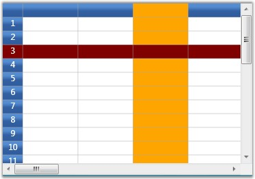

::: {style="DISPLAY: none"}
{#d2h_url_template}{#d2h_package_url style="WIDTH: 0px; DISPLAY: none; HEIGHT: 0px"}
:::

:::: {.d2h_secondary_topic style="PADDING-BOTTOM: 10pt; MARGIN: 0pt; PADDING-LEFT: 0pt; PADDING-RIGHT: 0pt; PADDING-TOP: 0pt"}
#### QueryBaseStyles {#querybasestyles style="tab-stops: 0pt"}

[]{style="FONT-FAMILY: 'Trebuchet MS','sans-serif'; COLOR: #15428b; FONT-SIZE: 9pt"} 

This event is used to provide base styles for desired grid cells. It receives an argument of type GridQueryBaseStylesEventArgs that contains the following parameters.

[]{style="FONT-FAMILY: 'Trebuchet MS','sans-serif'; COLOR: #15428b; FONT-SIZE: 9pt"} 

::: {align="center"}
  ------------ -----------------------------------------------------------------------
  Property     Description
  BaseStyles   Holds a list of base styles applicable for current cell co-ordinates.
  Cell         Represent the cell co-ordinates.
  Style        Gives cell style information.
  ------------ -----------------------------------------------------------------------
:::

[]{style="FONT-FAMILY: 'Trebuchet MS','sans-serif'; COLOR: #15428b; FONT-SIZE: 9pt"} 

Example

**[]{style="FONT-FAMILY: 'Trebuchet MS','sans-serif'; COLOR: #15428b; FONT-SIZE: 9pt"}** 

This event can be triggered using the following code:

[]{style="FONT-FAMILY: 'Trebuchet MS','sans-serif'; COLOR: #15428b; FONT-SIZE: 9pt"} 

+-----------------------------------------------------------------------------------------------------------------------------------------------------------------------------------------------------------------------------------+
| **[\[C#\]]{style="FONT-FAMILY: 'Courier New'; COLOR: black"}**                                                                                                                                                                    |
|                                                                                                                                                                                                                                   |
| []{style="FONT-FAMILY: 'Courier New'"}                                                                                                                                                                                            |
|                                                                                                                                                                                                                                   |
| [this]{style="FONT-FAMILY: 'Courier New'; COLOR: blue"}[.grid.QueryBaseStyles += [new]{style="COLOR: blue"} [GridQueryBaseStylesEventHandler]{style="COLOR: #2b91af"}(grid_QueryBaseStyles);]{style="FONT-FAMILY: 'Courier New'"} |
+-----------------------------------------------------------------------------------------------------------------------------------------------------------------------------------------------------------------------------------+

[]{style="FONT-FAMILY: 'Trebuchet MS','sans-serif'; COLOR: #15428b; FONT-SIZE: 9pt"} 

Event Handler

[]{style="FONT-FAMILY: 'Trebuchet MS','sans-serif'; COLOR: #15428b; FONT-SIZE: 9pt"} 

+------------------------------------------------------------------------------------------------------------------------------------------------------------------------------------------+
| **[\[C#\]]{style="FONT-FAMILY: 'Courier New'; COLOR: black"}**                                                                                                                           |
|                                                                                                                                                                                          |
| []{style="FONT-FAMILY: 'Courier New'"}                                                                                                                                                   |
|                                                                                                                                                                                          |
| [void]{style="FONT-FAMILY: 'Courier New'; COLOR: blue"}[ grid_QueryBaseStyles([object]{style="COLOR: blue"} sender, GridQueryBaseStylesEventArgs e)]{style="FONT-FAMILY: 'Courier New'"} |
|                                                                                                                                                                                          |
| [{]{style="FONT-FAMILY: 'Courier New'"}                                                                                                                                                  |
|                                                                                                                                                                                          |
| [    [if]{style="COLOR: blue"} (ColumnRowIndex.Text != [\"\"]{style="COLOR: #a31515"})]{style="FONT-FAMILY: 'Courier New'"}                                                              |
|                                                                                                                                                                                          |
| [    {]{style="FONT-FAMILY: 'Courier New'"}                                                                                                                                              |
|                                                                                                                                                                                          |
| [       [if]{style="COLOR: blue"} (e.Cell.RowIndex == 3)]{style="FONT-FAMILY: 'Courier New'"}                                                                                            |
|                                                                                                                                                                                          |
| [       {]{style="FONT-FAMILY: 'Courier New'"}                                                                                                                                           |
|                                                                                                                                                                                          |
| [                    ]{style="FONT-FAMILY: 'Courier New'"}                                                                                                                               |
|                                                                                                                                                                                          |
| [         e.BaseStyles.Add([new]{style="COLOR: blue"} GridStyleInfo() { Background = [new]{style="COLOR: blue"} SolidColorBrush(Colors.Maroon) });]{style="FONT-FAMILY: 'Courier New'"}  |
|                                                                                                                                                                                          |
| [       }]{style="FONT-FAMILY: 'Courier New'"}                                                                                                                                           |
|                                                                                                                                                                                          |
| [       [if]{style="COLOR: blue"} (e.Cell.ColumnIndex == 3)]{style="FONT-FAMILY: 'Courier New'"}                                                                                         |
|                                                                                                                                                                                          |
| [       {]{style="FONT-FAMILY: 'Courier New'"}                                                                                                                                           |
|                                                                                                                                                                                          |
| [         e.BaseStyles.Add([new]{style="COLOR: blue"} GridStyleInfo() { Background = [new]{style="COLOR: blue"} SolidColorBrush(Colors.Orange) });]{style="FONT-FAMILY: 'Courier New'"}  |
|                                                                                                                                                                                          |
| [       }]{style="FONT-FAMILY: 'Courier New'"}                                                                                                                                           |
|                                                                                                                                                                                          |
| []{style="FONT-FAMILY: 'Courier New'"}                                                                                                                                                   |
|                                                                                                                                                                                          |
| [    }]{style="FONT-FAMILY: 'Courier New'"}                                                                                                                                              |
|                                                                                                                                                                                          |
| [}]{style="FONT-FAMILY: 'Courier New'"}                                                                                                                                                  |
+------------------------------------------------------------------------------------------------------------------------------------------------------------------------------------------+

[]{style="FONT-FAMILY: 'Trebuchet MS','sans-serif'; COLOR: #15428b; FONT-SIZE: 9pt"} 

Output

**[]{style="FONT-FAMILY: 'Trebuchet MS','sans-serif'; COLOR: #15428b; FONT-SIZE: 9pt"}** 

The following output is generated using the code above.

[]{style="FONT-FAMILY: 'Trebuchet MS','sans-serif'; COLOR: #15428b; FONT-SIZE: 9pt"} 

{border="0"}

[]{style="FONT-FAMILY: 'Trebuchet MS','sans-serif'; COLOR: #15428b; FONT-SIZE: 9pt"} 

Figure 83: QueryBaseStyles

[]{#p199} 

[]{#related-topics}
::::
