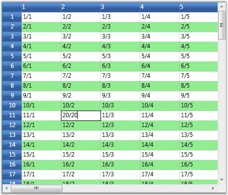

::: {style="DISPLAY: none"}
{#d2h_url_template}{#d2h_package_url style="WIDTH: 0px; DISPLAY: none; HEIGHT: 0px"}
:::

:::: {.d2h_secondary_topic style="PADDING-BOTTOM: 10pt; MARGIN: 0pt; PADDING-LEFT: 0pt; PADDING-RIGHT: 0pt; PADDING-TOP: 0pt"}
#### QueryCellInfo and CommitCellInfo {#querycellinfo-and-commitcellinfo style="tab-stops: 0pt"}

[]{#p217}These events are widely used to allow customization of each and every cell in the required format. QueryCellInfo accepts an argument of type GridQueryCellInfoEventArgs and CommitCellInfo accepts an argument of type GridCommitCellInfoEventArgs. The table  below  lists the customization properties exposed by these two event arguments.

 

::: {align="center"}
  ---------- --------------------------------------------------------------------------
  Property   Description
  Cell       Gives the cell co-ordinates.
  Style      Specifies the style for the cell represented by the above Cell property.
  ---------- --------------------------------------------------------------------------
:::

 

These events are essential to operate the grid in virtual mode, where:

 

[·      ]{style="FONT-FAMILY: Symbol"}QueryCellInfo is used to provide the cell values on demand and,

[·      ]{style="FONT-FAMILY: Symbol"}Changes made in the grid will be saved back by the CommitCellInfo event.

 

The QueryCellInfo is used to completely customize the grid cells. The code  below sets up a Virtual Grid by applying these events and also paints alternate rows using QueryCellInfo event. The QueryCellInfo event is raised for each cell that requires redrawing.

 

Example

 

These events can be triggered using the following code:

 

+--------------------------------------------------------------------------------------------------------------------------------------------------------------------------------------------------------------------------------+
| [\[C#\]]{style="FONT-FAMILY: 'Courier New'; COLOR: black"}                                                                                                                                                                     |
|                                                                                                                                                                                                                                |
| []{style="FONT-FAMILY: 'Courier New'; COLOR: blue"}                                                                                                                                                                            |
|                                                                                                                                                                                                                                |
| [this]{style="FONT-FAMILY: 'Courier New'; COLOR: blue"}[.grid.QueryCellInfo += [new]{style="COLOR: blue"} [GridQueryCellInfoEventHandler]{style="COLOR: #2b91af"}(grid_QueryCellInfo);]{style="FONT-FAMILY: 'Courier New'"}    |
|                                                                                                                                                                                                                                |
| [this]{style="FONT-FAMILY: 'Courier New'; COLOR: blue"}[.grid.CommitCellInfo += [new]{style="COLOR: blue"} [GridCommitCellInfoEventHandler]{style="COLOR: #2b91af"}(grid_CommitCellInfo);]{style="FONT-FAMILY: 'Courier New'"} |
+--------------------------------------------------------------------------------------------------------------------------------------------------------------------------------------------------------------------------------+

[]{style="COLOR: #15428b"} 

Event Handlers

[]{style="COLOR: #15428b"} 

+---------------------------------------------------------------------------------------------------------------------------------------------------------------------------------------------------------------------------------------------------------------------------------------------------------------------------------------------------+
| [\[C#\]]{style="FONT-FAMILY: 'Courier New'; COLOR: black"}                                                                                                                                                                                                                                                                                        |
|                                                                                                                                                                                                                                                                                                                                                   |
| []{style="FONT-FAMILY: 'Courier New'; COLOR: blue"}                                                                                                                                                                                                                                                                                               |
|                                                                                                                                                                                                                                                                                                                                                   |
| [Dictionary]{style="FONT-FAMILY: 'Courier New'; COLOR: #2b91af"}[\<[RowColumnIndex]{style="COLOR: #2b91af"}, [object]{style="COLOR: blue"}\> committedValues = [new]{style="COLOR: blue"} [Dictionary]{style="COLOR: #2b91af"}\<[RowColumnIndex]{style="COLOR: #2b91af"}, [object]{style="COLOR: blue"}\>();]{style="FONT-FAMILY: 'Courier New'"} |
|                                                                                                                                                                                                                                                                                                                                                   |
| [void]{style="FONT-FAMILY: 'Courier New'; COLOR: blue"}[ grid_QueryCellInfo([object]{style="COLOR: blue"} sender, GridQueryCellInfoEventArgs e)]{style="FONT-FAMILY: 'Courier New'"}                                                                                                                                                              |
|                                                                                                                                                                                                                                                                                                                                                   |
| [{]{style="FONT-FAMILY: 'Courier New'"}                                                                                                                                                                                                                                                                                                           |
|                                                                                                                                                                                                                                                                                                                                                   |
| [    [if]{style="COLOR: blue"} (e.Cell.ColumnIndex \> 0 && e.Cell.RowIndex \> 0)]{style="FONT-FAMILY: 'Courier New'"}                                                                                                                                                                                                                             |
|                                                                                                                                                                                                                                                                                                                                                   |
| [        [if]{style="COLOR: blue"} (e.Cell.RowIndex % 2 == 0)]{style="FONT-FAMILY: 'Courier New'"}                                                                                                                                                                                                                                                |
|                                                                                                                                                                                                                                                                                                                                                   |
| [            e.Style.Background = Brushes.LightGreen;]{style="FONT-FAMILY: 'Courier New'"}                                                                                                                                                                                                                                                        |
|                                                                                                                                                                                                                                                                                                                                                   |
| []{style="FONT-FAMILY: 'Courier New'"}                                                                                                                                                                                                                                                                                                            |
|                                                                                                                                                                                                                                                                                                                                                   |
| [    [if]{style="COLOR: blue"} (e.Cell.RowIndex == 0)]{style="FONT-FAMILY: 'Courier New'"}                                                                                                                                                                                                                                                        |
|                                                                                                                                                                                                                                                                                                                                                   |
| [    {]{style="FONT-FAMILY: 'Courier New'"}                                                                                                                                                                                                                                                                                                       |
|                                                                                                                                                                                                                                                                                                                                                   |
| [        [if]{style="COLOR: blue"} (e.Cell.ColumnIndex \> 0)]{style="FONT-FAMILY: 'Courier New'"}                                                                                                                                                                                                                                                 |
|                                                                                                                                                                                                                                                                                                                                                   |
| [            e.Style.CellValue = e.Cell.ColumnIndex;]{style="FONT-FAMILY: 'Courier New'"}                                                                                                                                                                                                                                                         |
|                                                                                                                                                                                                                                                                                                                                                   |
| [    }]{style="FONT-FAMILY: 'Courier New'"}                                                                                                                                                                                                                                                                                                       |
|                                                                                                                                                                                                                                                                                                                                                   |
| [    [else]{style="COLOR: blue"} [if]{style="COLOR: blue"} (e.Cell.RowIndex \> 0)]{style="FONT-FAMILY: 'Courier New'"}                                                                                                                                                                                                                            |
|                                                                                                                                                                                                                                                                                                                                                   |
| [    {]{style="FONT-FAMILY: 'Courier New'"}                                                                                                                                                                                                                                                                                                       |
|                                                                                                                                                                                                                                                                                                                                                   |
| [        [if]{style="COLOR: blue"} (e.Cell.ColumnIndex == 0)]{style="FONT-FAMILY: 'Courier New'"}                                                                                                                                                                                                                                                 |
|                                                                                                                                                                                                                                                                                                                                                   |
| [            e.Style.CellValue = e.Cell.RowIndex;]{style="FONT-FAMILY: 'Courier New'"}                                                                                                                                                                                                                                                            |
|                                                                                                                                                                                                                                                                                                                                                   |
| [        [else]{style="COLOR: blue"} [if]{style="COLOR: blue"} (e.Cell.ColumnIndex \> 0)]{style="FONT-FAMILY: 'Courier New'"}                                                                                                                                                                                                                     |
|                                                                                                                                                                                                                                                                                                                                                   |
| [        {]{style="FONT-FAMILY: 'Courier New'"}                                                                                                                                                                                                                                                                                                   |
|                                                                                                                                                                                                                                                                                                                                                   |
| [            [if]{style="COLOR: blue"} (committedValues.ContainsKey(e.Cell))]{style="FONT-FAMILY: 'Courier New'"}                                                                                                                                                                                                                                 |
|                                                                                                                                                                                                                                                                                                                                                   |
| [                e.Style.CellValue = committedValues\[e.Cell\];]{style="FONT-FAMILY: 'Courier New'"}                                                                                                                                                                                                                                              |
|                                                                                                                                                                                                                                                                                                                                                   |
| [            [else]{style="COLOR: blue"}]{style="FONT-FAMILY: 'Courier New'"}                                                                                                                                                                                                                                                                     |
|                                                                                                                                                                                                                                                                                                                                                   |
| [                e.Style.CellValue = String.Format([\"{0}/{1}\"]{style="COLOR: #a31515"}, e.Cell.RowIndex, e.Cell.ColumnIndex);]{style="FONT-FAMILY: 'Courier New'"}                                                                                                                                                                              |
|                                                                                                                                                                                                                                                                                                                                                   |
| [        }]{style="FONT-FAMILY: 'Courier New'"}                                                                                                                                                                                                                                                                                                   |
|                                                                                                                                                                                                                                                                                                                                                   |
| [    }]{style="FONT-FAMILY: 'Courier New'"}                                                                                                                                                                                                                                                                                                       |
|                                                                                                                                                                                                                                                                                                                                                   |
| [}]{style="FONT-FAMILY: 'Courier New'"}                                                                                                                                                                                                                                                                                                           |
|                                                                                                                                                                                                                                                                                                                                                   |
| []{style="FONT-FAMILY: 'Courier New'"}                                                                                                                                                                                                                                                                                                            |
|                                                                                                                                                                                                                                                                                                                                                   |
| [void]{style="FONT-FAMILY: 'Courier New'; COLOR: blue"}[ grid_CommitCellInfo([object]{style="COLOR: blue"} sender, GridCommitCellInfoEventArgs e)]{style="FONT-FAMILY: 'Courier New'"}                                                                                                                                                            |
|                                                                                                                                                                                                                                                                                                                                                   |
| [{]{style="FONT-FAMILY: 'Courier New'"}                                                                                                                                                                                                                                                                                                           |
|                                                                                                                                                                                                                                                                                                                                                   |
| [    [if]{style="COLOR: blue"} (e.Style.HasCellValue)]{style="FONT-FAMILY: 'Courier New'"}                                                                                                                                                                                                                                                        |
|                                                                                                                                                                                                                                                                                                                                                   |
| [    {]{style="FONT-FAMILY: 'Courier New'"}                                                                                                                                                                                                                                                                                                       |
|                                                                                                                                                                                                                                                                                                                                                   |
| [        committedValues\[e.Cell\] = e.Style.CellValue;]{style="FONT-FAMILY: 'Courier New'"}                                                                                                                                                                                                                                                      |
|                                                                                                                                                                                                                                                                                                                                                   |
| [        e.Handled = [true]{style="COLOR: blue"};]{style="FONT-FAMILY: 'Courier New'"}                                                                                                                                                                                                                                                            |
|                                                                                                                                                                                                                                                                                                                                                   |
| [    }]{style="FONT-FAMILY: 'Courier New'"}                                                                                                                                                                                                                                                                                                       |
|                                                                                                                                                                                                                                                                                                                                                   |
| [}]{style="FONT-FAMILY: 'Courier New'"}                                                                                                                                                                                                                                                                                                           |
+---------------------------------------------------------------------------------------------------------------------------------------------------------------------------------------------------------------------------------------------------------------------------------------------------------------------------------------------------+

[]{style="COLOR: #15428b"} 

Output

**[]{style="COLOR: #15428b"}** 

The following output is generated using the code above.

[]{style="COLOR: #15428b"} 

[{border="0"}]{style="COLOR: #15428b"}[]{style="COLOR: #15428b"}

Figure 95: QueryCellInfo and CommitCellInfo

 

 

[]{#related-topics}
::::
