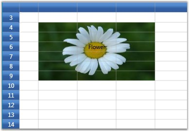

::: {style="DISPLAY: none"}
{#d2h_url_template}{#d2h_package_url style="WIDTH: 0px; DISPLAY: none; HEIGHT: 0px"}
:::

:::: {.d2h_secondary_topic style="PADDING-BOTTOM: 10pt; MARGIN: 0pt; PADDING-LEFT: 0pt; PADDING-RIGHT: 0pt; PADDING-TOP: 0pt"}
#### QueryCellSpanBackgrounds {#querycellspanbackgrounds style="tab-stops: 0pt"}

[]{style="FONT-FAMILY: 'Trebuchet MS','sans-serif'; COLOR: #15428b; FONT-SIZE: 9pt"} 

This event lets you create cell spans and customize their backgrounds. It receives an argument of type GridQueryCellSpanBackgroundsEventArgs containing the following properties.

[]{style="FONT-FAMILY: 'Trebuchet MS','sans-serif'; COLOR: #15428b; FONT-SIZE: 9pt"} 

::: {align="center"}
  -------------------- ---------------------------------------------
  Property             Description
  CellRowColumnIndex   Represents the cell row and column indices.
  Range                Defines the covered range for the cell.
  -------------------- ---------------------------------------------
:::

[]{style="FONT-FAMILY: 'Trebuchet MS','sans-serif'; COLOR: #15428b; FONT-SIZE: 9pt"} 

Example

**[]{style="FONT-FAMILY: 'Trebuchet MS','sans-serif'; COLOR: #15428b; FONT-SIZE: 9pt"}** 

This event can be triggered using the following code:

[]{style="FONT-FAMILY: 'Trebuchet MS','sans-serif'; COLOR: #15428b; FONT-SIZE: 9pt"} 

+-------------------------------------------------------------------------------------------------------------------------------------------------------------------------------------------------------+
| **[\[C#\]]{style="FONT-FAMILY: 'Courier New'; COLOR: black"}**                                                                                                                                        |
|                                                                                                                                                                                                       |
| []{style="FONT-FAMILY: 'Courier New'"}                                                                                                                                                                |
|                                                                                                                                                                                                       |
| [grid.QueryCellSpanBackgrounds += [new]{style="COLOR: blue"} [GridQueryCellSpanBackgroundsEventHandler ]{style="COLOR: #2b91af"}(grid_QueryCellSpanBackgrounds);]{style="FONT-FAMILY: 'Courier New'"} |
+-------------------------------------------------------------------------------------------------------------------------------------------------------------------------------------------------------+

[]{style="FONT-FAMILY: 'Trebuchet MS','sans-serif'; COLOR: #15428b; FONT-SIZE: 9pt"} 

Event Handler

[]{style="FONT-FAMILY: 'Trebuchet MS','sans-serif'; COLOR: #15428b; FONT-SIZE: 9pt"} 

+------------------------------------------------------------------------------------------------------------------------------------------------------------------------------------------------------------+
| **[\[C#\]]{style="FONT-FAMILY: 'Courier New'; COLOR: black"}**                                                                                                                                             |
|                                                                                                                                                                                                            |
| []{style="FONT-FAMILY: 'Courier New'"}                                                                                                                                                                     |
|                                                                                                                                                                                                            |
| [void]{style="FONT-FAMILY: 'Courier New'; COLOR: blue"}[ grid_QueryCellSpanBackgrounds([object]{style="COLOR: blue"} sender, GridQueryCellSpanBackgroundsEventArgs e)]{style="FONT-FAMILY: 'Courier New'"} |
|                                                                                                                                                                                                            |
| [{]{style="FONT-FAMILY: 'Courier New'"}                                                                                                                                                                    |
|                                                                                                                                                                                                            |
| [    [if]{style="COLOR: blue"} (e.CellRowColumnIndex.ColumnIndex == 2 && e.CellRowColumnIndex.RowIndex == 4)]{style="FONT-FAMILY: 'Courier New'"}                                                          |
|                                                                                                                                                                                                            |
| [    {]{style="FONT-FAMILY: 'Courier New'"}                                                                                                                                                                |
|                                                                                                                                                                                                            |
| [        CellSpanBackgroundInfo item = [new]{style="COLOR: blue"} CellSpanBackgroundInfo(e.CellRowColumnIndex.RowIndex, e.CellRowColumnIndex.ColumnIndex, 9, 4);]{style="FONT-FAMILY: 'Courier New'"}      |
|                                                                                                                                                                                                            |
| [        item.Background = [new]{style="COLOR: blue"} ImageBrush(GetImage([@\"common\\Images\\Grid\\BannerCells\\back2.jpg\"]{style="COLOR: #a31515"}));]{style="FONT-FAMILY: 'Courier New'"}              |
|                                                                                                                                                                                                            |
| [        e.Range = [new]{style="COLOR: blue"} List\<CellSpanBackgroundInfo\>();]{style="FONT-FAMILY: 'Courier New'"}                                                                                       |
|                                                                                                                                                                                                            |
| [        e.Range.Add(item);]{style="FONT-FAMILY: 'Courier New'"}                                                                                                                                           |
|                                                                                                                                                                                                            |
| [        e.Handled = [true]{style="COLOR: blue"};]{style="FONT-FAMILY: 'Courier New'"}                                                                                                                     |
|                                                                                                                                                                                                            |
| [    }]{style="FONT-FAMILY: 'Courier New'"}                                                                                                                                                                |
|                                                                                                                                                                                                            |
| [}]{style="FONT-FAMILY: 'Courier New'"}                                                                                                                                                                    |
+------------------------------------------------------------------------------------------------------------------------------------------------------------------------------------------------------------+

[]{style="FONT-FAMILY: 'Trebuchet MS','sans-serif'; COLOR: #15428b; FONT-SIZE: 9pt"} 

Output

**[]{style="FONT-FAMILY: 'Trebuchet MS','sans-serif'; COLOR: #15428b; FONT-SIZE: 9pt"}** 

The following output is generated using the code above.

[]{style="FONT-FAMILY: 'Trebuchet MS','sans-serif'; COLOR: #15428b; FONT-SIZE: 9pt"} 

{border="0"}

[]{style="FONT-FAMILY: 'Trebuchet MS','sans-serif'; COLOR: #15428b; FONT-SIZE: 9pt"} 

Figure 50: QueryCellSpanBackgrounds

[]{#p201} 

[]{#related-topics}
::::
