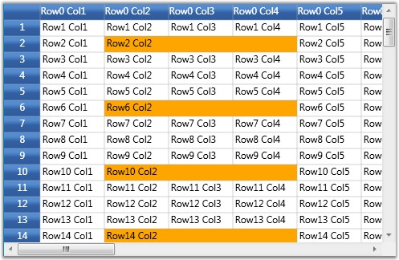

::: {style="DISPLAY: none"}
{#d2h_url_template}{#d2h_package_url style="WIDTH: 0px; DISPLAY: none; HEIGHT: 0px"}
:::

:::: {.d2h_secondary_topic style="PADDING-BOTTOM: 10pt; MARGIN: 0pt; PADDING-LEFT: 0pt; PADDING-RIGHT: 0pt; PADDING-TOP: 0pt"}
#### QueryCoveredRange[]{#p219} {#querycoveredrange style="tab-stops: 0pt"}

This event is used to define covered ranges in the required cells. It receives an argument of type GridQueryCoveredRangeEventArgs containing the following information about the event.

 

::: {align="center"}
  -------------------- ---------------------------------------------
  Property             Description
  CellRowColumnIndex   Represents the cell row and column indices.
  Range                Defines the covered range for the cell.
  -------------------- ---------------------------------------------
:::

 

Example

 

This event can be triggered using the following code:

 

+-----------------------------------------------------------------------------------------------------------------------------------------------------------------------------+
| [\[C#\]]{style="FONT-FAMILY: 'Courier New'; COLOR: black"}                                                                                                                  |
|                                                                                                                                                                             |
| []{style="FONT-FAMILY: 'Courier New'"}                                                                                                                                      |
|                                                                                                                                                                             |
| [grid.QueryCoveredRange += [new]{style="COLOR: blue"} [GridQueryBaseStylesEventArgs]{style="COLOR: #2b91af"} (grid_QueryCoveredRange);]{style="FONT-FAMILY: 'Courier New'"} |
+-----------------------------------------------------------------------------------------------------------------------------------------------------------------------------+

 

Event Handler

 

+--------------------------------------------------------------------------------------------------------------------------------------------------------------------------------------------+
| [\[C#\]]{style="FONT-FAMILY: 'Courier New'; COLOR: black"}                                                                                                                                 |
|                                                                                                                                                                                            |
| []{style="FONT-FAMILY: 'Courier New'"}                                                                                                                                                     |
|                                                                                                                                                                                            |
| [void]{style="FONT-FAMILY: 'Courier New'; COLOR: blue"}[ grid_QueryCoveredRange([object]{style="COLOR: blue"} sender, GridQueryBaseStylesEventArgs e)]{style="FONT-FAMILY: 'Courier New'"} |
|                                                                                                                                                                                            |
| [{]{style="FONT-FAMILY: 'Courier New'"}                                                                                                                                                    |
|                                                                                                                                                                                            |
| [    [// Combine column 2 to 4 on every 4th row.]{style="COLOR: green"}]{style="FONT-FAMILY: 'Courier New'"}                                                                               |
|                                                                                                                                                                                            |
| [    [if]{style="COLOR: blue"} (e.CellRowColumnIndex.RowIndex % 4 == 2)]{style="FONT-FAMILY: 'Courier New'"}                                                                               |
|                                                                                                                                                                                            |
| [    {]{style="FONT-FAMILY: 'Courier New'"}                                                                                                                                                |
|                                                                                                                                                                                            |
| [        [if]{style="COLOR: blue"} (e.CellRowColumnIndex.ColumnIndex \>= 2 && e.CellRowColumnIndex.ColumnIndex \<= 4)]{style="FONT-FAMILY: 'Courier New'"}                                 |
|                                                                                                                                                                                            |
| [        {]{style="FONT-FAMILY: 'Courier New'"}                                                                                                                                            |
|                                                                                                                                                                                            |
| [            e.Range = [new]{style="COLOR: blue"} CoveredCellInfo (e.CellRowColumnIndex.RowIndex, 2, e.CellRowColumnIndex.RowIndex, 4);]{style="FONT-FAMILY: 'Courier New'"}               |
|                                                                                                                                                                                            |
| [            e.Handled = [true]{style="COLOR: blue"};]{style="FONT-FAMILY: 'Courier New'"}                                                                                                 |
|                                                                                                                                                                                            |
| [        }]{style="FONT-FAMILY: 'Courier New'"}                                                                                                                                            |
|                                                                                                                                                                                            |
| [    }]{style="FONT-FAMILY: 'Courier New'"}                                                                                                                                                |
|                                                                                                                                                                                            |
| [}]{style="FONT-FAMILY: 'Courier New'"}                                                                                                                                                    |
+--------------------------------------------------------------------------------------------------------------------------------------------------------------------------------------------+

 

Output

 

The following output is generated using the code above.

 

{border="0"}

Figure 97: QueryCoveredRange

 

 

 

[]{#related-topics}
::::
