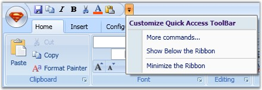
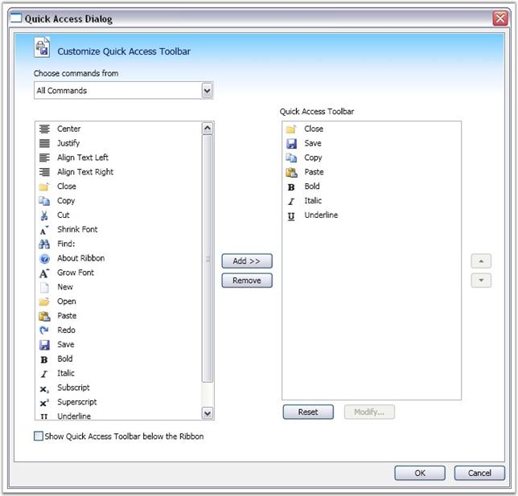

::: {style="DISPLAY: none"}
{#d2h_url_template}{#d2h_package_url style="WIDTH: 0px; DISPLAY: none; HEIGHT: 0px"}
:::

::: {.d2h_secondary_topic style="PADDING-BOTTOM: 10pt; MARGIN: 0pt; PADDING-LEFT: 0pt; PADDING-RIGHT: 0pt; PADDING-TOP: 0pt"}
#### Quick Access Toolbar {#quick-access-toolbar style="tab-stops: 0pt"}

 

Quick Access Toolbar in the ribbon instance is used to group the most commonly used commands and access the commands easily without having to search for the command in the menu bar. QAT is easily customized using the built-in context menu and is placed above or below the ribbon.

[]{style="FONT-FAMILY: 'Trebuchet MS','sans-serif'; COLOR: #15428b; FONT-SIZE: 9pt"} 

{border="0"}

[]{style="FONT-FAMILY: 'Trebuchet MS','sans-serif'; COLOR: #15428b; FONT-SIZE: 9pt"} 

Figure 860: Customizing the Quick Access Toolbar using the Built-In Context Menu

[]{style="FONT-FAMILY: 'Trebuchet MS','sans-serif'; COLOR: #15428b; FONT-SIZE: 9pt"} 

Common application commands like Save, Close, Print, and so on, are executed on the click of a button using the Command property of the ribbon button. Use the below code to add items to the Quick Access Toolbar.

[]{style="FONT-FAMILY: 'Trebuchet MS','sans-serif'; COLOR: #15428b; FONT-SIZE: 9pt"} 

+-----------------------------------------------------------------------------------------------------------------------------------------------------------------------------------------------------------------------------------------------------------------------------------------------------------------------------------------------------------------------------------------------------+
| **[\[XAML\]]{style="FONT-FAMILY: 'Courier New'; COLOR: black"}**                                                                                                                                                                                                                                                                                                                                    |
|                                                                                                                                                                                                                                                                                                                                                                                                     |
| []{style="COLOR: black; FONT-SIZE: 9pt"}                                                                                                                                                                                                                                                                                                                                                            |
|                                                                                                                                                                                                                                                                                                                                                                                                     |
| [\<]{style="FONT-FAMILY: 'Courier New'; COLOR: blue; FONT-SIZE: 9pt"}[ribbon]{style="FONT-FAMILY: 'Courier New'; COLOR: maroon; FONT-SIZE: 9pt"}[:]{style="FONT-FAMILY: 'Courier New'; COLOR: blue; FONT-SIZE: 9pt"}[Ribbon.QuickAccessToolBar]{style="FONT-FAMILY: 'Courier New'; COLOR: maroon; FONT-SIZE: 9pt"}[\>]{style="FONT-FAMILY: 'Courier New'; COLOR: blue; FONT-SIZE: 9pt"}             |
|                                                                                                                                                                                                                                                                                                                                                                                                     |
| [   [\<]{style="COLOR: blue"}[ribbon]{style="COLOR: maroon"}[:]{style="COLOR: blue"}[QuickAccessToolBar]{style="COLOR: maroon"}[\>]{style="COLOR: blue"}]{style="FONT-FAMILY: 'Courier New'; FONT-SIZE: 9pt"}                                                                                                                                                                                       |
|                                                                                                                                                                                                                                                                                                                                                                                                     |
| [          [\<]{style="COLOR: blue"}[ribbon]{style="COLOR: maroon"}[:]{style="COLOR: blue"}[RibbonButton]{style="COLOR: maroon"} [ribbon]{style="COLOR: maroon"}[:]{style="COLOR: blue"}[Ribbon.KeyTip]{style="COLOR: red"}[=\"1\"]{style="COLOR: blue"} [Command]{style="COLOR: red"}[=\"ApplicationCommands.Close\"/\>]{style="COLOR: blue"}]{style="FONT-FAMILY: 'Courier New'; FONT-SIZE: 9pt"} |
|                                                                                                                                                                                                                                                                                                                                                                                                     |
| [          [\<]{style="COLOR: blue"}[ribbon]{style="COLOR: maroon"}[:]{style="COLOR: blue"}[RibbonButton]{style="COLOR: maroon"} [ribbon]{style="COLOR: maroon"}[:]{style="COLOR: blue"}[Ribbon.KeyTip]{style="COLOR: red"}[=\"2\"]{style="COLOR: blue"} [Command]{style="COLOR: red"}[=\"ApplicationCommands.Save\"\>]{style="COLOR: blue"}]{style="FONT-FAMILY: 'Courier New'; FONT-SIZE: 9pt"}   |
|                                                                                                                                                                                                                                                                                                                                                                                                     |
| [   [\</]{style="COLOR: blue"}[ribbon]{style="COLOR: maroon"}[:]{style="COLOR: blue"}[QuickAccessToolBar]{style="COLOR: maroon"}[\>]{style="COLOR: blue"}]{style="FONT-FAMILY: 'Courier New'; FONT-SIZE: 9pt"}                                                                                                                                                                                      |
|                                                                                                                                                                                                                                                                                                                                                                                                     |
| [\</]{style="FONT-FAMILY: 'Courier New'; COLOR: blue; FONT-SIZE: 9pt"}[ribbon]{style="FONT-FAMILY: 'Courier New'; COLOR: maroon; FONT-SIZE: 9pt"}[:]{style="FONT-FAMILY: 'Courier New'; COLOR: blue; FONT-SIZE: 9pt"}[Ribbon.QuickAccessToolBar]{style="FONT-FAMILY: 'Courier New'; COLOR: maroon; FONT-SIZE: 9pt"}[\>]{style="FONT-FAMILY: 'Courier New'; COLOR: blue; FONT-SIZE: 9pt"}            |
+-----------------------------------------------------------------------------------------------------------------------------------------------------------------------------------------------------------------------------------------------------------------------------------------------------------------------------------------------------------------------------------------------------+

[]{style="FONT-FAMILY: 'Trebuchet MS','sans-serif'; COLOR: #15428b; FONT-SIZE: 9pt"} 

+---------------------------------------------------------------------------------------------------------------------------------------------------------------------------------------------------------------------------------------------------------------------------------------------------------+
| **[\[C#\]]{style="FONT-FAMILY: 'Courier New'; COLOR: black"}**                                                                                                                                                                                                                                          |
|                                                                                                                                                                                                                                                                                                         |
| []{style="COLOR: black; FONT-SIZE: 9pt"}                                                                                                                                                                                                                                                                |
|                                                                                                                                                                                                                                                                                                         |
| [RibbonButton]{style="FONT-FAMILY: 'Courier New'; COLOR: #2b91af; FONT-SIZE: 9pt"}[ rr = [new]{style="COLOR: blue"} [RibbonButton]{style="COLOR: #2b91af"}();]{style="FONT-FAMILY: 'Courier New'; FONT-SIZE: 9pt"}                                                                                      |
|                                                                                                                                                                                                                                                                                                         |
| [rr.SmallIcon = [new]{style="COLOR: blue"} [BitmapImage]{style="COLOR: #2b91af"}([new]{style="COLOR: blue"} [Uri]{style="COLOR: #2b91af"}([\"/../SampleImages/Bold16.png\"]{style="COLOR: #a31515"}, [UriKind]{style="COLOR: #2b91af"}.Relative));]{style="FONT-FAMILY: 'Courier New'; FONT-SIZE: 9pt"} |
|                                                                                                                                                                                                                                                                                                         |
| [rr.SizeForm = [SizeForm]{style="COLOR: #2b91af"}.ExtraSmall;]{style="FONT-FAMILY: 'Courier New'; FONT-SIZE: 9pt"}                                                                                                                                                                                      |
|                                                                                                                                                                                                                                                                                                         |
| [RibbonWindow.QuickAccessToolBar.Items.Add(rr);]{style="FONT-FAMILY: 'Courier New'; FONT-SIZE: 9pt"}                                                                                                                                                                                                    |
+---------------------------------------------------------------------------------------------------------------------------------------------------------------------------------------------------------------------------------------------------------------------------------------------------------+

[]{style="FONT-FAMILY: 'Trebuchet MS','sans-serif'; COLOR: #15428b; FONT-SIZE: 9pt"} 

Adding items using Quick Access Dialog

 

Commands are added to Quick Access Toolbar using the Quick Access Dialog. Quick Access Dialog is enabled by selecting more commands option in the context menu of QAT. The Quick Access Dialog displays the list of all available commands in the application. You can insert commands in the Quick Access Toolbar by adding the commands to the right pane of the Quick Access Dialog.

[]{style="FONT-FAMILY: 'Trebuchet MS','sans-serif'; COLOR: #15428b; FONT-SIZE: 9pt"} 

{border="0"}

 

Figure 861: Commands Added to the Quick Access Toolbar

***[]{style="FONT-FAMILY: 'Trebuchet MS','sans-serif'; COLOR: #15428b; FONT-SIZE: 9pt"}*** 

See Also

[]{style="FONT-FAMILY: 'Trebuchet MS','sans-serif'; COLOR: #15428b; FONT-SIZE: 9pt"} 

[[Menu Item Synchronization]{.UGHyperlink}](ms-xhelp:///?Id=3df34054-b133-4df3-9e37-5adcb6199a00)[]{.UGHyperlink}

 

[]{#p459} 

More:

[ ]{#related-topics}

[{border="0" align="absMiddle"}Menu Item Synchronization](ms-xhelp:///?Id=3df34054-b133-4df3-9e37-5adcb6199a00){style="TEXT-DECORATION: none"}
:::
