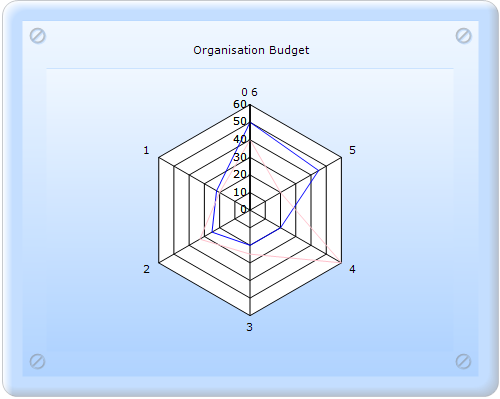
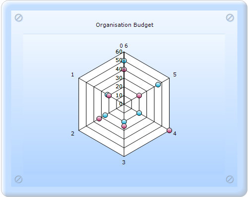

::: {style="DISPLAY: none"}
{#d2h_url_template}{#d2h_package_url style="WIDTH: 0px; DISPLAY: none; HEIGHT: 0px"}
:::

:::: {.d2h_secondary_topic style="PADDING-BOTTOM: 10pt; MARGIN: 0pt; PADDING-LEFT: 0pt; PADDING-RIGHT: 0pt; PADDING-TOP: 0pt"}
#### RadarType {#radartype style="tab-stops: 0pt"}

RadarType indicates the type of Radar chart to be rendered.

 

::: {align="center"}
+-------------------------------------+--------------------------------------------------------------------------------------------------------------+
| Details                                                                                                                                            |
+-------------------------------------+--------------------------------------------------------------------------------------------------------------+
| Possible values                     | **Area** - Renders the Radar chart such that the points are connected and the enclosed region is filled.     |
|                                     |                                                                                                              |
|                                     | **Line** - Renders the Radar chart such that the points are connected but the enclosed region is not filled. |
|                                     |                                                                                                              |
|                                     | **Symbol** - Points are rendered with the associated symbols.                                                |
+-------------------------------------+--------------------------------------------------------------------------------------------------------------+
| Default value                       | Area                                                                                                         |
+-------------------------------------+--------------------------------------------------------------------------------------------------------------+
| 2D/3D limitations                   | No                                                                                                           |
+-------------------------------------+--------------------------------------------------------------------------------------------------------------+
| Application to chart element        | Any series                                                                                                   |
+-------------------------------------+--------------------------------------------------------------------------------------------------------------+
| Application to chart types          | Polar chart and Radar chart.                                                                                 |
+-------------------------------------+--------------------------------------------------------------------------------------------------------------+
:::

{border="0"}

Figure 213: Radar chart with RadarType Line

[]{style="FONT-FAMILY: 'Times New Roman','serif'; FONT-SIZE: 12pt"} 

{border="0"}\
Figure 214: Radar chart with RadarType Symbol

More:

[ ]{#related-topics}

[{border="0" align="absMiddle"}Implementation](ms-xhelp:///?Id=15411048-c9d9-4cd3-b937-8a16b2334585){style="TEXT-DECORATION: none"}
::::
