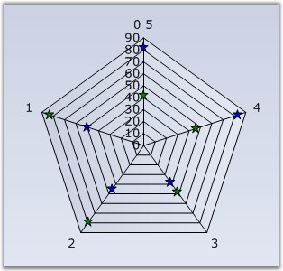

::: {style="DISPLAY: none"}
{#d2h_url_template}{#d2h_package_url style="WIDTH: 0px; DISPLAY: none; HEIGHT: 0px"}
:::

:::: {.d2h_secondary_topic style="PADDING-BOTTOM: 10pt; MARGIN: 0pt; PADDING-LEFT: 0pt; PADDING-RIGHT: 0pt; PADDING-TOP: 0pt"}
#### Radar Type {#radar-type style="tab-stops: 0pt"}

 

Indicates the type of radar chart to be rendered.

 

::: {align="center"}
+-------------------------------------+----------------------------------------------------------------------------------------------------------------------------------------------------+
|                                                                                                                                                                                          |
|                                                                                                                                                                                          |
| Details                                                                                                                                                                                  |
+-------------------------------------+----------------------------------------------------------------------------------------------------------------------------------------------------+
| **Possible Values**                 | [·      ]{style="FONT-FAMILY: Symbol"}**Area** - Renders the radar chart such that the points are connected and the enclosed region is not filled. |
|                                     |                                                                                                                                                    |
|                                     | [·      ]{style="FONT-FAMILY: Symbol"}**Line** - Renders the radar chart such that the points are connected but the enclosed region is not filled. |
|                                     |                                                                                                                                                    |
|                                     | [·      ]{style="FONT-FAMILY: Symbol"}**Symbol** - Points are rendered with the associated symbols                                                 |
+-------------------------------------+----------------------------------------------------------------------------------------------------------------------------------------------------+
| **Default Value    **               | **Area**                                                                                                                                           |
+-------------------------------------+----------------------------------------------------------------------------------------------------------------------------------------------------+
| **2D / 3D Limitations**             | No                                                                                                                                                 |
+-------------------------------------+----------------------------------------------------------------------------------------------------------------------------------------------------+
| **Applies to Chart Element**        | Any series                                                                                                                                         |
+-------------------------------------+----------------------------------------------------------------------------------------------------------------------------------------------------+
| **Applies to Chart Types**          | Polar and Radar Chart                                                                                                                              |
+-------------------------------------+----------------------------------------------------------------------------------------------------------------------------------------------------+
:::

 

Here is code snippet using RadarType.

 

+------------------------------------------------------------------------------------------------------------------------------------------------------------------------------------------------------------------------------------------------------------------------------------------------------+
| **[\[C#\]]{style="FONT-FAMILY: 'Courier New'; COLOR: black"}**                                                                                                                                                                                                                                       |
|                                                                                                                                                                                                                                                                                                      |
| **[]{style="FONT-FAMILY: 'Courier New'; COLOR: black"}**                                                                                                                                                                                                                                             |
|                                                                                                                                                                                                                                                                                                      |
| [this]{style="FONT-FAMILY: 'Courier New'; COLOR: blue"}[.chartControl1.Series\[0\].ConfigItems.RadarItem.Type = ]{style="FONT-FAMILY: 'Courier New'; COLOR: black"}[ChartRadarDrawType]{style="FONT-FAMILY: 'Courier New'; COLOR: teal"}[.Symbol;]{style="FONT-FAMILY: 'Courier New'; COLOR: black"} |
|                                                                                                                                                                                                                                                                                                      |
| [this]{style="FONT-FAMILY: 'Courier New'; COLOR: blue"}[.chartControl1.Series\[1\].ConfigItems.RadarItem.Type = ]{style="FONT-FAMILY: 'Courier New'; COLOR: black"}[ChartRadarDrawType]{style="FONT-FAMILY: 'Courier New'; COLOR: teal"}[.Symbol;]{style="FONT-FAMILY: 'Courier New'; COLOR: black"} |
|                                                                                                                                                                                                                                                                                                      |
| [this]{style="FONT-FAMILY: 'Courier New'; COLOR: blue"}[.chartControl1.Series\[0\].Style.Symbol.Shape = ]{style="FONT-FAMILY: 'Courier New'; COLOR: black"}[ChartSymbolShape]{style="FONT-FAMILY: 'Courier New'; COLOR: teal"}[.Star;]{style="FONT-FAMILY: 'Courier New'; COLOR: black"}             |
|                                                                                                                                                                                                                                                                                                      |
| [this]{style="FONT-FAMILY: 'Courier New'; COLOR: blue"}[.chartControl1.Series\[1\].Style.Symbol.Shape = ]{style="FONT-FAMILY: 'Courier New'; COLOR: black"}[ChartSymbolShape]{style="FONT-FAMILY: 'Courier New'; COLOR: teal"}[.Star;]{style="FONT-FAMILY: 'Courier New'; COLOR: black"}             |
|                                                                                                                                                                                                                                                                                                      |
| [this]{style="FONT-FAMILY: 'Courier New'; COLOR: blue"}[.chartControl1.Series\[0\].Style.Symbol.Color =]{style="FONT-FAMILY: 'Courier New'; COLOR: black"}[ Color]{style="FONT-FAMILY: 'Courier New'; COLOR: teal"}[.Blue;]{style="FONT-FAMILY: 'Courier New'; COLOR: black"}                        |
|                                                                                                                                                                                                                                                                                                      |
| [this]{style="FONT-FAMILY: 'Courier New'; COLOR: blue"}[.chartControl1.Series\[1\].Style.Symbol.Color = ]{style="FONT-FAMILY: 'Courier New'; COLOR: black"}[Color]{style="FONT-FAMILY: 'Courier New'; COLOR: teal"}[.Green;]{style="FONT-FAMILY: 'Courier New'; COLOR: black"}                       |
+------------------------------------------------------------------------------------------------------------------------------------------------------------------------------------------------------------------------------------------------------------------------------------------------------+

 

+---------------------------------------------------------------------------------------------------------------------------------------------------------------------------------------------------------------------------------------------------------------------------------------------------------+
| **[\[VB.NET\]]{style="FONT-FAMILY: 'Courier New'; COLOR: black"}**                                                                                                                                                                                                                                      |
|                                                                                                                                                                                                                                                                                                         |
| **[]{style="FONT-FAMILY: 'Courier New'; COLOR: black"}**                                                                                                                                                                                                                                                |
|                                                                                                                                                                                                                                                                                                         |
| [Private Me]{style="FONT-FAMILY: 'Courier New'; COLOR: blue"}[.chartControl1.Series(0).ConfigItems.RadarItem.Type = ]{style="FONT-FAMILY: 'Courier New'; COLOR: black"}[ChartRadarDrawType]{style="FONT-FAMILY: 'Courier New'; COLOR: teal"}[.Symbol]{style="FONT-FAMILY: 'Courier New'; COLOR: black"} |
|                                                                                                                                                                                                                                                                                                         |
| [Private Me]{style="FONT-FAMILY: 'Courier New'; COLOR: blue"}[.chartControl1.Series(1).ConfigItems.RadarItem.Type = ]{style="FONT-FAMILY: 'Courier New'; COLOR: black"}[ChartRadarDrawType]{style="FONT-FAMILY: 'Courier New'; COLOR: teal"}[.Symbol]{style="FONT-FAMILY: 'Courier New'; COLOR: black"} |
|                                                                                                                                                                                                                                                                                                         |
| [Private Me]{style="FONT-FAMILY: 'Courier New'; COLOR: blue"}[.chartControl1.Series(0).Style.Symbol.Shape = ]{style="FONT-FAMILY: 'Courier New'; COLOR: black"}[ChartSymbolShape]{style="FONT-FAMILY: 'Courier New'; COLOR: teal"}[.Star]{style="FONT-FAMILY: 'Courier New'; COLOR: black"}             |
|                                                                                                                                                                                                                                                                                                         |
| [Private Me]{style="FONT-FAMILY: 'Courier New'; COLOR: blue"}[.chartControl1.Series(1).Style.Symbol.Shape =]{style="FONT-FAMILY: 'Courier New'; COLOR: black"}[ ChartSymbolShape]{style="FONT-FAMILY: 'Courier New'; COLOR: teal"}[.Star]{style="FONT-FAMILY: 'Courier New'; COLOR: black"}             |
|                                                                                                                                                                                                                                                                                                         |
| [Private Me]{style="FONT-FAMILY: 'Courier New'; COLOR: blue"}[.chartControl1.Series(0).Style.Symbol.Color = ]{style="FONT-FAMILY: 'Courier New'; COLOR: black"}[Color]{style="FONT-FAMILY: 'Courier New'; COLOR: teal"}[.Blue]{style="FONT-FAMILY: 'Courier New'; COLOR: black"}                        |
|                                                                                                                                                                                                                                                                                                         |
| [Private Me]{style="FONT-FAMILY: 'Courier New'; COLOR: blue"}[.chartControl1.Series(1).Style.Symbol.Color =]{style="FONT-FAMILY: 'Courier New'; COLOR: black"}[ Color]{style="FONT-FAMILY: 'Courier New'; COLOR: teal"}[.Green]{style="FONT-FAMILY: 'Courier New'; COLOR: black"}                       |
+---------------------------------------------------------------------------------------------------------------------------------------------------------------------------------------------------------------------------------------------------------------------------------------------------------+

 

{border="0"}

 

Figure 181: Radar Chart

**[]{style="FONT-FAMILY: 'Courier New'; COLOR: black"}** 

See Also

 

[Polar and Radar Charts]{.UGHyperlink}[]{style="COLOR: black"}

 

[]{#p136} 

 

[]{#related-topics}
::::
