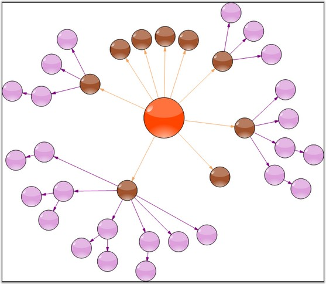
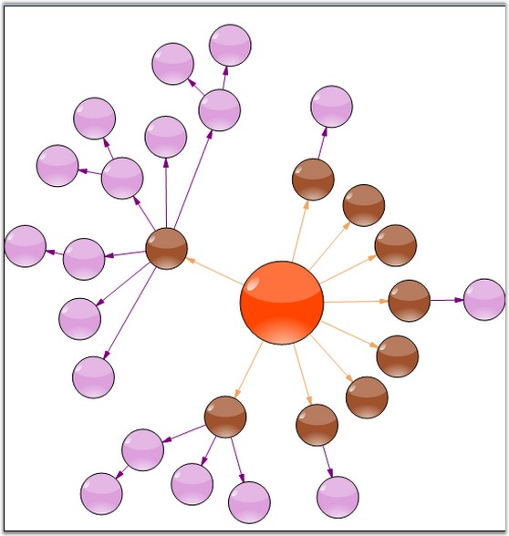

::: {style="DISPLAY: none"}
{#d2h_url_template}{#d2h_package_url style="WIDTH: 0px; DISPLAY: none; HEIGHT: 0px"}
:::

::: {.d2h_secondary_topic style="PADDING-BOTTOM: 10pt; MARGIN: 0pt; PADDING-LEFT: 0pt; PADDING-RIGHT: 0pt; PADDING-TOP: 0pt"}
#### Radial Tree Layout {#radial-tree-layout style="tab-stops: 0pt"}

[]{style="FONT-FAMILY: 'Trebuchet MS','sans-serif'; COLOR: #15428b; FONT-SIZE: 9pt"} 

The **RadialTreeLayoutManager** arranges nodes in a circular layout, positioning the root node at the center of the graph and the child nodes in a circular fashion around the root. It includes the following parameters.

[]{style="FONT-FAMILY: 'Trebuchet MS','sans-serif'; COLOR: #15428b; FONT-SIZE: 9pt"} 

[·      ]{style="FONT-FAMILY: Symbol"}**Model**: specifies the Current Model

[·      ]{style="FONT-FAMILY: Symbol"}**RotationDegree**: specifies the angular orientation of the tree

[·      ]{style="FONT-FAMILY: Symbol"}**VerticalOffset**: specifies the vertical distance between adjacent nodes

[·      ]{style="FONT-FAMILY: Symbol"}**HorizontalOffset**: specifies the horizontal distance between adjacent nodes

[]{style="FONT-FAMILY: 'Trebuchet MS','sans-serif'; COLOR: #15428b; FONT-SIZE: 9pt"} 

The following code example illustrates how to create the RadialTreeLayoutManager programmatically.

[]{style="FONT-FAMILY: 'Trebuchet MS','sans-serif'; COLOR: #15428b; FONT-SIZE: 9pt"} 

+-------------------------------------------------------------------------------------------------------------------------------------------------------------------------------------------------------------------------------------------------------+
| **[\[C#\]]{style="FONT-FAMILY: 'Courier New'"}**                                                                                                                                                                                                      |
|                                                                                                                                                                                                                                                       |
| []{style="FONT-FAMILY: 'Courier New'"}                                                                                                                                                                                                                |
|                                                                                                                                                                                                                                                       |
| [this]{style="FONT-FAMILY: 'Courier New'; COLOR: blue"}[.DiagramWebControl1.LayoutManager = [new]{style="COLOR: blue"} RadialTreeLayoutManager([this]{style="COLOR: blue"}.DiagramWebControl1.Model, 0, 20, 25);]{style="FONT-FAMILY: 'Courier New'"} |
+-------------------------------------------------------------------------------------------------------------------------------------------------------------------------------------------------------------------------------------------------------+

[]{style="FONT-FAMILY: 'Trebuchet MS','sans-serif'; COLOR: #15428b; FONT-SIZE: 9pt"} 

{border="0"}

[]{style="FONT-FAMILY: 'Trebuchet MS','sans-serif'; COLOR: #15428b; FONT-SIZE: 9pt"} 

Figure 25: Radial Tree Layout with Rotation Degree set to 0

[]{style="FONT-FAMILY: 'Trebuchet MS','sans-serif'; FONT-SIZE: 9pt"} 

{border="0"}

[]{style="FONT-FAMILY: 'Trebuchet MS','sans-serif'; COLOR: #15428b; FONT-SIZE: 9pt"} 

Figure 26: Radial Tree Layout with Rotation Degree set to 180

[]{style="FONT-FAMILY: 'Trebuchet MS','sans-serif'; COLOR: #15428b; FONT-SIZE: 9pt"} 

See Also

[]{style="FONT-FAMILY: 'Trebuchet MS','sans-serif'; COLOR: #15428b; FONT-SIZE: 9pt"} 

[Table Layout]{.UGHyperlink}[, ]{.UGHyperlink}[Directed Tree Layout]{.UGHyperlink}[, ]{.UGHyperlink}[Hierarchical Layout]{.UGHyperlink}[, ]{.UGHyperlink}[Graph Layout]{.UGHyperlink}[, ]{.UGHyperlink}[Subgraph Tree Layout]{.UGHyperlink}[, ]{.UGHyperlink}[Symmetric Layout]{.UGHyperlink}[, ]{.UGHyperlink}[OrgChart Layout]{.UGHyperlink}[, ]{.UGHyperlink}[Updating the Layout]{.UGHyperlink}[]{.UGHyperlink}

[]{#related-topics}
:::
