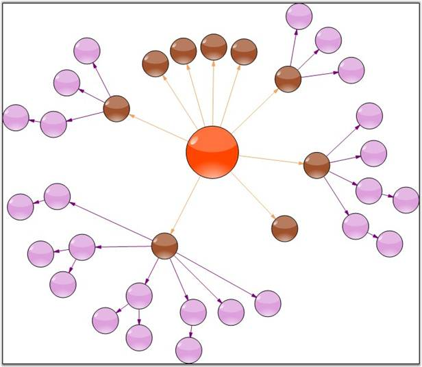
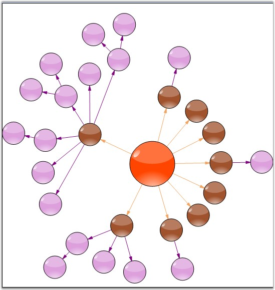

::: {style="DISPLAY: none"}
{#d2h_url_template}{#d2h_package_url style="WIDTH: 0px; DISPLAY: none; HEIGHT: 0px"}
:::

:::: {.d2h_secondary_topic style="PADDING-BOTTOM: 10pt; MARGIN: 0pt; PADDING-LEFT: 0pt; PADDING-RIGHT: 0pt; PADDING-TOP: 0pt"}
#### Radial Tree Layout Manager {#radial-tree-layout-manager style="tab-stops: 0pt"}

[]{style="FONT-FAMILY: 'Trebuchet MS','sans-serif'; COLOR: #15428b; FONT-SIZE: 9pt"} 

The Radial Tree Layout Manager is a specialization of the Directed Tree Layout Manager that employs a circular layout algorithm for locating the diagram nodes. The RadialTreeLayoutManager arranges nodes in a circular layout, positioning the root node at the center of the graph and the child nodes in a circular fashion around the root. Sub-trees formed by the branching of child nodes are located radially around the child nodes. This arrangement results in an ever-expanding concentric arrangement with radial proximity to the root node indicating the node level in the hierarchy.

 

The following parameters need should be specified for the RadialTreeLayoutManager.

[]{style="FONT-FAMILY: 'Trebuchet MS','sans-serif'; COLOR: #15428b; FONT-SIZE: 9pt"} 

::: {align="center"}
  ------------------- ---------------------------------------------------------------------------------
  Property            Description
  Model               Represents the model to be attached to the Layout Manager.
  RotationAngle       Defines the Graph Rotation angle. It accepts only integer values between 0-360.
  HorizontalSpacing   Defines the horizontal offset between adjacent nodes.
  VerticalSpacing     Defines the vertical offset between adjacent nodes.
  ------------------- ---------------------------------------------------------------------------------
:::

[]{style="FONT-FAMILY: 'Trebuchet MS','sans-serif'; COLOR: #15428b; FONT-SIZE: 9pt"} 

Programmatically, the radial tree layout manager instance is created with the respective arguments, assigned to the Layout Manager and updated as follows:

[]{style="FONT-FAMILY: 'Trebuchet MS','sans-serif'; COLOR: #15428b; FONT-SIZE: 9pt"} 

+-----------------------------------------------------------------------------------------------------------------------------------------------------------------+
| **[\[C#\]]{style="FONT-FAMILY: 'Courier New'; COLOR: black"}**                                                                                                  |
|                                                                                                                                                                 |
| []{style="FONT-FAMILY: 'Courier New'"}                                                                                                                          |
|                                                                                                                                                                 |
| [RadialTreeLayoutManager radialLayout= [new]{style="COLOR: blue"} RadialTreeLayoutManager(model1, 0, 20, 20);]{style="FONT-FAMILY: 'Courier New'"}              |
|                                                                                                                                                                 |
| [this]{style="FONT-FAMILY: 'Courier New'; COLOR: blue"}[.diagram1.LayoutManager=radialLayout; ]{style="FONT-FAMILY: 'Courier New'"}                             |
|                                                                                                                                                                 |
| [this]{style="FONT-FAMILY: 'Courier New'; COLOR: blue"}[.diagram1.LayoutManager.UpdateLayout([null]{style="COLOR: blue"});]{style="FONT-FAMILY: 'Courier New'"} |
+-----------------------------------------------------------------------------------------------------------------------------------------------------------------+

[]{style="FONT-FAMILY: 'Courier New'"} 

+-----------------------------------------------------------------------------------------------------------------------------------------------------------------------------------------------------------+
| **[\[VB\]]{style="FONT-FAMILY: 'Courier New'; COLOR: black"}**                                                                                                                                            |
|                                                                                                                                                                                                           |
| **[]{style="FONT-FAMILY: 'Courier New'; COLOR: black"}**                                                                                                                                                  |
|                                                                                                                                                                                                           |
| [Dim]{style="FONT-FAMILY: 'Courier New'; COLOR: blue"}[ radialLayout [As]{style="COLOR: blue"} [New]{style="COLOR: blue"} RadialTreeLayoutManager(model1, 0, 20, 20)]{style="FONT-FAMILY: 'Courier New'"} |
|                                                                                                                                                                                                           |
| [Me]{style="FONT-FAMILY: 'Courier New'; COLOR: blue"}[.diagram1.LayoutManager = radialLayout]{style="FONT-FAMILY: 'Courier New'"}                                                                         |
|                                                                                                                                                                                                           |
| [Me]{style="FONT-FAMILY: 'Courier New'; COLOR: blue"}[.diagram1.LayoutManager.UpdateLayout([Nothing]{style="COLOR: blue"})]{style="FONT-FAMILY: 'Courier New'"}                                           |
+-----------------------------------------------------------------------------------------------------------------------------------------------------------------------------------------------------------+

[]{style="FONT-FAMILY: 'Trebuchet MS','sans-serif'; COLOR: #15428b; FONT-SIZE: 9pt"} 

Sample Diagram is as follows.

**[]{style="FONT-FAMILY: 'Trebuchet MS','sans-serif'; COLOR: #15428b; FONT-SIZE: 9pt"}** 

{border="0"}

**[]{style="FONT-FAMILY: 'Trebuchet MS','sans-serif'; COLOR: #15428b; FONT-SIZE: 9pt"}** 

Figure 54: Radial Tree Layout with 0 degree Rotation Angle

**[]{style="FONT-FAMILY: 'Trebuchet MS','sans-serif'; COLOR: #15428b; FONT-SIZE: 9pt"}** 

{border="0"}

 

Figure 55:  Radial Tree Layout with 180 degree Rotation Angle

 

[]{#p35} 

 

[]{#related-topics}
::::
