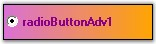

::: {style="DISPLAY: none"}
{#d2h_url_template}{#d2h_package_url style="WIDTH: 0px; DISPLAY: none; HEIGHT: 0px"}
:::

::: {.d2h_secondary_topic style="PADDING-BOTTOM: 10pt; MARGIN: 0pt; PADDING-LEFT: 0pt; PADDING-RIGHT: 0pt; PADDING-TOP: 0pt"}
#### RadioButtonAdv[]{#p786} {#radiobuttonadv style="tab-stops: 0pt"}

[]{style="COLOR: #15428b"} 

**RadioButtonAdv** functions similar to the Windows standard RadioButton but it has some additional enhancements. It helps to provide a great look and feel to the RadioButtons. It supports themes, gradient colors, images and shadow text.

[]{style="COLOR: #15428b"} 

{border="0"}

[]{style="COLOR: #15428b"} 

Figure 627: RadioButtonAdv Control

[]{style="COLOR: #15428b"} 

See Also

[]{style="COLOR: #4a5c8c"} 

More:

[ ]{#related-topics}

[{border="0" align="absMiddle"}Features](ms-xhelp:///?Id=9a477720-b06c-4376-8089-96e0883d1414){style="TEXT-DECORATION: none"}

[{border="0" align="absMiddle"}Creating RadioButtonAdv](ms-xhelp:///?Id=ec787f5f-f4c1-4d5c-baad-2d10ac08a111){style="TEXT-DECORATION: none"}

[{border="0" align="absMiddle"}Concepts and Features](ms-xhelp:///?Id=11e67816-46ae-4c84-8c06-f79e29ac87e5){style="TEXT-DECORATION: none"}

[{border="0" align="absMiddle"}RadioButtonAdv Events](ms-xhelp:///?Id=dfa665c5-4e83-4c95-8294-dede57c0835f){style="TEXT-DECORATION: none"}
:::
