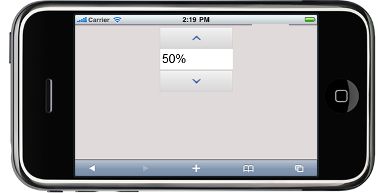

::: {style="DISPLAY: none"}
{#d2h_url_template} {#d2h_package_url style="WIDTH: 0px; DISPLAY: none; HEIGHT: 0px"}
:::

:::: {.d2h_secondary_topic style="PADDING-BOTTOM: 10pt; MARGIN: 0pt; PADDING-LEFT: 0pt; PADDING-RIGHT: 0pt; PADDING-TOP: 0pt"}
#### Range {#range style="tab-stops: 0pt"}

The Percent text box supports defining range of values for the control to accept and display.

[]{style="FONT-FAMILY: 'Calibri','sans-serif'; FONT-SIZE: 11pt; FONT-WEIGHT: normal"} 

Properties

  --------------- ------------------------------------------------------------------------------------------------------ ---------------------- ------------------------------------ ------------
  Name            Description                                                                                            Type of the property   Value it accepts                     Dependency
  MinValue        Sets the minimum value.                                                                                double                 double.MinValue to double.MaxValue   NA
  MaxValue        Sets the maximum value                                                                                 double                 double.MinValue to double.MaxValue   NA
  IncrementStep   Sets the step value by which the text box value increases or decreases when spin buttons are clicked   float                  float.MinValue to float.MaxValue     NA
  --------------- ------------------------------------------------------------------------------------------------------ ---------------------- ------------------------------------ ------------

 

Using Builder

The following steps, guides you in configuring the range through the Builder:

1.   In **View**, invoke the Percent textbox helper with the control ID as the first argument and enable the **MinValue**, **MaxValue**, and **IncrementStep** methods with the desired argument.

[[ []{style="TEXT-DECORATION: none"} ]{style="FONT-FAMILY: 'Calibri','sans-serif'"}]{.underline}  

+------------------------------------------------------------------------------------------------------------------------------------------------+
| **[\[ASPX\]]{style="FONT-FAMILY: 'Courier New'"}**                                                                                             |
|                                                                                                                                                |
| [  ]{style="FONT-FAMILY: 'Courier New'"} [\<%]{style="FONT-FAMILY: 'Courier New'; BACKGROUND: yellow"} [{]{style="FONT-FAMILY: 'Courier New'"} |
|                                                                                                                                                |
| [        Html.MobSyncfusion().PercentTextbox([\"WebsitePercent\"]{style="COLOR: #a31515"})]{style="FONT-FAMILY: 'Courier New'"}                |
|                                                                                                                                                |
| [                   .MinValue(50)]{style="FONT-FAMILY: 'Courier New'"}                                                                         |
|                                                                                                                                                |
| [                   .Maxvalue(300)]{style="FONT-FAMILY: 'Courier New'"}                                                                        |
|                                                                                                                                                |
| [                   .IncrementStep(10)]{style="FONT-FAMILY: 'Courier New'"}                                                                    |
|                                                                                                                                                |
| [                          .Render();]{style="FONT-FAMILY: 'Courier New'"}                                                                     |
|                                                                                                                                                |
| [                      }[%\>]{style="BACKGROUND: yellow"}]{style="FONT-FAMILY: 'Courier New'"}                                                 |
|                                                                                                                                                |
| **[\[Razor\]]{style="FONT-FAMILY: 'Courier New'"}**                                                                                            |
|                                                                                                                                                |
| [\@{]{style="FONT-FAMILY: 'Courier New'; BACKGROUND: yellow"} []{style="FONT-FAMILY: 'Courier New'"}                                           |
|                                                                                                                                                |
| [     Html.MobSyncfusion().PercentTextbox([\"WebsitePercent\"]{style="COLOR: #a31515"})]{style="FONT-FAMILY: 'Courier New'"}                   |
|                                                                                                                                                |
| [                   .MinValue(50)]{style="FONT-FAMILY: 'Courier New'"}                                                                         |
|                                                                                                                                                |
| [                   .Maxvalue(300)]{style="FONT-FAMILY: 'Courier New'"}                                                                        |
|                                                                                                                                                |
| [                   .IncrementStep(10)]{style="FONT-FAMILY: 'Courier New'"}                                                                    |
|                                                                                                                                                |
| []{style="FONT-FAMILY: 'Courier New'"}                                                                                                         |
|                                                                                                                                                |
| [                          .Render();]{style="FONT-FAMILY: 'Courier New'"}                                                                     |
|                                                                                                                                                |
| [                      [}]{style="BACKGROUND: yellow"}]{style="FONT-FAMILY: 'Courier New'"}                                                    |
|                                                                                                                                                |
| []{style="FONT-FAMILY: Consolas; BACKGROUND: yellow; FONT-SIZE: 9.5pt"}                                                                        |
+------------------------------------------------------------------------------------------------------------------------------------------------+

[[]{style="TEXT-DECORATION: none"}]{.underline}  

2.   Run the application.

 

Using Properties Model

The following steps will guide you in setting the range through the Properties model:

1.   In the **Controller**, create an instance of PercentTextBoxModel; define the **MinValue**, **MaxValue**, and **IncrementStep** properties, and pass the instance through the view-specific data to the view.[]{style="FONT-FAMILY: 'Calibri','sans-serif'"}

[]{style="FONT-FAMILY: 'Calibri','sans-serif'"} 

+---------------------------------------------------------------------------------------------------------------------------------------------------------------------------------------------------------------------------------------------------------+
| **[\[Controller\]]{style="FONT-FAMILY: 'Courier New'"}**                                                                                                                                                                                                |
|                                                                                                                                                                                                                                                         |
| [public]{style="FONT-FAMILY: 'Courier New'; COLOR: blue"} [ [ActionResult]{style="COLOR: #2b91af"} Index()]{style="FONT-FAMILY: 'Courier New'"}                                                                                                         |
|                                                                                                                                                                                                                                                         |
| [        {]{style="FONT-FAMILY: 'Courier New'"}                                                                                                                                                                                                         |
|                                                                                                                                                                                                                                                         |
| [           ]{style="FONT-FAMILY: 'Courier New'"} [PercentTextBoxModel]{style="FONT-FAMILY: 'Courier New'; COLOR: #2b91af"} [ myModel = [new]{style="COLOR: blue"}[PercentTextBoxModel]{style="COLOR: #2b91af"}();]{style="FONT-FAMILY: 'Courier New'"} |
|                                                                                                                                                                                                                                                         |
| [            myModel.MinValue = 50;]{style="FONT-FAMILY: 'Courier New'"}                                                                                                                                                                                |
|                                                                                                                                                                                                                                                         |
| [            myModel.MaxValue = 100;]{style="FONT-FAMILY: 'Courier New'"}                                                                                                                                                                               |
|                                                                                                                                                                                                                                                         |
| [            myModel.IncrementStep = 10;]{style="FONT-FAMILY: 'Courier New'"}                                                                                                                                                                           |
|                                                                                                                                                                                                                                                         |
| [            ViewData\[[\"myPercent\"]{style="COLOR: #a31515"}\] = myModel;]{style="FONT-FAMILY: 'Courier New'"}                                                                                                                                        |
|                                                                                                                                                                                                                                                         |
| [            [return]{style="COLOR: blue"} View();]{style="FONT-FAMILY: 'Courier New'"}                                                                                                                                                                 |
|                                                                                                                                                                                                                                                         |
| [        }]{style="FONT-FAMILY: 'Courier New'"}                                                                                                                                                                                                         |
|                                                                                                                                                                                                                                                         |
| []{style="FONT-FAMILY: Consolas; BACKGROUND: yellow; FONT-SIZE: 9.5pt"}                                                                                                                                                                                 |
+---------------------------------------------------------------------------------------------------------------------------------------------------------------------------------------------------------------------------------------------------------+

**[]{style="FONT-FAMILY: 'Calibri','sans-serif'"}**  

2.   In **View**, invoke the Percent textbox helper with the ViewData key as first argument.

[]{style="FONT-FAMILY: 'Courier New'"} 

+--------------------------------------------------------------------------------------------------------------------------------------------------------------------------------+
| **[\[ASPX\]]{style="FONT-FAMILY: 'Courier New'"}**                                                                                                                             |
|                                                                                                                                                                                |
| [  ]{style="FONT-FAMILY: 'Courier New'"} [\<%]{style="FONT-FAMILY: 'Courier New'; BACKGROUND: yellow"} [{                                ]{style="FONT-FAMILY: 'Courier New'"} |
|                                                                                                                                                                                |
| [    Html.MobSyncfusion().PercentTextbox([\"myPercent\")]{style="COLOR: #a31515"}]{style="FONT-FAMILY: 'Courier New'"}                                                         |
|                                                                                                                                                                                |
| [                          .Render();]{style="FONT-FAMILY: 'Courier New'"}                                                                                                     |
|                                                                                                                                                                                |
| [       }[%\>]{style="BACKGROUND: yellow"}]{style="FONT-FAMILY: 'Courier New'"}                                                                                                |
|                                                                                                                                                                                |
| **[\[Razor\]]{style="FONT-FAMILY: 'Courier New'"}**                                                                                                                            |
|                                                                                                                                                                                |
| [    ]{style="FONT-FAMILY: 'Courier New'"} [\@{]{style="FONT-FAMILY: 'Courier New'; BACKGROUND: yellow"} []{style="FONT-FAMILY: 'Courier New'"}                                |
|                                                                                                                                                                                |
| [           Html.MobSyncfusion().PercentTextbox([\"myPercent\"]{style="COLOR: #a31515"})]{style="FONT-FAMILY: 'Courier New'"}                                                  |
|                                                                                                                                                                                |
| [                          .Render();]{style="FONT-FAMILY: 'Courier New'"}                                                                                                     |
|                                                                                                                                                                                |
| [       [}]{style="BACKGROUND: yellow"}]{style="FONT-FAMILY: 'Courier New'"} []{style="FONT-FAMILY: 'Courier New'; BACKGROUND: yellow"}                                        |
+--------------------------------------------------------------------------------------------------------------------------------------------------------------------------------+

::: {style="BORDER-BOTTOM: windowtext 1pt solid; BORDER-LEFT: medium none; PADDING-BOTTOM: 1pt; MARGIN-TOP: 9pt; PADDING-LEFT: 0pt; PADDING-RIGHT: 0pt; MARGIN-BOTTOM: 9pt; BORDER-TOP: windowtext 1pt solid; BORDER-RIGHT: medium none; PADDING-TOP: 1pt"}
{border="0"}Note: The second argument of the above percent textbox helper should match the view data key from the controller to fetch the properties.
:::

3.   Run the application.

The following screenshot illustrates the output:

 

{border="0"}

Figure 243 Percent textbox with Customized Range

 

[]{#related-topics}
::::
